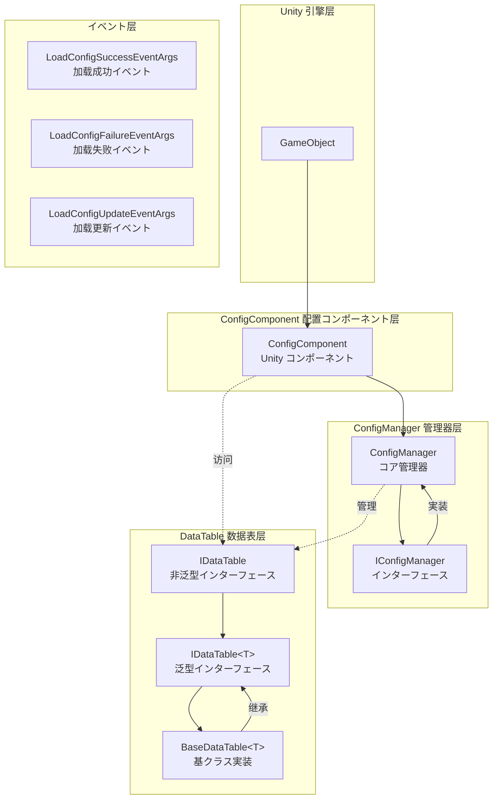
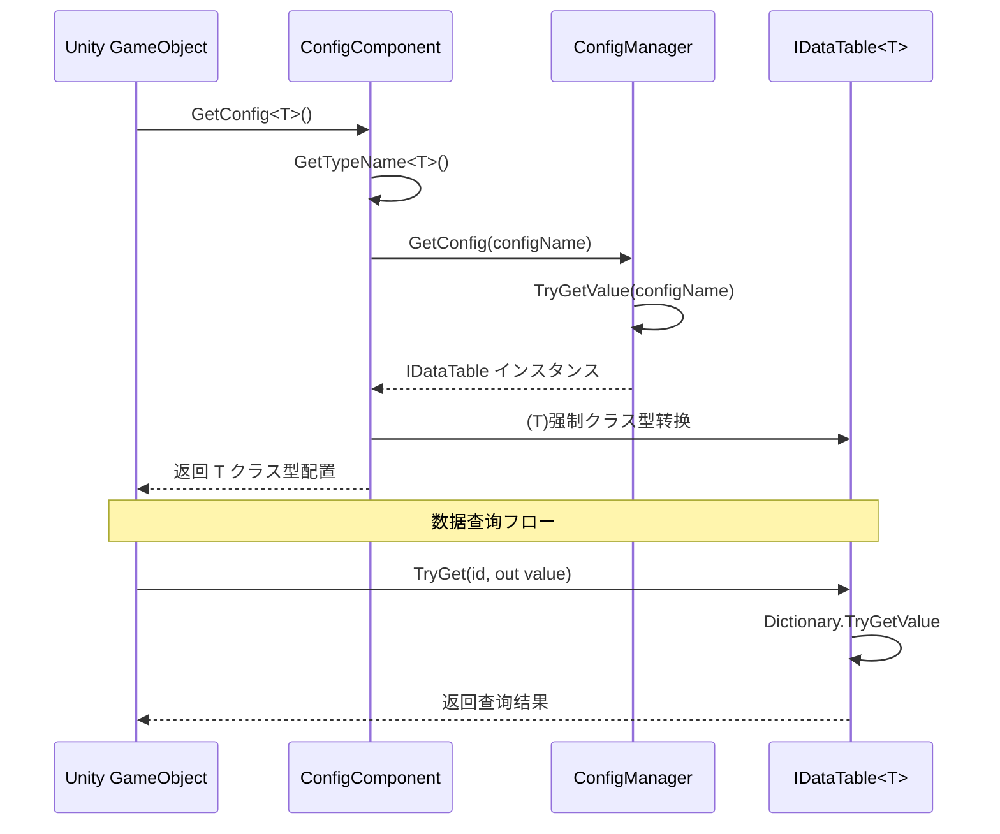

# 機能特性

Config 配置表コンポーネント是 GameFrameX フレームワーク的コア模块之一，提供します一套完整的数据配置管理解決策。该コンポーネントサポート多种数据格式（文本和二进制）、灵活的数据表查询、クラス型安全的数据访问，以及完整的イベント系统。

## 概要

Config 配置表コンポーネント为 Unity ゲーム开发提供高效的配置数据管理能力，主要特性包括：

- **统一配置管理**：を通じて ConfigManager 集中管理所有配置数据表
- **クラス型安全的数据访问**：基づく泛型的数据表インターフェース，提供编译时クラス型检查
- **多种数据格式サポート**：サポート文本格式（Tab 分隔）和二进制格式配置表
- **高性能查询**：使用字典结构実装 O(1) 时间复杂度的数据查找
- **灵活的数据操作**：提供丰富的查询、过滤、聚合メソッド
- **イベント驱动架构**：提供加载成功、失败、更新等イベント回调

## アーキテクチャ設計

Config コンポーネント采用分层アーキテクチャ設計，各コンポーネント职责清晰，協調動作：



### コアコンポーネント説明

| コンポーネント | 名前空間 | 説明 |
|------|----------|------|
| ConfigComponent | GameFrameX.Config.Runtime | Unity コンポーネント，提供运行时配置访问エントリーポイント |
| ConfigManager | GameFrameX.Config.Runtime | コア配置管理器，実装 IConfigManager インターフェース |
| IConfigManager | GameFrameX.Config.Runtime | 配置管理器インターフェース，定义配置管理操作 |
| IDataTable | GameFrameX.Config.Runtime | 数据表基础インターフェース |
| IDataTable<T> | GameFrameX.Config.Runtime | 泛型数据表インターフェース，提供クラス型安全访问 |
| BaseDataTable<T> | GameFrameX.Config.Runtime | 数据表基クラス，提供具体実装 |

## コア機能

### 1. 配置数据存储与管理

ConfigManager 使用线程安全的 `ConcurrentDictionary` 存储配置数据，サポート配置的添加、查询、移除和清空操作。

```csharp
// ConfigManager.cs - 配置管理器コア実装
public sealed partial class ConfigManager : GameFrameworkModule, IConfigManager
{
    private readonly ConcurrentDictionary<string, IDataTable> m_ConfigDatas;

    public ConfigManager()
    {
        m_ConfigDatas = new ConcurrentDictionary<string, IDataTable>(StringComparer.Ordinal);
    }

    public bool HasConfig(string configName)
    {
        return m_ConfigDatas.TryGetValue(configName, out _);
    }

    public void AddConfig(string configName, IDataTable configValue)
    {
        m_ConfigDatas.TryAdd(configName, configValue);
    }

    public IDataTable GetConfig(string configName)
    {
        return m_ConfigDatas.TryGetValue(configName, out var value) ? value : null;
    }

    public bool RemoveConfig(string configName)
    {
        return m_ConfigDatas.TryRemove(configName, out _);
    }

    public void RemoveAllConfigs()
    {
        m_ConfigDatas.Clear();
    }
}
```
> Source: [ConfigManager.cs](https://github.com/GameFrameX/com.gameframex.unity.config/blob/main/Runtime/Config/Config/ConfigManager.cs#L46-L166)

### 2. 泛型数据表インターフェース

`IDataTable<T>` インターフェース定义了クラス型安全的数据访问方法，サポート多种键クラス型（int、long、string）的数据查询：

```csharp
// IDataTable.cs - 泛型数据表インターフェース定义
public interface IDataTable<T> : IDataTable where T : class
{
    // 尝试に基づいて整数ID取得对象
    bool TryGet(int id, out T value);

    // 尝试に基づいて长整数ID取得对象
    bool TryGet(long id, out T value);

    // 尝试に基づいて字符串ID取得对象
    bool TryGet(string id, out T value);

    // 索引器 - サポート多种键クラス型
    T this[int id] { get; }
    T this[long id] { get; }
    T this[string id] { get; }

    // 取得首尾元素
    T FirstOrDefault { get; }
    T LastOrDefault { get; }

    // 取得所有数据
    T[] All { get; }
    T[] ToArray();
    List<T> ToList();

    // 查询メソッド
    T Find(Func<T, bool> func);
    T[] FindListArray(Func<T, bool> func);
    List<T> FindList(Func<T, bool> func);
    void ForEach(Action<T> func);

    // 聚合メソッド
    Tk Max<Tk>(Func<T, Tk> func) where Tk : IComparable<Tk>;
    Tk Min<Tk>(Func<T, Tk> func) where Tk : IComparable<Tk>;
    int Sum(Func<T, int> func);
    long Sum(Func<T, long> func);
    float Sum(Func<T, float> func);
    double Sum(Func<T, double> func);
    decimal Sum(Func<T, decimal> func);
}
```
> Source: [IDataTable.cs](https://github.com/GameFrameX/com.gameframex.unity.config/blob/main/Runtime/Config/Config/IDataTable.cs#L76-L265)

### 3. 数据表基クラス実装

`BaseDataTable<T>` 提供します完整的泛型数据表実装，内部使用双字典结构（`LongDataMaps` 和 `StringDataMaps`）分别存储长整型和字符串键的数据：

```csharp
// BaseDataTable.cs - 数据表基クラス実装
public abstract class BaseDataTable<T> : IDataTable<T> where T : class
{
    private const int DefaultSize = 1024 * 8;
    protected readonly Dictionary<long, T> LongDataMaps = new Dictionary<long, T>(DefaultSize);
    protected readonly Dictionary<string, T> StringDataMaps = new Dictionary<string, T>(DefaultSize);
    protected readonly List<T> DataList = new List<T>(DefaultSize);

    // 缓存优化
    private bool _cacheInitialized;
    private T _firstOrDefaultCache;
    private T _lastOrDefaultCache;

    public bool TryGet(int id, out T value)
    {
        return LongDataMaps.TryGetValue(id, out value);
    }

    public bool TryGet(long id, out T value)
    {
        return LongDataMaps.TryGetValue(id, out value);
    }

    public bool TryGet(string id, out T value)
    {
        return StringDataMaps.TryGetValue(id, out value);
    }

    // 使用索引器访问
    public T this[int id] => TryGet(id, out var value) ? value : null;
    public T this[long id] => TryGet(id, out var value) ? value : null;
    public T this[string id] => TryGet(id, out var value) ? value : null;

    // 查询メソッド
    public T Find(Func<T, bool> func)
    {
        return DataList.FirstOrDefault(func);
    }

    public T[] FindListArray(Func<T, bool> func)
    {
        return DataList.Where(func).ToArray();
    }
}
```
> Source: [BaseDataTable.cs](https://github.com/GameFrameX/com.gameframex.unity.config/blob/main/Runtime/Config/Config/BaseDataTable.cs#L46-L165)

### 4. Unity コンポーネント集成

`ConfigComponent` 是 Unity コンポーネント，可添加到 GameObject 上，提供配置访问的便捷インターフェース：

```csharp
// ConfigComponent.cs - Unity コンポーネント
[DisallowMultipleComponent]
[AddComponentMenu("GameFrameX/Config")]
public sealed class ConfigComponent : GameFrameworkComponent
{
    private IConfigManager m_ConfigManager = null;
    private ConcurrentDictionary<Type, string> m_ConfigNameTypeMap = new ConcurrentDictionary<Type, string>();

    protected override void Awake()
    {
        base.Awake();
        m_ConfigManager = GameFrameworkEntry.GetModule<IConfigManager>();
    }

    // 泛型メソッド取得配置
    public T GetConfig<T>() where T : IDataTable
    {
        var configName = GetTypeName<T>();
        var config = m_ConfigManager.GetConfig(configName);
        return config != null ? (T)config : default;
    }

    // 检查配置是否存在
    public bool HasConfig<T>() where T : IDataTable
    {
        var configName = GetTypeName<T>();
        return m_ConfigManager.HasConfig(configName);
    }

    // 移除配置
    public bool RemoveConfig<T>() where T : IDataTable
    {
        var configName = GetTypeName<T>();
        return m_ConfigManager.RemoveConfig(configName);
    }

    // 添加配置
    public void Add(string configName, IDataTable dataTable)
    {
        m_ConfigManager.AddConfig(configName, dataTable);
    }
}
```
> Source: [ConfigComponent.cs](https://github.com/GameFrameX/com.gameframex.unity.config/blob/main/Runtime/Config/ConfigComponent.cs#L46-L185)

### 5. イベント系统

Config コンポーネント提供します完整的イベント系统，に使用监听配置加载ステータス：

```csharp
// 加载成功イベント
public sealed class LoadConfigSuccessEventArgs : GameEventArgs
{
    public static readonly string EventId = typeof(LoadConfigSuccessEventArgs).FullName;
    public string ConfigAssetName { get; private set; }  // 配置リソース名称
    public float Duration { get; private set; }          // 加载耗时
    public object UserData { get; private set; }          // 用户数据

    public static LoadConfigSuccessEventArgs Create(string dataAssetName, float duration, object userData)
    {
        // 作成イベントインスタンス
    }
}

// 加载失败イベント
public sealed class LoadConfigFailureEventArgs : GameEventArgs
{
    public static readonly string EventId = typeof(LoadConfigFailureEventArgs).FullName;
    public string ConfigAssetName { get; private set; }  // 配置リソース名称
    public string ErrorMessage { get; private set; }     // 错误信息
    public object UserData { get; private set; }          // 用户数据
}

// 加载更新イベント（进度）
public sealed class LoadConfigUpdateEventArgs : GameEventArgs
{
    public static readonly string EventId = typeof(LoadConfigUpdateEventArgs).FullName;
    public string ConfigAssetName { get; private set; }  // 配置リソース名称
    public float Progress { get; private set; }           // 加载进度 (0.0 - 1.0)
    public object UserData { get; private set; }          // 用户数据
}
```
> Sources:
> - [LoadConfigSuccessEventArgs.cs](https://github.com/GameFrameX/com.gameframex.unity.config/blob/main/Runtime/EventArgs/LoadConfigSuccessEventArgs.cs#L43-L137)
> - [LoadConfigFailureEventArgs.cs](https://github.com/GameFrameX/com.gameframex.unity.config/blob/main/Runtime/EventArgs/LoadConfigFailureEventArgs.cs#L43-L137)
> - [LoadConfigUpdateEventArgs.cs](https://github.com/GameFrameX/com.gameframex.unity.config/blob/main/Runtime/EventArgs/LoadConfigUpdateEventArgs.cs#L43-L137)

## 数据访问フロー

以下フロー图展示了从 Unity コンポーネント到数据表的数据访问过程：



## 使用例

### 基本配置取得

```csharp
// 取得配置コンポーネント
var configComponent = GameEntry.GetComponent<ConfigComponent>();

// 检查配置是否存在
if (configComponent.HasConfig<PlayerConfig>())
{
    // 取得配置数据表
    var playerConfig = configComponent.GetConfig<PlayerConfig>();
    
    // 使用索引器查询数据
    var player = playerConfig[1001];  // に基づいて ID 查询
    
    // 使用 TryGet メソッド安全查询
    if (playerConfig.TryGet(1001, out var playerData))
    {
        Debug.Log($"玩家名称: {playerData.Name}");
    }
}
```

### 数据查询与过滤

```csharp
var config = configComponent.GetConfig<MonsterConfig>();

// 查询所有满足条件的对象
var bossMonsters = config.FindList(m => m.Type == MonsterType.Boss);

// 使用聚合函数
var maxLevel = config.Max(m => m.Level);
var totalHP = config.Sum(m => m.HP);

// 遍历所有数据
config.ForEach(monster => {
    Debug.Log($"怪物: {monster.Name}, 等级: {monster.Level}");
});
```

## 設定格式サポート

Config コンポーネントサポート两种配置表格式：

### 1. 文本格式（Tab 分隔）

文本格式配置使用 Tab 字符作为列分隔符，适に使用编辑器预览和调试：

```
# 格式：ID    名称    説明    值
1    config1 配置1   100
2    config2 配置2   200
```

### 2. 二进制格式（.bytes）

二进制格式配置ファイル后缀为 `.bytes`，适に使用生产环境加载，具有更小的体积和更快的解析速度。

> 关于二进制配置表的详细内容，お願いします参阅 [二进制配置表](./6-configuration.binary-config) 文档。

## 関連リンク

- [Config コンポーネント简介](./1-overview.introduction) - Config コンポーネント概述与安装
- [安装方法](./2-installation.install-methods) - コンポーネント安装指南
- [依赖要求](./2-installation.dependencies) - プロジェクト依赖説明
- [ConfigComponent 配置コンポーネント](./4-core-concepts.config-component) - Unity コンポーネント详解
- [ConfigManager 配置管理器](./4-core-concepts.config-manager) - コア管理器详解
- [IDataTable 数据表インターフェース](./4-core-concepts.idata-table) - 数据表インターフェース定义
- [API 参考](./5-api-reference.interfaces) - 完整インターフェース文档
- [イベント参数](./5-api-reference.event-args) - イベント参数详情
- [脚本宏定义](./6-configuration.scripting-define-symbols) - 编译符号配置
