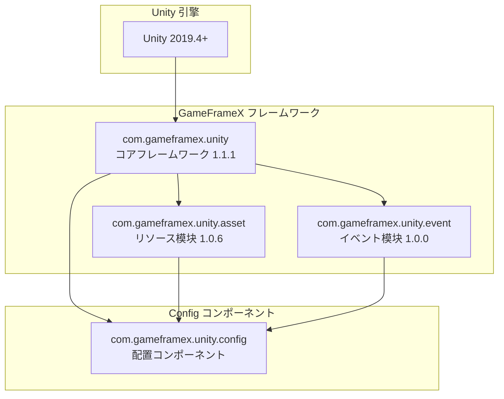

# 依赖要求

本文档详细介绍 Config 配置コンポーネント的依赖要求，包括 Unity 版本要求、GameFrameX コア包依赖以及内部程序集引用关系。

## 概要

Config 配置コンポーネント是 GameFrameX フレームワーク的コア模块之一，に使用管理ゲーム中的配置数据表。该コンポーネント依赖于 GameFrameX コアフレームワーク的其他模块，必要在满足特定版本要求的 Unity 环境中运行，并正确配置関連依赖包才能正常工作。

## 依赖架构



## Unity 版本要求

| プロジェクト | 要求 |
|------|------|
| 最小バージョン | Unity 2019.4 |
| 推荐版本 | Unity 2020.3 LTS 或更高 |
| 脚本运行时 | .NET Standard 2.0+ |

> Source: [package.json](https://github.com/GameFrameX/com.gameframex.unity.config/blob/main/package.json#L7)

Unity 版本要求定义在 `package.json` ファイル的 `unity` 字段中，确保您的プロジェクト使用兼容的 Unity 版本以获得最佳兼容性。

## GameFrameX コア包依赖

Config コンポーネント依赖于以下 GameFrameX 官方包，这些依赖在 `package.json` 中声明：

### 依赖包列表

| 包名 | 最小バージョン | 用途説明 |
|------|----------|----------|
| com.gameframex.unity | 1.1.1 | コアフレームワーク，提供基础コンポーネント和模块管理機能 |
| com.gameframex.unity.asset | 1.0.6 | リソース加载模块，に使用异步加载配置表ファイル |
| com.gameframex.unity.event | 1.0.0 | イベント系统，に使用配置加载成功/失败等イベント通知 |

```json
{
  "dependencies": {
    "com.gameframex.unity": "1.1.1",
    "com.gameframex.unity.asset": "1.0.6",
    "com.gameframex.unity.event": "1.0.0"
  }
}
```

> Source: [package.json](https://github.com/GameFrameX/com.gameframex.unity.config/blob/main/package.json#L21-L25)

### 依赖关系説明

**com.gameframex.unity (コアフレームワーク)**
- 提供 `GameFrameworkComponent` 基クラス，ConfigComponent を継承此クラス
- 提供模块管理系统，を通じて `GameFrameworkEntry` 取得各模块インスタンス
- 提供程序集工具 `Utility.Assembly` に使用クラス型反射

**com.gameframex.unity.asset (リソース模块)**
- 提供リソース异步加载能力，ConfigManager 使用 `GameFrameX.Asset.Runtime` 名前空間
- に使用加载配置表二进制ファイル或 JSON/XML 配置ファイル
- サポート配置表的按需加载和缓存管理

**com.gameframex.unity.event (イベント模块)**
- 提供イベント系统，に使用通知配置加载ステータス
- 定义了以下イベント参数クラス：
  - `LoadConfigSuccessEventArgs`: 配置加载成功イベント
  - `LoadConfigFailureEventArgs`: 配置加载失败イベント
  - `LoadConfigUpdateEventArgs`: 配置加载更新イベント

## 内部程序集引用

Config コンポーネント的运行时程序集 `GameFrameX.Config.Runtime.asmdef` 定义了以下程序集引用：

```csharp
// Runtime/GameFrameX.Config.Runtime.asmdef
{
    "references": [
        "GameFrameX.Runtime",
        "GameFrameX.Event.Runtime",
        "GameFrameX.Asset.Runtime"
    ]
}
```

> Source: [Runtime/GameFrameX.Config.Runtime.asmdef](https://github.com/GameFrameX/com.gameframex.unity.config/blob/main/Runtime/GameFrameX.Config.Runtime.asmdef#L3-L6)

### 程序集引用详情

| 程序集 | 名前空間 | 機能説明 |
|--------|----------|----------|
| GameFrameX.Runtime | `GameFrameX.Runtime` | コア运行时，提供 GameFrameworkComponent、GameFrameworkModule、IConfigManager インターフェース |
| GameFrameX.Event.Runtime | `GameFrameX.Event.Runtime` | イベント系统基础インターフェース和実装 |
| GameFrameX.Asset.Runtime | `GameFrameX.Asset.Runtime` | リソース加载インターフェース和実装 |

### 关键クラス型依赖

Config コンポーネント中使用的关键クラス型及其来源：

```csharp
using GameFrameX.Runtime;           // GameFrameworkComponent, GameFrameworkModule
using GameFrameX.Asset.Runtime;      // リソース加载関連インターフェース
using GameFrameX.Event.Runtime;     // イベント参数基クラス

// ConfigComponent 继承关系
public sealed class ConfigComponent : GameFrameworkComponent

// ConfigManager 继承关系  
public sealed class ConfigManager : GameFrameworkModule, IConfigManager
```

> Source: [Runtime/Config/ConfigComponent.cs](https://github.com/GameFrameX/com.gameframex.unity.config/blob/main/Runtime/Config/ConfigComponent.cs#L48)
> Source: [Runtime/Config/Config/ConfigManager.cs](https://github.com/GameFrameX/com.gameframex.unity.config/blob/main/Runtime/Config/Config/ConfigManager.cs#L47)

## 安装依赖

### 自动安装（推荐）

を通じて Unity Package Manager 添加包时，依赖包会自动安装：

1. 打开 Unity プロジェクト的 `Packages/manifest.json` ファイル
2. 在 `dependencies` 中添加 Config コンポーネント：

```json
{
  "dependencies": {
    "com.gameframex.unity.config": "https://github.com/GameFrameX/com.gameframex.unity.config.git"
  }
}
```

3. Unity 会自动解析并安装所有必須的依赖包

### 手动安装

如果必要手动安装，必ず按以下顺序安装依赖：

1. **安装コアフレームワーク**
   ```json
   { "com.gameframex.unity": "1.1.1" }
   ```

2. **安装リソース模块**
   ```json
   { "com.gameframex.unity.asset": "1.0.6" }
   ```

3. **安装イベント模块**
   ```json
   { "com.gameframex.unity.event": "1.0.0" }
   ```

4. **最后安装 Config コンポーネント**
   ```json
   { "com.gameframex.unity.config": "1.1.3" }
   ```

## 依赖版本兼容性

| Config 版本 | Unity 版本 | コアフレームワーク版本 | リソース模块版本 | イベント模块版本 |
|------------|------------|--------------|--------------|--------------|
| 1.1.3 | 2019.4+ | 1.1.1 | 1.0.6 | 1.0.0 |
| 1.1.2 | 2019.4+ | 1.1.0 | 1.0.5 | 1.0.0 |
| 1.1.1 | 2019.4+ | 1.1.0 | 1.0.5 | 1.0.0 |

建议始终使用最新版本的依赖包以获得最佳兼容性和新機能サポート。

## 常见依赖问题

### 问题 1：缺少コアフレームワーク依存

**症状**: 编译时报错找不到 `GameFrameworkComponent` クラス型

**解決策**: 确保已安装 `com.gameframex.unity` コアフレームワーク包

### 问题 2：イベント系统未初期化

**症状**: 配置加载イベント无法触发

**解決策**: 确保 `com.gameframex.unity.event` 已正确安装，并在シーン中初期化イベント系统

### 问题 3：リソース加载失败

**症状**: 配置表ファイル无法加载

**解決策**: 确认 `com.gameframex.unity.asset` 版本与要求一致，并检查リソース路径配置

## 関連リンク

- [安装方法](./2-installation.install-methods) - 了解不同的安装メソッド
- [ConfigComponent 配置コンポーネント](./4-core-concepts.config-component) - 了解コンポーネント的使用
- [ConfigManager 配置管理器](./4-core-concepts.config-manager) - 了解管理器機能
- [IDataTable 数据表インターフェース](./4-core-concepts.idata-table) - 了解数据表インターフェース定义
- [官方文档](https://gameframex.doc.alianblank.com/) - GameFrameX 完整文档
