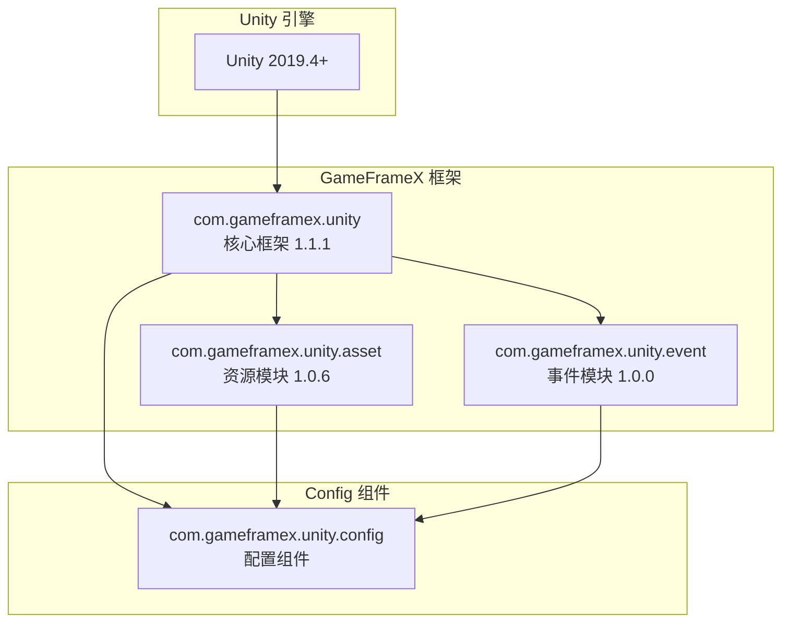

# 依存要件

このドキュメント詳細介绍 Config 設定コンポーネント的依赖要求，含みます Unity バージョン要求、GameFrameX コアパッケージ依赖および内部アセンブリ参照关系。

## 概要

Config 設定コンポーネント是 GameFrameX フレームワーク的コアモジュール之一，用于管理游戏中的設定数据表。该コンポーネント依赖于 GameFrameX コアフレームワーク的其他モジュール，〜する必要があります在满足特定バージョン要求的 Unity 環境中运行，并正确設定相关依赖パッケージ才能正常工作。

## 依赖アーキテクチャ



## Unity バージョン要求

| プロジェクト | 要求 |
|------|------|
| 最低バージョン | Unity 2019.4 |
| 推奨バージョン | Unity 2020.3 LTS 或更高 |
| 脚本ランタイム | .NET Standard 2.0+ |

> Source: [package.json](https://github.com/GameFrameX/com.gameframex.unity.config/blob/main/package.json#L7)

Unity バージョン要求定義在 `package.json` ファイル的 `unity` フィールド中，確認してください您的プロジェクト使用兼容的 Unity バージョン以获得最佳兼容性。

## GameFrameX コアパッケージ依赖

Config コンポーネント依赖于以下 GameFrameX 官方パッケージ，这些依赖在 `package.json` 中声明：

### 依赖パッケージ列表

| パッケージ名 | 最低バージョン | 用途説明 |
|------|----------|----------|
| com.gameframex.unity | 1.1.1 | コアフレームワーク，提供基本コンポーネント和モジュール管理機能 |
| com.gameframex.unity.asset | 1.0.6 | リソースロードモジュール，用于非同期ロード設定表ファイル |
| com.gameframex.unity.event | 1.0.0 | イベント系统，用于設定ロード成功/失敗等イベント通知 |

```json
{
  "dependencies": {
    "com.gameframex.unity": "1.1.1",
    "com.gameframex.unity.asset": "1.0.6",
    "com.gameframex.unity.event": "1.0.0"
  }
}
```

> Source: [package.json](https://github.com/GameFrameX/com.gameframex.unity.config/blob/main/package.json#L21-L25)

### 依赖关系説明

**com.gameframex.unity (コアフレームワーク)**
- 提供 `GameFrameworkComponent` 基底クラス，ConfigComponent 継承自此类
- 提供モジュール管理系统，通过 `GameFrameworkEntry` 取得各モジュールインスタンス
- 提供アセンブリ工具 `Utility.Assembly` 用于タイプ反射

**com.gameframex.unity.asset (リソースモジュール)**
- 提供リソース非同期ロード能力，ConfigManager 使用 `GameFrameX.Asset.Runtime` 名前空間
- 用于ロード設定表二进制ファイル或 JSON/XML 設定ファイル
- サポート設定表的按需ロード和缓存管理

**com.gameframex.unity.event (イベントモジュール)**
- 提供イベント系统，用于通知設定ロードステータス
- 定義了以下イベントパラメータ类：
  - `LoadConfigSuccessEventArgs`: 設定ロード成功イベント
  - `LoadConfigFailureEventArgs`: 設定ロード失敗イベント
  - `LoadConfigUpdateEventArgs`: 設定ロードアップデートイベント

## 内部アセンブリ参照

Config コンポーネント的ランタイムアセンブリ `GameFrameX.Config.Runtime.asmdef` 定義了以下アセンブリ参照：

```csharp
// Runtime/GameFrameX.Config.Runtime.asmdef
{
    "references": [
        "GameFrameX.Runtime",
        "GameFrameX.Event.Runtime",
        "GameFrameX.Asset.Runtime"
    ]
}
```

> Source: [Runtime/GameFrameX.Config.Runtime.asmdef](https://github.com/GameFrameX/com.gameframex.unity.config/blob/main/Runtime/GameFrameX.Config.Runtime.asmdef#L3-L6)

### アセンブリ参照详情

| アセンブリ | 名前空間 | 機能説明 |
|--------|----------|----------|
| GameFrameX.Runtime | `GameFrameX.Runtime` | コアランタイム，提供 GameFrameworkComponent、GameFrameworkModule、IConfigManager インターフェース |
| GameFrameX.Event.Runtime | `GameFrameX.Event.Runtime` | イベント系统基本インターフェース和実装 |
| GameFrameX.Asset.Runtime | `GameFrameX.Asset.Runtime` | リソースロードインターフェース和実装 |

### 关键タイプ依赖

Config コンポーネント中使用的关键タイプ及其来源：

```csharp
using GameFrameX.Runtime;           // GameFrameworkComponent, GameFrameworkModule
using GameFrameX.Asset.Runtime;      // 资源加载相关接口
using GameFrameX.Event.Runtime;     // 事件参数基类

// ConfigComponent 继承关系
public sealed class ConfigComponent : GameFrameworkComponent

// ConfigManager 继承关系  
public sealed class ConfigManager : GameFrameworkModule, IConfigManager
```

> Source: [Runtime/Config/ConfigComponent.cs](https://github.com/GameFrameX/com.gameframex.unity.config/blob/main/Runtime/Config/ConfigComponent.cs#L48)
> Source: [Runtime/Config/Config/ConfigManager.cs](https://github.com/GameFrameX/com.gameframex.unity.config/blob/main/Runtime/Config/Config/ConfigManager.cs#L47)

## 依存関係のインストール

### 自動インストール（推奨）

通过 Unity Package Manager 追加パッケージ时，依赖パッケージ会自动インストール：

1. 打开 Unity プロジェクト的 `Packages/manifest.json` ファイル
2. 在 `dependencies` 中追加 Config コンポーネント：

```json
{
  "dependencies": {
    "com.gameframex.unity.config": "https://github.com/GameFrameX/com.gameframex.unity.config.git"
  }
}
```

3. Unity 会自动解析并インストール所有必需的依赖パッケージ

### 手动インストール

もし〜する必要があります手动インストール，请確認してください按以下顺序インストール依赖：

1. **インストールコアフレームワーク**
   ```json
   { "com.gameframex.unity": "1.1.1" }
   ```

2. **インストールリソースモジュール**
   ```json
   { "com.gameframex.unity.asset": "1.0.6" }
   ```

3. **インストールイベントモジュール**
   ```json
   { "com.gameframex.unity.event": "1.0.0" }
   ```

4. **最後にインストール Config コンポーネント**
   ```json
   { "com.gameframex.unity.config": "1.1.3" }
   ```

## 依赖バージョン兼容性

| Config バージョン | Unity バージョン | コアフレームワークバージョン | リソースモジュールバージョン | イベントモジュールバージョン |
|------------|------------|--------------|--------------|--------------|
| 1.1.3 | 2019.4+ | 1.1.1 | 1.0.6 | 1.0.0 |
| 1.1.2 | 2019.4+ | 1.1.0 | 1.0.5 | 1.0.0 |
| 1.1.1 | 2019.4+ | 1.1.0 | 1.0.5 | 1.0.0 |

お勧め始终使用最新バージョン的依赖パッケージ以获得最佳兼容性和新機能サポート。

## 常见依赖問題

### 問題 1：缺少コアフレームワーク依赖

**症状**: コンパイル时报错找不到 `GameFrameworkComponent` タイプ

**解決策**: 確認してください已インストール `com.gameframex.unity` コアフレームワークパッケージ

### 問題 2：イベント系统未初期化

**症状**: 設定ロードイベント无法トリガー

**解決策**: 確認してください `com.gameframex.unity.event` 已正确インストール，并在シーン中初期化イベント系统

### 問題 3：リソースロード失敗

**症状**: 設定表ファイル无法ロード

**解決策**: 確認 `com.gameframex.unity.asset` バージョン与要求一致，并確認リソースパス設定

## 関連リンク

- [インストール方法](./2-installation.install-methods) - 理解する不同的インストールメソッド
- [ConfigComponent 設定コンポーネント](./4-core-concepts.config-component) - 理解するコンポーネント的使用
- [ConfigManager 設定マネージャー](./4-core-concepts.config-manager) - 理解するマネージャー機能
- [IDataTable 数据表インターフェース](./4-core-concepts.idata-table) - 理解する数据表インターフェース定義
- [官方ドキュメント](https://gameframex.doc.alianblank.com/) - GameFrameX 完全なドキュメント
