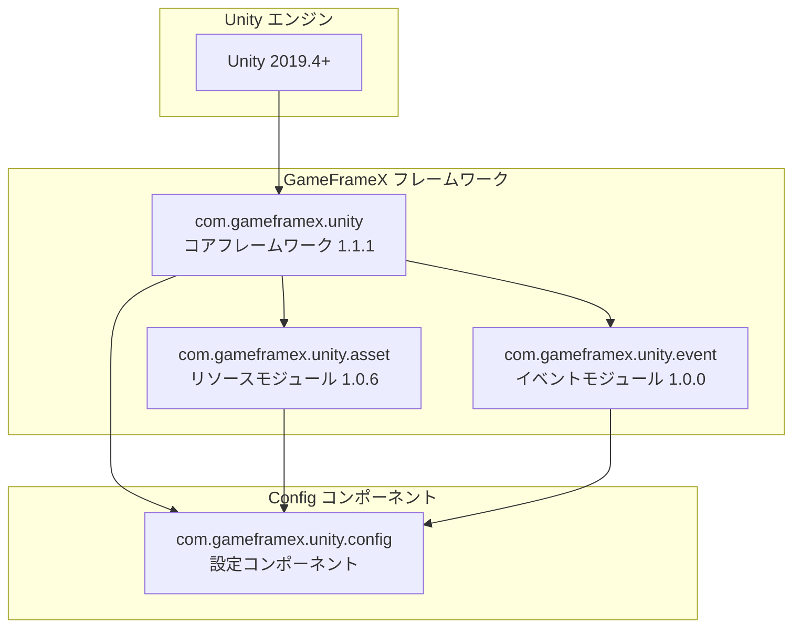

# 依存関係

本文書は Config 設定コンポーネントの依存関係を詳細に介紹し、Unity バージョン要件、GameFrameX コアパッケージ依存関係、内部アセンブリ参照関係を含みます。

## 概要

Config 設定コンポーネントは GameFrameX フレームワークのコアモジュールの1つであり、ゲーム内の設定データテーブルを管理するために使用されます。このコンポーネントは GameFrameX コアフレームワークの他のモジュールに依存しており、特定のバージョン要件を満たす Unity 環境で実行され、関連する依存パッケージを正しく設定する必要があります。

## 依存関係アーキテクチャ



## Unity バージョン要件

| プロジェクト | 要件 |
|------|------|
| 最小バージョン | Unity 2019.4 |
| 推奨バージョン | Unity 2020.3 LTS 以上 |
| スクリプトレンタイム | .NET Standard 2.0 以上 |

> Source: [package.json](https://github.com/GameFrameX/com.gameframex.unity.config/blob/main/package.json#L7)

Unity バージョン要件は `package.json` ファイルの `unity` フィールドに定義されており、プロジェクトが互換性のある Unity バージョンを使用して最佳の互換性を得ることを確認します。

## GameFrameX コアパッケージ依存関係

Config コンポーネントは、以下の GameFrameX 公式パッケージに依存しています。これらの依存関係は `package.json` で宣言されています：

### 依存パッケージ一覧

| パッケージ名 | 最小バージョン | 用途説明 |
|------|----------|----------|
| com.gameframex.unity | 1.1.1 | コアフレームワーク、基本コンポーネントとモジュール管理機能を提供 |
| com.gameframex.unity.asset | 1.0.6 | リソースロードモジュール、非同期で設定テーブルファイルをロードするために使用 |
| com.gameframex.unity.event | 1.0.0 | イベントシステム、設定ロード成功/失敗などのイベント通知に使用 |

```json
{
  "dependencies": {
    "com.gameframex.unity": "1.1.1",
    "com.gameframex.unity.asset": "1.0.6",
    "com.gameframex.unity.event": "1.0.0"
  }
}
```

> Source: [package.json](https://github.com/GameFrameX/com.gameframex.unity.config/blob/main/package.json#L21-L25)

### 依存関係説明

**com.gameframex.unity (コアフレームワーク)**
- `GameFrameworkComponent` 基底クラスを提供し、ConfigComponent はこのクラスを継承します
- モジュール管理システムを提供し、`GameFrameworkEntry` を通じて各モジュールのインスタンスを取得
- 型反射に使用するアセンブリツール `Utility.Assembly` を提供

**com.gameframex.unity.asset (リソースモジュール)**
- リソースの非同期ロード能力を提供し、ConfigManager は `GameFrameX.Asset.Runtime` 名前空間を使用
- 設定テーブルバイナリファイルまたは JSON/XML 設定ファイルのロードに使用
- 設定テーブルのオンデマンドロードとキャッシュ管理をサポート

**com.gameframex.unity.event (イベントモジュール)**
- イベントシステムを提供し、設定ロードステータスの通知に使用
- 以下のイベント引数クラスを定義：
  - `LoadConfigSuccessEventArgs`: 設定ロード成功イベント
  - `LoadConfigFailureEventArgs`: 設定ロード失敗イベント
  - `LoadConfigUpdateEventArgs`: 設定ロード更新イベント

## 内部アセンブリ参照

Config コンポーネントのランタイムアセンブリ `GameFrameX.Config.Runtime.asmdef` は以下のアセンブリ参照を定義しています：

```csharp
// Runtime/GameFrameX.Config.Runtime.asmdef
{
    "references": [
        "GameFrameX.Runtime",
        "GameFrameX.Event.Runtime",
        "GameFrameX.Asset.Runtime"
    ]
}
```

> Source: [Runtime/GameFrameX.Config.Runtime.asmdef](https://github.com/GameFrameX/com.gameframex.unity.config/blob/main/Runtime/GameFrameX.Config.Runtime.asmdef#L3-L6)

### アセンブリ参照詳細

| アセンブリ | 名前空間 | 機能説明 |
|--------|----------|----------|
| GameFrameX.Runtime | `GameFrameX.Runtime` | コアランタイム、GameFrameworkComponent、GameFrameworkModule、IConfigManager インターフェースを提供 |
| GameFrameX.Event.Runtime | `GameFrameX.Event.Runtime` | イベントシステム基底インターフェースと実装 |
| GameFrameX.Asset.Runtime | `GameFrameX.Asset.Runtime` | リソースロードインターフェースと実装 |

### 主要型依存関係

Config コンポーネントで使用される主要型とその出所：

```csharp
using GameFrameX.Runtime;           // GameFrameworkComponent, GameFrameworkModule
using GameFrameX.Asset.Runtime;      // リソースロード関連インターフェース
using GameFrameX.Event.Runtime;     // イベント引数基底クラス

// ConfigComponent 継承関係
public sealed class ConfigComponent : GameFrameworkComponent

// ConfigManager 継承関係  
public sealed class ConfigManager : GameFrameworkModule, IConfigManager
```

> Source: [Runtime/Config/ConfigComponent.cs](https://github.com/GameFrameX/com.gameframex.unity.config/blob/main/Runtime/Config/ConfigComponent.cs#L48)
> Source: [Runtime/Config/Config/ConfigManager.cs](https://github.com/GameFrameX/com.gameframex.unity.config/blob/main/Runtime/Config/Config/ConfigManager.cs#L47)

## 依存関係のインストール

### 自動インストール（推奨）

Unity Package Manager を通じてパッケージを追加的时候、依存パッケージは自動的にインストールされます：

1. Unity プロジェクトの `Packages/manifest.json` ファイルを開きます
2. `dependencies` に Config コンポーネントを追加します：

```json
{
  "dependencies": {
    "com.gameframex.unity.config": "https://github.com/GameFrameX/com.gameframex.unity.config.git"
  }
}
```

3. Unity は自動的にすべての必須の依存パッケージを解析してインストールします

### 手動インストール

手動でインストールする必要がある場合は、以下の順序で依存関係をインストールしてください：

1. **コアフレームワークをインストール**
   ```json
   { "com.gameframex.unity": "1.1.1" }
   ```

2. **リソースモジュールをインストール**
   ```json
   { "com.gameframex.unity.asset": "1.0.6" }
   ```

3. **イベントモジュールをインストール**
   ```json
   { "com.gameframex.unity.event": "1.0.0" }
   ```

4. **最後に Config コンポーネントをインストール**
   ```json
   { "com.gameframex.unity.config": "1.1.3" }
   ```

## 依存バージョンの互換性

| Config バージョン | Unity バージョン | コアフレームワークバージョン | リソースモジュールバージョン | イベントモジュールバージョン |
|------------|------------|--------------|--------------|--------------|
| 1.1.3 | 2019.4+ | 1.1.1 | 1.0.6 | 1.0.0 |
| 1.1.2 | 2019.4+ | 1.1.0 | 1.0.5 | 1.0.0 |
| 1.1.1 | 2019.4+ | 1.1.0 | 1.0.5 | 1.0.0 |

常に最新バージョンの依存パッケージを使用して、最佳の互換性と新機能のサポートを得ることを推奨します。

## よくある依存問題

### 問題 1：コアフレームワーク依存が欠落している

**症状**: コンパイル時にエラー `GameFrameworkComponent` 型が見つからない

**解決策**: `com.gameframex.unity` コアフレームワークパッケージがインストールされていることを確認

### 問題 2：イベントシステムが初期化されていない

**症状**: 設定ロードイベントがトリガーされない

**解決策**: `com.gameframex.unity.event` が正しくインストールされ、シーンでイベントシステムが初期化されていることを確認

### 問題 3：リソースロードが失敗する

**症状**: 設定テーブルファイルをロードできない

**解決策**: `com.gameframex.unity.asset` バージョンが要件と一致することを確認し、リソースパス設定を確認

## 関連リンク

- [インストール方法](./2-installation.install-methods) - 異なるインストールメソッドを確認
- [ConfigComponent 設定コンポーネント](./4-core-concepts.config-component) - コンポーネントの使用方法を確認
- [ConfigManager 設定マネージャー](./4-core-concepts.config-manager) - マネージャーの機能を確認
- [IDataTable データテーブルインターフェース](./4-core-concepts.idata-table) - データテーブルインターフェース定義を確認
- [公式ドキュメント](https://gameframex.doc.alianblank.com/) - GameFrameX 完全ドキュメント
