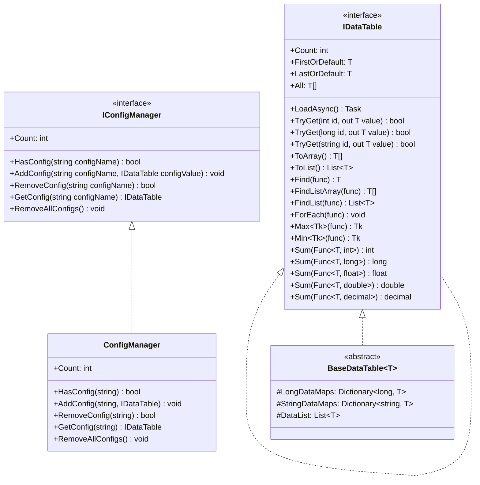
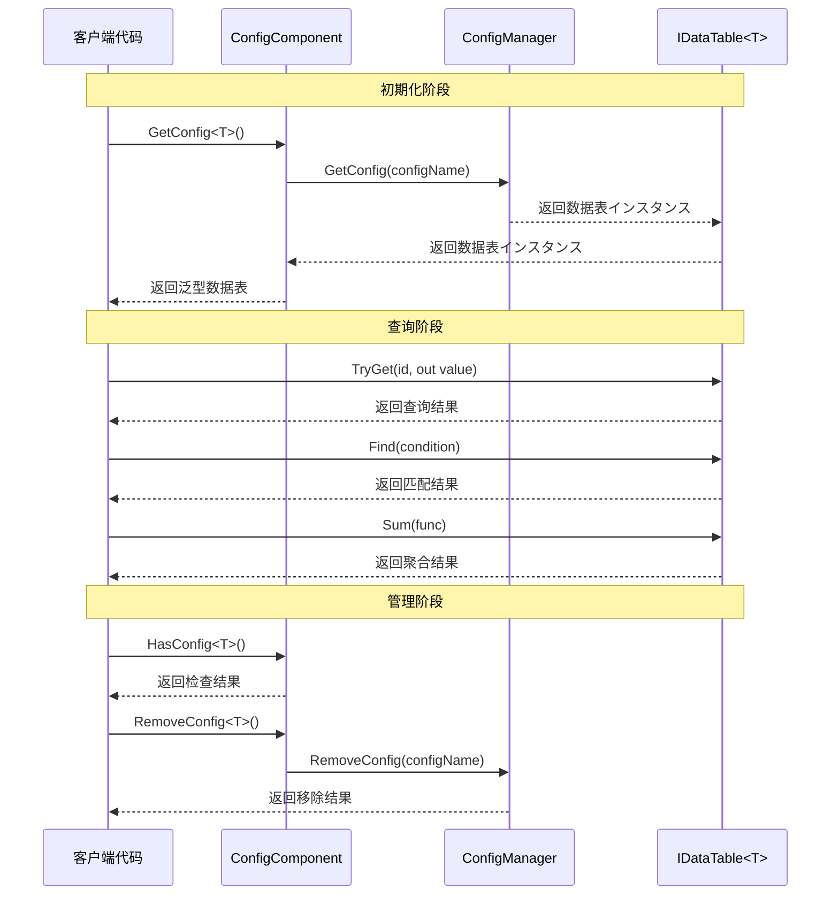

# インターフェース定义

本文档详细介绍 GameFrameX Config 配置模块中定义的コアインターフェース，包括数据表インターフェース IDataTable、泛型数据表インターフェース IDataTable<T> 以及グローバル設定管理器インターフェース IConfigManager。这些インターフェース为配置系统提供します统一的抽象层，使開発者能够以クラス型安全的方法访问和管理ゲーム配置数据。

## 概要

GameFrameX Config 配置模块采用インターフェース驱动设计，を通じて定义清晰的インターフェース契约来実装配置数据的解耦管理。インターフェース设计遵循以下コア原则：

- **クラス型安全**：を通じて泛型インターフェース IDataTable<T> 确保编译时的クラス型检查
- **灵活查询**：提供多种数据查询方法，包括主键查询、条件查询、聚合运算等
- **异步加载**：所有数据加载操作均サポート异步模式，避免阻塞ゲーム主线程
- **イベント驱动**：を通じてイベント参数クラス実装加载ステータス的精确通知

## インターフェース层次结构



如上图所示，インターフェース之间存在明确的继承和実装关系。IDataTable<T> を継承 IDataTable，添加了强クラス型的数据访问メソッド。BaseDataTable<T> 実装了 IDataTable<T> インターフェース，提供します数据存储和查询的基クラス実装。ConfigManager 実装了 IConfigManager インターフェース，负责管理所有的配置数据表インスタンス。

## IDataTable 非泛型インターフェース

IDataTable 是数据表的非泛型基础インターフェース，定义了所有数据表都必須実装的コア機能。该インターフェース位于 Runtime/Config/Config/IDataTable.cs ファイル中。

> Source: [IDataTable.cs](https://github.com/GameFrameX/com.gameframex.unity.config/blob/main/Runtime/Config/Config/IDataTable.cs#L46-L67)

### インターフェース定义

```csharp
[Preserve]
public interface IDataTable
{
    [Preserve]
    Task LoadAsync();

    [Preserve]
    int Count { get; }
}
```

### 成员説明

**LoadAsync メソッド**
- **签名**: `Task LoadAsync()`
- **説明**: 异步加载数据表内容。此メソッド由具体実装クラス実装，に使用从各种数据源（如二进制ファイル、JSON、XML 等）加载配置数据
- **返回值**: 表示异步操作的任务对象

**Count プロパティ**
- **签名**: `int Count { get; }`
- **説明**: 取得数据表中包含的数据对象数量
- **返回值**: 非负整数，表示数据项总数

## IDataTable<T> 泛型インターフェース

IDataTable<T> 是数据表的泛型インターフェース，を継承 IDataTable インターフェース，提供します强クラス型的数据访问和查询能力。该インターフェース同样位于 Runtime/Config/Config/IDataTable.cs ファイル中。

> Source: [IDataTable.cs](https://github.com/GameFrameX/com.gameframex.unity.config/blob/main/Runtime/Config/Config/IDataTable.cs#L77-L355)

### インターフェース定义

```csharp
[Preserve]
public interface IDataTable<T> : IDataTable where T : class
{
    // 主键查询メソッド
    [Obsolete("お願いします使用TryGetメソッド")]
    [Preserve]
    T Get(int id);

    [Obsolete("お願いします使用TryGetメソッド")]
    [Preserve]
    T Get(long id);

    [Obsolete("お願いします使用TryGetメソッド")]
    [Preserve]
    T Get(string id);

    [Preserve]
    bool TryGet(int id, out T value);

    [Preserve]
    bool TryGet(long id, out T value);

    [Preserve]
    bool TryGet(string id, out T value);

    // 索引器
    [Preserve]
    T this[int id] { get; }

    [Preserve]
    T this[long id] { get; }

    [Preserve]
    T this[string id] { get; }

    // 快捷访问プロパティ
    [Preserve]
    T FirstOrDefault { get; }

    [Preserve]
    T LastOrDefault { get; }

    [Preserve]
    T[] All { get; }

    // 集合转换メソッド
    [Preserve]
    T[] ToArray();

    [Preserve]
    List<T> ToList();

    // 查询メソッド
    [Preserve]
    T Find(System.Func<T, bool> func);

    [Preserve]
    T[] FindListArray(System.Func<T, bool> func);

    [Preserve]
    List<T> FindList(Func<T, bool> func);

    [Preserve]
    void ForEach(Action<T> func);

    // 聚合メソッド
    [Preserve]
    Tk Max<Tk>(Func<T, Tk> func) where Tk : IComparable<Tk>;

    [Preserve]
    Tk Min<Tk>(Func<T, Tk> func) where Tk : IComparable<Tk>;

    [Preserve]
    int Sum(Func<T, int> func);

    [Preserve]
    long Sum(Func<T, long> func);

    [Preserve]
    float Sum(Func<T, float> func);

    [Preserve]
    double Sum(Func<T, double> func);

    [Preserve]
    decimal Sum(Func<T, decimal> func);
}
```

### 成员詳細説明

#### 主键查询メソッド

**TryGet メソッド重载**
- **説明**: 尝试に基づいて指定的主键取得数据对象。相比已废弃的 Get メソッド，TryGet メソッド更加安全，不会抛出異常
- **参数**:
  - `id`: 数据对象的主键，サポート int、long、string 三种クラス型
  - `value`: 输出参数，当找到对应主键的数据时，返回该数据对象；否则返回默认值
- **返回值**: bool クラス型，找到对应主键的数据返回 true，否则返回 false

```csharp
// 使用 TryGet メソッド安全地取得数据
if (dataTable.TryGet(1001, out var item))
{
    Debug.Log($"找到数据: {item.Name}");
}
else
{
    Debug.LogWarning("未找到指定数据");
}
```

> Source: [BaseDataTable.cs](https://github.com/GameFrameX/com.gameframex.unity.config/blob/main/Runtime/Config/Config/BaseDataTable.cs#L119-L162)

#### 索引器

**説明**: 提供します三种クラス型的索引器に使用便捷访问数据。索引器内部呼び出し TryGet メソッド実装，当找不到对应数据时返回 null

```csharp
// 使用索引器访问数据
var item1 = dataTable[1001];      // int クラス型主键
var item2 = dataTable[10001L];     // long クラス型主键
var item3 = dataTable["item_001"]; // string クラス型主键
```

> Source: [BaseDataTable.cs](https://github.com/GameFrameX/com.gameframex.unity.config/blob/main/Runtime/Config/Config/BaseDataTable.cs#L164-L204)

#### 快捷访问プロパティ

**FirstOrDefault プロパティ**
- **クラス型**: `T`
- **説明**: 取得数据表中的第一个数据对象，如果数据表为空则返回 null

**LastOrDefault プロパティ**
- **クラス型**: `T`
- **説明**: 取得数据表中的最后一个数据对象，如果数据表为空则返回 null

**All プロパティ**
- **クラス型**: `T[]`
- **説明**: 取得数据表中所有数据对象的数组副本

```csharp
// 使用快捷プロパティ访问数据
var first = dataTable.FirstOrDefault;
var last = dataTable.LastOrDefault;
var allItems = dataTable.All;
```

> Source: [BaseDataTable.cs](https://github.com/GameFrameX/com.gameframex.unity.config/blob/main/Runtime/Config/Config/BaseDataTable.cs#L223-L268)

#### 查询メソッド

**Find メソッド**
- **签名**: `T Find(Func<T, bool> func)`
- **説明**: に基づいて指定的条件查找第一个匹配的数据对象
- **参数**: `func` - 定义匹配条件的委托函数
- **返回值**: 第一个匹配的对象，如果未找到则返回 null

**FindListArray メソッド**
- **签名**: `T[] FindListArray(Func<T, bool> func)`
- **説明**: に基づいて指定的条件查找所有匹配的数据对象，并返回数组

**FindList メソッド**
- **签名**: `List<T> FindList(Func<T, bool> func)`
- **説明**: に基づいて指定的条件查找所有匹配的数据对象，并返回列表

**ForEach メソッド**
- **签名**: `void ForEach(Action<T> func)`
- **説明**: 对数据表中的每个数据对象执行指定的操作

```csharp
// 使用查询メソッド
var found = dataTable.Find(item => item.Level > 10);
var matched = dataTable.FindList(item => item.Rarity == "SSR");
var arrayMatched = dataTable.FindListArray(item => item.IsAvailable);

dataTable.ForEach(item => Debug.Log(item.Name));
```

> Source: [BaseDataTable.cs](https://github.com/GameFrameX/com.gameframex.unity.config/blob/main/Runtime/Config/Config/BaseDataTable.cs#L296-L349)

#### 聚合メソッド

**Max メソッド**
- **签名**: `Tk Max<Tk>(Func<T, Tk> func) where Tk : IComparable<Tk>`
- **説明**: 取得数据表中指定プロパティ的最大值
- **泛型约束**: Tk 必須実装 IComparable<Tk> インターフェース

**Min メソッド**
- **签名**: `Tk Min<Tk>(Func<T, Tk> func) where Tk : IComparable<Tk>`
- **説明**: 取得数据表中指定プロパティ的最小值
- **泛型约束**: Tk 必須実装 IComparable<Tk> インターフェース

**Sum メソッド重载**
- **説明**: 计算数据表中指定数值プロパティ的总和，サポート int、long、float、double、decimal 五种数值クラス型
- **签名**: 
  - `int Sum(Func<T, int> func)`
  - `long Sum(Func<T, long> func)`
  - `float Sum(Func<T, float> func)`
  - `double Sum(Func<T, double> func)`
  - `decimal Sum(Func<T, decimal> func)`

```csharp
// 使用聚合メソッド
var maxLevel = dataTable.Max(item => item.Level);
var minPrice = dataTable.Min(item => item.Price);
var totalDamage = dataTable.Sum(item => item.BaseDamage);
```

> Source: [BaseDataTable.cs](https://github.com/GameFrameX/com.gameframex.unity.config/blob/main/Runtime/Config/Config/BaseDataTable.cs#L351-L449)

## IConfigManager グローバル設定管理器インターフェース

IConfigManager インターフェース定义了グローバル設定管理器的コア機能，负责管理所有的配置数据表インスタンス。该インターフェース位于 Runtime/Config/Config/IConfigManager.cs ファイル中。

> Source: [IConfigManager.cs](https://github.com/GameFrameX/com.gameframex.unity.config/blob/main/Runtime/Config/Config/IConfigManager.cs#L34-L99)

### インターフェース定义

```csharp
public interface IConfigManager
{
    /// <summary>
    /// 取得グローバル設定项数量。
    /// </summary>
    int Count { get; }

    /// <summary>
    /// 检查是否存在指定グローバル設定项。
    /// </summary>
    bool HasConfig(string configName);

    /// <summary>
    /// 增加指定グローバル設定项。
    /// </summary>
    void AddConfig(string configName, IDataTable configValue);

    /// <summary>
    /// 移除指定グローバル設定项。
    /// </summary>
    bool RemoveConfig(string configName);

    /// <summary>
    /// 取得指定グローバル設定项。
    /// </summary>
    IDataTable GetConfig(string configName);

    /// <summary>
    /// 清空所有グローバル設定项。
    /// </summary>
    void RemoveAllConfigs();
}
```

### 成员詳細説明

**Count プロパティ**
- **クラス型**: `int`
- **説明**: 取得当前已加载的グローバル設定项数量

**HasConfig メソッド**
- **签名**: `bool HasConfig(string configName)`
- **説明**: 检查是否存在指定名称的グローバル設定项
- **参数**: `configName` - 要检查的配置项名称
- **返回值**: 存在返回 true，否则返回 false

**AddConfig メソッド**
- **签名**: `void AddConfig(string configName, IDataTable configValue)`
- **説明**: 添加一个新的グローバル設定项
- **参数**:
  - `configName` - 配置项的名称，に使用后续检索
  - `configValue` - 配置项的数据表インスタンス

**RemoveConfig メソッド**
- **签名**: `bool RemoveConfig(string configName)`
- **説明**: 移除指定名称的グローバル設定项
- **参数**: `configName` - 要移除的配置项名称
- **返回值**: 移除成功返回 true，否则返回 false

**GetConfig メソッド**
- **签名**: `IDataTable GetConfig(string configName)`
- **説明**: 取得指定名称的グローバル設定项
- **参数**: `configName` - 要取得的配置项名称
- **返回值**: 配置项的数据表インスタンス，如果不存在则返回 null

**RemoveAllConfigs メソッド**
- **签名**: `void RemoveAllConfigs()`
- **説明**: 移除所有已加载的グローバル設定项

## インターフェース使用フロー



如序列图所示，使用インターフェース的基本フロー分为三个阶段：初期化阶段を通じて ConfigComponent 取得泛型数据表インスタンス；查询阶段使用 IDataTable<T> インターフェース提供的メソッド进行数据访问；管理阶段を通じて ConfigComponent 或 ConfigManager 进行配置项的检查和移除操作。

## ConfigComponent コンポーネントインターフェース封装

ConfigComponent 是 Unity コンポーネント，对 IConfigManager インターフェース进行了面向 Unity 的封装，提供します更便捷的泛型访问方法。该コンポーネント位于 Runtime/Config/ConfigComponent.cs ファイル中。

> Source: [ConfigComponent.cs](https://github.com/GameFrameX/com.gameframex.unity.config/blob/main/Runtime/Config/ConfigComponent.cs#L40-L185)

### コアメソッド

**GetConfig<T> メソッド**
- **签名**: `T GetConfig<T>() where T : IDataTable`
- **説明**: 取得指定クラス型的グローバル設定项，返回强クラス型的泛型数据表
- **返回值**: 泛型数据表インスタンス，如果不存在则返回默认值

**HasConfig<T> メソッド**
- **签名**: `bool HasConfig<T>() where T : IDataTable`
- **説明**: 检查是否存在指定クラス型的グローバル設定项

**RemoveConfig<T> メソッド**
- **签名**: `bool RemoveConfig<T>() where T : IDataTable`
- **説明**: 移除指定クラス型的グローバル設定项

**Add メソッド**
- **签名**: `void Add(string configName, IDataTable dataTable)`
- **説明**: 添加一个新的グローバル設定项

```csharp
// ConfigComponent 使用示例
public class MyGameController : MonoBehaviour
{
    private ConfigComponent configComponent;
    
    private void Start()
    {
        configComponent = GetComponent<ConfigComponent>();
        
        // 检查配置是否存在
        if (configComponent.HasConfig<WeaponDataTable>())
        {
            // 取得配置
            var weaponTable = configComponent.GetConfig<WeaponDataTable>();
            
            // 查询数据
            var weapon = weaponTable[1001];
            var fireWeapons = weaponTable.FindList(w => w.Type == WeaponType.Fire);
        }
    }
}
```

## 関連リンク

- [ConfigComponent 配置コンポーネント](./4-core-concepts.config-component) - 了解 ConfigComponent コンポーネント的详细信息
- [ConfigManager 配置管理器](./4-core-concepts.config-manager) - 了解 ConfigManager 実装细节
- [IDataTable 数据表インターフェース](./4-core-concepts.idata-table) - 了解数据表インターフェース的コア概念
- [イベント参数](./5-api-reference.event-args) - 了解配置加载関連的イベント参数
- [基础使用](./3-getting-started.basic-usage) - 快速开始配置模块的使用
- [数据表定义](./3-getting-started.data-table-definition) - 了解如何定义数据表
