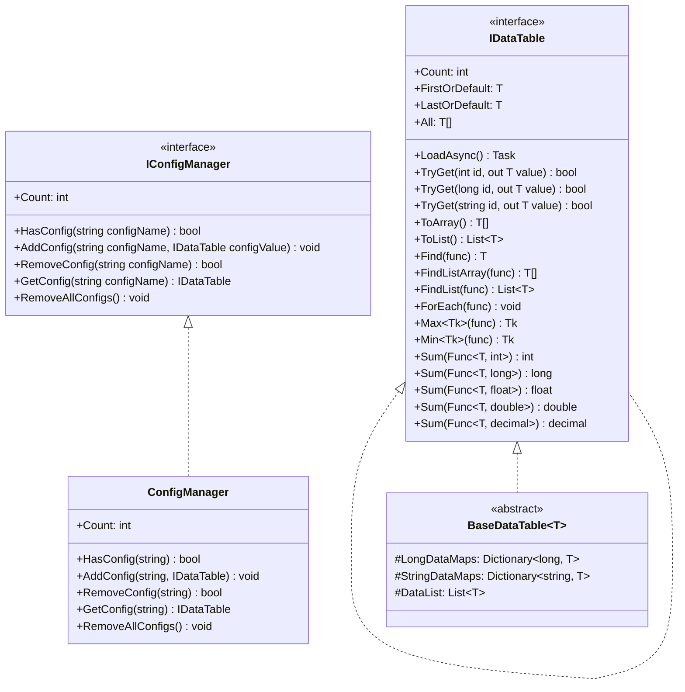
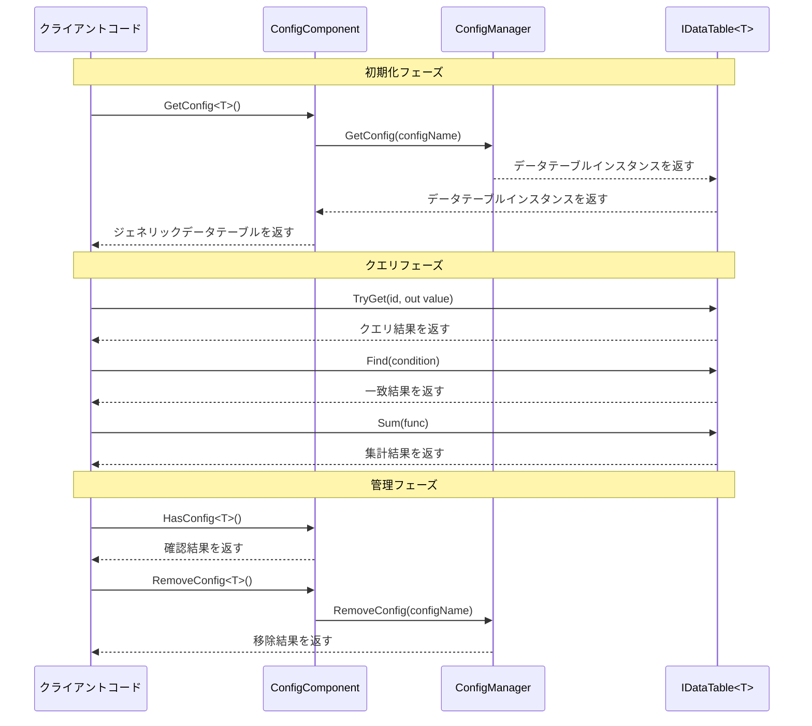

# インターフェース定義

本文書は GameFrameX Config 設定モジュールのコアインターフェースを詳細に介紹します。データテーブルインターフェース IDataTable、ジェネリックデータテーブルインターフェース `IDataTable<T>`、そしてグローバル設定マネージャーインターフェース IConfigManager が含まれます。これらのインターフェースは設定システムに统一された抽象化レイヤーを提供し、開発者が型安全な方法でゲーム設定データにアクセスし、管理できるようにします。

## 概要

GameFrameX Config 設定モジュールはインターフェース駆動設計を採用し、明確なインターフェースコントラクトを定義して設定データの疎結合管理を実現します。インターフェース設計は以下のコア原則に従います：

- **型安全性**：ジェネリックインターフェース `IDataTable<T>` を通じてコンパイル時の型チェックを確保
- **灵活なクエリ**：主キークエリ、条件クエリ、集計演算など、複数のデータクエリメソッドを提供
- **非同期ロード**：すべてのデータロード操作は非同期モードをサポートし、ゲーム主スレッドのブロックを回避
- **イベント驱动**：イベント引数クラスを通じてロードステータスの正確な通知を実装

## インターフェース階層構造



上の図に示すように、インターフェース間には明確な継承と実装関係がにあります。`IDataTable<T>` は IDataTable を継承し、强タイプのデータアクセスメソッドを追加します。`BaseDataTable<T>` は `IDataTable<T>` インターフェースを実装し、データ保存とクエリの基底クラス実装を提供します。ConfigManager は IConfigManager インターフェースを実装し、すべての設定データテーブルインスタンスの管理を担当します。

## IDataTable 非ジェネリックインターフェース

IDataTable はデータテーブルの非ジェネリック基底インターフェースであり、すべてのデータテーブルが実装する必要があるコア機能を定義します。このインターフェースは Runtime/Config/Config/IDataTable.cs ファイルにあります。

> Source: [IDataTable.cs](https://github.com/GameFrameX/com.gameframex.unity.config/blob/main/Runtime/Config/Config/IDataTable.cs#L46-L67)

### インターフェース定義

```csharp
[Preserve]
public interface IDataTable
{
    [Preserve]
    Task LoadAsync();

    [Preserve]
    int Count { get; }
}
```

### メンバー説明

**LoadAsync メソッド**
- **シグネチャ**: `Task LoadAsync()`
- **説明**: 非同期でデータテーブル内容をロードします。このメソッドは具体的な実装クラスが実装し、バイナリファイル、JSON、XML などのさまざまなデータソースから設定データをロードするために使用されます
- **戻り値**: 非同期操作のタスクオブジェクト

**Count プロパティ**
- **シグネチャ**: `int Count { get; }`
- **説明**: データテーブルに含まれるデータオブジェクトの数を取得します
- **戻り値**: データ項目の総数を表す負でない整数

## `IDataTable<T>` ジェネリックインターフェース

`IDataTable<T>` はデータテーブルのジェネリックインターフェースであり、IDataTable インターフェースを継承し、强タイプのデータアクセスとクエリ能力を提供します。このインターフェースは Runtime/Config/Config/IDataTable.cs ファイルにあります。

> Source: [IDataTable.cs](https://github.com/GameFrameX/com.gameframex.unity.config/blob/main/Runtime/Config/Config/IDataTable.cs#L77-L355)

### インターフェース定義

```csharp
[Preserve]
public interface IDataTable<T> : IDataTable where T : class
{
    // 主キークエリメソッド
    [Obsolete("TryGet メソッドを使用してください")]
    [Preserve]
    T Get(int id);

    [Obsolete("TryGet メソッドを使用してください")]
    [Preserve]
    T Get(long id);

    [Obsolete("TryGet メソッドを使用してください")]
    [Preserve]
    T Get(string id);

    [Preserve]
    bool TryGet(int id, out T value);

    [Preserve]
    bool TryGet(long id, out T value);

    [Preserve]
    bool TryGet(string id, out T value);

    // インデクサー
    [Preserve]
    T this[int id] { get; }

    [Preserve]
    T this[long id] { get; }

    [Preserve]
    T this[string id] { get; }

    // 便捷アクセスプロパティ
    [Preserve]
    T FirstOrDefault { get; }

    [Preserve]
    T LastOrDefault { get; }

    [Preserve]
    T[] All { get; }

    // コレクション変換メソッド
    [Preserve]
    T[] ToArray();

    [Preserve]
    List<T> ToList();

    // クエリメソッド
    [Preserve]
    T Find(System.Func<T, bool> func);

    [Preserve]
    T[] FindListArray(System.Func<T, bool> func);

    [Preserve]
    List<T> FindList(Func<T, bool> func);

    [Preserve]
    void ForEach(Action<T> func);

    // 集計メソッド
    [Preserve]
    Tk Max<Tk>(Func<T, Tk> func) where Tk : IComparable<Tk>;

    [Preserve]
    Tk Min<Tk>(Func<T, Tk> func) where Tk : IComparable<Tk>;

    [Preserve]
    int Sum(Func<T, int> func);

    [Preserve]
    long Sum(Func<T, long> func);

    [Preserve]
    float Sum(Func<T, float> func);

    [Preserve]
    double Sum(Func<T, double> func);

    [Preserve]
    decimal Sum(Func<T, decimal> func);
}
```

### メンバー詳細説明

#### 主キークエリメソッド

**TryGet メソッドオーバーロード**
- **説明**: 指定された主キーに基づいてデータオブジェクトの取得を試みます。廃止された Get メソッドとは異なり、TryGet メソッドはより安全で、例外をスローしません
- **パラメータ**:
  - `id`: データオブジェクトの主キーで、int、long、string の3種類をサポート
  - `value`: 出力パラメータ、対応する主キーのデータが見つかったときにそのデータオブジェクトを返し、そうでなければデフォルト値を返します
- **戻り値**: 対応する主キーのデータが見つかった場合は bool 型で true を返し、そうでなければ false を返します

```csharp
// TryGet メソッドを使用して安全にデータを取得
if (dataTable.TryGet(1001, out var item))
{
    Debug.Log($"データが見つかりました: {item.Name}");
}
else
{
    Debug.LogWarning("指定されたデータが見つかりません");
}
```

> Source: [BaseDataTable.cs](https://github.com/GameFrameX/com.gameframex.unity.config/blob/main/Runtime/Config/Config/BaseDataTable.cs#L119-L162)

#### インデクサー

**説明**: 便捷なデータアクセスを提供するために3種類のインデクサーを提供します。インデクサー内部は TryGet メソッドを実装し、対応するデータが見つからない場合は null を返します

```csharp
// インデクサーを使用してデータにアクセス
var item1 = dataTable[1001];      // int 型主キー
var item2 = dataTable[10001L];     // long 型主キー
var item3 = dataTable["item_001"]; // string 型主キー
```

> Source: [BaseDataTable.cs](https://github.com/GameFrameX/com.gameframex.unity.config/blob/main/Runtime/Config/Config/BaseDataTable.cs#L164-L204)

#### 便捷アクセスプロパティ

**FirstOrDefault プロパティ**
- **型**: `T`
- **説明**: データテーブルの最初のデータオブジェクトを取得し、データテーブルが空の場合は null を返します

**LastOrDefault プロパティ**
- **型**: `T`
- **説明**: データテーブルの最後のデータオブジェクトを取得し、データテーブルが空の場合は null を返します

**All プロパティ**
- **型**: `T[]`
- **説明**: データテーブルのすべてのデータオブジェクトの配列コピーを取得します

```csharp
// 便捷プロパティを使用してデータにアクセス
var first = dataTable.FirstOrDefault;
var last = dataTable.LastOrDefault;
var allItems = dataTable.All;
```

> Source: [BaseDataTable.cs](https://github.com/GameFrameX/com.gameframex.unity.config/blob/main/Runtime/Config/Config/BaseDataTable.cs#L223-L268)

#### クエリメソッド

**Find メソッド**
- **シグネチャ**: `T Find(Func<T, bool> func)`
- **説明**: 指定された条件に一致する最初のデータオブジェクトを検索します
- **パラメータ**: `func` - 一致条件を定義する委任関数
- **戻り値**: 最初の一致オブジェクトで見つからなかった場合は null

**FindListArray メソッド**
- **シグネチャ**: `T[] FindListArray(Func<T, bool> func)`
- **説明**: 指定された条件に一致するすべてのデータオブジェクトを検索し、配列を返します

**FindList メソッド**
- **シグネチャ**: `List<T> FindList(Func<T, bool> func)`
- **説明**: 指定された条件に一致するすべてのデータオブジェクトを検索し、リストを返します

**ForEach メソッド**
- **シグネチャ**: `void ForEach(Action<T> func)`
- **説明**: データテーブル内の各データオブジェクトに対して指定された操作を実行します

```csharp
// クエリメソッドを使用
var found = dataTable.Find(item => item.Level > 10);
var matched = dataTable.FindList(item => item.Rarity == "SSR");
var arrayMatched = dataTable.FindListArray(item => item.IsAvailable);

dataTable.ForEach(item => Debug.Log(item.Name));
```

> Source: [BaseDataTable.cs](https://github.com/GameFrameX/com.gameframex.unity.config/blob/main/Runtime/Config/Config/BaseDataTable.cs#L296-L349)

#### 集計メソッド

**Max メソッド**
- **シグネチャ**: `Tk Max<Tk>(Func<T, Tk> func) where Tk : IComparable<Tk>`
- **説明**: データテーブルの指定されたプロパティの最大値を取得します
- **ジェネリック制約**: Tk は `IComparable<Tk>` インターフェースを実装する必要があります

**Min メソッド**
- **シグネチャ**: `Tk Min<Tk>(Func<T, Tk> func) where Tk : IComparable<Tk>`
- **説明**: データテーブルの指定されたプロパティの最小値を取得します
- **ジェネリック制約**: Tk は `IComparable<Tk>` インターフェースを実装する必要があります

**Sum メソッドオーバーロード**
- **説明**: データテーブルの指定された数値プロパティの合計を計算し、int、long、float、double、decimal の5種類の数値型をサポート
- **シグネチャ**: 
  - `int Sum(Func<T, int> func)`
  - `long Sum(Func<T, long> func)`
  - `float Sum(Func<T, float> func)`
  - `double Sum(Func<T, double> func)`
  - `decimal Sum(Func<T, decimal> func)`

```csharp
// 集計メソッドを使用
var maxLevel = dataTable.Max(item => item.Level);
var minPrice = dataTable.Min(item => item.Price);
var totalDamage = dataTable.Sum(item => item.BaseDamage);
```

> Source: [BaseDataTable.cs](https://github.com/GameFrameX/com.gameframex.unity.config/blob/main/Runtime/Config/Config/BaseDataTable.cs#L351-L449)

## IConfigManager グローバル設定マネージャーインターフェース

IConfigManager インターフェースはグローバル設定マネージャーのコア機能を定義し、すべての設定データテーブルインスタンスの管理を担当します。このインターフェースは Runtime/Config/Config/IConfigManager.cs ファイルにあります。

> Source: [IConfigManager.cs](https://github.com/GameFrameX/com.gameframex.unity.config/blob/main/Runtime/Config/Config/IConfigManager.cs#L34-L99)

### インターフェース定義

```csharp
public interface IConfigManager
{
    /// <summary>
    /// グローバル設定項目の数を取得します。
    /// </summary>
    int Count { get; }

    /// <summary>
    /// 指定されたグローバル設定項目が存在するか確認します。
    /// </summary>
    bool HasConfig(string configName);

    /// <summary>
    /// 指定されたグローバル設定項目を追加します。
    /// </summary>
    void AddConfig(string configName, IDataTable configValue);

    /// <summary>
    /// 指定されたグローバル設定項目を移除します。
    /// </summary>
    bool RemoveConfig(string configName);

    /// <summary>
    /// 指定されたグローバル設定項目を取得します。
    /// </summary>
    IDataTable GetConfig(string configName);

    /// <summary>
    /// すべてのグローバル設定項目をクリアします。
    /// </summary>
    void RemoveAllConfigs();
}
```

### メンバー詳細説明

**Count プロパティ**
- **型**: `int`
- **説明**: 現在ロードされているグローバル設定項目の数を取得します

**HasConfig メソッド**
- **シグネチャ**: `bool HasConfig(string configName)`
- **説明**: 指定された名前のグローバル設定項目が存在するか確認します
- **パラメータ**: `configName` - 確認する設定項目名
- **戻り値**: 存在する場合は true、そうでなければ false

**AddConfig メソッド**
- **シグネチャ**: `void AddConfig(string configName, IDataTable configValue)`
- **説明**: 新しいグローバル設定項目を追加します
- **パラメータ**:
  - `configName` - 後続の検索に使用する設定項目名
  - `configValue` - 設定項目のデータテーブルインスタンス

**RemoveConfig メソッド**
- **シグネチャ**: `bool RemoveConfig(string configName)`
- **説明**: 指定された名前のグローバル設定項目を移除します
- **パラメータ**: `configName` - 移除する設定項目名
- **戻り値**: 移除成功の場合は true、そうでなければ false

**GetConfig メソッド**
- **シグネチャ**: `IDataTable GetConfig(string configName)`
- **説明**: 指定された名前のグローバル設定項目を取得します
- **パラメータ**: `configName` - 取得する設定項目名
- **戻り値**: 設定項目のデータテーブルインスタンス。存在しない場合は null を返します

**RemoveAllConfigs メソッド**
- **シグネチャ**: `void RemoveAllConfigs()`
- **説明**: すべてのロード済みグローバル設定項目を移除します

## インターフェース使用フロー



シーケンス図に示すように、インターフェースの基本フローは3つのフェーズに分かれています：初期化フェーズでは ConfigComponent を通じてジェネリックデータテーブルインスタンスを取得；クエリフェーズでは `IDataTable<T>` インターフェースが提供するメソッドを使用してデータにアクセス；管理フェーズでは ConfigComponent または ConfigManager を通じて設定項目の確認と移除操作を行います。

## ConfigComponent コンポーネントインターフェース封裝

ConfigComponent は Unity コンポーネントであり、IConfigManager インターフェースを Unity 向けに封裝し、より便捷なジェネリックアクセス方法を提供します。このコンポーネントは Runtime/Config/ConfigComponent.cs ファイルにあります。

> Source: [ConfigComponent.cs](https://github.com/GameFrameX/com.gameframex.unity.config/blob/main/Runtime/Config/ConfigComponent.cs#L40-L185)

### コアメソッド

**`GetConfig<T>` メソッド**
- **シグネチャ**: `T GetConfig<T>() where T : IDataTable`
- **説明**: 指定された型のグローバル設定項目を取得し、强タイプのジェネリックデータテーブルを返します
- **戻り値**: ジェネリックデータテーブルインスタンス。存在しない場合はデフォルト値を返します

**`HasConfig<T>` メソッド**
- **シグネチャ**: `bool HasConfig<T>() where T : IDataTable`
- **説明**: 指定された型のグローバル設定項目が存在するか確認します

**`RemoveConfig<T>` メソッド**
- **シグネチャ**: `bool RemoveConfig<T>() where T : IDataTable`
- **説明**: 指定された型のグローバル設定項目を移除します

**Add メソッド**
- **シグネチャ**: `void Add(string configName, IDataTable dataTable)`
- **説明**: 新しいグローバル設定項目を追加します

```csharp
// ConfigComponent 使用例
public class MyGameController : MonoBehaviour
{
    private ConfigComponent configComponent;
    
    private void Start()
    {
        configComponent = GetComponent<ConfigComponent>();
        
        // 設定是否存在か確認
        if (configComponent.HasConfig<WeaponDataTable>())
        {
            // 設定を取得
            var weaponTable = configComponent.GetConfig<WeaponDataTable>();
            
            // データをクエリ
            var weapon = weaponTable[1001];
            var fireWeapons = weaponTable.FindList(w => w.Type == WeaponType.Fire);
        }
    }
}
```

## 関連リンク

- [ConfigComponent 設定コンポーネント](./4-core-concepts.config-component) - ConfigComponent コンポーネントの詳細情報
- [ConfigManager 設定マネージャー](./4-core-concepts.config-manager) - ConfigManager 実装の詳細
- [IDataTable データテーブルインターフェース](./4-core-concepts.idata-table) - データテーブルインターフェースのコアコンセプト
- [イベント引数](./5-api-reference.event-args) - 設定ロード関連のイベント引数
- [基本的な使用方法](./3-getting-started.basic-usage) - 設定モジュールの使用を開始
- [データテーブル定義](./3-getting-started.data-table-definition) - データテーブルの定義方法
