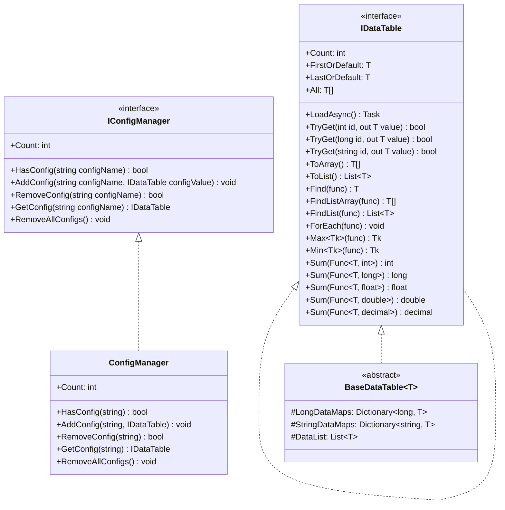
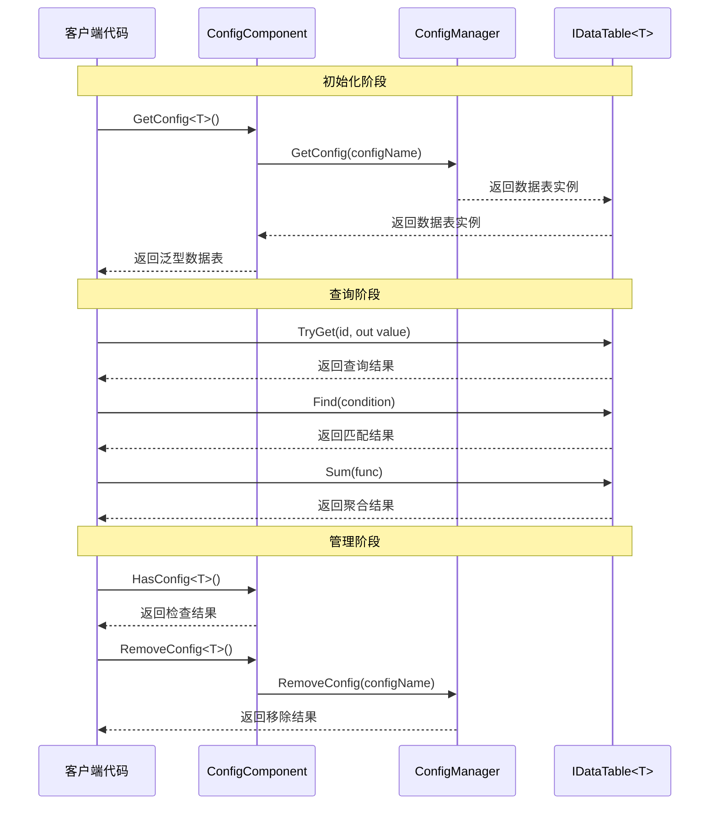

# インターフェース定義

このドキュメント詳細介绍 GameFrameX Config 設定モジュール中定義的コアインターフェース，含みます数据表インターフェース IDataTable、ジェネリック数据表インターフェース IDataTable<T> および全局設定マネージャーインターフェース IConfigManager。这些インターフェース为設定系统提供します統一された的抽象層，使開発者能够以タイプ安全的方法访问和管理游戏設定数据。

## 概要

GameFrameX Config 設定モジュール采用インターフェース驱动設計，通过定義清晰的インターフェース契约来実装設定数据的解耦管理。インターフェース設計遵循以下コア原则：

- **タイプ安全**：通过ジェネリックインターフェース IDataTable<T> 確認してくださいコンパイル时的タイプ確認
- **柔軟查询**：提供多种数据查询方法，含みます主键查询、条件查询、聚合运算等
- **非同期ロード**：所有数据ロード操作均サポート异步モード，避免阻塞游戏主线程
- **イベント驱动**：通过イベントパラメータ类実装ロードステータス的精确通知

## インターフェース層次结构



如上图所示，インターフェース之间存在明确的継承和実装关系。IDataTable<T> 継承自 IDataTable，追加了强タイプ的数据访问メソッド。BaseDataTable<T> 実装了 IDataTable<T> インターフェース，提供します数据存储和查询的基底クラス実装。ConfigManager 実装了 IConfigManager インターフェース，负责管理所有的設定数据表インスタンス。

## IDataTable 非ジェネリックインターフェース

IDataTable 是数据表的非ジェネリック基本インターフェース，定義了所有数据表都〜しなければなりません実装的コア機能。该インターフェース位于 Runtime/Config/Config/IDataTable.cs ファイル中。

> Source: [IDataTable.cs](https://github.com/GameFrameX/com.gameframex.unity.config/blob/main/Runtime/Config/Config/IDataTable.cs#L46-L67)

### インターフェース定義

```csharp
[Preserve]
public interface IDataTable
{
    [Preserve]
    Task LoadAsync();

    [Preserve]
    int Count { get; }
}
```

### 成员説明

**LoadAsync メソッド**
- **签名**: `Task LoadAsync()`
- **説明**: 非同期ロード数据表内容。此メソッド由具体実装类実装，用于从各种数据源（如二进制ファイル、JSON、XML 等）ロード設定数据
- **戻り値**: 表示异步操作的任务对象

**Count プロパティ**
- **签名**: `int Count { get; }`
- **説明**: 取得数据表中パッケージ含的数据对象数量
- **戻り値**: 非负整数，表示数据项总数

## IDataTable<T> ジェネリックインターフェース

IDataTable<T> 是数据表的ジェネリックインターフェース，継承自 IDataTable インターフェース，提供します强タイプ的数据访问和查询能力。该インターフェース同样位于 Runtime/Config/Config/IDataTable.cs ファイル中。

> Source: [IDataTable.cs](https://github.com/GameFrameX/com.gameframex.unity.config/blob/main/Runtime/Config/Config/IDataTable.cs#L77-L355)

### インターフェース定義

```csharp
[Preserve]
public interface IDataTable<T> : IDataTable where T : class
{
    // 主键查询方法
    [Obsolete("请使用TryGet方法")]
    [Preserve]
    T Get(int id);

    [Obsolete("请使用TryGet方法")]
    [Preserve]
    T Get(long id);

    [Obsolete("请使用TryGet方法")]
    [Preserve]
    T Get(string id);

    [Preserve]
    bool TryGet(int id, out T value);

    [Preserve]
    bool TryGet(long id, out T value);

    [Preserve]
    bool TryGet(string id, out T value);

    // 索引器
    [Preserve]
    T this[int id] { get; }

    [Preserve]
    T this[long id] { get; }

    [Preserve]
    T this[string id] { get; }

    // 快捷访问属性
    [Preserve]
    T FirstOrDefault { get; }

    [Preserve]
    T LastOrDefault { get; }

    [Preserve]
    T[] All { get; }

    // 集合转换方法
    [Preserve]
    T[] ToArray();

    [Preserve]
    List<T> ToList();

    // 查询方法
    [Preserve]
    T Find(System.Func<T, bool> func);

    [Preserve]
    T[] FindListArray(System.Func<T, bool> func);

    [Preserve]
    List<T> FindList(Func<T, bool> func);

    [Preserve]
    void ForEach(Action<T> func);

    // 聚合方法
    [Preserve]
    Tk Max<Tk>(Func<T, Tk> func) where Tk : IComparable<Tk>;

    [Preserve]
    Tk Min<Tk>(Func<T, Tk> func) where Tk : IComparable<Tk>;

    [Preserve]
    int Sum(Func<T, int> func);

    [Preserve]
    long Sum(Func<T, long> func);

    [Preserve]
    float Sum(Func<T, float> func);

    [Preserve]
    double Sum(Func<T, double> func);

    [Preserve]
    decimal Sum(Func<T, decimal> func);
}
```

### 成员詳細説明

#### 主键查询メソッド

**TryGet メソッドオーバーロード**
- **説明**: 尝试根据指定的主键取得数据对象。相比已废弃的 Get メソッド，TryGet メソッド更加安全，不会抛出例外
- **パラメータ**:
  - `id`: 数据对象的主键，サポート int、long、string 三种タイプ
  - `value`: 输出パラメータ，当找到对应主键的数据时，返す该数据对象；否则返すデフォルト值
- **戻り値**: bool タイプ，找到对应主键的数据返す true，否则返す false

```csharp
// 使用 TryGet 方法安全地获取数据
if (dataTable.TryGet(1001, out var item))
{
    Debug.Log($"找到数据: {item.Name}");
}
else
{
    Debug.LogWarning("未找到指定数据");
}
```

> Source: [BaseDataTable.cs](https://github.com/GameFrameX/com.gameframex.unity.config/blob/main/Runtime/Config/Config/BaseDataTable.cs#L119-L162)

#### 索引器

**説明**: 提供します三种タイプ的索引器用于便捷访问数据。索引器内部呼び出し TryGet メソッド実装，当找不到对应数据时返す null

```csharp
// 使用索引器访问数据
var item1 = dataTable[1001];      // int 类型主键
var item2 = dataTable[10001L];     // long 类型主键
var item3 = dataTable["item_001"]; // string 类型主键
```

> Source: [BaseDataTable.cs](https://github.com/GameFrameX/com.gameframex.unity.config/blob/main/Runtime/Config/Config/BaseDataTable.cs#L164-L204)

#### 快捷访问プロパティ

**FirstOrDefault プロパティ**
- **タイプ**: `T`
- **説明**: 取得数据表中的第1个数据对象，もし数据表为空则返す null

**LastOrDefault プロパティ**
- **タイプ**: `T`
- **説明**: 取得数据表中的最後に一个数据对象，もし数据表为空则返す null

**All プロパティ**
- **タイプ**: `T[]`
- **説明**: 取得数据表中所有数据对象的数组副本

```csharp
// 使用快捷属性访问数据
var first = dataTable.FirstOrDefault;
var last = dataTable.LastOrDefault;
var allItems = dataTable.All;
```

> Source: [BaseDataTable.cs](https://github.com/GameFrameX/com.gameframex.unity.config/blob/main/Runtime/Config/Config/BaseDataTable.cs#L223-L268)

#### 查询メソッド

**Find メソッド**
- **签名**: `T Find(Func<T, bool> func)`
- **説明**: 根据指定的条件查找第1个匹配的数据对象
- **パラメータ**: `func` - 定義匹配条件的デリゲート函数
- **戻り値**: 第1个匹配的对象，もし未找到则返す null

**FindListArray メソッド**
- **签名**: `T[] FindListArray(Func<T, bool> func)`
- **説明**: 根据指定的条件查找所有匹配的数据对象，并返す数组

**FindList メソッド**
- **签名**: `List<T> FindList(Func<T, bool> func)`
- **説明**: 根据指定的条件查找所有匹配的数据对象，并返す列表

**ForEach メソッド**
- **签名**: `void ForEach(Action<T> func)`
- **説明**: 对数据表中的每个数据对象执行指定的操作

```csharp
// 使用查询方法
var found = dataTable.Find(item => item.Level > 10);
var matched = dataTable.FindList(item => item.Rarity == "SSR");
var arrayMatched = dataTable.FindListArray(item => item.IsAvailable);

dataTable.ForEach(item => Debug.Log(item.Name));
```

> Source: [BaseDataTable.cs](https://github.com/GameFrameX/com.gameframex.unity.config/blob/main/Runtime/Config/Config/BaseDataTable.cs#L296-L349)

#### 聚合メソッド

**Max メソッド**
- **签名**: `Tk Max<Tk>(Func<T, Tk> func) where Tk : IComparable<Tk>`
- **説明**: 取得数据表中指定プロパティ的最大值
- **ジェネリック约束**: Tk 〜しなければなりません実装 IComparable<Tk> インターフェース

**Min メソッド**
- **签名**: `Tk Min<Tk>(Func<T, Tk> func) where Tk : IComparable<Tk>`
- **説明**: 取得数据表中指定プロパティ的最小值
- **ジェネリック约束**: Tk 〜しなければなりません実装 IComparable<Tk> インターフェース

**Sum メソッドオーバーロード**
- **説明**: 计算数据表中指定数值プロパティ的总和，サポート int、long、float、double、decimal 五种数值タイプ
- **签名**: 
  - `int Sum(Func<T, int> func)`
  - `long Sum(Func<T, long> func)`
  - `float Sum(Func<T, float> func)`
  - `double Sum(Func<T, double> func)`
  - `decimal Sum(Func<T, decimal> func)`

```csharp
// 使用聚合方法
var maxLevel = dataTable.Max(item => item.Level);
var minPrice = dataTable.Min(item => item.Price);
var totalDamage = dataTable.Sum(item => item.BaseDamage);
```

> Source: [BaseDataTable.cs](https://github.com/GameFrameX/com.gameframex.unity.config/blob/main/Runtime/Config/Config/BaseDataTable.cs#L351-L449)

## IConfigManager 全局設定マネージャーインターフェース

IConfigManager インターフェース定義了全局設定マネージャー的コア機能，负责管理所有的設定数据表インスタンス。该インターフェース位于 Runtime/Config/Config/IConfigManager.cs ファイル中。

> Source: [IConfigManager.cs](https://github.com/GameFrameX/com.gameframex.unity.config/blob/main/Runtime/Config/Config/IConfigManager.cs#L34-L99)

### インターフェース定義

```csharp
public interface IConfigManager
{
    /// <summary>
    /// 获取全局配置项数量。
    /// </summary>
    int Count { get; }

    /// <summary>
    /// 检查是否存在指定全局配置项。
    /// </summary>
    bool HasConfig(string configName);

    /// <summary>
    /// 增加指定全局配置项。
    /// </summary>
    void AddConfig(string configName, IDataTable configValue);

    /// <summary>
    /// 移除指定全局配置项。
    /// </summary>
    bool RemoveConfig(string configName);

    /// <summary>
    /// 获取指定全局配置项。
    /// </summary>
    IDataTable GetConfig(string configName);

    /// <summary>
    /// 清空所有全局配置项。
    /// </summary>
    void RemoveAllConfigs();
}
```

### 成员詳細説明

**Count プロパティ**
- **タイプ**: `int`
- **説明**: 取得当前已ロード的全局設定项数量

**HasConfig メソッド**
- **签名**: `bool HasConfig(string configName)`
- **説明**: 確認是否存在指定名称的全局設定项
- **パラメータ**: `configName` - 要確認的設定项名称
- **戻り値**: 存在返す true，否则返す false

**AddConfig メソッド**
- **签名**: `void AddConfig(string configName, IDataTable configValue)`
- **説明**: 追加一个新的全局設定项
- **パラメータ**:
  - `configName` - 設定项的名称，用于后续检索
  - `configValue` - 設定项的数据表インスタンス

**RemoveConfig メソッド**
- **签名**: `bool RemoveConfig(string configName)`
- **説明**: 移除指定名称的全局設定项
- **パラメータ**: `configName` - 要移除的設定项名称
- **戻り値**: 移除成功返す true，否则返す false

**GetConfig メソッド**
- **签名**: `IDataTable GetConfig(string configName)`
- **説明**: 取得指定名称的全局設定项
- **パラメータ**: `configName` - 要取得的設定项名称
- **戻り値**: 設定项的数据表インスタンス，もし不存在则返す null

**RemoveAllConfigs メソッド**
- **签名**: `void RemoveAllConfigs()`
- **説明**: 移除所有已ロード的全局設定项

## インターフェース使用フロー



如序列图所示，使用インターフェース的基本フロー分为三个フェーズ：初期化フェーズ通过 ConfigComponent 取得ジェネリック数据表インスタンス；查询フェーズ使用 IDataTable<T> インターフェース提供的メソッド进行数据访问；管理フェーズ通过 ConfigComponent 或 ConfigManager 进行設定项的確認和移除操作。

## ConfigComponent コンポーネントインターフェースカプセル化

ConfigComponent 是 Unity コンポーネント，对 IConfigManager インターフェース进行了面向 Unity 的カプセル化，提供します更便捷的ジェネリック访问方法。该コンポーネント位于 Runtime/Config/ConfigComponent.cs ファイル中。

> Source: [ConfigComponent.cs](https://github.com/GameFrameX/com.gameframex.unity.config/blob/main/Runtime/Config/ConfigComponent.cs#L40-L185)

### コアメソッド

**GetConfig<T> メソッド**
- **签名**: `T GetConfig<T>() where T : IDataTable`
- **説明**: 取得指定タイプ的全局設定项，返す强タイプ的ジェネリック数据表
- **戻り値**: ジェネリック数据表インスタンス，もし不存在则返すデフォルト值

**HasConfig<T> メソッド**
- **签名**: `bool HasConfig<T>() where T : IDataTable`
- **説明**: 確認是否存在指定タイプ的全局設定项

**RemoveConfig<T> メソッド**
- **签名**: `bool RemoveConfig<T>() where T : IDataTable`
- **説明**: 移除指定タイプ的全局設定项

**Add メソッド**
- **签名**: `void Add(string configName, IDataTable dataTable)`
- **説明**: 追加一个新的全局設定项

```csharp
// ConfigComponent 使用示例
public class MyGameController : MonoBehaviour
{
    private ConfigComponent configComponent;
    
    private void Start()
    {
        configComponent = GetComponent<ConfigComponent>();
        
        // 检查配置是否存在
        if (configComponent.HasConfig<WeaponDataTable>())
        {
            // 获取配置
            var weaponTable = configComponent.GetConfig<WeaponDataTable>();
            
            // 查询数据
            var weapon = weaponTable[1001];
            var fireWeapons = weaponTable.FindList(w => w.Type == WeaponType.Fire);
        }
    }
}
```

## 関連リンク

- [ConfigComponent 設定コンポーネント](./4-core-concepts.config-component) - 理解する ConfigComponent コンポーネント的詳細情報
- [ConfigManager 設定マネージャー](./4-core-concepts.config-manager) - 理解する ConfigManager 実装细节
- [IDataTable 数据表インターフェース](./4-core-concepts.idata-table) - 理解する数据表インターフェース的コアコンセプト
- [イベントパラメータ](./5-api-reference.event-args) - 理解する設定ロード相关的イベントパラメータ
- [基本使用](./3-getting-started.basic-usage) - 快速开始設定モジュール的使用
- [数据表定義](./3-getting-started.data-table-definition) - 理解する如何定義数据表
