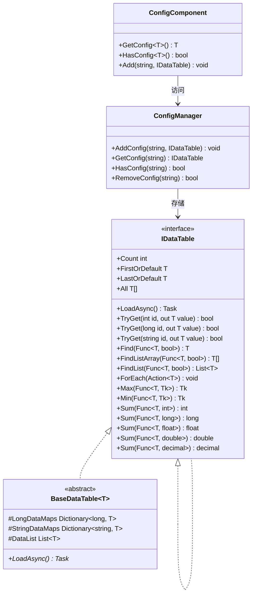

# IDataTable 数据表インターフェース

IDataTable 是 GameFrameX Config モジュール的コアインターフェース，提供します对設定数据表的統一された访问方法。该インターフェースサポート多种主键タイプ（int、long、string），并提供します丰富的数据查询和聚合操作。

## 概要

IDataTable インターフェース是設定数据表的基本抽象層，設計用于在游戏开发中管理静态設定数据。它采用ジェネリック設計，サポート强タイプ的数据访问，同時に保持了柔軟的查询能力。

该インターフェース采用双层结构設計：
- **IDataTable**：非ジェネリック基本インターフェース，定義了汎用的ロード和数据计数機能
- **IDataTable<T>**：ジェネリックインターフェース，継承自 IDataTable，提供します丰富的数据访问和查询メソッド

### 設計意图

IDataTable インターフェース的設計遵循以下原则：

1. **タイプ安全**：通过ジェネリックインターフェース確認してくださいコンパイル时的タイプ安全
2. **統一された访问**：提供多种主键タイプ的访问方法，适应不同的設定数据结构
3. **查询柔軟**：サポート LINQ 风格的条件查询和聚合计算
4. **非同期ロード**：サポート非同期ロード数据，提升游戏启动性能

## アーキテクチャ

以下是 IDataTable 在 Config 系统中的アーキテクチャ关系：



### コアコンポーネント説明

| コンポーネント | 职责 |
|------|------|
| **IDataTable** | 非ジェネリック基本インターフェース，定義ロード和计数機能 |
| **IDataTable<T>** | ジェネリックインターフェース，提供强タイプ的数据访问メソッド |
| **BaseDataTable<T>** | 抽象基底クラス，実装コア存储逻辑（字典+列表） |
| **ConfigManager** | 全局設定マネージャー，负责存储和管理所有 IDataTable インスタンス |
| **ConfigComponent** | Unity コンポーネントカプセル化，提供面向ユーザー的便捷访问メソッド |

## 数据表継承结构

IDataTable<T> インターフェース継承自 IDataTable，形成完全な的インターフェース体系：


## 使用例

### 基本使用

以下例表示如何定義一个継承自 BaseDataTable 的数据表类：

```csharp
using GameFrameX.Config.Runtime;

// 定义数据表元素类型
public class ItemData
{
    public int Id { get; set; }
    public string Name { get; set; }
    public int Level { get; set; }
    public int Price { get; set; }
}

// 定义数据表实现类
public class ItemDataTable : BaseDataTable<ItemData>
{
    public override async Task LoadAsync()
    {
        // 在此处实现数据加载逻辑
        // 示例：从配置文件中加载数据并填充到 LongDataMaps 和 StringDataMaps
        var dataList = new List<ItemData>
        {
            new ItemData { Id = 1, Name = "武器", Level = 1, Price = 100 },
            new ItemData { Id = 2, Name = "护甲", Level = 1, Price = 80 },
            new ItemData { Id = 3, Name = "药水", Level = 1, Price = 10 }
        };
        
        foreach (var data in dataList)
        {
            LongDataMaps[data.Id] = data;
            StringDataMaps[data.Name] = data;
            DataList.Add(data);
        }
    }
}
```
> Source: [IDataTable.cs](https://github.com/GameFrameX/com.gameframex.unity.config/blob/main/Runtime/Config/Config/IDataTable.cs#L46-L77)
> Source: [BaseDataTable.cs](https://github.com/GameFrameX/com.gameframex.unity.config/blob/main/Runtime/Config/Config/BaseDataTable.cs#L46-L70)

### 数据查询

数据表ロード后，〜できます通过多种方法查询数据：

```csharp
// 获取数据表实例（通过 ConfigComponent）
var configComponent = UnityEngine.GameObject.FindObjectOfType<ConfigComponent>();
var itemDataTable = configComponent.GetConfig<ItemDataTable>();

// 通过整数主键获取（推荐使用 TryGet）
ItemData item1 = itemDataTable[1];

// 通过字符串键获取
ItemData item2 = itemDataTable["武器"];

// 安全获取（推荐，避免空引用异常）
if (itemDataTable.TryGet(1, out ItemData item3))
{
    UnityEngine.Debug.Log($"找到物品: {item3.Name}");
}

// 获取第一个和最后一个元素
ItemData first = itemDataTable.FirstOrDefault;
ItemData last = itemDataTable.LastOrDefault;

// 获取所有元素
ItemData[] allItems = itemDataTable.All;
```
> Source: [BaseDataTable.cs](https://github.com/GameFrameX/com.gameframex.unity.config/blob/main/Runtime/Config/Config/BaseDataTable.cs#L119-L204)

### 条件查询

使用 LINQ 风格的条件查询：

```csharp
// 查找第一个匹配的元素
ItemData found = itemDataTable.Find(item => item.Level == 1);

// 查找所有匹配的元素（数组）
ItemData[] level1Items = itemDataTable.FindListArray(item => item.Level == 1);

// 查找所有匹配的元素（列表）
List<ItemData> cheapItems = itemDataTable.FindList(item => item.Price < 50);

// 遍历所有元素
itemDataTable.ForEach(item => 
{
    UnityEngine.Debug.Log($"物品: {item.Name}, 价格: {item.Price}");
});
```
> Source: [BaseDataTable.cs](https://github.com/GameFrameX/com.gameframex.unity.config/blob/main/Runtime/Config/Config/BaseDataTable.cs#L296-L349)

### 聚合操作

数据表サポート多种聚合计算：

```csharp
// 计算总和
int totalPrice = itemDataTable.Sum(item => item.Price);

// 获取最大值
int maxLevel = itemDataTable.Max(item => item.Level);

// 获取最小值
int minPrice = itemDataTable.Min(item => item.Price);

// 获取元素数量
int count = itemDataTable.Count;
```
> Source: [BaseDataTable.cs](https://github.com/GameFrameX/com.gameframex.unity.config/blob/main/Runtime/Config/Config/BaseDataTable.cs#L351-L449)

## API リファレンス

### IDataTable インターフェース

非ジェネリック基本インターフェース，定義数据表的基本機能。

#### `Task LoadAsync()`

非同期ロード数据表。

**返す：** 表示异步操作的任务

```csharp
await itemDataTable.LoadAsync();
```

#### `int Count { get; }`

取得数据表中对象的数量。

**返す：** 数据表中对象的数量

---

### IDataTable<T> インターフェース

ジェネリックインターフェース，提供强タイプ的数据访问和查询機能。

#### `bool TryGet(int id, out T value)`

尝试根据整数 ID 取得对象。

**パラメータ：**
- `id` (int): 要取得的对象的整数 ID
- `value` (out T): 当找到对应 ID 的对象时，返す该对象；否则返すデフォルト值

**返す：** もし找到对应 ID 的对象则返す `true`；否则返す `false`

#### `bool TryGet(long id, out T value)`

尝试根据长整数 ID 取得对象。

**パラメータ：**
- `id` (long): 要取得的对象的长整数 ID
- `value` (out T): 当找到对应 ID 的对象时，返す该对象；否则返すデフォルト值

**返す：** もし找到对应 ID 的对象则返す `true`；否则返す `false`

#### `bool TryGet(string id, out T value)`

尝试根据字符串 ID 取得对象。

**パラメータ：**
- `id` (string): 要取得的对象的字符串 ID
- `value` (out T): 当找到对应 ID 的对象时，返す该对象；否则返すデフォルト值

**返す：** もし找到对应 ID 的对象则返す `true`；否则返す `false`

#### `T this[int id] { get; }`

根据整数主键取得数据表中的对象。

**パラメータ：**
- `id` (int): 要取得的对象的整数主键

**返す：** 与指定主键关联的数据对象；もし找不到则返す `null`

#### `T this[long id] { get; }`

根据长整数主键取得数据表中的对象。

**パラメータ：**
- `id` (long): 要取得的对象的长整数主键

**返す：** 与指定主键关联的数据对象；もし找不到则返す `null`

#### `T this[string id] { get; }`

根据字符串键取得数据表中的对象。

**パラメータ：**
- `id` (string): 要取得的对象的字符串键

**返す：** 与指定键关联的数据对象；もし找不到则返す `null`

#### `T FirstOrDefault { get; }`

取得数据表中第1个对象。

**返す：** もし数据表为空，则返す `null`；否则返す第1个对象

#### `T LastOrDefault { get; }`

取得数据表中最後に一个对象。

**返す：** もし数据表为空，则返す `null`；否则返す最後に一个对象

#### `T[] All { get; }`

取得数据表中所有对象。

**返す：** パッケージ含数据表中所有对象的数组

#### `T[] ToArray()`

将数据表中所有对象复制到新数组。

**返す：** パッケージ含数据表中所有对象的新数组

#### `List<T> ToList()`

将数据表中所有对象复制到新列表。

**返す：** パッケージ含数据表中所有对象的新列表

#### `T Find(Func<T, bool> func)`

根据条件查找第1个匹配的对象。

**パラメータ：**
- `func` (Func<T, bool>): 用于定義匹配条件的函数

**返す：** もし找到匹配的对象，则返す该对象；否则返す `null`

#### `T[] FindListArray(Func<T, bool> func)`

根据条件查找所有匹配的对象并返す数组。

**パラメータ：**
- `func` (Func<T, bool>): 用于定義匹配条件的函数

**返す：** パッケージ含所有匹配对象的数组

#### `List<T> FindList(Func<T, bool> func)`

根据条件查找所有匹配的对象并返す列表。

**パラメータ：**
- `func` (Func<T, bool>): 用于定義匹配条件的函数

**返す：** パッケージ含所有匹配对象的列表

#### `void ForEach(Action<T> func)`

对数据表中的每个元素执行指定的操作。

**パラメータ：**
- `func` (Action<T>): 要对每个元素执行的操作

#### `Tk Max<Tk>(Func<T, Tk> func) where Tk : IComparable<Tk>`

取得数据表中指定プロパティ的最大值。

**パラメータ：**
- `func` (Func<T, Tk>): 用于取得比较值的函数

**タイプパラメータ：**
- `Tk`: 比较值的タイプ，〜しなければなりません実装 `IComparable<Tk>` インターフェース

**返す：** 指定プロパティ的最大值

#### `Tk Min<Tk>(Func<T, Tk> func) where Tk : IComparable<Tk>`

取得数据表中指定プロパティ的最小值。

**パラメータ：**
- `func` (Func<T, Tk>): 用于取得比较值的函数

**タイプパラメータ：**
- `Tk`: 比较值的タイプ，〜しなければなりません実装 `IComparable<Tk>` インターフェース

**返す：** 指定プロパティ的最小值

#### `int Sum(Func<T, int> func)`

计算数据表中指定 `int` プロパティ的总和。

**パラメータ：**
- `func` (Func<T, int>): 用于取得求和值的函数

**返す：** 指定プロパティ的总和

#### `long Sum(Func<T, long> func)`

计算数据表中指定 `long` プロパティ的总和。

**パラメータ：**
- `func` (Func<T, long>): 用于取得求和值的函数

**返す：** 指定プロパティ的总和

#### `float Sum(Func<T, float> func)`

计算数据表中指定 `float` プロパティ的总和。

**パラメータ：**
- `func` (Func<T, float>): 用于取得求和值的函数

**返す：** 指定プロパティ的总和

#### `double Sum(Func<T, double> func)`

计算数据表中指定 `double` プロパティ的总和。

**パラメータ：**
- `func` (Func<T, double>): 用于取得求和值的函数

**返す：** 指定プロパティ的总和

#### `decimal Sum(Func<T, decimal> func)`

计算数据表中指定 `decimal` プロパティ的总和。

**パラメータ：**
- `func` (Func<T, decimal>): 用于取得求和值的函数

**返す：** 指定プロパティ的总和

## 関連リンク

- [ConfigComponent 設定コンポーネント](./4-core-concepts.config-component)
- [ConfigManager 設定マネージャー](./4-core-concepts.config-manager)
- [API リファレンス](./5-api-reference.interfaces)
- [数据表定義](./3-getting-started.data-table-definition)
