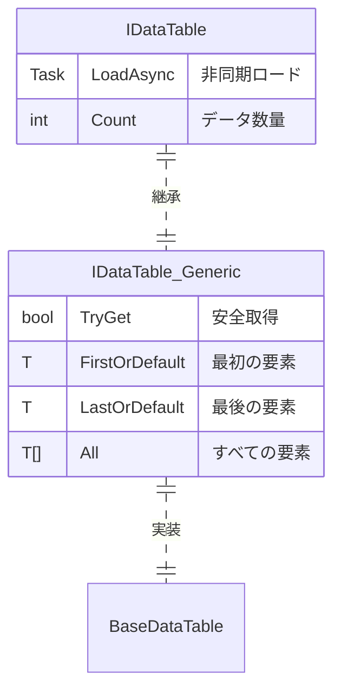

# IDataTable データテーブルインターフェース

IDataTable は GameFrameX Config モジュールのコアインターフェースであり、設定データテーブルへの統一アクセス方法を提供します。このインターフェースは複数の主キー型（int、long、string）をサポートし、丰富的なデータクエリと集計操作を提供します。

## 概要

IDataTable インターフェースは設定データテーブルの基底抽象化レイヤーであり、ゲーム開発における静的設定データ管理のために設計されています。ジェネリック設計を採用し、强タイプのデータアクセスをサポート的同时、灵活なクエリ能力を維持します。

このインターフェースは双層構造設計を採用しています：
- **IDataTable**：非ジェネリック基底インターフェースで、通用のロードとデータ计数機能を定義
- **`IDataTable<T>`**：ジェネリックインターフェースで、IDataTable を継承し、丰富的なデータアクセスとクエリメソッドを提供

### 設計意図

IDataTable インターフェースの設計は以下の原則に従います：

1. **型安全性**：ジェネリックインターフェースを通じてコンパイル時の型安全を確保
2. **統一アクセス**：複数の主キー型のアクセス方法を提供し、異なる設定データ構造に対応
3. **灵活なクエリ**：LINQ スタイルの条件クエリと集計計算をサポート
4. **非同期ロード**：データの非同期ロードをサポートし、ゲーム起動パフォーマンスを向上

## アーキテクチャ

以下は IDataTable の Config システムにおけるアーキテクチャ関係です：


### コアコンポーネント説明

| コンポーネント | 职责 |
|------|------|
| **IDataTable** | 非ジェネリック基底インターフェースで、ロードと计数機能を定義 |
| **`IDataTable<T>`** | ジェネリックインターフェースで、强タイプのデータアクセスメソッドを提供 |
| **`BaseDataTable<T>`** | 抽象基底クラスで、コア保存ロジック（辞書+リスト）を実装 |
| **ConfigManager** | グローバル設定マネージャーで、すべての IDataTable インスタンスの保存と管理を担当 |
| **ConfigComponent** | Unity コンポーネント封裝で、ユーザー向けの便捷なアクセスメソッドを提供 |

## データテーブル継承構造

`IDataTable<T>` インターフェースは IDataTable を継承し、完全なインターフェース体系を形成します：



## 使用例

### 基礎使用

以下の例は BaseDataTable を継承するデータテーブルクラスの定義方法を示します：

```csharp
using GameFrameX.Config.Runtime;

// データテーブル要素型を定義
public class ItemData
{
    public int Id { get; set; }
    public string Name { get; set; }
    public int Level { get; set; }
    public int Price { get; set; }
}

// データテーブル実装クラスを定義
public class ItemDataTable : BaseDataTable<ItemData>
{
    public override async Task LoadAsync()
    {
        // ここでデータロードロジックを実装
        // 例：設定ファイルからデータをロードし、LongDataMaps と StringDataMaps に設定
        var dataList = new List<ItemData>
        {
            new ItemData { Id = 1, Name = "武器", Level = 1, Price = 100 },
            new ItemData { Id = 2, Name = "鎧", Level = 1, Price = 80 },
            new ItemData { Id = 3, Name = "药水", Level = 1, Price = 10 }
        };
        
        foreach (var data in dataList)
        {
            LongDataMaps[data.Id] = data;
            StringDataMaps[data.Name] = data;
            DataList.Add(data);
        }
    }
}
```
> Source: [IDataTable.cs](https://github.com/GameFrameX/com.gameframex.unity.config/blob/main/Runtime/Config/Config/IDataTable.cs#L46-L77)
> Source: [BaseDataTable.cs](https://github.com/GameFrameX/com.gameframex.unity.config/blob/main/Runtime/Config/Config/BaseDataTable.cs#L46-L70)

### データクエリ

データテーブルがロードされた後、複数の方法でデータをクエリできます：

```csharp
// データテーブルインスタンスを取得（ConfigComponent を通じて）
var configComponent = UnityEngine.GameObject.FindObjectOfType<ConfigComponent>();
var itemDataTable = configComponent.GetConfig<ItemDataTable>();

// 整数主キーで取得（TryGet の使用を推奨）
ItemData item1 = itemDataTable[1];

// 文字列キーで取得
ItemData item2 = itemDataTable["武器"];

// 安全取得（推奨、null 参照例外を回避）
if (itemDataTable.TryGet(1, out ItemData item3))
{
    UnityEngine.Debug.Log($"アイテム Found: {item3.Name}");
}

// 最初と最後の要素を取得
ItemData first = itemDataTable.FirstOrDefault;
ItemData last = itemDataTable.LastOrDefault;

// すべての要素を取得
ItemData[] allItems = itemDataTable.All;
```
> Source: [BaseDataTable.cs](https://github.com/GameFrameX/com.gameframex.unity.config/blob/main/Runtime/Config/Config/BaseDataTable.cs#L119-L204)

### 条件クエリ

LINQ スタイルの条件クエリを使用します：

```csharp
// 条件に一致する最初の要素を検索
ItemData found = itemDataTable.Find(item => item.Level == 1);

// 条件に一致するすべての要素を検索（配列）
ItemData[] level1Items = itemDataTable.FindListArray(item => item.Level == 1);

// 条件に一致するすべての要素を検索（リスト）
List<ItemData> cheapItems = itemDataTable.FindList(item => item.Price < 50);

// すべての要素を遍歴
itemDataTable.ForEach(item => 
{
    UnityEngine.Debug.Log($"アイテム: {item.Name}, 価格: {item.Price}");
});
```
> Source: [BaseDataTable.cs](https://github.com/GameFrameX/com.gameframex.unity.config/blob/main/Runtime/Config/Config/BaseDataTable.cs#L296-L349)

### 集計操作

データテーブルは複数の集計計算をサポートします：

```csharp
// 合計を計算
int totalPrice = itemDataTable.Sum(item => item.Price);

// 最大値を取得
int maxLevel = itemDataTable.Max(item => item.Level);

// 最小値を取得
int minPrice = itemDataTable.Min(item => item.Price);

// 要素数を取得
int count = itemDataTable.Count;
```
> Source: [BaseDataTable.cs](https://github.com/GameFrameX/com.gameframex.unity.config/blob/main/Runtime/Config/Config/BaseDataTable.cs#L351-L449)

## API リファレンス

### IDataTable インターフェース

非ジェネリック基底インターフェースで、データテーブルの基本機能を定義します。

#### `Task LoadAsync()`

データテーブルを非同期でロードします。

**戻り値：** 非同期操作のタスク

```csharp
await itemDataTable.LoadAsync();
```

#### `int Count { get; }`

データテーブル内のオブジェクトの数を取得します。

**戻り値：** データテーブル内のオブジェクト数

---

### `IDataTable<T>` インターフェース

ジェネリックインターフェースで、强タイプのデータアクセスとクエリ機能を提供します。

#### `bool TryGet(int id, out T value)`

整数 ID に基づいてオブジェクトの取得を試みます。

**パラメータ：**
- `id` (int): 取得するオブジェクトの整数 ID
- `value` (out T): 対応する ID のオブジェクトが見つかったときにそのオブジェクトを返し、そうでなければデフォルト値を返します

**戻り値：** 対応する ID のオブジェクトが見つかった場合は `true`、そうえれば `false`

#### `bool TryGet(long id, out T value)`

長整数 ID に基づいてオブジェクトの取得を試みます。

**パラメータ：**
- `id` (long): 取得するオブジェクトの長整数 ID
- `value` (out T): 対応する ID のオブジェクトが見つかったときにそのオブジェクトを返し、そうでなければデフォルト値を返します

**戻り値：** 対応する ID のオブジェクトが見つかった場合は `true`、そうれば `false`

#### `bool TryGet(string id, out T value)`

文字列 ID に基づいてオブジェクトの取得を試みます。

**パラメータ：**
- `id` (string): 取得するオブジェクトの文字列 ID
- `value` (out T): 対応する ID のオブジェクトが見つかったときにそのオブジェクトを返し、そうでなければデフォルト値を返します

**戻り値：** 対応する ID のオブジェクトが見つかった場合は `true`、そうれば `false`

#### `T this[int id] { get; }`

整数主キーに基づいてデータテーブル内のオブジェクトを取得します。

**パラメータ：**
- `id` (int): 取得するオブジェクトの整数主キー

**戻り値：** 指定された主キーに関連するデータオブジェクト。見つからない場合は `null`

#### `T this[long id] { get; }`

長整数主キーに基づいてデータテーブル内のオブジェクトを取得します。

**パラメータ：**
- `id` (long): 取得するオブジェクトの長整数主キー

**戻り値：** 指定された主キーに関連するデータオブジェクト。見つからない場合は `null`

#### `T this[string id] { get; }`

文字列キーに基づいてデータテーブル内のオブジェクトを取得します。

**パラメータ：**
- `id` (string): 取得するオブジェクトの文字列キー

**戻り値：** 指定されたキーに関連するデータオブジェクト。見つからない場合は `null`

#### `T FirstOrDefault { get; }`

データテーブル内の最初のオブジェクトを取得します。

**戻り値：** データテーブルが空の場合は `null`、そうでなければ最初のオブジェクト

#### `T LastOrDefault { get; }`

データテーブル内の最後のオブジェクトを取得します。

**戻り値：** データテーブルが空の場合は `null`、そうでなければ最後のオブジェクト

#### `T[] All { get; }`

データテーブル内のすべてのオブジェクトを取得します。

**戻り値：** データテーブル内のすべてのオブジェクトを含む配列

#### `T[] ToArray()`

データテーブル内のすべてのオブジェクトを新しい配列にコピーします。

**戻り値：** データテーブル内のすべてのオブジェクトを含む新しい配列

#### `List<T> ToList()`

データテーブル内のすべてのオブジェクトを新しいリストにコピーします。

**戻り値：** データテーブル内のすべてのオブジェクトを含む新しいリスト

#### `T Find(Func<T, bool> func)`

条件に基づいて最初の一致オブジェクトを検索します。

**パラメータ：**
- `func` (Func<T, bool>): 一致条件を定義するために使用する関数

**戻り値：** 一致するオブジェクトが見つかった場合はそのオブジェクトを返し、そうでなければ `null`

#### `T[] FindListArray(Func<T, bool> func)`

条件に基づいてすべての一致オブジェクトを検索し、配列を返します。

**パラメータ：**
- `func` (Func<T, bool>): 一致条件を定義するために使用する関数

**戻り値：** すべての一致オブジェクトを含む配列

#### `List<T> FindList(Func<T, bool> func)`

条件に基づいてすべての一致オブジェクトを検索し、リストを返します。

**パラメータ：**
- `func` (Func<T, bool>): 一致条件を定義するために使用する関数

**戻り値：** すべての一致オブジェクトを含むリスト

#### `void ForEach(Action<T> func)`

データテーブル内の各要素に対して指定された操作を実行します。

**パラメータ：**
- `func` (`Action<T>`): 各要素に対して実行する操作

#### `Tk Max<Tk>(Func<T, Tk> func) where Tk : IComparable<Tk>`

データテーブル内の指定されたプロパティの最大値を取得します。

**パラメータ：**
- `func` (Func<T, Tk>): 比較値を取得するために使用する関数

**型パラメータ：**
- `Tk`: 比較値の型で、`IComparable<Tk>` インターフェースを実装する必要があります

**戻り値：** 指定されたプロパティの最大値

#### `Tk Min<Tk>(Func<T, Tk> func) where Tk : IComparable<Tk>`

データテーブル内の指定されたプロパティの最小値を取得します。

**パラメータ：**
- `func` (Func<T, Tk>): 比較値を取得するために使用する関数

**型パラメータ：**
- `Tk`: 比較値の型で、`IComparable<Tk>` インターフェースを実装する必要があります

**戻り値：** 指定されたプロパティの最小値

#### `int Sum(Func<T, int> func)`

データテーブル内の指定された `int` プロパティの合計を計算します。

**パラメータ：**
- `func` (Func<T, int>): 合計値を取得するために使用する関数

**戻り値：** 指定されたプロパティの合計

#### `long Sum(Func<T, long> func)`

データテーブル内の指定された `long` プロパティの合計を計算します。

**パラメータ：**
- `func` (Func<T, long>): 合計値を取得するために使用する関数

**戻り値：** 指定されたプロパティの合計

#### `float Sum(Func<T, float> func)`

データテーブル内の指定された `float` プロパティの合計を計算します。

**パラメータ：**
- `func` (Func<T, float>): 合計値を取得するために使用する関数

**戻り値：** 指定されたプロパティの合計

#### `double Sum(Func<T, double> func)`

データテーブル内の指定された `double` プロパティの合計を計算します。

**パラメータ：**
- `func` (Func<T, double>): 合計値を取得するために使用する関数

**戻り値：** 指定されたプロパティの合計

#### `decimal Sum(Func<T, decimal> func)`

データテーブル内の指定された `decimal` プロパティの合計を計算します。

**パラメータ：**
- `func` (Func<T, decimal>): 合計値を取得するために使用する関数

**戻り値：** 指定されたプロパティの合計

## 関連リンク

- [ConfigComponent 設定コンポーネント](./4-core-concepts.config-component)
- [ConfigManager 設定マネージャー](./4-core-concepts.config-manager)
- [API リファレンス](./5-api-reference.interfaces)
- [データテーブル定義](./3-getting-started.data-table-definition)
