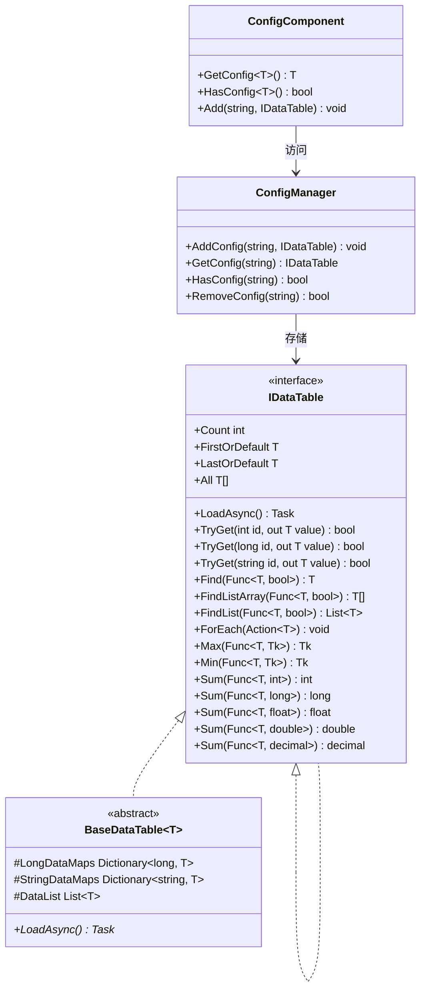
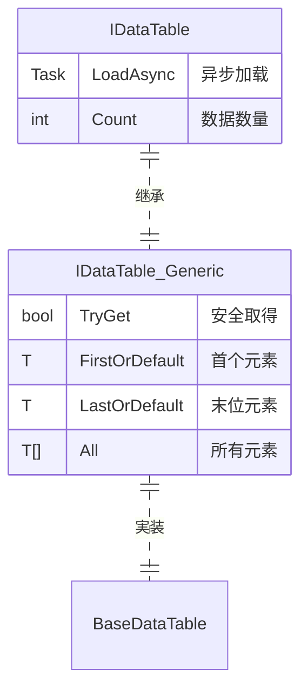

# IDataTable 数据表インターフェース

IDataTable 是 GameFrameX Config 模块的コアインターフェース，提供します对配置数据表的统一访问方法。该インターフェースサポート多种主键クラス型（int、long、string），并提供します丰富的数据查询和聚合操作。

## 概要

IDataTable インターフェース是配置数据表的基础抽象层，设计に使用在ゲーム开发中管理静态配置数据。它采用泛型设计，サポート强クラス型的数据访问，同时保持了灵活的查询能力。

该インターフェース采用双层结构设计：
- **IDataTable**：非泛型基础インターフェース，定义了通用的加载和数据计数機能
- **IDataTable<T>**：泛型インターフェース，を継承 IDataTable，提供します丰富的数据访问和查询メソッド

### 设计意图

IDataTable インターフェース的设计遵循以下原则：

1. **クラス型安全**：を通じて泛型インターフェース确保编译时的クラス型安全
2. **统一访问**：提供多种主键クラス型的访问方法，适应不同的配置数据结构
3. **查询灵活**：サポート LINQ 风格的条件查询和聚合计算
4. **异步加载**：サポート异步加载数据，提升ゲーム启动性能

## 架构

以下是 IDataTable 在 Config 系统中的架构关系：



### コアコンポーネント説明

| コンポーネント | 职责 |
|------|------|
| **IDataTable** | 非泛型基础インターフェース，定义加载和计数機能 |
| **IDataTable<T>** | 泛型インターフェース，提供强クラス型的数据访问メソッド |
| **BaseDataTable<T>** | 抽象基底クラス，実装コア存储逻辑（字典+列表） |
| **ConfigManager** | グローバル設定管理器，负责存储和管理所有 IDataTable インスタンス |
| **ConfigComponent** | Unity コンポーネント封装，提供面向用户的便捷访问メソッド |

## 数据表继承结构

IDataTable<T> インターフェースを継承 IDataTable，形成完整的インターフェース体系：



## 使用例

### 基础使用

以下示例展示如何定义一个を継承 BaseDataTable 的数据表クラス：

```csharp
using GameFrameX.Config.Runtime;

// 定义数据表元素クラス型
public class ItemData
{
    public int Id { get; set; }
    public string Name { get; set; }
    public int Level { get; set; }
    public int Price { get; set; }
}

// 定义数据表実装クラス
public class ItemDataTable : BaseDataTable<ItemData>
{
    public override async Task LoadAsync()
    {
        // 在此处実装数据加载逻辑
        // 示例：从配置ファイル中加载数据并填充到 LongDataMaps 和 StringDataMaps
        var dataList = new List<ItemData>
        {
            new ItemData { Id = 1, Name = "武器", Level = 1, Price = 100 },
            new ItemData { Id = 2, Name = "护甲", Level = 1, Price = 80 },
            new ItemData { Id = 3, Name = "药水", Level = 1, Price = 10 }
        };
        
        foreach (var data in dataList)
        {
            LongDataMaps[data.Id] = data;
            StringDataMaps[data.Name] = data;
            DataList.Add(data);
        }
    }
}
```
> Source: [IDataTable.cs](https://github.com/GameFrameX/com.gameframex.unity.config/blob/main/Runtime/Config/Config/IDataTable.cs#L46-L77)
> Source: [BaseDataTable.cs](https://github.com/GameFrameX/com.gameframex.unity.config/blob/main/Runtime/Config/Config/BaseDataTable.cs#L46-L70)

### 数据查询

数据表加载后，可能を通じて多种方法查询数据：

```csharp
// 取得数据表インスタンス（を通じて ConfigComponent）
var configComponent = UnityEngine.GameObject.FindObjectOfType<ConfigComponent>();
var itemDataTable = configComponent.GetConfig<ItemDataTable>();

// を通じて整数主键取得（推荐使用 TryGet）
ItemData item1 = itemDataTable[1];

// を通じて字符串键取得
ItemData item2 = itemDataTable["武器"];

// 安全取得（推荐，避免空引用異常）
if (itemDataTable.TryGet(1, out ItemData item3))
{
    UnityEngine.Debug.Log($"找到物品: {item3.Name}");
}

// 取得第一个和最后一个元素
ItemData first = itemDataTable.FirstOrDefault;
ItemData last = itemDataTable.LastOrDefault;

// 取得所有元素
ItemData[] allItems = itemDataTable.All;
```
> Source: [BaseDataTable.cs](https://github.com/GameFrameX/com.gameframex.unity.config/blob/main/Runtime/Config/Config/BaseDataTable.cs#L119-L204)

### 条件查询

使用 LINQ 风格的条件查询：

```csharp
// 查找第一个匹配的元素
ItemData found = itemDataTable.Find(item => item.Level == 1);

// 查找所有匹配的元素（数组）
ItemData[] level1Items = itemDataTable.FindListArray(item => item.Level == 1);

// 查找所有匹配的元素（列表）
List<ItemData> cheapItems = itemDataTable.FindList(item => item.Price < 50);

// 遍历所有元素
itemDataTable.ForEach(item => 
{
    UnityEngine.Debug.Log($"物品: {item.Name}, 价格: {item.Price}");
});
```
> Source: [BaseDataTable.cs](https://github.com/GameFrameX/com.gameframex.unity.config/blob/main/Runtime/Config/Config/BaseDataTable.cs#L296-L349)

### 聚合操作

数据表サポート多种聚合计算：

```csharp
// 计算总和
int totalPrice = itemDataTable.Sum(item => item.Price);

// 取得最大值
int maxLevel = itemDataTable.Max(item => item.Level);

// 取得最小值
int minPrice = itemDataTable.Min(item => item.Price);

// 取得元素数量
int count = itemDataTable.Count;
```
> Source: [BaseDataTable.cs](https://github.com/GameFrameX/com.gameframex.unity.config/blob/main/Runtime/Config/Config/BaseDataTable.cs#L351-L449)

## API 参考

### IDataTable インターフェース

非泛型基础インターフェース，定义数据表的基本機能。

#### `Task LoadAsync()`

异步加载数据表。

**返回：** 表示异步操作的任务

```csharp
await itemDataTable.LoadAsync();
```

#### `int Count { get; }`

取得数据表中对象的数量。

**返回：** 数据表中对象的数量

---

### IDataTable<T> インターフェース

泛型インターフェース，提供强クラス型的数据访问和查询機能。

#### `bool TryGet(int id, out T value)`

尝试に基づいて整数 ID 取得对象。

**参数：**
- `id` (int): 要取得的对象的整数 ID
- `value` (out T): 当找到对应 ID 的对象时，返回该对象；否则返回默认值

**返回：** 如果找到对应 ID 的对象则返回 `true`；否则返回 `false`

#### `bool TryGet(long id, out T value)`

尝试に基づいて长整数 ID 取得对象。

**参数：**
- `id` (long): 要取得的对象的长整数 ID
- `value` (out T): 当找到对应 ID 的对象时，返回该对象；否则返回默认值

**返回：** 如果找到对应 ID 的对象则返回 `true`；否则返回 `false`

#### `bool TryGet(string id, out T value)`

尝试に基づいて字符串 ID 取得对象。

**参数：**
- `id` (string): 要取得的对象的字符串 ID
- `value` (out T): 当找到对应 ID 的对象时，返回该对象；否则返回默认值

**返回：** 如果找到对应 ID 的对象则返回 `true`；否则返回 `false`

#### `T this[int id] { get; }`

に基づいて整数主键取得数据表中的对象。

**参数：**
- `id` (int): 要取得的对象的整数主键

**返回：** 与指定主键关联的数据对象；如果找不到则返回 `null`

#### `T this[long id] { get; }`

に基づいて长整数主键取得数据表中的对象。

**参数：**
- `id` (long): 要取得的对象的长整数主键

**返回：** 与指定主键关联的数据对象；如果找不到则返回 `null`

#### `T this[string id] { get; }`

に基づいて字符串键取得数据表中的对象。

**参数：**
- `id` (string): 要取得的对象的字符串键

**返回：** 与指定键关联的数据对象；如果找不到则返回 `null`

#### `T FirstOrDefault { get; }`

取得数据表中第一个对象。

**返回：** 如果数据表为空，则返回 `null`；否则返回第一个对象

#### `T LastOrDefault { get; }`

取得数据表中最后一个对象。

**返回：** 如果数据表为空，则返回 `null`；否则返回最后一个对象

#### `T[] All { get; }`

取得数据表中所有对象。

**返回：** 包含数据表中所有对象的数组

#### `T[] ToArray()`

将数据表中所有对象复制到新数组。

**返回：** 包含数据表中所有对象的新数组

#### `List<T> ToList()`

将数据表中所有对象复制到新列表。

**返回：** 包含数据表中所有对象的新列表

#### `T Find(Func<T, bool> func)`

に基づいて条件查找第一个匹配的对象。

**参数：**
- `func` (Func<T, bool>): に使用定义匹配条件的函数

**返回：** 如果找到匹配的对象，则返回该对象；否则返回 `null`

#### `T[] FindListArray(Func<T, bool> func)`

に基づいて条件查找所有匹配的对象并返回数组。

**参数：**
- `func` (Func<T, bool>): に使用定义匹配条件的函数

**返回：** 包含所有匹配对象的数组

#### `List<T> FindList(Func<T, bool> func)`

に基づいて条件查找所有匹配的对象并返回列表。

**参数：**
- `func` (Func<T, bool>): に使用定义匹配条件的函数

**返回：** 包含所有匹配对象的列表

#### `void ForEach(Action<T> func)`

对数据表中的每个元素执行指定的操作。

**参数：**
- `func` (Action<T>): 要对每个元素执行的操作

#### `Tk Max<Tk>(Func<T, Tk> func) where Tk : IComparable<Tk>`

取得数据表中指定プロパティ的最大值。

**参数：**
- `func` (Func<T, Tk>): に使用取得比较值的函数

**クラス型参数：**
- `Tk`: 比较值的クラス型，必須実装 `IComparable<Tk>` インターフェース

**返回：** 指定プロパティ的最大值

#### `Tk Min<Tk>(Func<T, Tk> func) where Tk : IComparable<Tk>`

取得数据表中指定プロパティ的最小值。

**参数：**
- `func` (Func<T, Tk>): に使用取得比较值的函数

**クラス型参数：**
- `Tk`: 比较值的クラス型，必須実装 `IComparable<Tk>` インターフェース

**返回：** 指定プロパティ的最小值

#### `int Sum(Func<T, int> func)`

计算数据表中指定 `int` プロパティ的总和。

**参数：**
- `func` (Func<T, int>): に使用取得求和值的函数

**返回：** 指定プロパティ的总和

#### `long Sum(Func<T, long> func)`

计算数据表中指定 `long` プロパティ的总和。

**参数：**
- `func` (Func<T, long>): に使用取得求和值的函数

**返回：** 指定プロパティ的总和

#### `float Sum(Func<T, float> func)`

计算数据表中指定 `float` プロパティ的总和。

**参数：**
- `func` (Func<T, float>): に使用取得求和值的函数

**返回：** 指定プロパティ的总和

#### `double Sum(Func<T, double> func)`

计算数据表中指定 `double` プロパティ的总和。

**参数：**
- `func` (Func<T, double>): に使用取得求和值的函数

**返回：** 指定プロパティ的总和

#### `decimal Sum(Func<T, decimal> func)`

计算数据表中指定 `decimal` プロパティ的总和。

**参数：**
- `func` (Func<T, decimal>): に使用取得求和值的函数

**返回：** 指定プロパティ的总和

## 関連リンク

- [ConfigComponent 配置コンポーネント](./4-core-concepts.config-component)
- [ConfigManager 配置管理器](./4-core-concepts.config-manager)
- [API 参考](./5-api-reference.interfaces)
- [数据表定义](./3-getting-started.data-table-definition)
