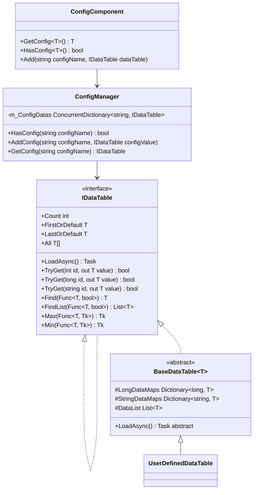
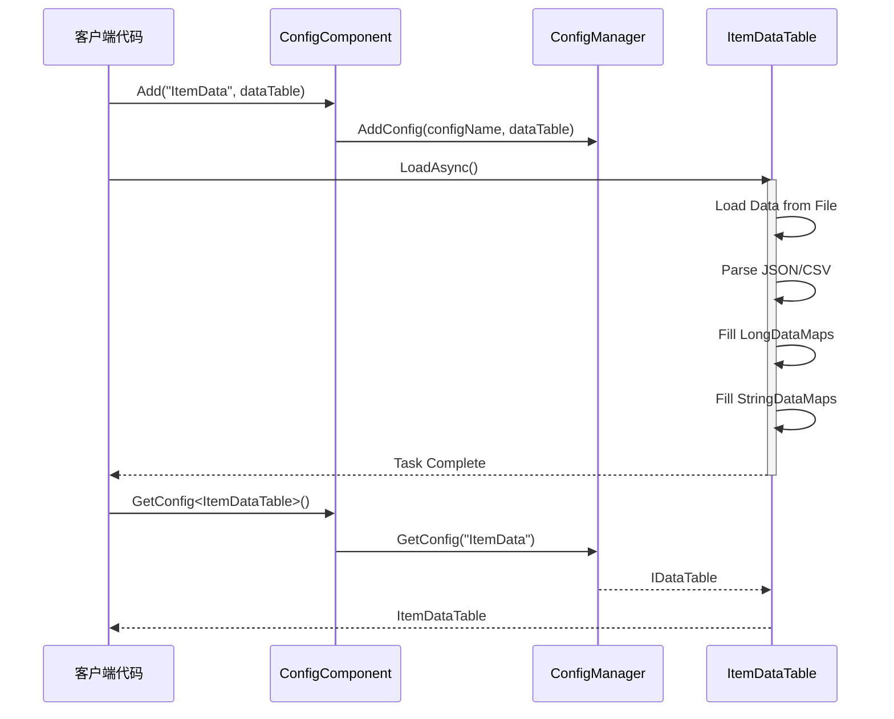

# 数据表定義

数据表（Data Table）是 GameFrameX Config 設定系统中用于存储和管理設定数据的コア抽象。通过数据表，開発者〜できます効率的地访问、查询和管理游戏設定。

## 概要

数据表是 GameFrameX 設定系统的コア组成部分，提供します一种タイプ安全的方法来存储和检索設定数据。每个数据表本质上は键值对集合，サポート通过整数 ID、长整数 ID 或字符串 ID 进行快速查找。

数据表系统的主な設計目标是：

- **高性能查询**：使用 Dictionary 実装 O(1) 时间複雑度的数据查找
- **タイプ安全**：通过ジェネリックインターフェース確認してくださいコンパイル时タイプ確認
- **柔軟的数据组织**：サポート多种主键タイプ，满足不同业务シーン
- **丰富的查询操作**：提供类似 LINQ 的查询インターフェース，サポート条件筛选、聚合计算等操作

## 数据表アーキテクチャ

数据表系统采用分层アーキテクチャ設計，从底层到上层依次为：



### アーキテクチャ层级説明

| 层级 | コンポーネント | 职责 |
|------|------|------|
| インターフェース層 | `IDataTable` / `IDataTable<T>` | 定義数据表的抽象操作契约 |
| 実装層 | `BaseDataTable<T>` | 提供数据存储和查询的汎用実装 |
| コンポーネント層 | `ConfigComponent` | Unity コンポーネントカプセル化，提供 Inspector 設定界面 |
| 管理层 | `ConfigManager` | 全局設定マネージャー，负责設定的統一された管理 |

## 定義数据表

### 定義数据模型

まず，〜する必要があります定義数据表中的数据模型（实体类）。数据模型〜できます是任何参照タイプ的类：

```csharp
using UnityEngine;

[System.Serializable]
public class ItemData
{
    public int Id;
    public string Name;
    public string Description;
    public int Quality;
    public int Price;
    public string Icon;
}
```

> Source: [数据模型例](https://github.com/GameFrameX/com.gameframex.unity.config/blob/main/Runtime/Config/Config/BaseDataTable.cs#L46-L48)

### 継承 BaseDataTable

次に，作成一个継承自 `BaseDataTable<T>` 的数据表类，并実装 `LoadAsync` メソッド：

```csharp
using GameFrameX.Config.Runtime;
using System.Collections.Generic;
using System.Threading.Tasks;
using UnityEngine;

public class ItemDataTable : BaseDataTable<ItemData>
{
    private const string DataTablePath = "Assets/Game/Configs/ItemData.json";

    public override async Task LoadAsync()
    {
        // 加载数据并填充到字典中
        var jsonText = await LoadJsonAsync(DataTablePath);
        var items = DeserializeItems(jsonText);
        
        foreach (var item in items)
        {
            // 同时添加到长整型和字符串索引中
            LongDataMaps.Add(item.Id, item);
            StringDataMaps.Add(item.Name, item);
            DataList.Add(item);
        }
    }
    
    private Task<string> LoadJsonAsync(string path)
    {
        // 实现资源加载逻辑
        return Task.FromResult(string.Empty);
    }
    
    private List<ItemData> DeserializeItems(string json)
    {
        // 实现反序列化逻辑
        return new List<ItemData>();
    }
}
```

> Source: [BaseDataTable 定義](https://github.com/GameFrameX/com.gameframex.unity.config/blob/main/Runtime/Config/Config/BaseDataTable.cs#L48-L69)

### 登録数据表

在 Unity シーン中追加 ConfigComponent コンポーネント，并登録数据表：

```csharp
using UnityEngine;
using GameFrameX.Config.Runtime;

public class GameBootstrap : MonoBehaviour
{
    private ConfigComponent _configComponent;
    
    private async void Start()
    {
        _configComponent = FindObjectOfType<ConfigComponent>();
        
        // 创建并加载数据表
        var itemDataTable = new ItemDataTable();
        await itemDataTable.LoadAsync();
        
        // 注册到 ConfigComponent
        _configComponent.Add("ItemData", itemDataTable);
    }
}
```

> Source: [ConfigComponent.Add メソッド](https://github.com/GameFrameX/com.gameframex.unity.config/blob/main/Runtime/Config/ConfigComponent.cs#L181-L184)

## 数据表操作

### 基本查询

数据表サポート多种查询方法：

```csharp
// 通过索引器获取（推荐）
var item = _configComponent.GetConfig<ItemDataTable>()[1001];

// 使用 TryGet 方法获取（安全版本）
if (_configComponent.GetConfig<ItemDataTable>().TryGet(1001, out var item))
{
    Debug.Log($"找到物品: {item.Name}");
}

// 通过字符串键获取
var itemByName = _configComponent.GetConfig<ItemDataTable>()["武器"];
```

> Source: [TryGet 実装](https://github.com/GameFrameX/com.gameframex.unity.config/blob/main/Runtime/Config/Config/BaseDataTable.cs#L128-L162)

### 条件查询

数据表提供します类似 LINQ 的查询インターフェース：

```csharp
var dataTable = _configComponent.GetConfig<ItemDataTable>();

// 查找第一个匹配的元素
var firstQualityItem = dataTable.Find(item => item.Quality == 1);

// 查找所有匹配的元素
var expensiveItems = dataTable.FindList(item => item.Price > 1000);

// 遍历所有元素
dataTable.ForEach(item => 
{
    Debug.Log($"{item.Name}: {item.Price}");
});
```

> Source: [Find 和 ForEach メソッド](https://github.com/GameFrameX/com.gameframex.unity.config/blob/main/Runtime/Config/Config/BaseDataTable.cs#L296-L349)

### 聚合操作

サポート常用的聚合计算：

```csharp
var dataTable = _configComponent.GetConfig<ItemDataTable>();

// 计算所有物品的总价
var totalValue = dataTable.Sum(item => item.Price);

// 获取最高价格的物品
var maxPrice = dataTable.Max(item => item.Price);

// 获取最低价格的物品
var minPrice = dataTable.Min(item => item.Price);

// 获取物品数量
var count = dataTable.Count;
```

> Source: [聚合メソッド実装](https://github.com/GameFrameX/com.gameframex.unity.config/blob/main/Runtime/Config/Config/BaseDataTable.cs#L351-L449)

## 数据ロードフロー

数据表的ロード遵循异步モード，整个フロー如下：



## コア数据结构

`BaseDataTable<T>` 内部维护三个コア数据结构：

```csharp
protected readonly Dictionary<long, T> LongDataMaps = new Dictionary<long, T>(DefaultSize);
protected readonly Dictionary<string, T> StringDataMaps = new Dictionary<string, T>(DefaultSize);
protected readonly List<T> DataList = new List<T>(DefaultSize);
```

| 数据结构 | 用途 | 访问方法 |
|---------|------|---------|
| `LongDataMaps` | 存储以长整数为主键的数据 | `TryGet(long id)` |
| `StringDataMaps` | 存储以字符串为主键的数据 | `TryGet(string id)` |
| `DataList` | 按插入顺序存储所有数据 | 遍历、聚合操作 |

这种設計確認してください了：
- 通过主键查询时具有 O(1) 的时间複雑度
- サポート同時に通过多种键タイプ进行查询
- 保留了数据的插入顺序，便于遍历和批量操作

## 缓存机制

为了最適化性能，`BaseDataTable<T>` 実装了缓存机制：

```csharp
private bool _cacheInitialized;
private T _firstOrDefaultCache;
private T _lastOrDefaultCache;
private bool _countCacheInitialized;
private int _countCache;
```

> Source: [缓存実装](https://github.com/GameFrameX/com.gameframex.unity.config/blob/main/Runtime/Config/Config/BaseDataTable.cs#L55-L59)

- **首尾缓存**：首次访问 `FirstOrDefault` 或 `LastOrDefault` 时，会遍历数据列表找到第1个和最後に一个非空元素并缓存
- **数量缓存**：首次访问 `Count` プロパティ时，会计算并缓存数据数量

这种懒ロード缓存策略避免了在数据ロード时进行额外的计算，同時に確認してください了后续访问的効率的性。

## ベストプラクティス

### 数据模型設計

1. **使用值タイプフィールド**：对于シンプル数据，优先使用值タイプ（int、float、bool）以减少内存占用
2. **避免嵌套複雑对象**：設定数据应保持扁平化，複雑关系通过 ID 参照実装
3. **追加索引フィールド**：为〜する必要があります频繁查询的フィールド在数据表中追加对应的索引字典

### 性能最適化

1. **批量ロード**：在游戏启动时一次性ロード所有設定数据
2. **按需ロード**：对于大型設定，〜できます使用シーン或機能モジュール按需ロード
3. **缓存查询結果**：对于频繁访问的設定数据，考虑追加应用层缓存

### エラー処理

数据表ロード失敗时，应提供适当的エラー処理：

```csharp
try
{
    var dataTable = new ItemDataTable();
    await dataTable.LoadAsync();
    _configComponent.Add("ItemData", dataTable);
}
catch (System.Exception ex)
{
    Debug.LogError($"加载配置失败: {ex.Message}");
    // 使用默认配置或显示错误界面
}
```

## 関連リンク

- [ConfigComponent 設定コンポーネント](./4-core-concepts.config-component)
- [ConfigManager 設定マネージャー](./4-core-concepts.config-manager)
- [IDataTable 数据表インターフェース](./4-core-concepts.idata-table)
- [基本使用](./3-getting-started.basic-usage)
