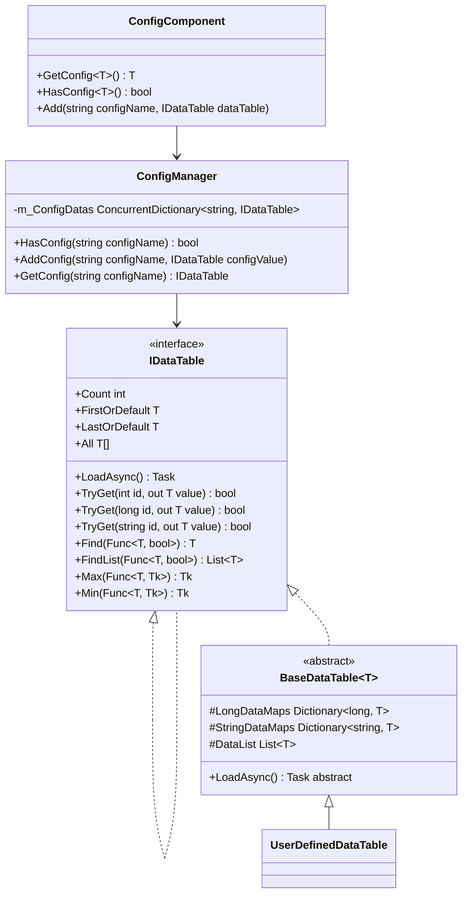
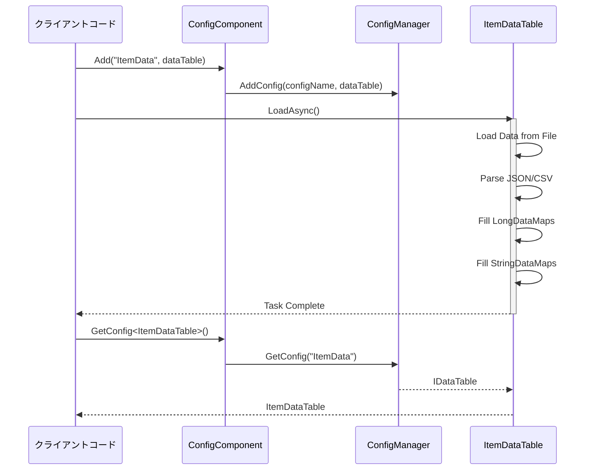

# データテーブル定義

データテーブル（Data Table）は、GameFrameX Config 設定システムにおいて設定データの保存と管理に使用されるコア抽象化です。データテーブルを通じて、開発者はゲーム設定を高效にアクセス、クエリ、管理できます。

## 概要

データテーブルは GameFrameX 設定システムのコア组成部分であり、設定データを保存および取得するための型安全な方法を提供します。各データテーブルは本质上は键値对集合であり、整数 ID、長整数 ID または文字列 ID を通じた高速検索をサポートしています。

データテーブルシステムの主な設計目標は：

- **高性能クエリ**：Dictionary を使用して O(1) の時間複雑度でデータを検索
- **型安全性**：ジェネリックインターフェースを通じてコンパイル時の型チェックを確保
- **灵活なデータ組織**：複数の主キー型をサポートし、異なるビジネスシナリオに対応
- **丰富なクエリ操作**：LINQ 形式のクエリインターフェースを提供し、条件フィルタリング、集計計算などの操作をサポート

## データテーブルアーキテクチャ

データテーブルシステムは分层アーキテクチャ設計を採用しており、底层から上层に向かって 다음과 같습니다：



### アーキテクチャレイヤー説明

| レイヤー | コンポーネント | 职责 |
|------|------|------|
| インターフェースレイヤー | `IDataTable` / `IDataTable<T>` | データテーブルの抽象操作コントラクトを定義 |
| 実装レイヤー | `BaseDataTable<T>` | データ保存とクエリの汎用実装を提供 |
| コンポーネントレイヤー | `ConfigComponent` | Unity コンポーネント封裝で、Inspector 設定界面を提供 |
| 管理层 | `ConfigManager` | グローバル設定マネージャーで、設定の統一管理を担当 |

## データテーブルの定義

### データモデルの定義

まず、データテーブル内のデータモデル（エンティティクラス）を定義する必要があります。データモデルは任意の参照型のクラスにできます：

```csharp
using UnityEngine;

[System.Serializable]
public class ItemData
{
    public int Id;
    public string Name;
    public string Description;
    public int Quality;
    public int Price;
    public string Icon;
}
```

> Source: [データモデル例](https://github.com/GameFrameX/com.gameframex.unity.config/blob/main/Runtime/Config/Config/BaseDataTable.cs#L46-L48)

### BaseDataTable の継承

次に、`BaseDataTable<T>` を継承するデータテーブルクラスを作成し、`LoadAsync` メソッドを実装します：

```csharp
using GameFrameX.Config.Runtime;
using System.Collections.Generic;
using System.Threading.Tasks;
using UnityEngine;

public class ItemDataTable : BaseDataTable<ItemData>
{
    private const string DataTablePath = "Assets/Game/Configs/ItemData.json";

    public override async Task LoadAsync()
    {
        // データをロードし、辞書に設定
        var jsonText = await LoadJsonAsync(DataTablePath);
        var items = DeserializeItems(jsonText);
        
        foreach (var item in items)
        {
            // 長整数と文字列インデックスの両方に追加
            LongDataMaps.Add(item.Id, item);
            StringDataMaps.Add(item.Name, item);
            DataList.Add(item);
        }
    }
    
    private Task<string> LoadJsonAsync(string path)
    {
        // リソースロードロジックを実装
        return Task.FromResult(string.Empty);
    }
    
    private List<ItemData> DeserializeItems(string json)
    {
        // 逆シリアル化ロジックを実装
        return new List<ItemData>();
    }
}
```

> Source: [BaseDataTable 定義](https://github.com/GameFrameX/com.gameframex.unity.config/blob/main/Runtime/Config/Config/BaseDataTable.cs#L48-L69)

### データテーブルの登録

Unity シーンで ConfigComponent コンポーネントを追加し、データテーブルを登録します：

```csharp
using UnityEngine;
using GameFrameX.Config.Runtime;

public class GameBootstrap : MonoBehaviour
{
    private ConfigComponent _configComponent;
    
    private async void Start()
    {
        _configComponent = FindObjectOfType<ConfigComponent>();
        
        // データテーブルを作成してロード
        var itemDataTable = new ItemDataTable();
        await itemDataTable.LoadAsync();
        
        // ConfigComponent に登録
        _configComponent.Add("ItemData", itemDataTable);
    }
}
```

> Source: [ConfigComponent.Add メソッド](https://github.com/GameFrameX/com.gameframex.unity.config/blob/main/Runtime/Config/ConfigComponent.cs#L181-L184)

## データテーブル操作

### 基本的なクエリ

データテーブルは複数のクエリ方法をサポートします：

```csharp
// インデクサーを通じて取得（推奨）
var item = _configComponent.GetConfig<ItemDataTable>()[1001];

// TryGet メソッドを使用（安全版）
if (_configComponent.GetConfig<ItemDataTable>().TryGet(1001, out var item))
{
    Debug.Log($"アイテム Found: {item.Name}");
}

// 文字列キーで取得
var itemByName = _configComponent.GetConfig<ItemDataTable>()["武器"];
```

> Source: [TryGet 実装](https://github.com/GameFrameX/com.gameframex.unity.config/blob/main/Runtime/Config/Config/BaseDataTable.cs#L128-L162)

### 条件クエリ

データテーブルは LINQ 形式のクエリインターフェースを提供します：

```csharp
var dataTable = _configComponent.GetConfig<ItemDataTable>();

// 条件に一致する最初の要素を検索
var firstQualityItem = dataTable.Find(item => item.Quality == 1);

// 条件に一致するすべての要素を検索
var expensiveItems = dataTable.FindList(item => item.Price > 1000);

// すべての要素を遍歴
dataTable.ForEach(item => 
{
    Debug.Log($"{item.Name}: {item.Price}");
});
```

> Source: [Find と ForEach メソッド](https://github.com/GameFrameX/com.gameframex.unity.config/blob/main/Runtime/Config/Config/BaseDataTable.cs#L296-L349)

### 集計操作

常用的な集計計算をサポートします：

```csharp
var dataTable = _configComponent.GetConfig<ItemDataTable>();

// すべてのアイテムの合計価値を計算
var totalValue = dataTable.Sum(item => item.Price);

// 最高価格のアイテムを取得
var maxPrice = dataTable.Max(item => item.Price);

// 最低価格のアイテムを取得
var minPrice = dataTable.Min(item => item.Price);

// アイテム数を取得
var count = dataTable.Count;
```

> Source: [集計メソッド実装](https://github.com/GameFrameX/com.gameframex.unity.config/blob/main/Runtime/Config/Config/BaseDataTable.cs#L351-L449)

## データロードフロー

データテーブルのロードは非同期モードに従い、全体フローは 다음과 같습니다：



## コアデータ構造

`BaseDataTable<T>` は内部的に3つのコアデータ構造を維持します：

```csharp
protected readonly Dictionary<long, T> LongDataMaps = new Dictionary<long, T>(DefaultSize);
protected readonly Dictionary<string, T> StringDataMaps = new Dictionary<string, T>(DefaultSize);
protected readonly List<T> DataList = new List<T>(DefaultSize);
```

| データ構造 | 用途 | アクセス方法 |
|---------|------|---------|
| `LongDataMaps` | 長整数を主キーとするデータを保存 | `TryGet(long id)` |
| `StringDataMaps` | 文字列を主キーとするデータを保存 | `TryGet(string id)` |
| `DataList` | 挿入順序ですべてのデータを保存 | 遍歴、集計操作 |

この設計により：
- 主キーでのクエリ時に O(1) の時間複雑度を確保
- 同時に複数のキー型でのクエリをサポート
- データの挿入順序を保持し、遍歴とバッチ操作を容易に

## キャッシュメカニズム

パフォーマンスを最適化するために、`BaseDataTable<T>` はキャッシュメカニズムを実装しています：

```csharp
private bool _cacheInitialized;
private T _firstOrDefaultCache;
private T _lastOrDefaultCache;
private bool _countCacheInitialized;
private int _countCache;
```

> Source: [キャッシュ実装](https://github.com/GameFrameX/com.gameframex.unity.config/blob/main/Runtime/Config/Config/BaseDataTable.cs#L55-L59)

- **最初と最後のキャッシュ**：`FirstOrDefault` または `LastOrDefault` に初めてアクセス的时候、データの先頭から最初の最后一个非空要素を遍歷してキャッシュ
- **数量キャッシュ**：`Count` プロパティに初めてアクセス的时候、データ数量を計算してキャッシュ

この遅延加载キャッシュ策略により、データのロード時に追加の計算を回避し、同時に後続のアクセス高效性を確保します。

## ベストプラクティス

### データモデル設計

1. **値型フィールドを使用**：简单なデータには、値型（int、float、bool）を優先してメモリ消費を削減
2. **ネスト複雑なオブジェクトを避ける**：設定データは扁平化を保ち、複雑な関係は ID 参照で実装
3. **インデックスフィールドを追加**：高频にクエリが必要なフィールドには、データテーブルに対応するインデックス辞書を追加

### パフォーマンス最適化

1. **バッチロード**：ゲーム起動時にすべての設定データを一度にロード
2. **オンデマンドロード**：大型設定には、シーンや機能モジュール別にオンデマンドロードを使用
3. **クエリ結果をキャッシュ**：高频にアクセスする設定データには、アプリケーション层キャッシュを追加することを検討

### エラー処理

データテーブルのロードが失敗した場合、適切なエラー処理を提供します：

```csharp
try
{
    var dataTable = new ItemDataTable();
    await dataTable.LoadAsync();
    _configComponent.Add("ItemData", dataTable);
}
catch (System.Exception ex)
{
    Debug.LogError($"設定のロードに失敗しました: {ex.Message}");
    // デフォルト設定を使用またはエラー画面を表示
}
```

## 関連リンク

- [ConfigComponent 設定コンポーネント](./4-core-concepts.config-component)
- [ConfigManager 設定マネージャー](./4-core-concepts.config-manager)
- [IDataTable データテーブルインターフェース](./4-core-concepts.idata-table)
- [基本的な使用方法](./3-getting-started.basic-usage)
