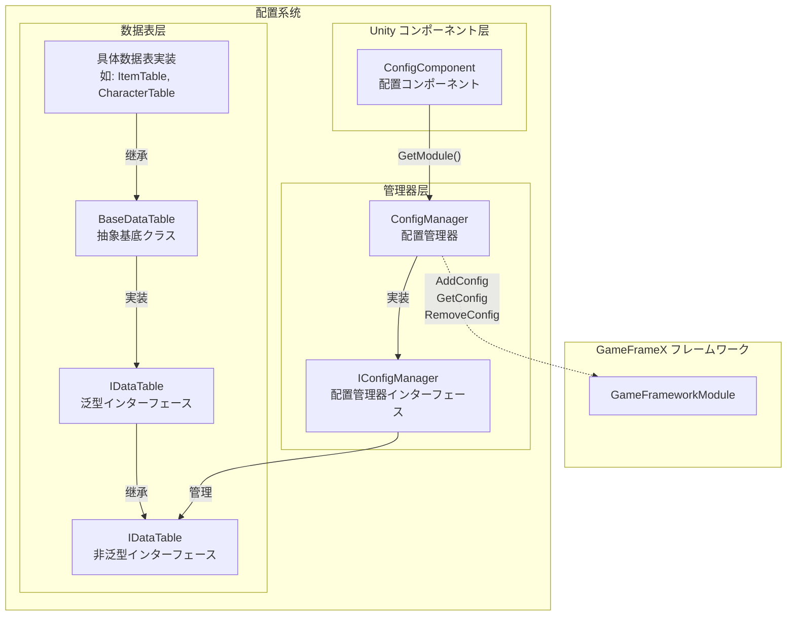
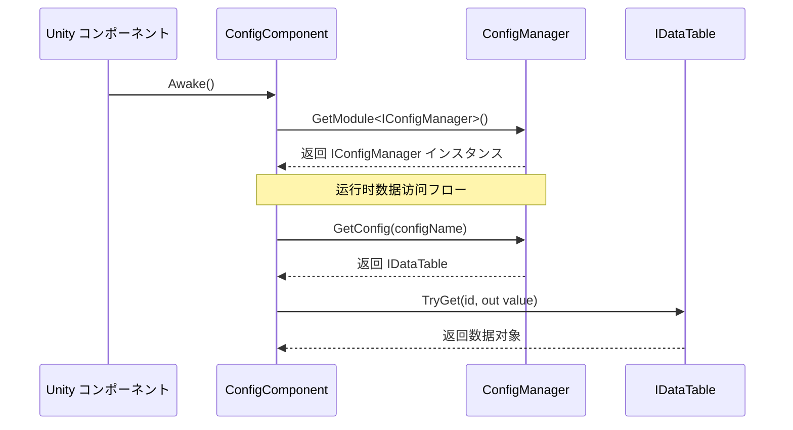

# ConfigManager 配置管理器

ConfigManager 是 GameFrameX 配置系统的コア模块，负责统一管理ゲーム中的所有配置数据表。它提供します配置数据的存储、查询、添加、移除等コア機能，是ゲーム运行时访问配置数据的主要エントリーポイント。

## 概要

ConfigManager 作为グローバル設定管理器，扮演着配置数据中央仓库的角色。在ゲーム开发中，通常会有大量的配置数据（如物品表、角色プロパティ表、关卡配置等），这些数据必要统一的管理机制来确保高效访问。ConfigManager を通じて键值对的方法管理 `IDataTable` クラス型的配置数据表，サポートを通じて配置名称快速查找和取得对应的数据表。

该管理器采用线程安全的 `ConcurrentDictionary` 実装，确保在多线程环境下也能安全地进行配置数据的访问和修改。作为 GameFramework 的コア模块之一，ConfigManager 在ゲーム启动时初期化，在ゲーム关闭时清理所有配置数据。

### コア职责

- **配置存储管理**：统一管理所有ゲーム配置数据表的存储
- **配置查询**：提供快速的配置数据查找和取得機能
- **配置生命周期**：管理配置数据的添加、移除和清空操作
- **线程安全保障**：在多线程环境下安全地访问配置数据

## アーキテクチャ設計



上图展示了配置系统的整体架构，从 Unity コンポーネント层到数据表层的完整呼び出し链路。

### コアクラス説明

| クラス名 | 职责 | 説明 |
|------|------|------|
| ConfigManager | 配置管理器コア実装 | 继承 GameFrameworkModule，管理所有配置数据表 |
| IConfigManager | 配置管理器インターフェース | 定义配置管理器的标准操作インターフェース |
| ConfigComponent | Unity コンポーネント | 作为 Unity 层面的エントリーポイント点，取得 ConfigManager インスタンス |
| IDataTable | 数据表基础インターフェース | 定义数据表的基本操作 |
| IDataTable<T> | 泛型数据表インターフェース | 提供强クラス型的数据表查询能力 |
| BaseDataTable<T> | 数据表抽象基底クラス | 実装数据表的コア機能，如字典存储、查询等 |

## 工作フロー



## コア機能

### 設定数据存储

ConfigManager 使用 `ConcurrentDictionary<string, IDataTable>` 来存储所有的配置数据表。这种设计具有以下优势：

- **线程安全**：ConcurrentDictionary 是线程安全的集合，适に使用多线程环境
- **高性能查找**：字典的 O(1) 时间复杂度确保了配置数据的高速访问
- **键值对管理**：を通じて配置名称（字符串）作为键，方便管理和查找

```csharp
// 源代码位置: Runtime/Config/Config/ConfigManager.cs#L47-L61
public sealed partial class ConfigManager : GameFrameworkModule, IConfigManager
{
    private readonly ConcurrentDictionary<string, IDataTable> m_ConfigDatas;

    public ConfigManager()
    {
        m_ConfigDatas = new ConcurrentDictionary<string, IDataTable>(StringComparer.Ordinal);
    }
}
```
> Source: [ConfigManager.cs](https://github.com/GameFrameX/com.gameframex.unity.config/blob/main/Runtime/Config/Config/ConfigManager.cs#L47-L61)

### 設定数据操作

ConfigManager 提供します完整的配置数据操作インターフェース，包括检查、增加、移除和取得配置：

```csharp
// 检查配置是否存在
public bool HasConfig(string configName)
{
    return m_ConfigDatas.TryGetValue(configName, out _);
}

// 添加配置
public void AddConfig(string configName, IDataTable configValue)
{
    m_ConfigDatas.TryAdd(configName, configValue);
}

// 移除配置
public bool RemoveConfig(string configName)
{
    return m_ConfigDatas.TryRemove(configName, out _);
}

// 取得配置
public IDataTable GetConfig(string configName)
{
    return m_ConfigDatas.TryGetValue(configName, out var value) ? value : null;
}

// 清空所有配置
public void RemoveAllConfigs()
{
    m_ConfigDatas.Clear();
}
```
> Source: [ConfigManager.cs](https://github.com/GameFrameX/com.gameframex.unity.config/blob/main/Runtime/Config/Config/ConfigManager.cs#L99-L167)

这些メソッド的设计遵循了简单直接的原则，を通じて字符串键来管理配置数据表，サポート动态添加和移除配置。

## 使用例

### を通じて ConfigComponent 访问配置

在ゲーム代码中，通常を通じて ConfigComponent 来访问配置管理器：

```csharp
// 取得 ConfigComponent コンポーネント
var configComponent = UnityEngine.Object.FindObjectOfType<ConfigComponent>();

// 检查配置是否存在
if (configComponent.HasConfig<CharacterTable>())
{
    // 取得配置数据表
    var characterTable = configComponent.GetConfig<CharacterTable>();
    
    // に基づいて ID 查找角色数据
    if (characterTable.TryGet(1001, out var character))
    {
        UnityEngine.Debug.Log($"角色名称: {character.Name}");
    }
}
```
> Source: [ConfigComponent.cs](https://github.com/GameFrameX/com.gameframex.unity.config/blob/main/Runtime/Config/ConfigComponent.cs#L117-L142)

### 数据表查询操作

数据表提供します丰富的查询メソッド，サポート多种查找方法：

```csharp
// に基づいて ID 查找（推荐使用 TryGet）
var item = itemTable.TryGet(1001, out var itemData) ? itemData : null;

// 使用索引器查找
var character = characterTable[1001];

// 查找所有满足条件的对象
var allWarriors = characterTable.FindList(c => c.Type == "Warrior");

// 计算プロパティ总和
var totalAttack = characterTable.Sum(c => c.Attack);

// 遍历所有数据
characterTable.ForEach(character => {
    UnityEngine.Debug.Log(character.Name);
});
```
> Source: [BaseDataTable.cs](https://github.com/GameFrameX/com.gameframex.unity.config/blob/main/Runtime/Config/Config/BaseDataTable.cs#L296-L349)

### 自定义数据表実装

開発者可能继承 BaseDataTable 来作成自己的数据表実装：

```csharp
// 示例：定义角色数据表
public class CharacterData
{
    public int Id { get; set; }
    public string Name { get; set; }
    public int Attack { get; set; }
    public int Defense { get; set; }
}

public class CharacterTable : BaseDataTable<CharacterData>
{
    public override async Task LoadAsync()
    {
        // 在这里実装数据加载逻辑
        // 可能从 Resources、AssetBundle 或网络加载数据
    }
}
```

## API 参考

### IConfigManager インターフェース

配置管理器的コアインターフェース，定义了配置数据的基本操作：

| メソッド | 返回クラス型 | 説明 |
|------|----------|------|
| `HasConfig(configName)` | `bool` | 检查指定名称的配置是否存在 |
| `AddConfig(configName, configValue)` | `void` | 添加一个新的配置数据表 |
| `RemoveConfig(configName)` | `bool` | 移除指定名称的配置数据表 |
| `GetConfig(configName)` | `IDataTable` | 取得指定名称的配置数据表 |
| `RemoveAllConfigs()` | `void` | 清空所有配置数据表 |
| `Count` | `int` | 取得配置数据表的数量 |

### IDataTable インターフェース

数据表的基础インターフェース，提供数据表的元数据和加载能力：

| 成员 | クラス型 | 説明 |
|------|------|------|
| `LoadAsync()` | `Task` | 异步加载数据表 |
| `Count` | `int` | 取得数据表中数据的数量 |

### IDataTable<T> 泛型インターフェース

强クラス型的数据表インターフェース，提供数据查询和统计機能：

#### 查询メソッド

| メソッド | 説明 |
|------|------|
| `TryGet(int id, out T value)` | に基づいて整数 ID 尝试取得数据 |
| `TryGet(long id, out T value)` | に基づいて长整数 ID 尝试取得数据 |
| `TryGet(string id, out T value)` | に基づいて字符串 ID 尝试取得数据 |
| `Find(Func<T, bool> func)` | に基づいて条件查找第一个匹配项 |
| `FindList(Func<T, bool> func)` | に基づいて条件查找所有匹配项并返回列表 |
| `FindListArray(Func<T, bool> func)` | に基づいて条件查找所有匹配项并返回数组 |

#### 索引器

| 索引器 | 説明 |
|--------|------|
| `this[int id]` | を通じて整数主键取得数据 |
| `this[long id]` | を通じて长整数主键取得数据 |
| `this[string id]` | を通じて字符串键取得数据 |

#### 聚合メソッド

| メソッド | 説明 |
|------|------|
| `Max<Tk>(Func<T, Tk> func)` | 取得指定プロパティ的最大值 |
| `Min<Tk>(Func<T, Tk> func)` | 取得指定プロパティ的最小值 |
| `Sum(Func<T, int> func)` | 计算 int クラス型プロパティ的总和 |
| `Sum(Func<T, long> func)` | 计算 long クラス型プロパティ的总和 |
| `Sum(Func<T, float> func)` | 计算 float クラス型プロパティ的总和 |

#### 转换メソッド

| メソッド | 説明 |
|------|------|
| `All` | 取得所有数据组成的数组 |
| `ToArray()` | 转换为数组 |
| `ToList()` | 转换为列表 |
| `FirstOrDefault` | 取得第一个元素 |
| `LastOrDefault` | 取得最后一个元素 |

## 関連リンク

- [ConfigComponent 配置コンポーネント](./4-core-concepts.config-component) - Unity コンポーネント层面的配置エントリーポイント
- [IDataTable 数据表インターフェース](./4-core-concepts.idata-table) - 数据表的インターフェース定义和详细规范
- [快速开始 - 数据表定义](./3-getting-started.data-table-definition) - 如何定义和使用数据表
- [API 参考 - インターフェース定义](./5-api-reference.interfaces) - 完整的 API インターフェース文档
