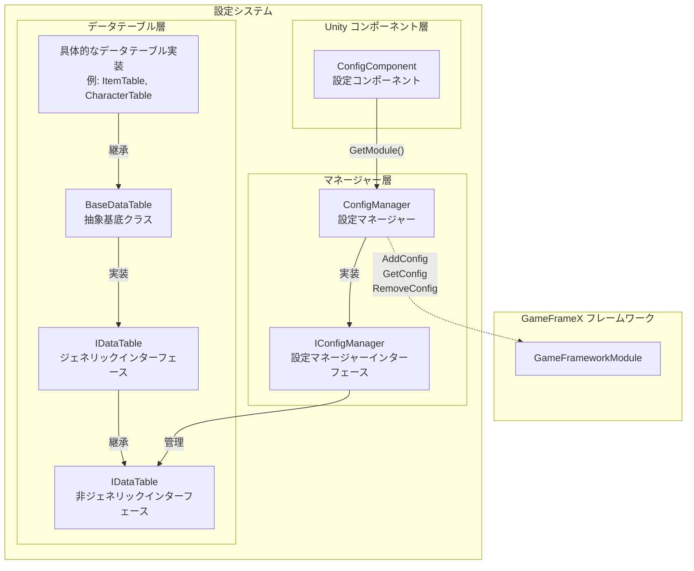
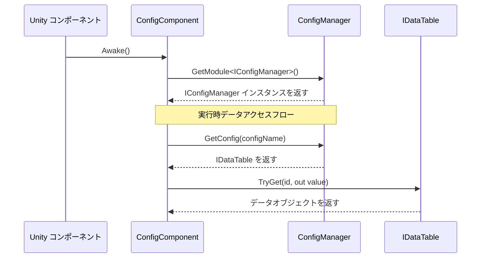

# ConfigManager 設定マネージャー

ConfigManager は GameFrameX 設定システムのコアモジュールであり、ゲーム内のすべての設定データテーブルを統一管理する职责を負います。設定データの保存、クエリ、追加、移除などのコア機能を提供し、ゲーム実行時に設定データにアクセスするための主要なエントリーポイントです。

## 概要

ConfigManager はグローバル設定マネージャーとして、設定データ中央リポジトリの役割を果たします。ゲーム開発では、アイテムテーブル、キャラクターパラメータテーブル、レベル設定など的大量の設定データがあり、これらのデータには高效アクセスを確保するための統一された管理メカニズムが必要です。ConfigManager は键値对の方法で `IDataTable` 型の設定データテーブルを管理し、設定名を通じた高速検索と対応するデータテーブルの取得をサポートしています。

このマネージャーはスレッド安全な `ConcurrentDictionary` を使用して実装され、マルチスレッド環境でも設定データへの安全的アクセスと修正を保証します。GameFramework のコアモジュールの1つとして、ConfigManager はゲーム起動時に初期化され、ゲーム終了時にすべての設定データをクリアします。

### コア职责

- **設定保存管理**：すべてのゲーム設定データテーブルの保存を統一管理
- **設定クエリ**：高速な設定データの検索と取得機能を提供
- **設定ライフサイクル**：設定データの追加、移除、クリア操作を管理
- **スレッド安全保証**：マルチスレッド環境での設定データへの安全的アクセス

## アーキテクチャ設計



上の図は設定システムの全体アーキテクチャを示し、Unity コンポーネント層からデータテーブル層への完全な呼び出しチェーンを示しています。

### コアクラス説明

| クラス名 | 职责 | 説明 |
|------|------|------|
| ConfigManager | 設定マネージャーのコア実装 | GameFrameworkModule を継承し、すべての設定データテーブルを管理 |
| IConfigManager | 設定マネージャーインターフェース | 設定マネージャーの標準操作インターフェースを定義 |
| ConfigComponent | Unity コンポーネント | Unity 層のエントリーポイントとして、ConfigManager インスタンスを取得 |
| IDataTable | データテーブル基底インターフェース | データテーブルの基本操作を定義 |
| `IDataTable<T>` | ジェネリックデータテーブルインターフェース | 强タイプのデータテーブルクエリ能力を提供 |
| `BaseDataTable<T>` | データテーブル抽象基底クラス | 辞書保存、クエリなどのデータテーブルのコア機能を実装 |

## ワークフロー



## コア機能

### 設定データ保存

ConfigManager は `ConcurrentDictionary<string, IDataTable>` を使用してすべての設定データテーブルを保存します。この設計には以下の利点があります：

- **スレッド安全**：ConcurrentDictionary はスレッド安全なコレクションであり、マルチスレッド環境に適しています
- **高性能検索**：辞書の O(1) の時間複雑度により、設定データへの高速アクセスを保証
- **键値对管理**：設定名（文字列）を键として使用し、管理と検索を容易にします

```csharp
// ソースコードの位置: Runtime/Config/Config/ConfigManager.cs#L47-L61
public sealed partial class ConfigManager : GameFrameworkModule, IConfigManager
{
    private readonly ConcurrentDictionary<string, IDataTable> m_ConfigDatas;

    public ConfigManager()
    {
        m_ConfigDatas = new ConcurrentDictionary<string, IDataTable>(StringComparer.Ordinal);
    }
}
```
> Source: [ConfigManager.cs](https://github.com/GameFrameX/com.gameframex.unity.config/blob/main/Runtime/Config/Config/ConfigManager.cs#L47-L61)

### 設定データ操作

ConfigManager は設定データの完全な操作インターフェースを提供し、检查、追加、移除、取得設定を含みます：

```csharp
// 設定是否存在か確認
public bool HasConfig(string configName)
{
    return m_ConfigDatas.TryGetValue(configName, out _);
}

// 設定を追加
public void AddConfig(string configName, IDataTable configValue)
{
    m_ConfigDatas.TryAdd(configName, configValue);
}

// 設定を移除
public bool RemoveConfig(string configName)
{
    return m_ConfigDatas.TryRemove(configName, out _);
}

// 設定を取得
public IDataTable GetConfig(string configName)
{
    return m_ConfigDatas.TryGetValue(configName, out var value) ? value : null;
}

// すべての設定をクリア
public void RemoveAllConfigs()
{
    m_ConfigDatas.Clear();
}
```
> Source: [ConfigManager.cs](https://github.com/GameFrameX/com.gameframex.unity.config/blob/main/Runtime/Config/Config/ConfigManager.cs#L99-L167)

これらのメソッドの設計は简单直接の原則に従い、文字列键を使用して設定データテーブルを管理し、動的な追加と移除設定をサポートしています。

## 使用例

### ConfigComponent を通じて設定にアクセス

ゲームコードでは、通常 ConfigComponent を通じて設定マネージャーにアクセスします：

```csharp
// ConfigComponent コンポーネントを取得
var configComponent = UnityEngine.Object.FindObjectOfType<ConfigComponent>();

// 設定是否存在か確認
if (configComponent.HasConfig<CharacterTable>())
{
    // 設定データテーブルを取得
    var characterTable = configComponent.GetConfig<CharacterTable>();
    
    // ID に基づいてキャラクターデータを検索
    if (characterTable.TryGet(1001, out var character))
    {
        UnityEngine.Debug.Log($"キャラクター名: {character.Name}");
    }
}
```
> Source: [ConfigComponent.cs](https://github.com/GameFrameX/com.gameframex.unity.config/blob/main/Runtime/Config/ConfigComponent.cs#L117-L142)

### データテーブルクエリ操作

データテーブルは丰富なクエリメソッドを提供し、複数の検索方法をサポートしています：

```csharp
// ID に基づいて検索（TryGet の使用を推奨）
var item = itemTable.TryGet(1001, out var itemData) ? itemData : null;

// インデクサーを使用して検索
var character = characterTable[1001];

// 条件に一致するすべてのオブジェクトを検索
var allWarriors = characterTable.FindList(c => c.Type == "Warrior");

// プロパティの合計を計算
var totalAttack = characterTable.Sum(c => c.Attack);

// すべてのデータを遍歴
characterTable.ForEach(character => {
    UnityEngine.Debug.Log(character.Name);
});
```
> Source: [BaseDataTable.cs](https://github.com/GameFrameX/com.gameframex.unity.config/blob/main/Runtime/Config/Config/BaseDataTable.cs#L296-L349)

### カスタムデータテーブル実装

開発者は BaseDataTable を継承して独自のデータテーブル実装を作成できます：

```csharp
// 例：キャラクターデータテーブルを定義
public class CharacterData
{
    public int Id { get; set; }
    public string Name { get; set; }
    public int Attack { get; set; }
    public int Defense { get; set; }
}

public class CharacterTable : BaseDataTable<CharacterData>
{
    public override async Task LoadAsync()
    {
        // ここでデータロードロジックを実装
        // Resources、AssetBundle、またはネットワークからデータをロード可能
    }
}
```

## API リファレンス

### IConfigManager インターフェース

設定マネージャーのコアインターフェースで、設定データの基本操作を定義します：

| メソッド | 戻り型 | 説明 |
|------|----------|------|
| `HasConfig(configName)` | `bool` | 指定された名前の設定是否存在か確認 |
| `AddConfig(configName, configValue)` | `void` | 新しい設定データテーブルを追加 |
| `RemoveConfig(configName)` | `bool` | 指定された名前の設定データテーブルを移除 |
| `GetConfig(configName)` | `IDataTable` | 指定された名前の設定データテーブルを取得 |
| `RemoveAllConfigs()` | `void` | すべての設定データテーブルをクリア |
| `Count` | `int` | 設定データテーブルの数を取得 |

### IDataTable インターフェース

データテーブルの基底インターフェースで、データテーブルのメタデータとロード能力を提供します：

| メンバー | 型 | 説明 |
|------|------|------|
| `LoadAsync()` | `Task` | データテーブルを非同期でロード |
| `Count` | `int` | データテーブル内のデータ数を取得 |

### `IDataTable<T>` ジェネリックインターフェース

强タイプのデータテーブルインターフェースで、データクエリと統計機能を提供します：

#### クエリメソッド

| メソッド | 説明 |
|------|------|
| `TryGet(int id, out T value)` | 整数 ID に基づいてデータの取得を試みる |
| `TryGet(long id, out T value)` | 長整数 ID に基づいてデータの取得を試みる |
| `TryGet(string id, out T value)` | 文字列 ID に基づいてデータの取得を試みる |
| `Find(Func<T, bool> func)` | 条件に基づいて最初の一致項目を検索 |
| `FindList(Func<T, bool> func)` | 条件に基づいてすべての一致項目を検索しリストを返す |
| `FindListArray(Func<T, bool> func)` | 条件に基づいてすべての一致項目を検索し配列を返す |

#### インデクサー

| インデクサー | 説明 |
|--------|------|
| `this[int id]` | 整数主キーでデータを取得 |
| `this[long id]` | 長整数主キーでデータを取得 |
| `this[string id]` | 文字列キーでデータを取得 |

#### 集計メソッド

| メソッド | 説明 |
|------|------|
| `Max<Tk>(Func<T, Tk> func)` | 指定されたプロパティの最大値を取得 |
| `Min<Tk>(Func<T, Tk> func)` | 指定されたプロパティの最小値を取得 |
| `Sum(Func<T, int> func)` | int 型プロパティの合計を計算 |
| `Sum(Func<T, long> func)` | long 型プロパティの合計を計算 |
| `Sum(Func<T, float> func)` | float 型プロパティの合計を計算 |

#### 変換メソッド

| メソッド | 説明 |
|------|------|
| `All` | すべてのデータ组成的配列を取得 |
| `ToArray()` | 配列に変換 |
| `ToList()` | リストに変換 |
| `FirstOrDefault` | 最初の要素を取得 |
| `LastOrDefault` | 最後の要素を取得 |

## 関連リンク

- [ConfigComponent 設定コンポーネント](./4-core-concepts.config-component) - Unity コンポーネント層のの設定エントリーポイント
- [IDataTable データテーブルインターフェース](./4-core-concepts.idata-table) - データテーブルのインターフェース定義と詳細仕様
- [クイックスタート - データテーブル定義](./3-getting-started.data-table-definition) - データテーブルの定義と使用方法
- [API リファレンス - インターフェース定義](./5-api-reference.interfaces) - 完全な API インターフェースドキュメント
