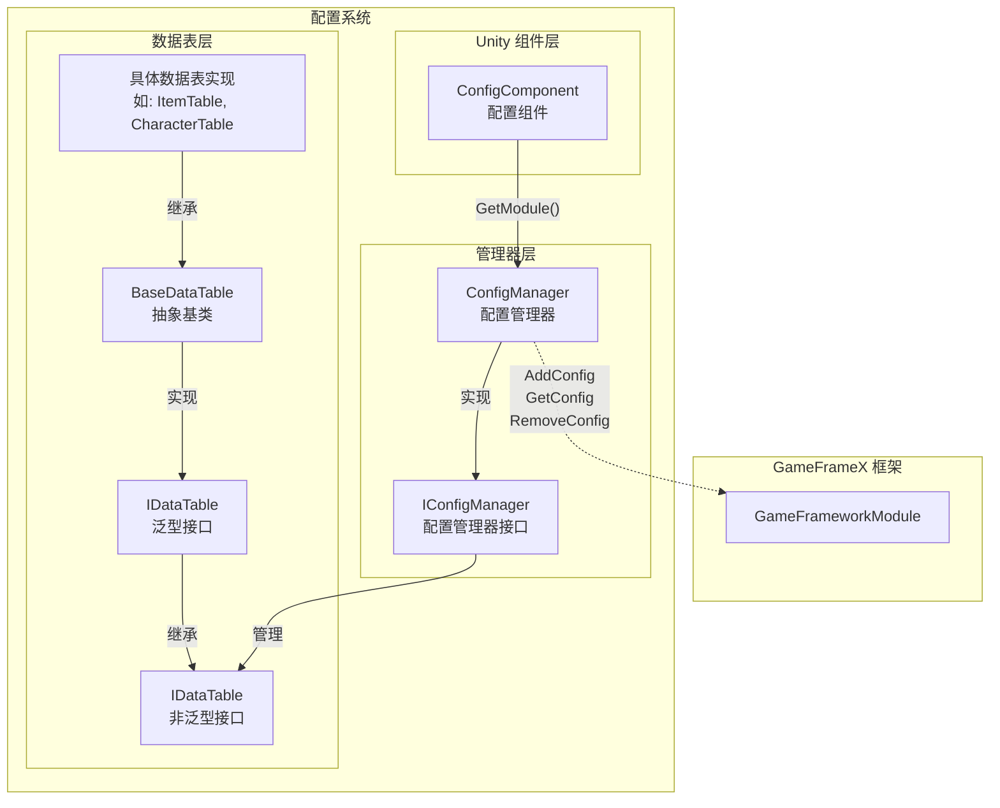
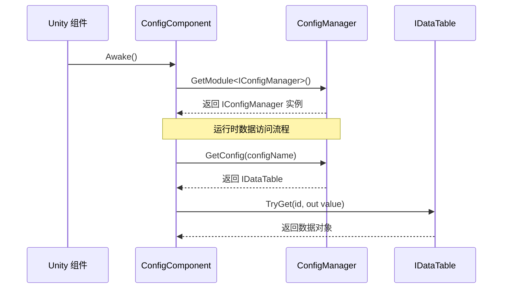

# ConfigManager 設定マネージャー

ConfigManager 是 GameFrameX 設定系统的コアモジュール，负责統一された管理游戏中的所有設定数据表。它提供します設定数据的存储、查询、追加、移除等コア機能，是游戏ランタイム访问設定数据的主な入口。

## 概要

ConfigManager 作为全局設定マネージャー，扮演着設定数据中央リポジトリ的角色。在游戏开发中，通常会有大量的設定数据（如物品表、角色プロパティ表、关卡設定等），这些数据〜する必要があります統一された的管理机制来確認してください効率的访问。ConfigManager 通过键值对的方法管理 `IDataTable` タイプ的設定数据表，サポート通过設定名称快速查找和取得对应的数据表。

该マネージャー采用线程安全的 `ConcurrentDictionary` 実装，確認してください在多线程環境下也能安全地进行設定数据的访问和変更。作为 GameFramework 的コアモジュール之一，ConfigManager 在游戏启动时初期化，在游戏閉じる时清理所有設定数据。

### コア职责

- **設定存储管理**：統一された管理所有游戏設定数据表的存储
- **設定查询**：提供快速的設定数据查找和取得機能
- **設定ライフサイクル**：管理設定数据的追加、移除和清空操作
- **线程安全保障**：在多线程環境下安全地访问設定数据

## アーキテクチャ設計



上图表示了設定系统的整体アーキテクチャ，从 Unity コンポーネント層到数据表层的完全な呼び出し链路。

### コア类説明

| 类名 | 职责 | 説明 |
|------|------|------|
| ConfigManager | 設定マネージャーコア実装 | 継承 GameFrameworkModule，管理所有設定数据表 |
| IConfigManager | 設定マネージャーインターフェース | 定義設定マネージャー的標準操作インターフェース |
| ConfigComponent | Unity コンポーネント | 作为 Unity 层面的入口点，取得 ConfigManager インスタンス |
| IDataTable | 数据表基本インターフェース | 定義数据表的基本操作 |
| IDataTable<T> | ジェネリック数据表インターフェース | 提供强タイプ的数据表查询能力 |
| BaseDataTable<T> | 数据表抽象基底クラス | 実装数据表的コア機能，如字典存储、查询等 |

## ワークフロー



## コア機能

### 設定数据存储

ConfigManager 使用 `ConcurrentDictionary<string, IDataTable>` 来存储所有的設定数据表。这种設計具有以下优势：

- **线程安全**：ConcurrentDictionary 是线程安全的集合，適しています多线程環境
- **高性能查找**：字典的 O(1) 时间複雑度確認してください了設定数据的高速访问
- **键值对管理**：通过設定名称（字符串）作为键，方便管理和查找

```csharp
// 源代码位置: Runtime/Config/Config/ConfigManager.cs#L47-L61
public sealed partial class ConfigManager : GameFrameworkModule, IConfigManager
{
    private readonly ConcurrentDictionary<string, IDataTable> m_ConfigDatas;

    public ConfigManager()
    {
        m_ConfigDatas = new ConcurrentDictionary<string, IDataTable>(StringComparer.Ordinal);
    }
}
```
> Source: [ConfigManager.cs](https://github.com/GameFrameX/com.gameframex.unity.config/blob/main/Runtime/Config/Config/ConfigManager.cs#L47-L61)

### 設定数据操作

ConfigManager 提供します完全な的設定数据操作インターフェース，含みます確認、增加、移除和取得設定：

```csharp
// 检查配置是否存在
public bool HasConfig(string configName)
{
    return m_ConfigDatas.TryGetValue(configName, out _);
}

// 添加配置
public void AddConfig(string configName, IDataTable configValue)
{
    m_ConfigDatas.TryAdd(configName, configValue);
}

// 移除配置
public bool RemoveConfig(string configName)
{
    return m_ConfigDatas.TryRemove(configName, out _);
}

// 获取配置
public IDataTable GetConfig(string configName)
{
    return m_ConfigDatas.TryGetValue(configName, out var value) ? value : null;
}

// 清空所有配置
public void RemoveAllConfigs()
{
    m_ConfigDatas.Clear();
}
```
> Source: [ConfigManager.cs](https://github.com/GameFrameX/com.gameframex.unity.config/blob/main/Runtime/Config/Config/ConfigManager.cs#L99-L167)

这些メソッド的設計遵循了シンプル直接的原则，通过字符串键来管理設定数据表，サポート动态追加和移除設定。

## 使用例

### 通过 ConfigComponent 访问設定

在游戏コード中，通常通过 ConfigComponent 来访问設定マネージャー：

```csharp
// 获取 ConfigComponent 组件
var configComponent = UnityEngine.Object.FindObjectOfType<ConfigComponent>();

// 检查配置是否存在
if (configComponent.HasConfig<CharacterTable>())
{
    // 获取配置数据表
    var characterTable = configComponent.GetConfig<CharacterTable>();
    
    // 根据 ID 查找角色数据
    if (characterTable.TryGet(1001, out var character))
    {
        UnityEngine.Debug.Log($"角色名称: {character.Name}");
    }
}
```
> Source: [ConfigComponent.cs](https://github.com/GameFrameX/com.gameframex.unity.config/blob/main/Runtime/Config/ConfigComponent.cs#L117-L142)

### 数据表查询操作

数据表提供します丰富的查询メソッド，サポート多种查找方法：

```csharp
// 根据 ID 查找（推荐使用 TryGet）
var item = itemTable.TryGet(1001, out var itemData) ? itemData : null;

// 使用索引器查找
var character = characterTable[1001];

// 查找所有满足条件的对象
var allWarriors = characterTable.FindList(c => c.Type == "Warrior");

// 计算属性总和
var totalAttack = characterTable.Sum(c => c.Attack);

// 遍历所有数据
characterTable.ForEach(character => {
    UnityEngine.Debug.Log(character.Name);
});
```
> Source: [BaseDataTable.cs](https://github.com/GameFrameX/com.gameframex.unity.config/blob/main/Runtime/Config/Config/BaseDataTable.cs#L296-L349)

### 自定義数据表実装

開発者〜できます継承 BaseDataTable 来作成自己的数据表実装：

```csharp
// 示例：定义角色数据表
public class CharacterData
{
    public int Id { get; set; }
    public string Name { get; set; }
    public int Attack { get; set; }
    public int Defense { get; set; }
}

public class CharacterTable : BaseDataTable<CharacterData>
{
    public override async Task LoadAsync()
    {
        // 在这里实现数据加载逻辑
        // 可以从 Resources、AssetBundle 或网络加载数据
    }
}
```

## API リファレンス

### IConfigManager インターフェース

設定マネージャー的コアインターフェース，定義了設定数据的基本操作：

| メソッド | 返すタイプ | 説明 |
|------|----------|------|
| `HasConfig(configName)` | `bool` | 確認指定名称的設定是否存在 |
| `AddConfig(configName, configValue)` | `void` | 追加一个新的設定数据表 |
| `RemoveConfig(configName)` | `bool` | 移除指定名称的設定数据表 |
| `GetConfig(configName)` | `IDataTable` | 取得指定名称的設定数据表 |
| `RemoveAllConfigs()` | `void` | 清空所有設定数据表 |
| `Count` | `int` | 取得設定数据表的数量 |

### IDataTable インターフェース

数据表的基本インターフェース，提供数据表的元数据和ロード能力：

| 成员 | タイプ | 説明 |
|------|------|------|
| `LoadAsync()` | `Task` | 非同期ロード数据表 |
| `Count` | `int` | 取得数据表中数据的数量 |

### IDataTable<T> ジェネリックインターフェース

强タイプ的数据表インターフェース，提供数据查询和统计機能：

#### 查询メソッド

| メソッド | 説明 |
|------|------|
| `TryGet(int id, out T value)` | 根据整数 ID 尝试取得数据 |
| `TryGet(long id, out T value)` | 根据长整数 ID 尝试取得数据 |
| `TryGet(string id, out T value)` | 根据字符串 ID 尝试取得数据 |
| `Find(Func<T, bool> func)` | 根据条件查找第1个匹配项 |
| `FindList(Func<T, bool> func)` | 根据条件查找所有匹配项并返す列表 |
| `FindListArray(Func<T, bool> func)` | 根据条件查找所有匹配项并返す数组 |

#### 索引器

| 索引器 | 説明 |
|--------|------|
| `this[int id]` | 通过整数主键取得数据 |
| `this[long id]` | 通过长整数主键取得数据 |
| `this[string id]` | 通过字符串键取得数据 |

#### 聚合メソッド

| メソッド | 説明 |
|------|------|
| `Max<Tk>(Func<T, Tk> func)` | 取得指定プロパティ的最大值 |
| `Min<Tk>(Func<T, Tk> func)` | 取得指定プロパティ的最小值 |
| `Sum(Func<T, int> func)` | 计算 int タイププロパティ的总和 |
| `Sum(Func<T, long> func)` | 计算 long タイププロパティ的总和 |
| `Sum(Func<T, float> func)` | 计算 float タイププロパティ的总和 |

#### 转换メソッド

| メソッド | 説明 |
|------|------|
| `All` | 取得所有数据组成的数组 |
| `ToArray()` | 转换为数组 |
| `ToList()` | 转换为列表 |
| `FirstOrDefault` | 取得第1个元素 |
| `LastOrDefault` | 取得最後に一个元素 |

## 関連リンク

- [ConfigComponent 設定コンポーネント](./4-core-concepts.config-component) - Unity コンポーネント層面的設定入口
- [IDataTable 数据表インターフェース](./4-core-concepts.idata-table) - 数据表的インターフェース定義和詳細规范
- [快速开始 - 数据表定義](./3-getting-started.data-table-definition) - 如何定義和使用数据表
- [API リファレンス - インターフェース定義](./5-api-reference.interfaces) - 完全な的 API インターフェースドキュメント
