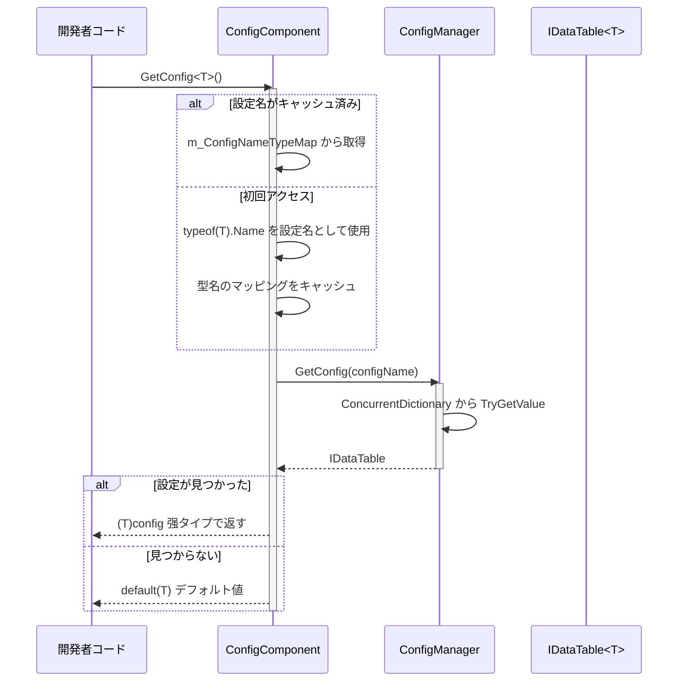
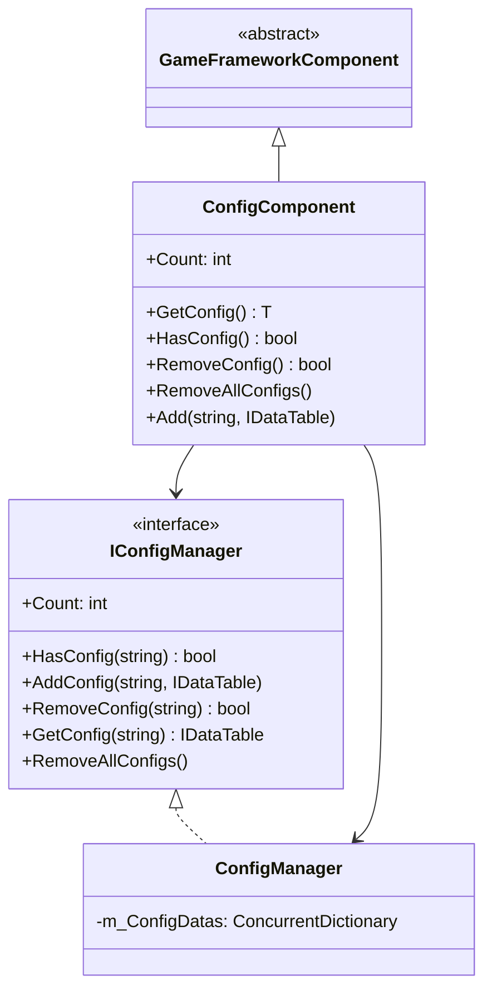

# ConfigComponent 設定コンポーネント

ConfigComponent は GameFrameX 設定システムの Unity コンポーネント層であり、ゲーム設定管理のコアエントリーポイントとして、型安全な設定データアクセス能力を提供します。

## 概要

ConfigComponent は Unity シーン内の `MonoBehaviour` コンポーネントであり、`GameFrameworkComponent` を継承します。これは設定管理システムと Unity  엔진間のブリッジとして機能し、開発者がゲーム実行時に удобно に設定データを取得和管理できるようにします。

### コア职责

- **型安全な設定アクセス**：ジェネリックメソッドを通じてコンパイル時の型チェックを提供
- **設定キャッシュ管理**：型から設定名へのマッピング関係を维护
- **統一設定エントリーポイント**：ConfigManager の複雑さを封裝し、简洁な API を提供
- **ライフサイクル管理**：Awake フェーズで設定マネージャーを初期化

### 設計意図

ConfigComponent は门面パターン（Facade Pattern）を採用して設計されており、設定管理の複雑さを簡略化するすることを目的としています。開発者は ConfigManager と直接やり取りする必要がなく、ConfigComponent を通じるだけで設定の取得、クエリ、管理操作を完了できます。ジェネリックメソッドの使用はコンパイル時の型安全を保証し、実行時エラーを削減します。

## アーキテクチャ

### コンポーネント階層構造

```mermaid
graph TD
    subgraph Unity["Unity 層 (Scene)"]
        ConfigComp["ConfigComponent<br/>(MonoBehaviour)"]
    end
    
    subgraph Framework["GameFrameX コア層"]
        IConfigMgr["IConfigManager<br/>(インターフェース)"]
        ConfigMgr["ConfigManager<br/>(実装)"]
    end
    
    subgraph Data["データ層"]
        IDataTable["IDataTable<T><br/>(インターフェース)"]
        BaseDataTable["BaseDataTable<T><br/>(基底クラス)"]
        CustomDT["カスタムデータテーブル<br/>(BaseDataTableを継承)"]
    end
    
    ConfigComp -->|"設定を取得"| IConfigMgr
    IConfigMgr <|.. ConfigMgr
    ConfigMgr -->|"保存/クエリ"| IDataTable
    IDataTable <|.. BaseDataTable
    BaseDataTable <|-- CustomDT
```

### 設定アクセスフロー



## コア機能

### 設定取得

ConfigComponent は設定を取得するための2つの方法を提供します：

1. **ジェネリックメソッドで取得**（推奨）：自動的に型名を設定键として使用
2. **手動で設定を追加**：設定名とインスタンスを明示的に指定可能

### 型名マッピングメカニズム

内部的には `ConcurrentDictionary<Type, string>` を使用して型から名へのマッピングをキャッシュし、`typeof(T).Name` の频繁な呼び出しを回避します：

```csharp
private ConcurrentDictionary<Type, string> m_ConfigNameTypeMap = new ConcurrentDictionary<Type, string>();
```

> Source: [ConfigComponent.cs](https://github.com/GameFrameX/com.gameframex.unity.config/blob/main/Runtime/Config/ConfigComponent.cs#L51)

### 設定数統計

`Count` プロパティを通じて現在ロードされている設定項目の総数をすばやく取得できます：

```csharp
public int Count
{
    get { return m_ConfigManager.Count; }
}
```

> Source: [ConfigComponent.cs](https://github.com/GameFrameX/com.gameframex.unity.config/blob/main/Runtime/Config/ConfigComponent.cs#L61-L64)

## 使用例

### Unity シーンでの使用

1. Unity エディタで空のゲームオブジェクトを作成
2. `GameFrameX/Config` コンポーネントを追加（ConfigComponent が自動的に追加されます）
3. スクリプトを通じて設定を取得して使用

### 設定データを取得

```csharp
using GameFrameX.Config.Runtime;

// 設定コンポーネントを取得
var configComponent = UnityEngine.GameObject.Find("GameFrameX").GetComponent<ConfigComponent>();

// 設定是否存在か確認
if (configComponent.HasConfig<WeaponDataTable>())
{
    // 設定を取得
    var weaponTable = configComponent.GetConfig<WeaponDataTable>();
    
    // ID を通じてデータを取得
    var weapon = weaponTable[1001];
    
    // TryGet を使用して安全に取得
    if (weaponTable.TryGetValue(1001, out var weapon2))
    {
        // weapon2 を使用
    }
}
```

> Source: [ConfigComponent.cs](https://github.com/GameFrameX/com.gameframex.unity.config/blob/main/Runtime/Config/ConfigComponent.cs#L117-L127)

### カスタム設定を追加

```csharp
// 手動で設定を追加
var customTable = new MyCustomDataTable();
configComponent.Add("MyCustomConfig", customTable);

// 指定した設定を移除
configComponent.RemoveConfig<WeaponDataTable>();

// すべての設定をクリア
configComponent.RemoveAllConfigs();
```

> Source: [ConfigComponent.cs](https://github.com/GameFrameX/com.gameframex.unity.config/blob/main/Runtime/Config/ConfigComponent.cs#L153-L170)

### データテーブルクエリ例

```csharp
var config = configComponent.GetConfig<ItemDataTable>();

// すべてのデータを取得
var allItems = config.All;

// 条件クエリ
var rareItems = config.FindList(item => item.Quality >= 4);

// 集計操作
var maxPrice = config.Max(item => item.Price);
var totalCount = config.Sum(item => item.Count);

// 遍歴操作
config.ForEach(item => {
    UnityEngine.Debug.Log(item.Name);
});
```

> Source: [BaseDataTable.cs](https://github.com/GameFrameX/com.gameframex.unity.config/blob/main/Runtime/Config/Config/BaseDataTable.cs#L296-L349)

## API リファレンス

### プロパティ

#### `Count: int`

グローバル設定項目の数を取得します。

```csharp
int count = configComponent.Count;
```

| プロパティ | 値 |
|------|-----|
| 型 | `int` |
| アクセス | 読み取り専用 |
| 説明 | ConfigManager に保存されている設定項目の総数を返す |

### メソッド

#### `GetConfig<T>(): T`

指定された型のグローバル設定項目を取得します。

```csharp
var config = configComponent.GetConfig<WeaponDataTable>();
```

| パラメータ | 型 | 説明 |
|------|------|------|
| T | ジェネリックパラメータ | 設定項目の型で、`IDataTable` インターフェースを実装する必要があります |

| 戻り値 | 説明 |
|--------|------|
| T | 見つかった設定項目。見つからない場合は `default(T)` |

> Source: [ConfigComponent.cs](https://github.com/GameFrameX/com.gameframex.unity.config/blob/main/Runtime/Config/ConfigComponent.cs#L117-L127)

---

#### `HasConfig<T>(): bool`

指定された型の設定項目が存在するか確認します。

```csharp
bool exists = configComponent.HasConfig<MonsterDataTable>();
```

| パラメータ | 型 | 説明 |
|------|------|------|
| T | ジェネリックパラメータ | 設定項目の型で、`IDataTable` インターフェースを実装する必要があります |

| 戻り値 | 説明 |
|--------|------|
| `bool` | 設定項目が存在する場合は `true`、そう否则は `false` |

> Source: [ConfigComponent.cs](https://github.com/GameFrameX/com.gameframex.unity.config/blob/main/Runtime/Config/ConfigComponent.cs#L138-L142)

---

#### `RemoveConfig<T>(): bool`

指定された型の設定項目を移除します。

```csharp
bool success = configComponent.RemoveConfig<WeaponDataTable>();
```

| パラメータ | 型 | 説明 |
|------|------|------|
| T | ジェネリックパラメータ | 設定項目の型で、`IDataTable` インターフェースを実装する必要があります |

| 戻り値 | 説明 |
|--------|------|
| `bool` | 移除成功の場合は `true`；設定が存在しない場合は `false` |

> Source: [ConfigComponent.cs](https://github.com/GameFrameX/com.gameframex.unity.config/blob/main/Runtime/Config/ConfigComponent.cs#L153-L157)

---

#### `RemoveAllConfigs(): void`

すべてのグローバル設定項目をクリアします。

```csharp
configComponent.RemoveAllConfigs();
```

> Source: [ConfigComponent.cs](https://github.com/GameFrameX/com.gameframex.unity.config/blob/main/Runtime/Config/ConfigComponent.cs#L166-L170)

---

#### `Add(configName: string, dataTable: IDataTable): void`

指定されたグローバル設定項目を追加します。

```csharp
configComponent.Add("MyConfig", myDataTable);
```

| パラメータ | 型 | 説明 |
|------|------|------|
| configName | `string` | グローバル設定項目の名前 |
| dataTable | `IDataTable` | グローバル設定項目のデータテーブルインスタンス |

> Source: [ConfigComponent.cs](https://github.com/GameFrameX/com.gameframex.unity.config/blob/main/Runtime/Config/ConfigComponent.cs#L181-L184)

## 継承構造



## 関連リンク

- [ConfigManager 設定マネージャー](./4-core-concepts.config-manager)
- [IDataTable データテーブルインターフェース](./4-core-concepts.idata-table)
- [インターフェース定義](./5-api-reference.interfaces)
- [イベント引数](./5-api-reference.event-args)
- [バイナリ設定テーブル](./6-configuration.binary-config)
- [スクリプトマクロ定義](./6-configuration.scripting-define-symbols)
