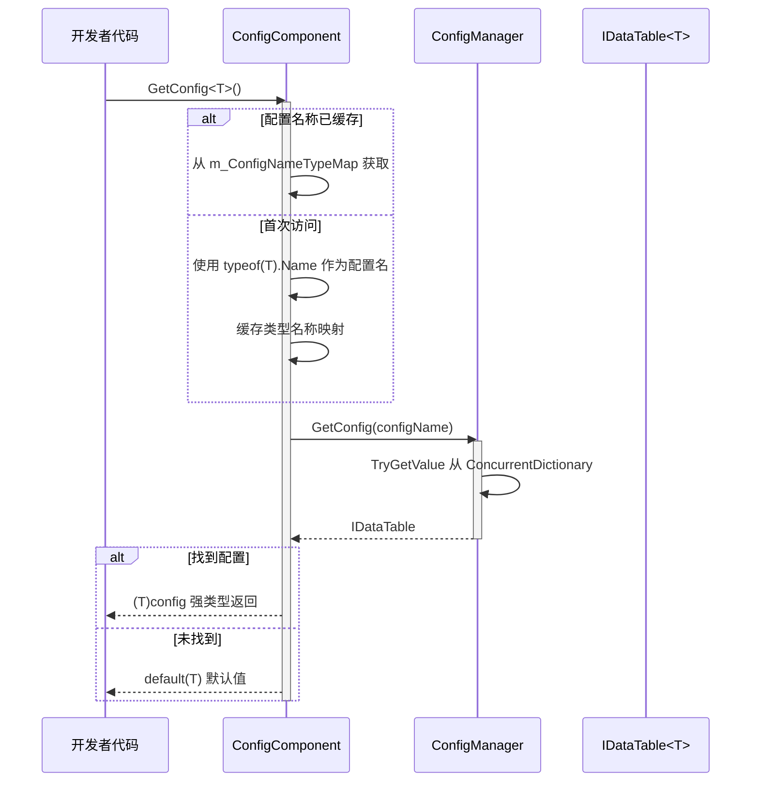
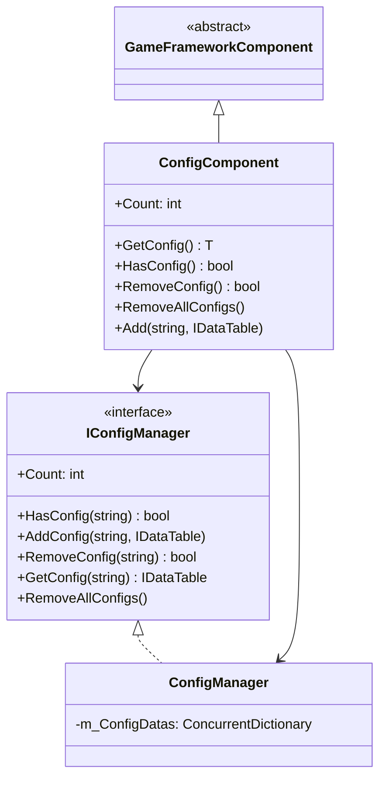

# ConfigComponent 設定コンポーネント

ConfigComponent 是 GameFrameX 設定系统的 Unity コンポーネント層，作为游戏設定管理的コア入口，提供タイプ安全的設定数据访问能力。

## 概要

ConfigComponent 是 Unity シーン中的 `MonoBehaviour` コンポーネント，継承自 `GameFrameworkComponent`。它充当了設定管理系统与 Unity 引擎之间的桥梁，使開発者能够在游戏ランタイム方便地取得和管理設定数据。

### コア职责

- **タイプ安全的設定访问**：通过ジェネリックメソッド提供コンパイル时タイプ確認
- **設定缓存管理**：维护タイプ到設定名称的映射关系
- **統一された設定入口**：カプセル化 ConfigManager 的複雑性，提供シンプル的 API
- **ライフサイクル管理**：在 Awake フェーズ初期化設定マネージャー

### 設計意图

ConfigComponent 采用ファサードパターン（Facade Pattern）設計，旨在簡素化設定管理的複雑性。開発者无需直接与 ConfigManager 交互，只需通过 ConfigComponent つまり可完成設定的取得、查询和管理操作。ジェネリックメソッド的使用確認してください了コンパイル时的タイプ安全，减少了ランタイムエラー。

## アーキテクチャ

### コンポーネント層次结构

```mermaid
graph TD
    subgraph Unity["Unity 层 (Scene)"]
        ConfigComp["ConfigComponent<br/>(MonoBehaviour)"]
    end
    
    subgraph Framework["GameFrameX 核心层"]
        IConfigMgr["IConfigManager<br/>(接口)"]
        ConfigMgr["ConfigManager<br/>(实现)"]
    end
    
    subgraph Data["数据层"]
        IDataTable["IDataTable<T><br/>(接口)"]
        BaseDataTable["BaseDataTable<T><br/>(基类)"]
        CustomDT["自定义数据表<br/>(继承BaseDataTable)"]
    end
    
    ConfigComp -->|"获取配置"| IConfigMgr
    IConfigMgr <|.. ConfigMgr
    ConfigMgr -->|"存储/查询"| IDataTable
    IDataTable <|.. BaseDataTable
    BaseDataTable <|-- CustomDT
```

### 設定访问フロー



## コア機能

### 設定取得

ConfigComponent 提供します两种方法取得設定：

1. **ジェネリックメソッド取得**（推奨）：自动使用タイプ名称作为設定键
2. **手动追加設定**：允许显式指定設定名称和インスタンス

### タイプ名称映射机制

内部使用 `ConcurrentDictionary<Type, string>` 缓存タイプ到名称的映射，避免频繁呼び出し `typeof(T).Name`：

```csharp
private ConcurrentDictionary<Type, string> m_ConfigNameTypeMap = new ConcurrentDictionary<Type, string>();
```

> Source: [ConfigComponent.cs](https://github.com/GameFrameX/com.gameframex.unity.config/blob/main/Runtime/Config/ConfigComponent.cs#L51)

### 設定数量统计

通过 `Count` プロパティ〜できます快速取得当前已ロード的設定项总数：

```csharp
public int Count
{
    get { return m_ConfigManager.Count; }
}
```

> Source: [ConfigComponent.cs](https://github.com/GameFrameX/com.gameframex.unity.config/blob/main/Runtime/Config/ConfigComponent.cs#L61-L64)

## 使用例

### 在 Unity シーン中使用

1. 在 Unity エディタ中作成空物体
2. 追加 `GameFrameX/Config` コンポーネント（自动追加 ConfigComponent）
3. 通过脚本取得并使用設定

### 取得設定数据

```csharp
using GameFrameX.Config.Runtime;

// 获取配置组件
var configComponent = UnityEngine.GameObject.Find("GameFrameX").GetComponent<ConfigComponent>();

// 检查配置是否存在
if (configComponent.HasConfig<WeaponDataTable>())
{
    // 获取配置
    var weaponTable = configComponent.GetConfig<WeaponDataTable>();
    
    // 通过 ID 获取数据
    var weapon = weaponTable[1001];
    
    // 使用 TryGet 安全获取
    if (weaponTable.TryGetValue(1001, out var weapon2))
    {
        // 使用 weapon2
    }
}
```

> Source: [ConfigComponent.cs](https://github.com/GameFrameX/com.gameframex.unity.config/blob/main/Runtime/Config/ConfigComponent.cs#L117-L127)

### 追加自定義設定

```csharp
// 手动添加配置
var customTable = new MyCustomDataTable();
configComponent.Add("MyCustomConfig", customTable);

// 移除指定配置
configComponent.RemoveConfig<WeaponDataTable>();

// 清空所有配置
configComponent.RemoveAllConfigs();
```

> Source: [ConfigComponent.cs](https://github.com/GameFrameX/com.gameframex.unity.config/blob/main/Runtime/Config/ConfigComponent.cs#L153-L170)

### 数据表查询例

```csharp
var config = configComponent.GetConfig<ItemDataTable>();

// 获取所有数据
var allItems = config.All;

// 条件查询
var rareItems = config.FindList(item => item.Quality >= 4);

// 聚合操作
var maxPrice = config.Max(item => item.Price);
var totalCount = config.Sum(item => item.Count);

// 遍历操作
config.ForEach(item => {
    UnityEngine.Debug.Log(item.Name);
});
```

> Source: [BaseDataTable.cs](https://github.com/GameFrameX/com.gameframex.unity.config/blob/main/Runtime/Config/Config/BaseDataTable.cs#L296-L349)

## API リファレンス

### プロパティ

#### `Count: int`

取得全局設定项数量。

```csharp
int count = configComponent.Count;
```

| プロパティ | 值 |
|------|-----|
| タイプ | `int` |
| 访问 | 只读 |
| 説明 | 返す ConfigManager 中存储的設定项总数 |

### メソッド

#### `GetConfig<T>(): T`

取得指定タイプ的全局設定项。

```csharp
var config = configComponent.GetConfig<WeaponDataTable>();
```

| パラメータ | タイプ | 説明 |
|------|------|------|
| T | ジェネリックパラメータ | 設定项タイプ，〜しなければなりません実装 `IDataTable` インターフェース |

| 戻り値 | 説明 |
|--------|------|
| T | 找到的設定项；未找到时返す `default(T)` |

> Source: [ConfigComponent.cs](https://github.com/GameFrameX/com.gameframex.unity.config/blob/main/Runtime/Config/ConfigComponent.cs#L117-L127)

---

#### `HasConfig<T>(): bool`

確認指定タイプ的設定项是否存在。

```csharp
bool exists = configComponent.HasConfig<MonsterDataTable>();
```

| パラメータ | タイプ | 説明 |
|------|------|------|
| T | ジェネリックパラメータ | 設定项タイプ，〜しなければなりません実装 `IDataTable` インターフェース |

| 戻り値 | 説明 |
|--------|------|
| `bool` | 設定项存在返す `true`，否则返す `false` |

> Source: [ConfigComponent.cs](https://github.com/GameFrameX/com.gameframex.unity.config/blob/main/Runtime/Config/ConfigComponent.cs#L138-L142)

---

#### `RemoveConfig<T>(): bool`

移除指定タイプ的設定项。

```csharp
bool success = configComponent.RemoveConfig<WeaponDataTable>();
```

| パラメータ | タイプ | 説明 |
|------|------|------|
| T | ジェネリックパラメータ | 設定项タイプ，〜しなければなりません実装 `IDataTable` インターフェース |

| 戻り値 | 説明 |
|--------|------|
| `bool` | 移除成功返す `true`；設定不存在返す `false` |

> Source: [ConfigComponent.cs](https://github.com/GameFrameX/com.gameframex.unity.config/blob/main/Runtime/Config/ConfigComponent.cs#L153-L157)

---

#### `RemoveAllConfigs(): void`

清空所有全局設定项。

```csharp
configComponent.RemoveAllConfigs();
```

> Source: [ConfigComponent.cs](https://github.com/GameFrameX/com.gameframex.unity.config/blob/main/Runtime/Config/ConfigComponent.cs#L166-L170)

---

#### `Add(configName: string, dataTable: IDataTable): void`

增加指定的全局設定项。

```csharp
configComponent.Add("MyConfig", myDataTable);
```

| パラメータ | タイプ | 説明 |
|------|------|------|
| configName | `string` | 全局設定项的名称 |
| dataTable | `IDataTable` | 全局設定项的数据表インスタンス |

> Source: [ConfigComponent.cs](https://github.com/GameFrameX/com.gameframex.unity.config/blob/main/Runtime/Config/ConfigComponent.cs#L181-L184)

## 継承结构



## 関連リンク

- [ConfigManager 設定マネージャー](./4-core-concepts.config-manager)
- [IDataTable 数据表インターフェース](./4-core-concepts.idata-table)
- [インターフェース定義](./5-api-reference.interfaces)
- [イベントパラメータ](./5-api-reference.event-args)
- [二进制設定表](./6-configuration.binary-config)
- [脚本宏定義](./6-configuration.scripting-define-symbols)
