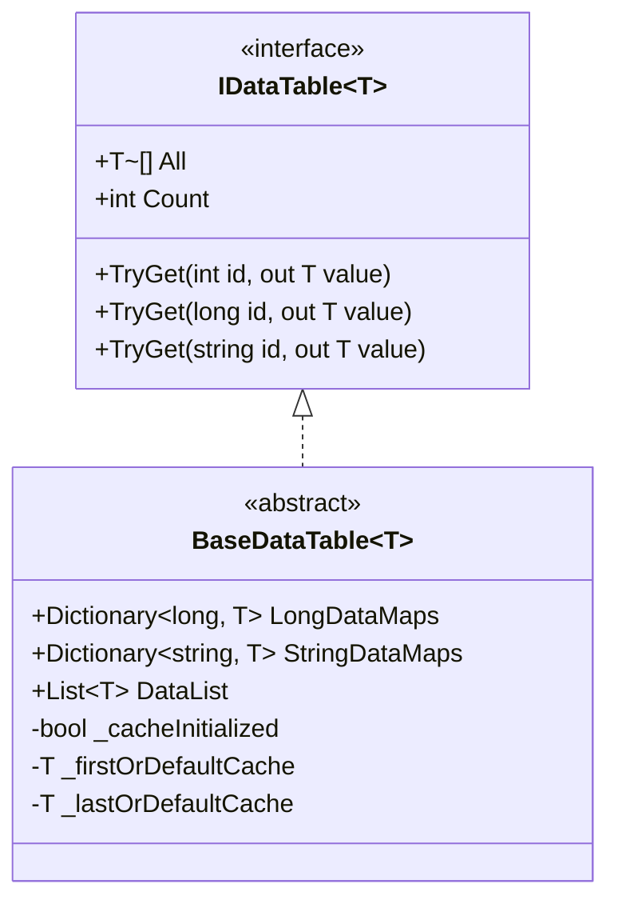

# 二进制配置表

二进制配置表是 GameFrameX Config 配置系统的重要组成部分，に使用以二进制格式存储和加载ゲーム配置数据。相比文本格式，二进制配置表具有加载速度快、占用空间小、解析效率高等优点，特别适合对性能要求较高的ゲームシーン。

## 概要

二进制配置表機能允许開発者在 Unity プロジェクト中使用 `.bytes` 格式的二进制配置ファイル。系统を通じてファイル扩展名自动识别配置クラス型：当配置リソース名称以 `.bytes` 结尾时，系统会将其作为二进制数据进行解析；否则按文本格式处理。

这种设计提供します极大的灵活性，開発者可能に基づいて实际需求选择使用文本配置表或二进制配置表，甚至可能在同一个プロジェクト中混合使用两种格式。

### 二进制配置的コア优势

**加载性能**：二进制数据无需进行字符串解析，直接を通じて BinaryReader 读取即可，能够显著减少加载时间。在大型ゲーム或多配置シーン下，这一优势尤为明显。

**存储效率**：二进制格式将数据紧凑存储，相比文本格式（如 JSON、XML）能够节省 30%-50% 的存储空间，同时减少运行时内存占用。

**安全性**：二进制配置表不易被直接阅读和修改，为ゲーム数据提供します一定程度的保护。虽然不能完全防止破解，但相比明文存储的文本配置ファイル安全系数更高。

## アーキテクチャ設計

```mermaid
flowchart TD
    subgraph ConfigSystem["配置系统架构"]
        subgraph UnityLayer["Unity 层"]
            CC[ConfigComponent<br/>配置コンポーネント]
        end
        
        subgraph ManagerLayer["管理层"]
            CM[ConfigManager<br/>配置管理器]
        end
        
        subgraph DataLayer["数据层"]
            DT[IDataTable&lt;T&gt;<br/>数据表インターフェース]
            BDT[BaseDataTable&lt;T&gt;<br/>数据表基クラス]
        end
        
        subgraph StorageLayer["存储层"]
            DictLong[Dictionary&lt;long, T&gt;<br/>长整型索引]
            DictStr[Dictionary&lt;string, T&gt;<br/>字符串索引]
            List[List&lt;T&gt;<br/>数据列表]
        end
    end
    
    CC --> CM
    CM --> DT
    DT <|-- BDT
    BDT --> DictLong
    BDT --> DictStr
    BDT --> List
```

### コアコンポーネント职责

**ConfigComponent** 是 Unity 层面的エントリーポイントコンポーネント，を継承 GameFrameworkComponent，を通じて挂载到ゲーム物体上提供配置機能。它负责初期化 ConfigManager 并暴露配置访问インターフェース给ゲーム逻辑层。

**ConfigManager** 実装 IConfigManager インターフェース，是整个配置系统的コア管理器。它维护一个线程安全的 ConcurrentDictionary，に使用存储所有已加载的配置表インスタンス，并提供配置的查询、添加、移除等操作。

**BaseDataTable<T>** 是所有数据表的泛型基クラス，提供します数据存储和查询的完整実装。它内部维护三个数据结构：LongDataMaps に使用长整型 ID 索引、StringDataMaps に使用字符串 ID 索引、DataList に使用顺序遍历和批量操作。

## 二进制配置加载フロー

```mermaid
sequenceDiagram
    participant Game as ゲーム逻辑
    participant CC as ConfigComponent
    participant CM as ConfigManager
    participant RC as ResourceComponent
    participant Parser as 配置解析器

    Game->>CC: お願いします求加载配置
    CC->>CM: GetConfig&lt;T&gt;()
    CM->>RC: LoadAsset(configName.bytes)
    RC-->>CM: 返回 TextAsset.bytes
    CM->>Parser: ParseData(bytes)
    
    alt ファイル扩展名为 .bytes
        Parser->>Parser: 使用 BinaryReader 解析
        Parser->>Parser: 循环读取 string-key 和 string-value
    else 其他扩展名
        Parser->>Parser: 使用文本解析器
    end
    
    Parser-->>CM: 返回解析结果
    CM-->>CM: 存储到 Dictionary
    CM-->>CC: 返回 IDataTable
    CC-->>Game: 返回配置数据
```

## 脚本宏定义

二进制配置機能を通じて Unity 脚本宏定义（Scripting Define Symbols）进行控制。Editor ディレクトリ下提供します ConfigDefineSymbols 工具クラス来管理此宏定义。

### 启用二进制配置

在 Unity 编辑器中，可能を通じて菜单操作来启用或禁用二进制配置機能：

```csharp
// Source: [Editor/ConfigDefineSymbols.cs](https://github.com/GameFrameX/com.gameframex.unity.config/blob/main/Editor/ConfigDefineSymbols.cs#L1-L31)

namespace GameFrameX.Config.Editor
{
    /// <summary>
    /// 配置表二进制機能脚本宏定义。
    /// </summary>
    public static class ConfigDefineSymbols
    {
        public const string EnableBinaryConfigScriptingDefineSymbol = "ENABLE_BINARY_CONFIG";

        /// <summary>
        /// 开启配置表为二进制的脚本宏定义。
        /// </summary>
        [MenuItem("GameFrameX/Scripting Define Symbols/Enable Binary Config(开启二进制配置表)", false, 501)]
        public static void EnableBinaryConfig()
        {
            ScriptingDefineSymbols.AddScriptingDefineSymbol(EnableBinaryConfigScriptingDefineSymbol);
        }

        /// <summary>
        /// 禁用配置表为二进制的脚本宏定义。
        /// </summary>
        [MenuItem("GameFrameX/Scripting Define Symbols/Disable Binary Config(关闭二进制配置表)", false, 500)]
        public static void DisableBinaryConfig()
        {
            ScriptingDefineSymbols.RemoveScriptingDefineSymbol(EnableBinaryConfigScriptingDefineSymbol);
        }
    }
}
```

を通じて菜单 **GameFrameX → Scripting Define Symbols → Enable Binary Config(开启二进制配置表)** 即可启用二进制配置サポート。

## 二进制配置格式

二进制配置表采用简单的键值对格式存储数据，每条记录包含两个字符串：配置名称（键）和配置值（值）。

### 二进制格式规范

二进制ファイル使用 BinaryWriter 按以下顺序写入数据：

```
[配置名称1 (string)] [配置值1 (string)]
[配置名称2 (string)] [配置值2 (string)]
...
```

每个字符串使用 UTF-8 编码，并を通じて BinaryWriter.Write(string) メソッド写入。

### 数据解析実装

系统使用 BinaryReader 进行二进制数据的解析，コア実装逻辑如下：

```csharp
// Source: [Runtime/Config/DefaultConfigHelper.cs](https://github.com/GameFrameX/com.gameframex.unity.config/blob/main/Runtime/Config/DefaultConfigHelper.cs#L147-L184)

/// <summary>
/// 解析グローバル設定（二进制格式）。
/// </summary>
public override bool ParseData(IConfigManager configManager, byte[] configBytes, int startIndex, int length, object userData)
{
    try
    {
        using (MemoryStream memoryStream = new MemoryStream(configBytes, startIndex, length, false))
        {
            using (BinaryReader binaryReader = new BinaryReader(memoryStream, Encoding.UTF8))
            {
                while (binaryReader.BaseStream.Position < binaryReader.BaseStream.Length)
                {
                    string configName = binaryReader.ReadString();
                    string configValue = binaryReader.ReadString();
                    if (!configManager.AddConfig(configName, configValue))
                    {
                        Log.Warning("Can not add config with config name '{0}' which may be invalid or duplicate.", configName);
                        return false;
                    }
                }
            }
        }

        return true;
    }
    catch (Exception exception)
    {
        Log.Warning("Can not parse config bytes with exception '{0}'.", exception);
        return false;
    }
}
```

解析过程中，系统会持续读取字符串对，直到流末尾。每读取到一个配置项，就呼び出し AddConfig メソッド将其添加到配置管理器中。

### ファイル扩展名识别

系统を通じてリソースファイル扩展名自动判断配置クラス型：

```csharp
// Source: [Runtime/Config/DefaultConfigHelper.cs](https://github.com/GameFrameX/com.gameframex.unity.config/blob/main/Runtime/Config/DefaultConfigHelper.cs#L61-L78)

private static readonly string BytesAssetExtension = ".bytes";

public override bool ReadData(IConfigManager configManager, string configAssetName, object configAsset, object userData)
{
    TextAsset configTextAsset = configAsset as TextAsset;
    if (configTextAsset != null)
    {
        if (configAssetName.EndsWith(BytesAssetExtension, StringComparison.Ordinal))
        {
            // 二进制格式解析
            return configManager.ParseData(configTextAsset.bytes, userData);
        }
        else
        {
            // 文本格式解析
            return configManager.ParseData(configTextAsset.text, userData);
        }
    }

    Log.Warning("Config asset '{0}' is invalid.", configAssetName);
    return false;
}
```

## 数据表存储结构

BaseDataTable<T> 使用多种数据结构来满足不同的查询需求，这种设计在保证機能完整性的同时，也优化了常见操作的性能。



### 存储结构説明

**LongDataMaps**：使用 Dictionary<long, T> 存储以长整数作为主键的配置数据，提供 O(1) 时间复杂度的按 ID 查询。

**StringDataMaps**：使用 Dictionary<string, T> 存储以字符串作为主键的配置数据，适に使用必要使用字符串标识符的シーン。

**DataList**：使用 List<T> 存储所有配置数据对象，サポート顺序遍历、批量操作以及 First/Last 查询。

**缓存机制**：BaseDataTable 実装了缓存机制，に使用缓存数据表中的首尾元素和数量统计，避免频繁遍历底层数据结构。

## 設定查询示例

数据表サポート多种查询方法，開発者可能に基づいて实际シーン选择最合适的メソッド：

```csharp
// Source: [Runtime/Config/Config/BaseDataTable.cs](https://github.com/GameFrameX/com.gameframex.unity.config/blob/main/Runtime/Config/Config/BaseDataTable.cs#L119-L162)

/// <summary>
/// 尝试に基づいて整数ID取得对象。
/// </summary>
public bool TryGet(int id, out T value)
{
    return LongDataMaps.TryGetValue(id, out value);
}

/// <summary>
/// 尝试に基づいて长整数ID取得对象。
/// </summary>
public bool TryGet(long id, out T value)
{
    return LongDataMaps.TryGetValue(id, out value);
}

/// <summary>
/// 尝试に基づいて字符串ID取得对象。
/// </summary>
public bool TryGet(string id, out T value)
{
    return StringDataMaps.TryGetValue(id, out value);
}
```

### 常用查询メソッド

| メソッド | 説明 | 返回クラス型 |
|------|------|----------|
| TryGet(int id) | に基づいて整数 ID 尝试取得数据 | bool |
| TryGet(long id) | に基づいて长整数 ID 尝试取得数据 | bool |
| TryGet(string id) | に基づいて字符串 ID 尝试取得数据 | bool |
| Find(func) | に基づいて条件查找第一个匹配对象 | T |
| FindListArray(func) | に基づいて条件查找所有匹配对象 | T[] |
| FirstOrDefault | 取得第一个对象 | T |
| LastOrDefault | 取得最后一个对象 | T |
| All | 取得所有对象数组 | T[] |

## 関連リンク

- [Config コンポーネント简介](./1-overview.introduction)
- [機能特性](./1-overview.features)
- [安装方法](./2-installation.install-methods)
- [依赖要求](./2-installation.dependencies)
- [基础使用](./3-getting-started.basic-usage)
- [数据表定义](./3-getting-started.data-table-definition)
- [ConfigComponent 配置コンポーネント](./4-core-concepts.config-component)
- [ConfigManager 配置管理器](./4-core-concepts.config-manager)
- [IDataTable 数据表インターフェース](./4-core-concepts.idata-table)
- [インターフェース定义](./5-api-reference.interfaces)
- [イベント参数](./5-api-reference.event-args)
- [脚本宏定义](./6-configuration.scripting-define-symbols)
- [常见问题](./7-troubleshooting)
