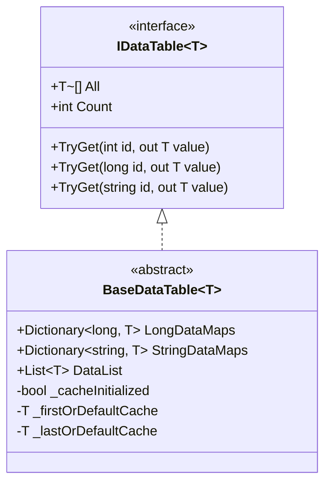

# バイナリ設定テーブル

バイナリ設定テーブルは、GameFrameX Config 設定システムの重要な组成部分であり、バイナリフォーマットでゲーム設定データを保存およびロードするために使用されます。テキストフォーマットと比較して、バイナリ設定テーブルはロード速度快、占用スペース小、解析効率高等优点があり、パフォーマンス要件较高的ゲームシナリオに特に適しています。

## 概要

バイナリ設定テーブル機能により、開発者は Unity プロジェクトで `.bytes` フォーマットのバイナリ設定ファイルを使用できます。システムはファイル拡張子を通じて設定タイプを自动識別：設定リソース名が `.bytes` で終わる場合、システムはバイナリデータとして解析します。そうでなければテキストフォーマットとして処理します。

この設計は开发者に大きな柔軟性を提供し、開発者は実際の需求に基づいてテキスト設定テーブルまたはバイナリ設定テーブルを選択でき、同じプロジェクト内で両方のフォーマットを混合して使用する可能性もあります。

### バイナリ設定のコア優位性

**ロードパフォーマンス**：バイナリデータは文字列解析が不要で、BinaryReader を通じて直接読み取るだけでよく、ロード時間を大幅に短縮できます。大規模なゲームや複数設定シナリオでは、この優位性が特に顕著です。

**保存効率**：バイナリフォーマットはデータをコンパクトに保存し、テキストフォーマット（JSON、XMLなど）と比較してストレージスペースを 30%-50% 節約でき、実行時のメモリ使用量も削減します。

**安全性**：バイナリ設定テーブルは直接閲覧や修改されにくく、ゲームデータにある程度の保護を提供します。完全に解読を防ぐことはできませんが、プレーンテキスト保存のテキスト設定ファイルと比較して安全系数が高くなります。

## アーキテクチャ設計

```mermaid
flowchart TD
    subgraph ConfigSystem["設定システムアーキテクチャ"]
        subgraph UnityLayer["Unity 層"]
            CC[ConfigComponent<br/>設定コンポーネント]
        end
        
        subgraph ManagerLayer["マネージャー層"]
            CM[ConfigManager<br/>設定マネージャー]
        end
        
        subgraph DataLayer["データ層"]
            DT[IDataTable&lt;T&gt;<br/>データテーブルインターフェース]
            BDT[BaseDataTable&lt;T&gt;<br/>データテーブル基底クラス]
        end
        
        subgraph StorageLayer["保存層"]
            DictLong[Dictionary&lt;long, T&gt;<br/>長整数インデックス]
            DictStr[Dictionary&lt;string, T&gt;<br/>文字列インデックス]
            List[List&lt;T&gt;<br/>データリスト]
        end
    end
    
    CC --> CM
    CM --> DT
    DT <|-- BDT
    BDT --> DictLong
    BDT --> DictStr
    BDT --> List
```

### コアコンポーネント职责

**ConfigComponent** は Unity 層のエントリーポイントコンポーネントであり、GameFrameworkComponent を継承し、ゲームオブジェクトにマウントして設定機能を提供します。ConfigManager の初期化を担当し、ゲームロジック層に設定アクセスインターフェースを公开します。

**ConfigManager** は IConfigManager インターフェースを実装し、整个設定システムのコアマネージャーです。スレッド安全な ConcurrentDictionary を维护し、すべてのロード済み設定テーブルインスタンスの保存に使用し、設定のクエリ、追加、移除などの操作を提供します。

**`BaseDataTable<T>`** はすべてのデータテーブルのジェネリック基底クラスであり、データ保存とクエリの完全な実装を提供します。内部的には3つのデータ構造を維持：LongDataMaps は長整数 ID インデックスに使用、StringDataMaps は文字列 ID インデックスに使用、DataList は順序遍歴とバッチ操作に使用します。

## バイナリ設定ロードフロー

```mermaid
sequenceDiagram
    participant Game as ゲームロジック
    participant CC as ConfigComponent
    participant CM as ConfigManager
    participant RC as ResourceComponent
    participant Parser as 設定解析器

    Game->>CC: 設定のロードをリクエスト
    CC->>CM: GetConfig&lt;T&gt;()
    CM->>RC: LoadAsset(configName.bytes)
    RC-->>CM: TextAsset.bytes を返す
    CM->>Parser: ParseData(bytes)
    
    alt ファイル拡張子が .bytes
        Parser->>Parser: BinaryReader を使用して解析
        Parser->>Parser: string-key と string-value をループで読み取り
    else 他の拡張子
        Parser->>Parser: テキスト解析器を使用
    end
    
    Parser-->>CM: 解析結果を返す
    CM-->>CM: Dictionary に保存
    CM-->>CC: IDataTable を返す
    CC-->>Game: 設定データを返す
```

## スクリプトマクロ定義

バイナリ設定機能は Unity スクリプトマクロ定義（Scripting Define Symbols）を通じて制御されます。Editor ディレクトリにはこのマクロ定義を管理する ConfigDefineSymbols ツールクラスが用意されています。

### バイナリ設定を有効にする

Unity エディタでは、メニュー操作を通じてバイナリ設定機能を有効または無効にできます：

```csharp
// Source: [Editor/ConfigDefineSymbols.cs](https://github.com/GameFrameX/com.gameframex.unity.config/blob/main/Editor/ConfigDefineSymbols.cs#L1-L31)

namespace GameFrameX.Config.Editor
{
    /// <summary>
    /// 設定テーブルバイナリ機能スクリプトマクロ定義。
    /// </summary>
    public static class ConfigDefineSymbols
    {
        public const string EnableBinaryConfigScriptingDefineSymbol = "ENABLE_BINARY_CONFIG";

        /// <summary>
        /// 設定テーブルをバイナリにするスクリプトマクロ定義を有効にする。
        /// </summary>
        [MenuItem("GameFrameX/Scripting Define Symbols/Enable Binary Config(バイナリ設定テーブルを有効にする)", false, 501)]
        public static void EnableBinaryConfig()
        {
            ScriptingDefineSymbols.AddScriptingDefineSymbol(EnableBinaryConfigScriptingDefineSymbol);
        }

        /// <summary>
        /// 設定テーブルをバイナリにするスクリプトマクロ定義を無効にする。
        /// </summary>
        [MenuItem("GameFrameX/Scripting Define Symbols/Disable Binary Config(バイナリ設定テーブルを無効にする)", false, 500)]
        public static void DisableBinaryConfig()
        {
            ScriptingDefineSymbols.RemoveScriptingDefineSymbol(EnableBinaryConfigScriptingDefineSymbol);
        }
    }
}
```

メニューから **GameFrameX → Scripting Define Symbols → Enable Binary Config(バイナリ設定テーブルを有効にする)** を選択して、バイナリ設定サポートを有効にします。

## バイナリ設定フォーマット

バイナリ設定テーブルは键値对フォーマットを使用してデータを保存し、各レコードには2つの文字列が含まれます：設定名（键）と設定値（値）。

### バイナリフォーマット仕様

バイナリファイルは BinaryWriter を使用して以下の順序でデータを書き込みます：

```
[設定名1 (string)] [設定値1 (string)]
[設定名2 (string)] [設定値2 (string)]
...
```

各文字列は UTF-8 エンコーディングを使用し、BinaryWriter.Write(string) メソッドを通じて書き込みます。

### データ解析実装

システムは BinaryReader を使用してバイナリデータの解析を行い、コア実装ロジックは以下の通りです：

```csharp
// Source: [Runtime/Config/DefaultConfigHelper.cs](https://github.com/GameFrameX/com.gameframex.unity.config/blob/main/Runtime/Config/DefaultConfigHelper.cs#L147-L184)

/// <summary>
/// グローバル設定を解析（バイナリフォーマット）。
/// </summary>
public override bool ParseData(IConfigManager configManager, byte[] configBytes, int startIndex, int length, object userData)
{
    try
    {
        using (MemoryStream memoryStream = new MemoryStream(configBytes, startIndex, length, false))
        {
            using (BinaryReader binaryReader = new BinaryReader(memoryStream, Encoding.UTF8))
            {
                while (binaryReader.BaseStream.Position < binaryReader.BaseStream.Length)
                {
                    string configName = binaryReader.ReadString();
                    string configValue = binaryReader.ReadString();
                    if (!configManager.AddConfig(configName, configValue))
                    {
                        Log.Warning("Can not add config with config name '{0}' which may be invalid or duplicate.", configName);
                        return false;
                    }
                }
            }
        }

        return true;
    }
    catch (Exception exception)
    {
        Log.Warning("Can not parse config bytes with exception '{0}'.", exception);
        return false;
    }
}
```

解析プロセス中、システムはストリームの末尾まで文字列の组みを持续的に読み取ります。各設定項目を読み取るたびに、AddConfig メソッドを呼び出して設定マネージャーに追加します。

### ファイル拡張子識別

システムはリソースファイルの拡張子を通じて設定タイプを自動判断します：

```csharp
// Source: [Runtime/Config/DefaultConfigHelper.cs](https://github.com/GameFrameX/com.gameframex.unity.config/blob/main/Runtime/Config/DefaultConfigHelper.cs#L61-L78)

private static readonly string BytesAssetExtension = ".bytes";

public override bool ReadData(IConfigManager configManager, string configAssetName, object configAsset, object userData)
{
    TextAsset configTextAsset = configAsset as TextAsset;
    if (configTextAsset != null)
    {
        if (configAssetName.EndsWith(BytesAssetExtension, StringComparison.Ordinal))
        {
            // バイナリフォーマット解析
            return configManager.ParseData(configTextAsset.bytes, userData);
        }
        else
        {
            // テキストフォーマット解析
            return configManager.ParseData(configTextAsset.text, userData);
        }
    }

    Log.Warning("Config asset '{0}' is invalid.", configAssetName);
    return false;
}
```

## データテーブル保存構造

`BaseDataTable<T>` は異なるクエリ要件を満たすために複数のデータ構造を使用しており、この設計は機能の完全性を保证的同时、一般的な操作のパフォーマンスも最適化しています。



### 保存構造説明

**LongDataMaps**：Dictionary<long, T> を使用して長整数を主キーとする設定データを保存し、O(1) の時間複雑度で ID によるクエリを提供します。

**StringDataMaps**：Dictionary<string, T> を使用して文字列を主キーとする設定データを保存し、文字列識別子を必要とするシナリオに適しています。

**DataList**：`List<T>` を使用してすべての設定データオブジェクトを保存し、順序遍歴、バッチ操作、First/Last クエリをサポートしています。

**キャッシュメカニズム**：BaseDataTable はキャッシュメカニズムを実装しており、データテーブル内の最初と最後の要素および数量統計をキャッシュして、底层データ構造への频繁な遍歴を回避します。

## 設定クエリ例

データテーブルは複数のクエリ方法をサポートしており、開発者は実際のシナリオに基づいて最も適切な方法を選択できます：

```csharp
// Source: [Runtime/Config/Config/BaseDataTable.cs](https://github.com/GameFrameX/com.gameframex.unity.config/blob/main/Runtime/Config/Config/BaseDataTable.cs#L119-L162)

/// <summary>
/// 整数IDに基づいてオブジェクトの取得を試みる。
/// </summary>
public bool TryGet(int id, out T value)
{
    return LongDataMaps.TryGetValue(id, out value);
}

/// <summary>
/// 長整数IDに基づいてオブジェクトの取得を試みる。
/// </summary>
public bool TryGet(long id, out T value)
{
    return LongDataMaps.TryGetValue(id, out value);
}

/// <summary>
/// 文字列IDに基づいてオブジェクトの取得を試みる。
/// </summary>
public bool TryGet(string id, out T value)
{
    return StringDataMaps.TryGetValue(id, out value);
}
```

### 常用的クエリメソッド

| メソッド | 説明 | 戻り型 |
|------|------|----------|
| TryGet(int id) | 整数 ID に基づいてデータの取得を試みる | bool |
| TryGet(long id) | 長整数 ID に基づいてデータの取得を試みる | bool |
| TryGet(string id) | 文字列 ID に基づいてデータの取得を試みる | bool |
| Find(func) | 条件に基づいて最初の一致オブジェクトを検索 | T |
| FindListArray(func) | 条件に基づいてすべての一致オブジェクトを検索 | T[] |
| FirstOrDefault | 最初のオブジェクトを取得 | T |
| LastOrDefault | 最後のオブジェクトを取得 | T |
| All | すべてのオブジェクト配列を取得 | T[] |

## 関連リンク

- [Config コンポーネント概要](./1-overview.introduction)
- [機能一覧](./1-overview.features)
- [インストール方法](./2-installation.install-methods)
- [依存関係](./2-installation.dependencies)
- [基本的な使用方法](./3-getting-started.basic-usage)
- [データテーブル定義](./3-getting-started.data-table-definition)
- [ConfigComponent 設定コンポーネント](./4-core-concepts.config-component)
- [ConfigManager 設定マネージャー](./4-core-concepts.config-manager)
- [IDataTable データテーブルインターフェース](./4-core-concepts.idata-table)
- [インターフェース定義](./5-api-reference.interfaces)
- [イベント引数](./5-api-reference.event-args)
- [スクリプトマクロ定義](./6-configuration.scripting-define-symbols)
- [よくある問題](./7-troubleshooting)
