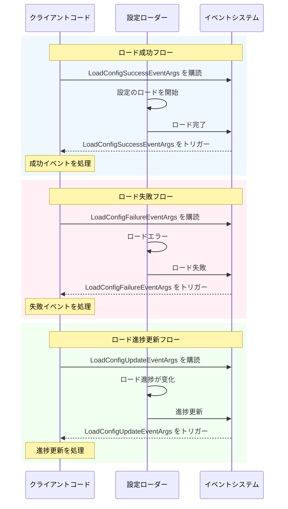

# イベント引数

本文書は GameFrameX 設定モジュールで定義されているイベント引数クラスを紹介し、設定ロードプロセス中にイベントデータを传递するために使用されます。

## 概要

イベント引数は GameFrameX 設定システムにおける Observer パターンの重要な组成部分です。設定リソースが非同期でロードされるとき、システムは異なるタイプのイベントをトリガーして、このプロセス关注的コードに通知します。これらのイベントには、ロード成功、ロード失敗、ロード進捗更新が含まれます。

イベント引数クラスは统一して `GameFrameX.Event.Runtime.GameEventArgs` 基底クラスを継承し、オブジェクトプールパターンを使用してメモリ割り当てを最適化します。各イベントクラスはイベント識別に使用する静的な `EventId` プロパティと、イベントインスタンスを作成するための静的な `Create` ファクトリメソッドを提供します。

## イベント引数クラス

### 1. LoadConfigSuccessEventArgs - ロード成功イベント

グローバル設定リソースが正常にロードされたときにこのイベントがトリガーされます。

```csharp
public sealed class LoadConfigSuccessEventArgs : GameEventArgs
{
    /// <summary>
    /// グローバル設定のロード成功イベントID。
    /// </summary>
    public static readonly string EventId = typeof(LoadConfigSuccessEventArgs).FullName;

    /// <summary>
    /// グローバル設定リソース名を取得します。
    /// </summary>
    public string ConfigAssetName { get; private set; }

    /// <summary>
    /// ロード持続時間を取得します。
    /// </summary>
    /// <remarks>
    /// ロード持続時間を秒単位で表します
    /// </remarks>
    public float Duration { get; private set; }

    /// <summary>
    /// ユーザー定義データを取得します。
    /// </summary>
    public object UserData { get; private set; }

    /// <summary>
    /// グローバル設定のロード成功イベントを作成します。
    /// </summary>
    public static LoadConfigSuccessEventArgs Create(string dataAssetName, float duration, object userData)
    {
        LoadConfigSuccessEventArgs loadConfigSuccessEventArgs = ReferencePool.Acquire<LoadConfigSuccessEventArgs>();
        loadConfigSuccessEventArgs.ConfigAssetName = dataAssetName;
        loadConfigSuccessEventArgs.Duration = duration;
        loadConfigSuccessEventArgs.UserData = userData;
        return loadConfigSuccessEventArgs;
    }

    /// <summary>
    /// グローバル設定のロード成功イベントをクリアします。
    /// </summary>
    public override void Clear()
    {
        ConfigAssetName = null;
        Duration = 0f;
        UserData = null;
    }
}
```

> Source: [LoadConfigSuccessEventArgs.cs](https://github.com/GameFrameX/com.gameframex.unity.config/blob/main/Runtime/EventArgs/LoadConfigSuccessEventArgs.cs#L43-L137)

### 2. LoadConfigFailureEventArgs - ロード失敗イベント

グローバル設定リソースのロードが失敗したときにこのイベントがトリガーされます。

```csharp
public sealed class LoadConfigFailureEventArgs : GameEventArgs
{
    /// <summary>
    /// グローバル設定のロード失敗イベントID。
    /// </summary>
    public static readonly string EventId = typeof(LoadConfigFailureEventArgs).FullName;

    /// <summary>
    /// グローバル設定リソース名を取得します。
    /// </summary>
    public string ConfigAssetName { get; private set; }

    /// <summary>
    /// エラーメッセージを取得します。
    /// </summary>
    public string ErrorMessage { get; private set; }

    /// <summary>
    /// ユーザー定義データを取得します。
    /// </summary>
    public object UserData { get; private set; }

    /// <summary>
    /// グローバル設定のロード失敗イベントを作成します。
    /// </summary>
    public static LoadConfigFailureEventArgs Create(string dataAssetName, string errorMessage, object userData)
    {
        LoadConfigFailureEventArgs loadConfigFailureEventArgs = ReferencePool.Acquire<LoadConfigFailureEventArgs>();
        loadConfigFailureEventArgs.ConfigAssetName = dataAssetName;
        loadConfigFailureEventArgs.ErrorMessage = errorMessage;
        loadConfigFailureEventArgs.UserData = userData;
        return loadConfigFailureEventArgs;
    }

    /// <summary>
    /// グローバル設定のロード失敗イベントをクリアします。
    /// </summary>
    public override void Clear()
    {
        ConfigAssetName = null;
        ErrorMessage = null;
        UserData = null;
    }
}
```

> Source: [LoadConfigFailureEventArgs.cs](https://github.com/GameFrameX/com.gameframex.unity.config/blob/main/Runtime/EventArgs/LoadConfigFailureEventArgs.cs#L43-L137)

### 3. LoadConfigUpdateEventArgs - ロード進捗更新イベント

グローバル設定リソースのロード進捗が更新されたときにこのイベントがトリガーされます。

```csharp
public sealed class LoadConfigUpdateEventArgs : GameEventArgs
{
    /// <summary>
    /// グローバル設定のロード更新イベントID。
    /// </summary>
    public static readonly string EventId = typeof(LoadConfigUpdateEventArgs).FullName;

    /// <summary>
    /// グローバル設定リソース名を取得します。
    /// </summary>
    public string ConfigAssetName { get; private set; }

    /// <summary>
    /// グローバル設定のロード進捗を取得します。
    /// </summary>
    /// <remarks>
    /// ロード進捗の範囲は 0.0 から 1.0 です
    /// </remarks>
    public float Progress { get; private set; }

    /// <summary>
    /// ユーザー定義データを取得します。
    /// </summary>
    public object UserData { get; private set; }

    /// <summary>
    /// グローバル設定のロード更新イベントを作成します。
    /// </summary>
    public static LoadConfigUpdateEventArgs Create(string dataAssetName, float progress, object userData)
    {
        LoadConfigUpdateEventArgs loadConfigUpdateEventArgs = ReferencePool.Acquire<LoadConfigUpdateEventArgs>();
        loadConfigUpdateEventArgs.ConfigAssetName = dataAssetName;
        loadConfigUpdateEventArgs.Progress = progress;
        loadConfigUpdateEventArgs.UserData = userData;
        return loadConfigUpdateEventArgs;
    }

    /// <summary>
    /// グローバル設定のロード更新イベントをクリアします。
    /// </summary>
    public override void Clear()
    {
        ConfigAssetName = null;
        Progress = 0f;
        UserData = null;
    }
}
```

> Source: [LoadConfigUpdateEventArgs.cs](https://github.com/GameFrameX/com.gameframex.unity.config/blob/main/Runtime/EventArgs/LoadConfigUpdateEventArgs.cs#L43-L137)

## イベント関係クラス図

```mermaid
classDiagram
    class GameEventArgs {
        <<abstract>>
        +Id: string {get; abstract}
        +Clear() void$ abstract
    }
    
    class LoadConfigSuccessEventArgs {
        +EventId: string
        +ConfigAssetName: string
        +Duration: float
        +UserData: object
        +Create(dataAssetName, duration, userData)$ LoadConfigSuccessEventArgs
    }
    
    class LoadConfigFailureEventArgs {
        +EventId: string
        +ConfigAssetName: string
        +ErrorMessage: string
        +UserData: object
        +Create(dataAssetName, errorMessage, userData)$ LoadConfigFailureEventArgs
    }
    
    class LoadConfigUpdateEventArgs {
        +EventId: string
        +ConfigAssetName: string
        +Progress: float
        +UserData: object
        +Create(dataAssetName, progress, userData)$ LoadConfigUpdateEventArgs
    }
    
    GameEventArgs <|-- LoadConfigSuccessEventArgs
    GameEventArgs <|-- LoadConfigFailureEventArgs
    GameEventArgs <|-- LoadConfigUpdateEventArgs
```

## イベントフロー



## API リファレンス

### LoadConfigSuccessEventArgs

**名前空間：** `GameFrameX.Config.Runtime`

**継承：** `GameEventArgs`

#### プロパティ

| プロパティ | 型 | 読み取り専用 | 説明 |
|------|------|------|------|
| EventId | string | はい | イベントの一意識別子で、型の完全修飾名です |
| ConfigAssetName | string | はい | 正常にロードされた設定リソース名 |
| Duration | float | はい | ロードにかかった時間を秒単位で表します |
| UserData | object | はい | ユーザー定義データで、イベント間でコンテキストを传递するために使用されます |

#### メソッド

| メソッド | 戻り型 | 説明 |
|------|----------|------|
| Create(string, float, object) | LoadConfigSuccessEventArgs | オブジェクトプールからインスタンスを取得して初期化する静的ファクトリメソッド |
| Clear() | void | すべてのプロパティ値をクリアし、インスタンスをオブジェクトプールに归还します |

---

### LoadConfigFailureEventArgs

**名前空間：** `GameFrameX.Config.Runtime`

**継承：** `GameEventArgs`

#### プロパティ

| プロパティ | 型 | 読み取り専用 | 説明 |
|------|------|------|------|
| EventId | string | はい | イベントの一意識別子で、型の完全修飾名です |
| ConfigAssetName | string | はい | ロードに失敗した設定リソース名 |
| ErrorMessage | string | はい | 失敗理由を説明するエラーメッセージ |
| UserData | object | はい | ユーザー定義データで、イベント間でコンテキストを传递するために使用されます |

#### メソッド

| メソッド | 戻り型 | 説明 |
|------|----------|------|
| Create(string, string, object) | LoadConfigFailureEventArgs | オブジェクトプールからインスタンスを取得して初期化する静的ファクトリメソッド |
| Clear() | void | すべてのプロパティ値をクリアし、インスタンスをオブジェクトプールに归还します |

---

### LoadConfigUpdateEventArgs

**名前空間：** `GameFrameX.Config.Runtime`

**継承：** `GameEventArgs`

#### プロパティ

| プロパティ | 型 | 読み取り専用 | 説明 |
|------|------|------|------|
| EventId | string | はい | イベントの一意識別子で、型の完全修飾名です |
| ConfigAssetName | string | はい | ロード中の設定リソース名 |
| Progress | float | はい | ロード進捗で、範囲は 0.0 から 1.0 です |
| UserData | object | はい | ユーザー定義データで、イベント間でコンテキストを传递するために使用されます |

#### メソッド

| メソッド | 戻り型 | 説明 |
|------|----------|------|
| Create(string, float, object) | LoadConfigUpdateEventArgs | オブジェクトプールからインスタンスを取得して初期化する静的ファクトリメソッド |
| Clear() | void | すべてのプロパティ値をクリアし、インスタンスをオブジェクトプールに归还します |

## 使用例

### 設定ロードイベントの購読

```csharp
using GameFrameX.Event.Runtime;
using GameFrameX.Config.Runtime;

// 設定ロード成功イベントを購読
EventSystem.EventSubscribe<LoadConfigSuccessEventArgs>(OnLoadConfigSuccess);

// 設定ロード失敗イベントを購読
EventSystem.EventSubscribe<LoadConfigFailureEventArgs>(OnLoadConfigFailure);

// 設定ロード進捗更新イベントを購読
EventSystem.EventSubscribe<LoadConfigUpdateEventArgs>(OnLoadConfigUpdate);

private void OnLoadConfigSuccess(object sender, LoadConfigSuccessEventArgs e)
{
    UnityEngine.Debug.Log($"設定のロードに成功しました: {e.ConfigAssetName}, 耗时: {e.Duration}秒");
    // ロード成功のロジックを処理
    // 注意：使用完毕后イベントオブジェクトをオブジェクトプールに归还する必要があります
    ReferencePool.Release(e);
}

private void OnLoadConfigFailure(object sender, LoadConfigFailureEventArgs e)
{
    UnityEngine.Debug.LogError($"設定のロードに失敗しました: {e.ConfigAssetName}, エラー: {e.ErrorMessage}");
    ReferencePool.Release(e);
}

private void OnLoadConfigUpdate(object sender, LoadConfigUpdateEventArgs e)
{
    UnityEngine.Debug.Log($"ロード進捗: {e.ConfigAssetName} - {e.Progress * 100}%");
    ReferencePool.Release(e);
}
```

> Source: [LoadConfigSuccessEventArgs.cs](https://github.com/GameFrameX/com.gameframex.unity.config/blob/main/Runtime/EventArgs/LoadConfigSuccessEventArgs.cs#L116-L123)
> Source: [LoadConfigFailureEventArgs.cs](https://github.com/GameFrameX/com.gameframex.unity.config/blob/main/Runtime/EventArgs/LoadConfigFailureEventArgs.cs#L116-L123)
> Source: [LoadConfigUpdateEventArgs.cs](https://github.com/GameFrameX/com.gameframex.unity.config/blob/main/Runtime/EventArgs/LoadConfigUpdateEventArgs.cs#L116-L123)

## 関連リンク

- [インターフェース定義](./5-api-reference.interfaces) - 設定マネージャーのインターフェース定義
- [ConfigComponent 設定コンポーネント](./4-core-concepts.config-component) - 設定コンポーネントの詳細紹介
- [ConfigManager 設定マネージャー](./4-core-concepts.config-manager) - 設定マネージャーの詳細紹介
- [IDataTable データテーブルインターフェース](./4-core-concepts.idata-table) - データテーブルインターフェースの詳細定義
