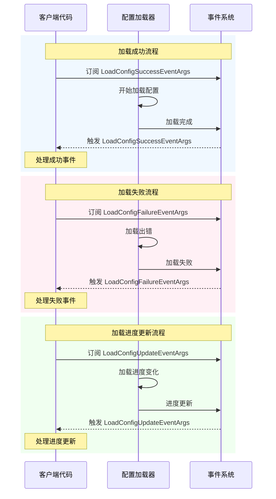

# イベントパラメータ

このドキュメント介绍 GameFrameX 設定モジュール中定義的イベントパラメータタイプ，用于在設定ロード过程中传递イベント数据。

## 概要

イベントパラメータ是 GameFrameX 設定系统中观察者モード的重要な组成部分。当設定リソース进行非同期ロード时，系统会トリガー不同タイプ的イベント来通知关注该进程的コード。这些イベント含みます：ロード成功、ロード失敗、ロード進捗アップデート。

イベントパラメータ类統一された継承自 `GameFrameX.Event.Runtime.GameEventArgs` 基底クラス，使用对象池モード来最適化内存分配。每个イベント类都提供します静态的 `EventId` プロパティ用于イベント标识，および静态的 `Create` 工厂メソッド用于作成イベントインスタンス。

## イベントパラメータ类

### 1. LoadConfigSuccessEventArgs - ロード成功イベント

当全局設定リソースロード成功时トリガー此イベント。

```csharp
public sealed class LoadConfigSuccessEventArgs : GameEventArgs
{
    /// <summary>
    /// 加载全局配置成功事件编号。
    /// </summary>
    public static readonly string EventId = typeof(LoadConfigSuccessEventArgs).FullName;

    /// <summary>
    /// 获取全局配置资源名称。
    /// </summary>
    public string ConfigAssetName { get; private set; }

    /// <summary>
    /// 获取加载持续时间。
    /// </summary>
    /// <remarks>
    /// 加载持续时间，以秒为单位
    /// </remarks>
    public float Duration { get; private set; }

    /// <summary>
    /// 获取用户自定义数据。
    /// </summary>
    public object UserData { get; private set; }

    /// <summary>
    /// 创建加载全局配置成功事件。
    /// </summary>
    public static LoadConfigSuccessEventArgs Create(string dataAssetName, float duration, object userData)
    {
        LoadConfigSuccessEventArgs loadConfigSuccessEventArgs = ReferencePool.Acquire<LoadConfigSuccessEventArgs>();
        loadConfigSuccessEventArgs.ConfigAssetName = dataAssetName;
        loadConfigSuccessEventArgs.Duration = duration;
        loadConfigSuccessEventArgs.UserData = userData;
        return loadConfigSuccessEventArgs;
    }

    /// <summary>
    /// 清理加载全局配置成功事件。
    /// </summary>
    public override void Clear()
    {
        ConfigAssetName = null;
        Duration = 0f;
        UserData = null;
    }
}
```

> Source: [LoadConfigSuccessEventArgs.cs](https://github.com/GameFrameX/com.gameframex.unity.config/blob/main/Runtime/EventArgs/LoadConfigSuccessEventArgs.cs#L43-L137)

### 2. LoadConfigFailureEventArgs - ロード失敗イベント

当全局設定リソースロード失敗时トリガー此イベント。

```csharp
public sealed class LoadConfigFailureEventArgs : GameEventArgs
{
    /// <summary>
    /// 加载全局配置失败事件编号。
    /// </summary>
    public static readonly string EventId = typeof(LoadConfigFailureEventArgs).FullName;

    /// <summary>
    /// 获取全局配置资源名称。
    /// </summary>
    public string ConfigAssetName { get; private set; }

    /// <summary>
    /// 获取错误信息。
    /// </summary>
    public string ErrorMessage { get; private set; }

    /// <summary>
    /// 获取用户自定义数据。
    /// </summary>
    public object UserData { get; private set; }

    /// <summary>
    /// 创建加载全局配置失败事件。
    /// </summary>
    public static LoadConfigFailureEventArgs Create(string dataAssetName, string errorMessage, object userData)
    {
        LoadConfigFailureEventArgs loadConfigFailureEventArgs = ReferencePool.Acquire<LoadConfigFailureEventArgs>();
        loadConfigFailureEventArgs.ConfigAssetName = dataAssetName;
        loadConfigFailureEventArgs.ErrorMessage = errorMessage;
        loadConfigFailureEventArgs.UserData = userData;
        return loadConfigFailureEventArgs;
    }

    /// <summary>
    /// 清理加载全局配置失败事件。
    /// </summary>
    public override void Clear()
    {
        ConfigAssetName = null;
        ErrorMessage = null;
        UserData = null;
    }
}
```

> Source: [LoadConfigFailureEventArgs.cs](https://github.com/GameFrameX/com.gameframex.unity.config/blob/main/Runtime/EventArgs/LoadConfigFailureEventArgs.cs#L43-L137)

### 3. LoadConfigUpdateEventArgs - ロード進捗アップデートイベント

当全局設定リソースロード進捗アップデート时トリガー此イベント。

```csharp
public sealed class LoadConfigUpdateEventArgs : GameEventArgs
{
    /// <summary>
    /// 加载全局配置更新事件编号。
    /// </summary>
    public static readonly string EventId = typeof(LoadConfigUpdateEventArgs).FullName;

    /// <summary>
    /// 获取全局配置资源名称。
    /// </summary>
    public string ConfigAssetName { get; private set; }

    /// <summary>
    /// 获取加载全局配置进度。
    /// </summary>
    /// <remarks>
    /// 加载进度，范围为 0.0 到 1.0
    /// </remarks>
    public float Progress { get; private set; }

    /// <summary>
    /// 获取用户自定义数据。
    /// </summary>
    public object UserData { get; private set; }

    /// <summary>
    /// 创建加载全局配置更新事件。
    /// </summary>
    public static LoadConfigUpdateEventArgs Create(string dataAssetName, float progress, object userData)
    {
        LoadConfigUpdateEventArgs loadConfigUpdateEventArgs = ReferencePool.Acquire<LoadConfigUpdateEventArgs>();
        loadConfigUpdateEventArgs.ConfigAssetName = dataAssetName;
        loadConfigUpdateEventArgs.Progress = progress;
        loadConfigUpdateEventArgs.UserData = userData;
        return loadConfigUpdateEventArgs;
    }

    /// <summary>
    /// 清理加载全局配置更新事件。
    /// </summary>
    public override void Clear()
    {
        ConfigAssetName = null;
        Progress = 0f;
        UserData = null;
    }
}
```

> Source: [LoadConfigUpdateEventArgs.cs](https://github.com/GameFrameX/com.gameframex.unity.config/blob/main/Runtime/EventArgs/LoadConfigUpdateEventArgs.cs#L43-L137)

## イベント关系类图

```mermaid
classDiagram
    class GameEventArgs {
        <<abstract>>
        +Id: string {get; abstract}
        +Clear() void$ abstract
    }
    
    class LoadConfigSuccessEventArgs {
        +EventId: string
        +ConfigAssetName: string
        +Duration: float
        +UserData: object
        +Create(dataAssetName, duration, userData)$ LoadConfigSuccessEventArgs
    }
    
    class LoadConfigFailureEventArgs {
        +EventId: string
        +ConfigAssetName: string
        +ErrorMessage: string
        +UserData: object
        +Create(dataAssetName, errorMessage, userData)$ LoadConfigFailureEventArgs
    }
    
    class LoadConfigUpdateEventArgs {
        +EventId: string
        +ConfigAssetName: string
        +Progress: float
        +UserData: object
        +Create(dataAssetName, progress, userData)$ LoadConfigUpdateEventArgs
    }
    
    GameEventArgs <|-- LoadConfigSuccessEventArgs
    GameEventArgs <|-- LoadConfigFailureEventArgs
    GameEventArgs <|-- LoadConfigUpdateEventArgs
```

## イベントフロー



## API リファレンス

### LoadConfigSuccessEventArgs

**名前空間：** `GameFrameX.Config.Runtime`

**継承：** `GameEventArgs`

#### プロパティ

| プロパティ | タイプ | 只读 | 説明 |
|------|------|------|------|
| EventId | string | 是 | イベント唯一标识符，值为タイプ的完全限定名 |
| ConfigAssetName | string | 是 | ロード成功的設定リソース名称 |
| Duration | float | 是 | ロード所花费的时间，单位为秒 |
| UserData | object | 是 | ユーザー自定義数据，用于在イベント间传递上下文 |

#### メソッド

| メソッド | 返すタイプ | 説明 |
|------|----------|------|
| Create(string, float, object) | LoadConfigSuccessEventArgs | 静态工厂メソッド，从对象池取得インスタンス并初期化 |
| Clear() | void | 清理所有プロパティ值，将インスタンス归还对象池 |

---

### LoadConfigFailureEventArgs

**名前空間：** `GameFrameX.Config.Runtime`

**継承：** `GameEventArgs`

#### プロパティ

| プロパティ | タイプ | 只读 | 説明 |
|------|------|------|------|
| EventId | string | 是 | イベント唯一标识符，值为タイプ的完全限定名 |
| ConfigAssetName | string | 是 | ロード失敗的設定リソース名称 |
| ErrorMessage | string | 是 | 説明失敗原因的エラー情報 |
| UserData | object | 是 | ユーザー自定義数据，用于在イベント间传递上下文 |

#### メソッド

| メソッド | 返すタイプ | 説明 |
|------|----------|------|
| Create(string, string, object) | LoadConfigFailureEventArgs | 静态工厂メソッド，从对象池取得インスタンス并初期化 |
| Clear() | void | 清理所有プロパティ值，将インスタンス归还对象池 |

---

### LoadConfigUpdateEventArgs

**名前空間：** `GameFrameX.Config.Runtime`

**継承：** `GameEventArgs`

#### プロパティ

| プロパティ | タイプ | 只读 | 説明 |
|------|------|------|------|
| EventId | string | 是 | イベント唯一标识符，值为タイプ的完全限定名 |
| ConfigAssetName | string | 是 | 〜中ロード的設定リソース名称 |
| Progress | float | 是 | ロード進捗，范围从 0.0 到 1.0 |
| UserData | object | 是 | ユーザー自定義数据，用于在イベント间传递上下文 |

#### メソッド

| メソッド | 返すタイプ | 説明 |
|------|----------|------|
| Create(string, float, object) | LoadConfigUpdateEventArgs | 静态工厂メソッド，从对象池取得インスタンス并初期化 |
| Clear() | void | 清理所有プロパティ值，将インスタンス归还对象池 |

## 使用例

### 購読設定ロードイベント

```csharp
using GameFrameX.Event.Runtime;
using GameFrameX.Config.Runtime;

// 订阅配置加载成功事件
EventSystem.EventSubscribe<LoadConfigSuccessEventArgs>(OnLoadConfigSuccess);

// 订阅配置加载失败事件
EventSystem.EventSubscribe<LoadConfigFailureEventArgs>(OnLoadConfigFailure);

// 订阅配置加载进度更新事件
EventSystem.EventSubscribe<LoadConfigUpdateEventArgs>(OnLoadConfigUpdate);

private void OnLoadConfigSuccess(object sender, LoadConfigSuccessEventArgs e)
{
    UnityEngine.Debug.Log($"配置加载成功: {e.ConfigAssetName}, 耗时: {e.Duration}秒");
    // 处理加载成功的逻辑
    // 注意：使用完毕后需要归还事件对象到对象池
    ReferencePool.Release(e);
}

private void OnLoadConfigFailure(object sender, LoadConfigFailureEventArgs e)
{
    UnityEngine.Debug.LogError($"配置加载失败: {e.ConfigAssetName}, 错误: {e.ErrorMessage}");
    ReferencePool.Release(e);
}

private void OnLoadConfigUpdate(object sender, LoadConfigUpdateEventArgs e)
{
    UnityEngine.Debug.Log($"加载进度: {e.ConfigAssetName} - {e.Progress * 100}%");
    ReferencePool.Release(e);
}
```

> Source: [LoadConfigSuccessEventArgs.cs](https://github.com/GameFrameX/com.gameframex.unity.config/blob/main/Runtime/EventArgs/LoadConfigSuccessEventArgs.cs#L116-L123)
> Source: [LoadConfigFailureEventArgs.cs](https://github.com/GameFrameX/com.gameframex.unity.config/blob/main/Runtime/EventArgs/LoadConfigFailureEventArgs.cs#L116-L123)
> Source: [LoadConfigUpdateEventArgs.cs](https://github.com/GameFrameX/com.gameframex.unity.config/blob/main/Runtime/EventArgs/LoadConfigUpdateEventArgs.cs#L116-L123)

## 関連リンク

- [インターフェース定義](./5-api-reference.interfaces) - 設定マネージャー的インターフェース定義
- [ConfigComponent 設定コンポーネント](./4-core-concepts.config-component) - 設定コンポーネント的詳細介绍
- [ConfigManager 設定マネージャー](./4-core-concepts.config-manager) - 設定マネージャー的詳細介绍
- [IDataTable 数据表インターフェース](./4-core-concepts.idata-table) - 数据表インターフェース的詳細定義
