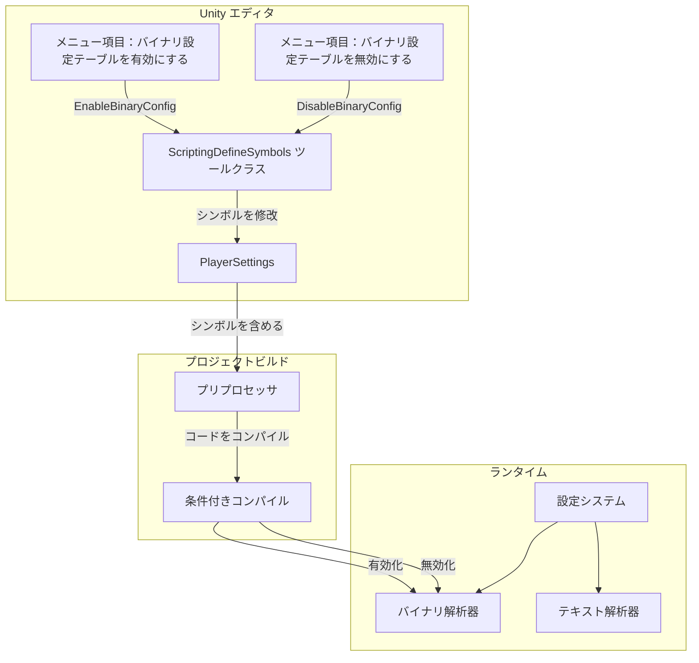
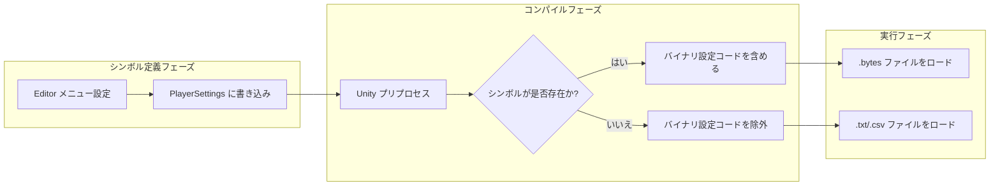

# スクリプトマクロ定義

スクリプトマクロ定義（Scripting Define Symbols）は、Unity プロジェクトで条件付きコンパイルに使用されるプリプロセッサシンボルです。GameFrameX Config コンポーネントはスクリプトマクロ定義を使用して、バイナリ設定テーブル機能の有効/無効を制御します。

## 概要

スクリプトマクロ定義は Unity コンパイラの機能であり、開発者はコード内で異なるコンパイル条件に基づいて特定のコードセグメントを含めるか除外するかを選択できます。GameFrameX Config コンポーネントは `ENABLE_BINARY_CONFIG` スクリプトマクロを使用して、バイナリ設定テーブル機能を有効にするか否かを制御します。

### バイナリ設定テーブルとは

バイナリ設定テーブルは、バイナリフォーマットで設定データを保存する方法であり、テキストフォーマット（CSV、TSV）と比較して以下の利点があります：

- **ロード速度の向上**：バイナリデータは解析不要で、直接読み取り可能
- **ファイル体积の縮小**：データはコンパクトなバイナリフォーマットで保存
- **高い安全性**：バイナリデータは直接閲覧や修改されにくい
- **解析开销の低減**：文字列分割と型変換が不要

## 動作原理

### アーキテクチャフロー



### シンボル作用メカニズム



## 使用方法

### バイナリ設定テーブルを有効にする

Unity エディタで、メニュー操作を通じてバイナリ設定機能を有効にします：

1. Unity エディタを開きます
2. メニューを順番にクリック：`GameFrameX` → `Scripting Define Symbols` → `Enable Binary Config(バイナリ設定テーブルを有効にする)`
3. Unity がスクリプトを再コンパイルするのを待ちます

### バイナリ設定テーブルを無効にする

テキストフォーマットの設定に戻す必要がある場合：

1. メニューを順番にクリック：`GameFrameX` → `Scripting Define Symbols` → `Disable Binary Config(バイナリ設定テーブルを無効にする)`
2. Unity がスクリプトを再コンパイルするのを待ちます

## API リファレンス

### ConfigDefineSymbols

名前空間：`GameFrameX.Config.Editor`

```csharp
public static class ConfigDefineSymbols
```

設定テーブルバイナリ機能のスクリプトマクロ定義クラスで、バイナリ設定テーブルスイッチ機能を提供します。

#### フィールド

| フィールド | 型 | 説明 |
|------|------|------|
| `EnableBinaryConfigScriptingDefineSymbol` | `const string` | バイナリ設定テーブルスクリプトマクロ定義の定数値：`"ENABLE_BINARY_CONFIG"` |

#### メソッド

##### EnableBinaryConfig

```csharp
[MenuItem("GameFrameX/Scripting Define Symbols/Enable Binary Config(バイナリ設定テーブルを有効にする)", false, 501)]
public static void EnableBinaryConfig()
```

バイナリ設定テーブル機能を有効にするスクリプトマクロ定義。

**機能説明：**
`ENABLE_BINARY_CONFIG` シンボルをプロジェクトの PlayerSettings に追加し、プロジェクトがコンパイル時にバイナリ設定関連のコードを含めるようにします。

> Source: [ConfigDefineSymbols.cs](https://github.com/GameFrameX/com.gameframex.unity.config/blob/main/Editor/ConfigDefineSymbols.cs#L25-L29)

---

##### DisableBinaryConfig

```csharp
[MenuItem("GameFrameX/Scripting Define Symbols/Disable Binary Config(バイナリ設定テーブルを無効にする)", false, 500)]
public static void DisableBinaryConfig()
```

バイナリ設定テーブル機能を無効にするスクリプトマクロ定義。

**機能説明：**
プロジェクトの PlayerSettings から `ENABLE_BINARY_CONFIG` シンボルを移除し、プロジェクトがコンパイル時にバイナリ設定関連のコードを含めないないようにします。

> Source: [ConfigDefineSymbols.cs](https://github.com/GameFrameX/com.gameframex.unity.config/blob/main/Editor/ConfigDefineSymbols.cs#L16-L20)

## 設定オプション

| 設定項目 | 型 | 默认値 | 説明 |
|--------|------|--------|------|
| `ENABLE_BINARY_CONFIG` | スクリプトマクロ | 未定義 | バイナリ設定テーブル機能のスイッチを制御します |

## 注意事項

1. **コンパイルの再ロード**：スクリプトマクロ定義を修改すると、Unity は自動的にスクリプトを再コンパイルし、その间短暂な卡顿が発生する可能性がありますが、正常な現象です。

2. **プラットフォームの差異**：スクリプトマクロ定義はグローバルであり、すべてのプラットフォームに適用されます。特定のプラットフォーム用に設定する必要がある場合は、PlayerSettings で手動で修改してください。

3. **リソースフォーマット**：バイナリ設定を有効にした後、設定リソースファイルが `.bytes` フォーマットであることを確認してください。

4. **データの互換性**：バイナリフォーマットとテキストフォーマットのデータ構造は異なる場合があり、切替時にデータが正しく変換されていることを確認してください。

## 関連リンク

- [バイナリ設定テーブル](./6-configuration.binary-config)
- [ConfigComponent 設定コンポーネント](./4-core-concepts.config-component)
- [ConfigManager 設定マネージャー](./4-core-concepts.config-manager)
- [IDataTable データテーブルインターフェース](./4-core-concepts.idata-table)
