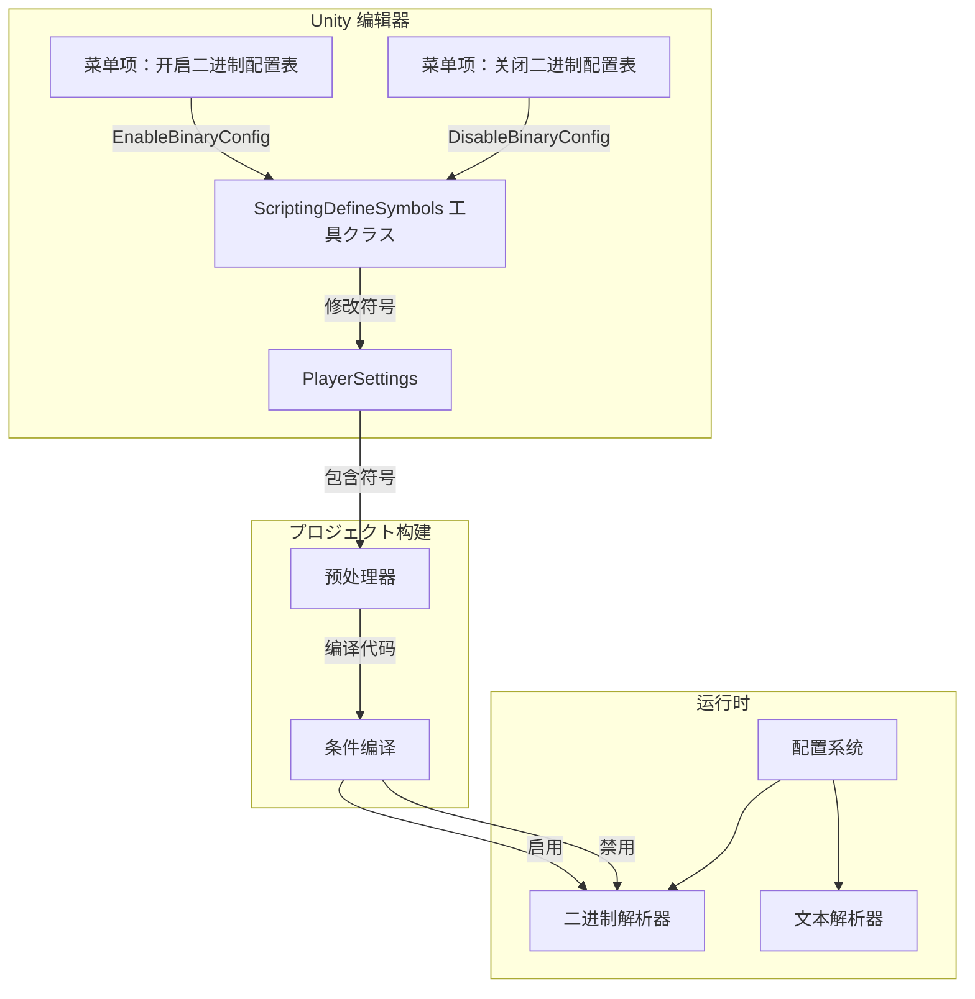
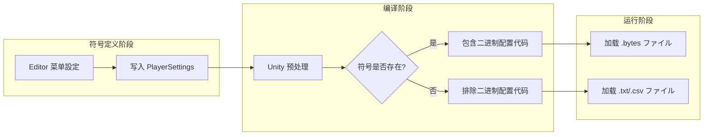

# 脚本宏定义

脚本宏定义（Scripting Define Symbols）是 Unity プロジェクト中に使用条件编译的预处理器符号。GameFrameX Config コンポーネントを通じて脚本宏定义来控制二进制配置表機能的开启与关闭。

## 概要

脚本宏定义是 Unity 编译器的一个特性，允许開発者在代码中に基づいて不同的编译条件包含或排除特定代码段。GameFrameX Config コンポーネント使用 `ENABLE_BINARY_CONFIG` 脚本宏来控制是否启用二进制配置表機能。

### 什么是二进制配置表

二进制配置表是一种以二进制格式存储配置数据的方法，相比文本格式（CSV、TSV）具有以下优势：

- **加载速度更快**：二进制数据无需解析，可直接读取
- **ファイル体积更小**：数据以紧凑的二进制格式存储
- **安全性更高**：二进制数据不易被直接阅读和修改
- **解析开销更低**：无需字符串分割和クラス型转换

## 工作原理

### 架构フロー



### 符号作用机制



## 使用メソッド

### 开启二进制配置表

在 Unity 编辑器中，を通じて菜单操作开启二进制配置機能：

1. 打开 Unity 编辑器
2. 依次点击菜单：`GameFrameX` → `Scripting Define Symbols` → `Enable Binary Config(开启二进制配置表)`
3. 等待 Unity 重新编译脚本

### 关闭二进制配置表

如需切换回文本格式配置：

1. 依次点击菜单：`GameFrameX` → `Scripting Define Symbols` → `Disable Binary Config(关闭二进制配置表)`
2. 等待 Unity 重新编译脚本

## API 参考

### ConfigDefineSymbols

名前空間：`GameFrameX.Config.Editor`

```csharp
public static class ConfigDefineSymbols
```

配置表二进制機能的脚本宏定义クラス，提供二进制配置表开关機能。

#### 字段

| 字段 | クラス型 | 説明 |
|------|------|------|
| `EnableBinaryConfigScriptingDefineSymbol` | `const string` | 二进制配置表脚本宏定义的常量值：`"ENABLE_BINARY_CONFIG"` |

#### メソッド

##### EnableBinaryConfig

```csharp
[MenuItem("GameFrameX/Scripting Define Symbols/Enable Binary Config(开启二进制配置表)", false, 501)]
public static void EnableBinaryConfig()
```

开启二进制配置表機能的脚本宏定义。

**機能説明：**
将 `ENABLE_BINARY_CONFIG` 符号添加到プロジェクト的 PlayerSettings 中，使プロジェクト在编译时包含二进制配置関連的代码。

> Source: [ConfigDefineSymbols.cs](https://github.com/GameFrameX/com.gameframex.unity.config/blob/main/Editor/ConfigDefineSymbols.cs#L25-L29)

---

##### DisableBinaryConfig

```csharp
[MenuItem("GameFrameX/Scripting Define Symbols/Disable Binary Config(关闭二进制配置表)", false, 500)]
public static void DisableBinaryConfig()
```

关闭二进制配置表機能的脚本宏定义。

**機能説明：**
从プロジェクト的 PlayerSettings 中移除 `ENABLE_BINARY_CONFIG` 符号，使プロジェクト在编译时不包含二进制配置関連的代码。

> Source: [ConfigDefineSymbols.cs](https://github.com/GameFrameX/com.gameframex.unity.config/blob/main/Editor/ConfigDefineSymbols.cs#L16-L20)

## 設定选项

| 配置项 | クラス型 | 默认值 | 説明 |
|--------|------|--------|------|
| `ENABLE_BINARY_CONFIG` | 脚本宏 | 未定义 | 控制二进制配置表機能的开关 |

## 注意事项

1. **编译重载**：修改脚本宏定义后，Unity 会自动重新编译脚本，此时可能短暂卡顿，属正常现象。

2. **平台差异**：脚本宏定义是全局的，对所有平台生效。如需针对特定平台設定，お願いします手动在 PlayerSettings 中修改。

3. **リソース格式**：开启二进制配置后，必要确保配置リソースファイル为 `.bytes` 格式。

4. **数据兼容性**：二进制格式和文本格式的数据结构可能不同，切换时需确保数据已正确转换。

## 関連リンク

- [二进制配置表](./6-configuration.binary-config)
- [ConfigComponent 配置コンポーネント](./4-core-concepts.config-component)
- [ConfigManager 配置管理器](./4-core-concepts.config-manager)
- [IDataTable 数据表インターフェース](./4-core-concepts.idata-table)
