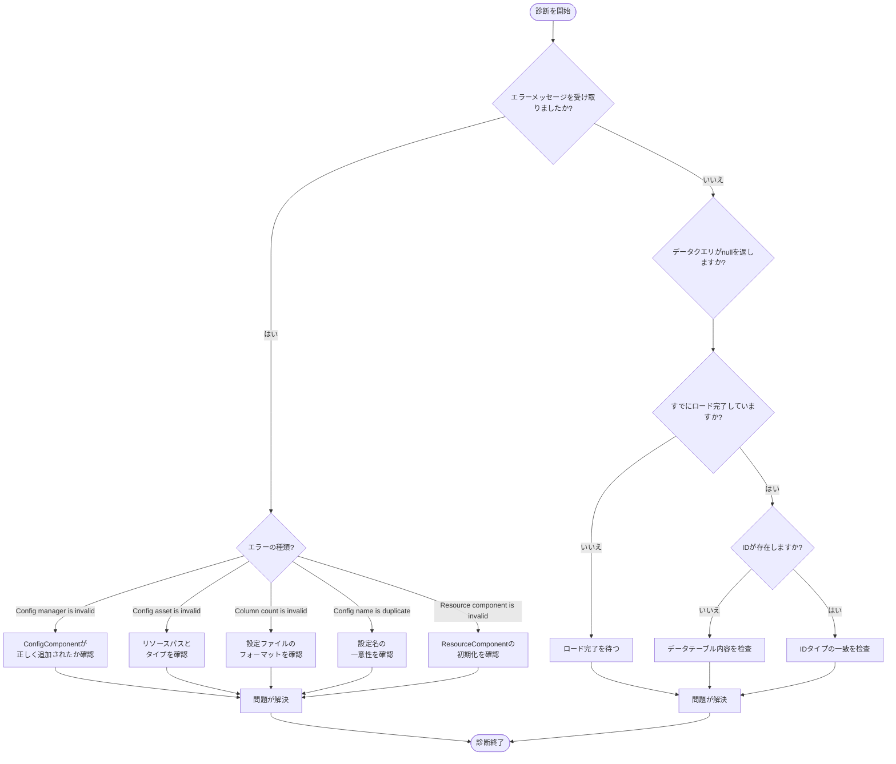

# よくある問題

本文書は Config 設定テーブルコンポーネントの使用中に発生する可能性のあるよくある問題、エラーメッセージとその解決策を汇总します。

## 概要

Config 設定テーブルコンポーネントは、Unity ゲームに完全な設定データ管理ソリューションを提供します。実際の使用プロセスにおいて、開発者は設定のロード失敗、データの解析エラー、コンポーネントが正しく初期化されていないなどの問題が発生する可能性があります。本文書は、開発者がこれらの問題を，迅速に特定して解決することを支援することを目的としています。

## よくある問題一覧

### 1. Config Manager が初期化されていない

**エラーメッセージ：**
```
Config manager is invalid.
```

**原因分析：**
このエラーは、`ConfigComponent` が初期化時に GameFrameworkEntry から `IConfigManager` モジュールを取得できなかったことを意味します。これは通常、フレームワークの初期化順序が正しくない場合に発生します。

**解決策：**

1. シーンに `ConfigComponent` コンポーネントが正しく追加されていることを確認してください：
```csharp
// Unity シーンに ConfigComponent を追加
// GameObject -> Add Component -> GameFrameX -> Config
```

2. GameFramework コアコンポーネントが正しく初期化されていることを確認します。シーンに `GameEntry` オブジェクトが存在するか確認します：
> 詳細については [コアコンセプト - ConfigComponent](./4-core-concepts.config-component) を参照してください

---

### 2. 設定リソースタイプが無効

**エラーメッセージ：**
```
Config asset 'xxx' is invalid.
```

**原因分析：**
この警告は、システムがロードしたアセットを有効設定リソースとして識別できなかったことを意味します。考えられる原因：
- リソースパスが正しくない
- リソースタイプが `TextAsset` または `.bytes` ファイルではない
- リソースファイルが破損している

**解決策：**

1. 設定ファイルのパスが正しいか確認します
2. 設定ファイルがプレーンテキストファイル（`.txt`）またはバイナリファイル（`.bytes`）であることを確認します
3. リソースが最終的なゲームビルドに正しくパッケージされているか確認します

---

### 3. 設定の列数が一致しない

**エラーメッセージ：**
```
Can not parse config line string 'xxx' which column count is invalid.
```

**原因分析：**
テキストフォーマットの設定ファイルを解析する際、解析器は各行に 4 列のデータ（Tab 区切り）があることを期待します。列数が予想と一致しない場合、解析は失敗します。

設定ファイルのフォーマット要件：
```
#ID    名称    コメント    値
1      config1 例         value1
2      config2 例         value2
```

**解決策：**

1. 設定ファイルの列数が正しいか確認します（4 列であるべきです）
2. Tab 文字が列区切り文字として使用されていることを確認します
3. 空行またはフォーマットが正しくない行がないか確認します

> 詳細については [設定オプション - バイナリ設定テーブル](./6-configuration.binary-config) を参照してください

---

### 4. 設定名が重複または無効

**エラーメッセージ：**
```
Can not add config with config name 'xxx' which may be invalid or duplicate.
```

**原因分析：**
この警告は、追加しようとする設定名が無効またはすでに存在することを示します。各設定名は一意である必要があります。

**解決策：**

1. 重複する設定名が存在するか確認します
2. 設定名が空文字列でないことを確認します
3. 一意の識別子を設定名として使用します

---

### 5. Resource Component が見つからない

**エラーメッセージ：**
```
Resource component is invalid.
```

**原因分析：**
`DefaultConfigHelper` は設定リソースをロードするために `ResourceComponent` に依存します。`ResourceComponent` が正しく初期化されていない場合、設定はロードできません。

**解決策：**

1. シーンに `ResourceComponent` コンポーネントが存在することを確認します
2. リソースシステムの初期化順序を確認します
3. リソースパッケージが正しくロードされていることを確認します

---

### 6. バイナリ設定テーブルが有効にならない

**問題説明：**
`ENABLE_BINARY_CONFIG` マクロ定義を有効にした後、バイナリ設定テーブル機能が有効になりません。

**解決策：**

1. Unity メニューでバイナリ設定を有効にします：
   - メニューを開きます：`GameFrameX -> Scripting Define Symbols -> Enable Binary Config(バイナリ設定テーブルを有効にする)`

2. 設定ファイルの拡張子が `.bytes` であることを確認します

> 詳細については [設定オプション - スクリプトマクロ定義](./6-configuration.scripting-define-symbols) を参照してください

---

### 7. データテーブルのロードが失敗

**問題説明：**
`IDataTable.LoadAsync()` メソッドを呼び出した後、データが正しくロードされません。

**排查手順：**

1. 非同期ロードが完了したか確認します：
```csharp
// ロードの完了を正しく待つ
IDataTable<MyConfig> configTable = component.GetConfig<MyConfigTable>();
await configTable.LoadAsync();

// ロードが成功したか確認
if (component.HasConfig<MyConfigTable>()) {
    // 設定がロードされた
}
```

2. イベントがエラーをキャプチャしたか確認します：
> 詳細については [API リファレンス - イベント引数](./5-api-reference.event-args) を参照してください

---

### 8. データクエリが null を返す

**問題説明：**
`TryGet` メソッドで設定データをクエリすると、`false` または `null` が返されます。

**考えられる原因：**

1. データテーブルがまだロードされていない
2. クエリした ID が存在しない
3. データテーブルタイプが一致しない

**解決策：**

1. データのロードが完了してからクエリを実行するようにします
2. `HasConfig<T>()` メソッドを使用して設定是否存在か先に確認します
3. クエリした ID タイプ（int/long/string）がデータテーブル定義と一致することを確認します

```csharp
// 正しいデータクエリフロー
var configTable = component.GetConfig<MyConfigTable>();
if (component.HasConfig<MyConfigTable>()) {
    if (configTable.TryGet(1, out var config)) {
        // 設定の取得に成功
    }
}
```

---

## 診断フロー



## デバッグ技巧

### 1. ログデバッグを有効にする

Config コンポーネントは詳細なログ情報を出力します。開発フェーズでは、ログラベルが `Debug` または `Info` に設定されていることを確認します：

```csharp
// ゲームの起動時にログラベルを設定
Log.SetLogHelper(new DebugLogHelper());
```

### 2. イベントリスンを使用する

設定ロードイベントのリスンを設定すると、問題の特定を素早く行えます：

```csharp
// 設定ロード成功イベントをリスン
GameEntry.Event.Subscribe(LoadConfigSuccessEventArgs.EventId, OnLoadConfigSuccess);

// 設定ロード失敗イベントをリスン
GameEntry.Event.Subscribe(LoadConfigFailureEventArgs.EventId, OnLoadConfigFailure);

private void OnLoadConfigSuccess(object sender, LoadConfigSuccessEventArgs e)
{
    UnityEngine.Debug.Log($"設定のロードに成功しました: {e.ConfigAssetName}, 耗时: {e.Duration}秒");
}

private void OnLoadConfigFailure(object sender, LoadConfigFailureEventArgs e)
{
    UnityEngine.Debug.LogError($"設定のロードに失敗しました: {e.ConfigAssetName}, エラー: {e.ErrorMessage}");
}
```

### 3. 設定数をチェック

デバッグ時に、現在ロードされている設定数をチェックできます：

```csharp
var configComponent = GameEntry.GetComponent<ConfigComponent>();
UnityEngine.Debug.Log($"現在の設定数: {configComponent.Count}");
```

---

## ベストプラクティス

1. **常に TryGet メソッドを使用**： `[Obsolete]` とマークされた `Get` メソッドの使用を避けします
2. **設定の存在性をチェック**：設定を使用する前に `HasConfig<T>()` メソッドを呼び出します
3. **非同期ロード**：設定のロードは非同期であるため、データの使用前にロードが完了していることを確認します
4. **エラー処理**：ロード失敗イベントを購読して、エラーを適時に発見して処理します

---

## 関連リンク

- [コアコンセプト - ConfigComponent](./4-core-concepts.config-component)
- [コアコンセプト - ConfigManager](./4-core-concepts.config-manager)
- [コアコンセプト - IDataTable](./4-core-concepts.idata-table)
- [API リファレンス - インターフェース定義](./5-api-reference.interfaces)
- [API リファレンス - イベント引数](./5-api-reference.event-args)
- [設定オプション - バイナリ設定テーブル](./6-configuration.binary-config)
- [設定オプション - スクリプトマクロ定義](./6-configuration.scripting-define-symbols)
