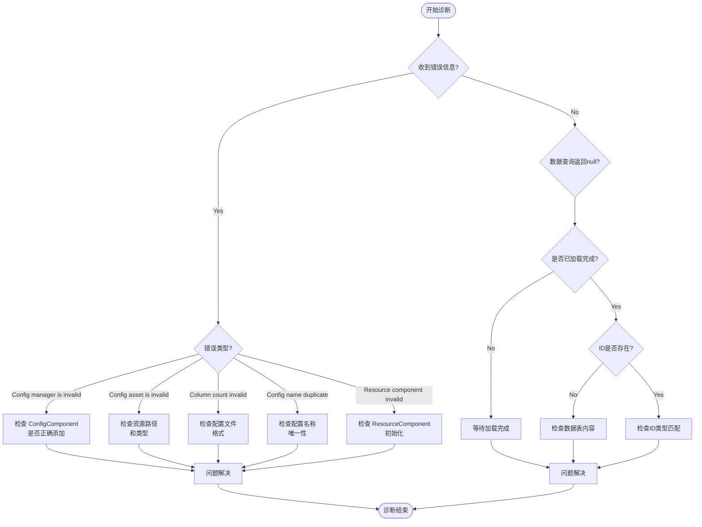

# よくある問題

このドキュメント汇总了使用 Config 設定表コンポーネント时〜の可能性があります遇到的常见問題、エラー情報及其解決策。

## 概要

Config 設定表コンポーネント为 Unity 游戏提供します一套完全な的設定数据管理解決策。在实际使用过程中，開発者〜の可能性があります会遇到設定ロード失敗、数据解析エラー、コンポーネント未正确初期化等問題。このドキュメント旨在帮助開発者快速定位和解决这些問題。

## よくある問題列表

### 1. Config Manager 未初期化

**エラー情報：**
```
Config manager is invalid.
```

**原因分析：**
此エラー表示 `ConfigComponent` 在初期化时无法从 GameFrameworkEntry 取得到 `IConfigManager` モジュール。这通常发生在フレームワーク初期化顺序不正确的情况下。

**解決策：**

1. 確認してください在シーン中正确追加了 `ConfigComponent` コンポーネント：
```csharp
// 在 Unity 场景中添加 ConfigComponent
// GameObject -> Add Component -> GameFrameX -> Config
```

2. 確認してください GameFramework コアコンポーネント已正确初期化。確認シーン中是否存在 `GameEntry` 对象：
> 详情请リファレンス [コアコンセプト - ConfigComponent](./4-core-concepts.config-component)

---

### 2. 設定リソースタイプ无效

**エラー情報：**
```
Config asset 'xxx' is invalid.
```

**原因分析：**
此警告表示系统无法将ロード的资产识别为有效的設定リソース。〜の可能性があります原因含みます：
- リソースパス不正确
- リソースタイプ不是 `TextAsset` 或 `.bytes` ファイル
- リソースファイル损坏

**解決策：**

1. 確認設定ファイル的路径是否正确
2. 確認してください設定ファイル是纯文本ファイル（`.txt`）或二进制ファイル（`.bytes`）
3. 検証リソース已正确打パッケージ到最终的游戏ビルド中

---

### 3. 設定列数不匹配

**エラー情報：**
```
Can not parse config line string 'xxx' which column count is invalid.
```

**原因分析：**
在解析文本フォーマット的設定ファイル时，解析器期望每行有 4 列数据（使用 Tab 分隔）。もし列数不符合预期，解析将失敗。

設定ファイルフォーマット要求：
```
#ID    名称    注释    值
1      config1 示例     value1
2      config2 示例     value2
```

**解決策：**

1. 確認設定ファイル的列数是否正确（应为 4 列）
2. 確認してください使用 Tab 字符作为列分隔符
3. 確認是否有空行或フォーマット不正确的行

> 详情请リファレンス [設定オプション - 二进制設定表](./6-configuration.binary-config)

---

### 4. 設定名称重复或无效

**エラー情報：**
```
Can not add config with config name 'xxx' which may be invalid or duplicate.
```

**原因分析：**
此警告表示尝试追加的設定名称无效或已存在。每个設定名称〜しなければなりません是唯一的。

**解決策：**

1. 確認是否存在重复的設定名称
2. 確認してください設定名称不为空字符串
3. 使用唯一标识符作为設定名称

---

### 5. Resource Component 未找到

**エラー情報：**
```
Resource component is invalid.
```

**原因分析：**
`DefaultConfigHelper` 依赖 `ResourceComponent` 来ロード設定リソース。もし `ResourceComponent` 未正确初期化，設定将无法ロード。

**解決策：**

1. 確認してくださいシーン中存在 `ResourceComponent` コンポーネント
2. 確認リソースシステム的初期化顺序
3. 確認してくださいリソースパッケージ已正确ロード

---

### 6. 二进制設定表不生效

**問題説明：**
启用 `ENABLE_BINARY_CONFIG` 宏定義后，二进制設定表機能未生效。

**解決策：**

1. 在 Unity メニュー中启用二进制設定：
   - 打开メニュー：`GameFrameX -> Scripting Define Symbols -> Enable Binary Config(开启二进制配置表)`

2. 確認してください設定ファイル拡張名为 `.bytes`

> 详情请リファレンス [設定オプション - 脚本宏定義](./6-configuration.scripting-define-symbols)

---

### 7. 数据表ロード失敗

**問題説明：**
呼び出し `IDataTable.LoadAsync()` メソッド后，数据未正确ロード。

**排查ステップ：**

1. 確認非同期ロード是否完成：
```csharp
// 正确等待加载完成
IDataTable<MyConfig> configTable = component.GetConfig<MyConfigTable>();
await configTable.LoadAsync();

// 检查是否加载成功
if (component.HasConfig<MyConfigTable>()) {
    // 配置已加载
}
```

2. 確認イベント是否捕获到エラー：
> 详情请リファレンス [API リファレンス - イベントパラメータ](./5-api-reference.event-args)

---

### 8. 数据查询返す null

**問題説明：**
使用 `TryGet` メソッド查询設定数据时，返す `false` 或 `null`。

**〜の可能性があります原因：**

1. 数据表尚未ロード完成
2. 查询的 ID 不存在
3. 数据表タイプ不匹配

**解決策：**

1. 確認してください在数据ロード完成后再进行查询
2. 使用 `HasConfig<T>()` メソッド先確認設定是否存在
3. 検証查询的 ID タイプ（int/long/string）与数据表定義一致

```csharp
// 正确的数据查询流程
var configTable = component.GetConfig<MyConfigTable>();
if (component.HasConfig<MyConfigTable>()) {
    if (configTable.TryGet(1, out var config)) {
        // 成功获取配置
    }
}
```

---

## 診断フロー



## デバッグ技巧

### 1. 启用ログデバッグ

Config コンポーネント会输出詳細的ログ情報。在开发フェーズ，確認してくださいログ级别設定为 `Debug` 或 `Info`：

```csharp
// 在游戏启动时设置日志级别
Log.SetLogHelper(new DebugLogHelper());
```

### 2. 使用イベント监听

监听設定ロードイベント〜に役立ちます快速定位問題：

```csharp
// 监听配置加载成功事件
GameEntry.Event.Subscribe(LoadConfigSuccessEventArgs.EventId, OnLoadConfigSuccess);

// 监听配置加载失败事件
GameEntry.Event.Subscribe(LoadConfigFailureEventArgs.EventId, OnLoadConfigFailure);

private void OnLoadConfigSuccess(object sender, LoadConfigSuccessEventArgs e)
{
    UnityEngine.Debug.Log($"配置加载成功: {e.ConfigAssetName}, 耗时: {e.Duration}秒");
}

private void OnLoadConfigFailure(object sender, LoadConfigFailureEventArgs e)
{
    UnityEngine.Debug.LogError($"配置加载失败: {e.ConfigAssetName}, 错误: {e.ErrorMessage}");
}
```

### 3. 確認設定数量

在デバッグ时，〜できます確認当前ロード的設定数量：

```csharp
var configComponent = GameEntry.GetComponent<ConfigComponent>();
UnityEngine.Debug.Log($"当前配置数量: {configComponent.Count}");
```

---

## ベストプラクティス

1. **始终使用 TryGet メソッド**：避免使用已标记为 `[Obsolete]` 的 `Get` メソッド
2. **確認設定存在性**：在使用設定前先呼び出し `HasConfig<T>()` メソッド
3. **非同期ロード**：設定ロード是异步的，確認してください在ロード完成后再使用数据
4. **エラー処理**：購読ロード失敗イベント，以便及时发现和処理エラー

---

## 関連リンク

- [コアコンセプト - ConfigComponent](./4-core-concepts.config-component)
- [コアコンセプト - ConfigManager](./4-core-concepts.config-manager)
- [コアコンセプト - IDataTable](./4-core-concepts.idata-table)
- [API リファレンス - インターフェース定義](./5-api-reference.interfaces)
- [API リファレンス - イベントパラメータ](./5-api-reference.event-args)
- [設定オプション - 二进制設定表](./6-configuration.binary-config)
- [設定オプション - 脚本宏定義](./6-configuration.scripting-define-symbols)
