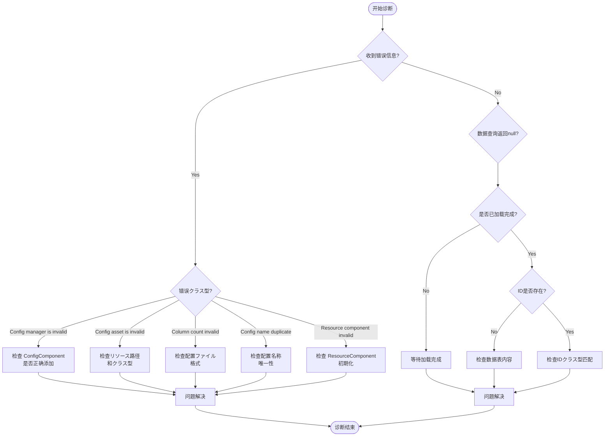

# 常见问题

本文档汇总了使用 Config 配置表コンポーネント时可能遇到的常见问题、错误信息及其解決策。

## 概要

Config 配置表コンポーネント为 Unity ゲーム提供します一套完整的配置数据管理解決策。在实际使用过程中，開発者可能会遇到配置加载失败、数据解析错误、コンポーネント未正确初期化等问题。本文档旨在帮助開発者快速定位和解决这些问题。

## よくある質問列表

### 1. Config Manager 未初期化

**错误信息：**
```
Config manager is invalid.
```

**原因分析：**
此错误表示 `ConfigComponent` 在初期化时无法从 GameFrameworkEntry 取得到 `IConfigManager` 模块。这通常发生在フレームワーク初期化顺序不正确的情况下。

**解決策：**

1. 确保在シーン中正确添加了 `ConfigComponent` コンポーネント：
```csharp
// 在 Unity シーン中添加 ConfigComponent
// GameObject -> Add Component -> GameFrameX -> Config
```

2. 确保 GameFramework コアコンポーネント已正确初期化。检查シーン中是否存在 `GameEntry` 对象：
> 详情お願いします参考 [コア概念 - ConfigComponent](./4-core-concepts.config-component)

---

### 2. 配置リソースクラス型无效

**错误信息：**
```
Config asset 'xxx' is invalid.
```

**原因分析：**
此警告表示系统无法将加载的资产识别为有效的配置リソース。可能原因包括：
- リソース路径不正确
- リソースクラス型不是 `TextAsset` 或 `.bytes` ファイル
- リソースファイル损坏

**解決策：**

1. 检查配置ファイル的路径是否正确
2. 确保配置ファイル是纯文本ファイル（`.txt`）或二进制ファイル（`.bytes`）
3. 验证リソース已正确打包到最终的ゲーム构建中

---

### 3. 配置列数不匹配

**错误信息：**
```
Can not parse config line string 'xxx' which column count is invalid.
```

**原因分析：**
在解析文本格式的配置ファイル时，解析器期望每行有 4 列数据（使用 Tab 分隔）。如果列数不符合预期，解析将失败。

配置ファイル格式要求：
```
#ID    名称    注释    值
1      config1 示例     value1
2      config2 示例     value2
```

**解決策：**

1. 检查配置ファイル的列数是否正确（应为 4 列）
2. 确保使用 Tab 字符作为列分隔符
3. 检查是否有空行或格式不正确的行

> 详情お願いします参考 [配置选项 - 二进制配置表](./6-configuration.binary-config)

---

### 4. 配置名称重复或无效

**错误信息：**
```
Can not add config with config name 'xxx' which may be invalid or duplicate.
```

**原因分析：**
此警告表示尝试添加的配置名称无效或已存在。每个配置名称必須是唯一的。

**解決策：**

1. 检查是否存在重复的配置名称
2. 确保配置名称不为空字符串
3. 使用唯一标识符作为配置名称

---

### 5. Resource Component 未找到

**错误信息：**
```
Resource component is invalid.
```

**原因分析：**
`DefaultConfigHelper` 依赖 `ResourceComponent` 来加载配置リソース。如果 `ResourceComponent` 未正确初期化，配置将无法加载。

**解決策：**

1. 确保シーン中存在 `ResourceComponent` コンポーネント
2. 检查リソース系统的初期化顺序
3. 确保リソース包已正确加载

---

### 6. 二进制配置表不生效

**问题説明：**
启用 `ENABLE_BINARY_CONFIG` 宏定义后，二进制配置表機能未生效。

**解決策：**

1. 在 Unity 菜单中启用二进制配置：
   - メニューを開く：`GameFrameX -> Scripting Define Symbols -> Enable Binary Config(开启二进制配置表)`

2. 确保配置ファイル扩展名为 `.bytes`

> 详情お願いします参考 [配置选项 - 脚本宏定义](./6-configuration.scripting-define-symbols)

---

### 7. 数据表加载失败

**问题説明：**
呼び出し `IDataTable.LoadAsync()` メソッド后，数据未正确加载。

**排查手順：**

1. 检查异步加载是否完成：
```csharp
// 正确等待加载完成
IDataTable<MyConfig> configTable = component.GetConfig<MyConfigTable>();
await configTable.LoadAsync();

// 检查是否加载成功
if (component.HasConfig<MyConfigTable>()) {
    // 配置已加载
}
```

2. 检查イベント是否捕获到错误：
> 详情お願いします参考 [API 参考 - イベント参数](./5-api-reference.event-args)

---

### 8. 数据查询返回 null

**问题説明：**
使用 `TryGet` メソッド查询配置数据时，返回 `false` 或 `null`。

**可能原因：**

1. 数据表尚未加载完成
2. 查询的 ID 不存在
3. 数据表クラス型不匹配

**解決策：**

1. 确保在数据加载完成后再进行查询
2. 使用 `HasConfig<T>()` メソッド先检查配置是否存在
3. 验证查询的 ID クラス型（int/long/string）与数据表定义一致

```csharp
// 正确的数据查询フロー
var configTable = component.GetConfig<MyConfigTable>();
if (component.HasConfig<MyConfigTable>()) {
    if (configTable.TryGet(1, out var config)) {
        // 成功取得配置
    }
}
```

---

## 诊断フロー



## 调试技巧

### 1. 启用日志调试

Config コンポーネント会输出详细的日志信息。在开发阶段，确保日志级别設定为 `Debug` 或 `Info`：

```csharp
// 在ゲーム启动时設定日志级别
Log.SetLogHelper(new DebugLogHelper());
```

### 2. 使用イベント监听

监听配置加载イベント可能帮助快速定位问题：

```csharp
// 监听配置加载成功イベント
GameEntry.Event.Subscribe(LoadConfigSuccessEventArgs.EventId, OnLoadConfigSuccess);

// 监听配置加载失败イベント
GameEntry.Event.Subscribe(LoadConfigFailureEventArgs.EventId, OnLoadConfigFailure);

private void OnLoadConfigSuccess(object sender, LoadConfigSuccessEventArgs e)
{
    UnityEngine.Debug.Log($"配置加载成功: {e.ConfigAssetName}, 耗时: {e.Duration}秒");
}

private void OnLoadConfigFailure(object sender, LoadConfigFailureEventArgs e)
{
    UnityEngine.Debug.LogError($"配置加载失败: {e.ConfigAssetName}, 错误: {e.ErrorMessage}");
}
```

### 3. 检查配置数量

在调试时，可能检查当前加载的配置数量：

```csharp
var configComponent = GameEntry.GetComponent<ConfigComponent>();
UnityEngine.Debug.Log($"当前配置数量: {configComponent.Count}");
```

---

## 最佳实践

1. **始终使用 TryGet メソッド**：避免使用已标记为 `[Obsolete]` 的 `Get` メソッド
2. **检查配置存在性**：在使用配置前先呼び出し `HasConfig<T>()` メソッド
3. **异步加载**：配置加载是异步的，确保在加载完成后再使用数据
4. **错误处理**：订阅加载失败イベント，以便及时发现和处理错误

---

## 関連リンク

- [コア概念 - ConfigComponent](./4-core-concepts.config-component)
- [コア概念 - ConfigManager](./4-core-concepts.config-manager)
- [コア概念 - IDataTable](./4-core-concepts.idata-table)
- [API 参考 - インターフェース定义](./5-api-reference.interfaces)
- [API 参考 - イベント参数](./5-api-reference.event-args)
- [配置选项 - 二进制配置表](./6-configuration.binary-config)
- [配置选项 - 脚本宏定义](./6-configuration.scripting-define-symbols)
