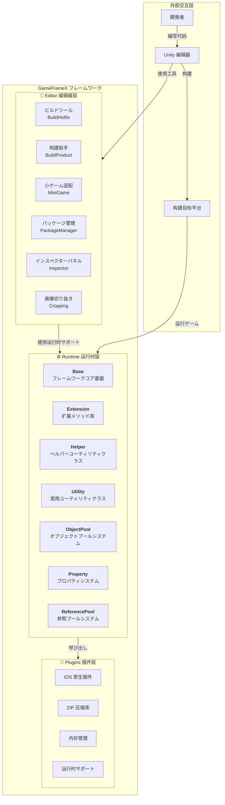
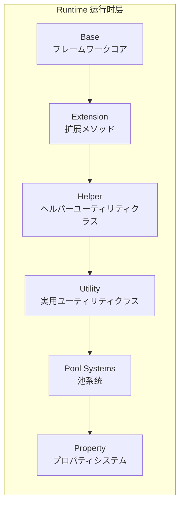

# 概要

GameFrameX は专インディゲーム開発者向け设计的近代化 Unity ゲームフレームワーク，提供完全なフロントエンドとバックエンド一体型解決策。フレームワーク采用**三層モジュラーアーキテクチャ**设计，内置丰富的ゲーム开发工具和コンポーネント，帮助開発者快速构建高质量的ゲームプロジェクト。

> Source: [README.zh-CN.md](https://github.com/GameFrameX/com.gameframex.unity/blob/main/README.zh-CN.md#L1-L60)

---

## プロジェクト简介

GameFrameX 旨在インディゲーム開発者向け提供一个機能强大、易于使用、高度可扩展的ゲーム开发フレームワーク。フレームワーク经过精心设计，能够满足从小型个人プロジェクト到中型商业ゲーム的各种需求。

### コア機能

| 特性 | 説明 |
|------|------|
| **三層アーキテクチャ** | Runtime（运行时）、Plugins（插件）、Editor（编辑器）明確なレイヤー分離 |
| **丰富工具集** | 内置多种开发辅助工具和エディター拡張 |
| **オブジェクトプール管理** | 高效的内存管理和オブジェクト再利用機構 |
| **扩展メソッド库** | 丰富的 Unity 引擎扩展メソッド |
| **実用ユーティリティクラス** | 涵盖加密、压缩、网络等常用機能 |
| **多平台サポート** | サポート PC、移动端、WebGL 等マルチプラットフォームデプロイ |
| **ホットアップデートサポート** | 内置 HybridCLR ホットアップデート解決策 |
| **小ゲーム适配** | ワンスイッチ切り替えマルチプラットフォームミニゲーム環境 |

### システム要件

| 要求 | 规格 |
|------|------|
| **Unity 版本** | 2019.4 或更高版本 |
| **平台サポート** | Windows, macOS, Linux, iOS, Android, WebGL |
| **.NET 版本** | .NET Standard 2.0+ |

---

## アーキテクチャ概要

GameFrameX 采用清晰的三层アーキテクチャ設計，每个模块それぞれの責務を果たす，協調動作。这种分层设计确保了コードの高い凝集度と低い結合度，メンテナンスと拡張が容易。



### アーキテクチャ設計理念

1. **モジュラー設計**：每个模块独立して特定の機能を担当，便于単独でテストとメンテナンスが可能
2. **インターフェース分离**：インターフェースで疎結合を実現，モジュール間は抽象を通じて通信
3. **按需加载**：コンポーネントは必要な時に初期化，不必要なパフォーマンスオーバーヘッドを回避
4. **可扩展性**：豊富な拡張ポイントを提供，開発者カスタム機能を 쉽게追加可能

---

## コアモジュールの詳細

### Runtime 运行时层

ランタイムコアコード，提供ゲームランタイムに必要な全機能。



| 子模块 | 説明 | 主要機能 |
|--------|------|----------|
| **Base** | フレームワークコア基盤 | コンポーネント管理、イベントプール、ログシステム、参照プール、タスクプール、変数システム、ライフサイクル管理、シングルトンパターン |
| **Extension** | 扩展メソッド库 | 汎用拡張（文字列、コレクション、日付）、Unityタイプ拡張（Transform、Vector）、シリアル読み取り、GameObject拡張 |
| **Helper** | ヘルパーユーティリティクラス | アプリケーション、カメラ、ファイル、パス、数学、乱数、タイマー、ネットワーク、JSON、レンダリング、位置などの全方位的ヘルパー機能 |
| **ObjectPool** | オブジェクトプールシステム | オブジェクト再利用、メモリ最適化、パフォーマンス向上 |
| **Property** | プロパティシステム | 可绑定プロパティ、数据监听、MVVM サポート |
| **ReferencePool** | 参照プールシステム | 引用クラス型对象管理、GC 优化 |
| **Utility** | 実用ユーティリティクラス | 暗号化（AES/RSA/DSA）、圧縮解凍、ハッシュ計算（MD5/SHA1/HMAC）、CRCチェックサム、JSONシリアライズ、ファイル操作、ID生成、タイプ変換、テキスト処理、ログなど |

### Plugins 插件层

ネイティブプラットフォームプラグインとサードパーティ依存ライブラリ。

| 子模块 | 説明 | 依赖库 |
|--------|------|--------|
| **iOS 插件** | iOS 原生平台機能 | GameFrameX.mm |
| **压缩库** | ZIP ファイル压缩/解压 | SharpZipLib |
| **内存管理** | 効率的なメモリ操作 | StringTools, Memory, Buffers |
| **运行时サポート** | .NET 运行时扩展 | CompilerServices.Unsafe |

### Editor 编辑器层

エディターツールと拡張，開発効率の向上。

| 子模块 | 説明 | 主要機能 |
|--------|------|----------|
| **BuildHotfix** | ホットアップデート构建 | HybridCLR ホットアップデートアセンブリビルド与管理 |
| **BuildProduct** | 产品构建 | ビルドフロー自動化、前後処理フック |
| **BuildWebGLTools** | WebGL 构建 | WebGL 平台专用ビルドツール |
| **Cropping** | 画像切り抜き | 可視化画像切り抜きツール |
| **Inspector** | 自定义インスペクターパネル | オブジェクトプール、参照プールの可視化監視 |
| **InspectorLockShortcut** | 面板锁定 | 快捷键锁定 Inspector 面板 |
| **MiniGame** | 小ゲーム适配 | ワンスイッチで21のミニゲームプラットフォームに切り替え |
| **PackageManager** | パッケージ管理 | 可視化パッケージ管理界面 |
| **UpdatePackages** | 包更新 | 一括プロジェクト依存関係更新 |
| **Welcome** | 欢迎界面 | 新規ユーザーガイドとクイックエントリーポイント |

---

## プラットフォーム対応

### 操作系统平台

| 平台 | ステータス | サポートバージョン |
|------|------|----------|
| Windows | ✅ サポート済み | Unity 2019.4+ |
| macOS | ✅ サポート済み | Unity 2019.4+ |
| Linux | ✅ サポート済み | Unity 2019.4+ |
| iOS | ✅ サポート済み | Unity 2019.4+ |
| Android | ✅ サポート済み | Unity 2019.4+ |
| WebGL | ✅ サポート済み | Unity 2019.4+ |

### 小ゲーム平台适配

GameFrameX 提供ワンスイッチ切り替え的小ゲーム平台适配機能，サポート**全球21个主流小ゲーム平台**：

#### 🇨🇳 国内小ゲーム（9个）

微信、支付宝、抖音、快手、百度、京东、淘宝、美团、Bilibili

#### 🌍 国际小ゲーム（7个）

Discord、YouTube、Facebook、Google Play、TikTok、CrazyGames、Poki

#### 📱 设备厂商（4个）

华为、OPPO、vivo、小米

#### 🎮 ゲーム平台（1个）

TapTap

---

## コアコンセプト

### ゲームエントリーポイント

GameFrameX 使用 `GameEntry` 作为ゲームエントリーポイント点，を通じて `GameFrameworkEntry` 管理所有フレームワーク模块。

```csharp
using GameFrameX.Runtime;

// 取得オブジェクトプールコンポーネント
var objectPool = GameEntry.GetComponent<ObjectPoolComponent>();

// 取得参照プールコンポーネント
var referencePool = GameEntry.GetComponent<ReferencePoolComponent>();

// 使用扩展メソッド
transform.SetPositionX(10f);
gameObject.SetActiveOptimized(true);
```
> Source: [README.zh-CN.md](https://github.com/GameFrameX/com.gameframex.unity/blob/main/README.zh-CN.md#L366-L386)

### コンポーネント系统

GameFrameX 采用コンポーネント化设计，所有機能都を通じてコンポーネント（Component）提供。コンポーネントを継承 `GameFrameworkComponent` 基クラス，可能を通じて `GameEntry.GetComponent<T>()` メソッド取得。

```csharp
public sealed class ObjectPoolComponent : GameFrameworkComponent
{
    // オブジェクトプール管理実装
}
```
> Source: [Runtime/ObjectPool/ObjectPoolComponent.cs](https://github.com/GameFrameX/com.gameframex.unity/blob/main/Runtime/ObjectPool/ObjectPoolComponent.cs#L45-L46)

### 模块系统

フレームワーク模块（Module）を通じてインターフェース提供更高层次的抽象，サポート按需作成和懒加载。

```csharp
public static T GetModule<T>() where T : class
{
    // 自动作成模块（如果不存在）
    return GetModule(moduleType) as T;
}
```
> Source: [Runtime/Base/GameFrameworkEntry.cs](https://github.com/GameFrameX/com.gameframex.unity/blob/main/Runtime/Base/GameFrameworkEntry.cs#L95-L120)

---

## バージョン情報

| プロジェクト | 信息 |
|------|------|
| **包名** | com.gameframex.unity |
| **版本** | 1.10.0 |
| **Unity 版本** | 2019.4+ |
| **许可证** | MIT + Apache 2.0 |
| **作者** | Blank |

---

## 関連リンク

- [📖 完整文档](https://gameframex.doc.alianblank.com)
- [🔧 安装指南](./2-installation)
- [🚀 快速入门](./3-quick-start)
- [💡 コア概念](./4-core-concepts)
- [📦 运行时模块](./5-runtime.base)
- [🛠️ 编辑器工具](./6-editor-tools.build-tools)
- [🌐 平台サポート](./7-platforms)
- [📚 API 参考](./8-api-reference)
- [❓ 常见问题](./9-troubleshooting)

---

## コミュニティとサポート

- 💬 **QQ 讨论群**: 467608841
- 🐛 **问题反馈**: [GitHub Issues](https://github.com/GameFrameX/com.gameframex.unity/issues)
- 💡 **機能建议**: [GitHub Discussions](https://github.com/GameFrameX/com.gameframex.unity/discussions)

---

如果这个プロジェクト对你有帮助，お願いします给我们一个 ⭐ Star！

