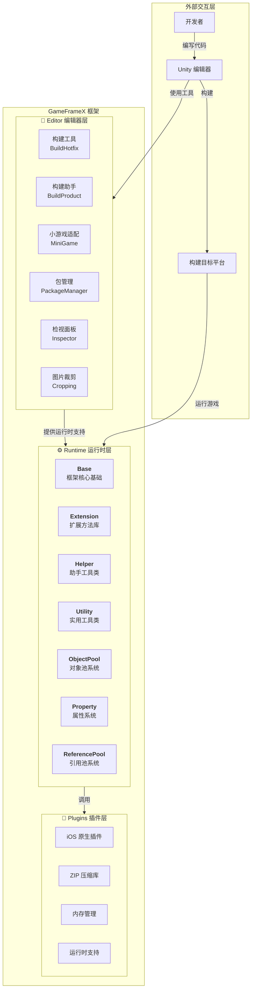
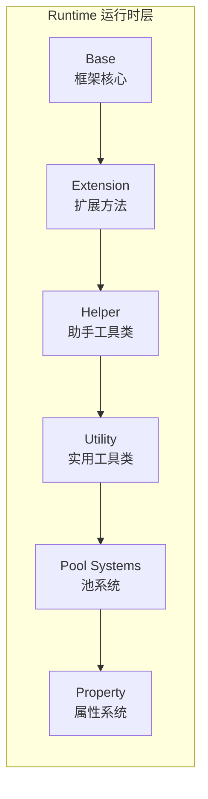

# 概要

GameFrameX は专为独立游戏開発者設計的现代化 Unity 游戏フレームワーク，提供完全な的前后端一体化解決策。フレームワーク采用**三层モジュール化アーキテクチャ**設計，内置丰富的游戏开发工具和コンポーネント，帮助開発者快速ビルド高质量的游戏プロジェクト。

> Source: [README.zh-CN.md](https://github.com/GameFrameX/com.gameframex.unity/blob/main/README.zh-CN.md#L1-L60)

---

## プロジェクト紹介

GameFrameX 旨在为独立游戏開発者提供一个機能強力、易于使用、高度可拡張的游戏开发フレームワーク。フレームワーク经过精心設計，能够满足从小型个人プロジェクト到中型商业游戏的各种需求。

### コア特性

| 特性 | 説明 |
|------|------|
| **三层アーキテクチャ** | Runtime（ランタイム）、Plugins（プラグイン）、Editor（エディタ）清晰分层 |
| **丰富工具集** | 内置多种开发辅助工具和エディタ拡張 |
| **对象池管理** | 効率的的内存管理和对象复用机制 |
| **拡張メソッド库** | 丰富的 Unity 引擎拡張メソッド |
| **实用工具类** | 涵盖加密、压缩、网络等常用機能 |
| **多プラットフォームサポート** | サポート PC、移动端、WebGL 等多プラットフォームデプロイ |
| **ホットアップデートサポート** | 内置 HybridCLR ホットアップデート解決策 |
| **ミニゲーム适配** | 一键切换多プラットフォームミニゲーム環境 |

### 系统要求

| 要求 | 规格 |
|------|------|
| **Unity バージョン** | 2019.4 或更高バージョン |
| **プラットフォームサポート** | Windows, macOS, Linux, iOS, Android, WebGL |
| **.NET バージョン** | .NET Standard 2.0+ |

---

## アーキテクチャ概览

GameFrameX 采用清晰的三层アーキテクチャ設計，每个モジュール各司其职，协同工作。这种分层設計確認してください了コード的高内聚低耦合，便于维护和拡張。



### アーキテクチャ設計理念

1. **モジュール化設計**：每个モジュール独立负责特定機能，便于单独テスト和维护
2. **インターフェース分离**：通过インターフェース実装解耦，モジュール之间通过抽象进行通信
3. **按需ロード**：コンポーネント按需初期化，避免不必要的性能开销
4. **可拡張性**：提供丰富的拡張点，開発者〜できます轻松追加自定義機能

---

## コアモジュール详解

### Runtime ランタイム层

ランタイムコアコード，提供游戏ランタイム所需的所有機能。



| 子モジュール | 説明 | 主な機能 |
|--------|------|----------|
| **Base** | フレームワークコア基本 | コンポーネント管理、イベント池、ログ系统、参照池、任务池、变量系统、ライフサイクル管理、单例モード |
| **Extension** | 拡張メソッド库 | 汎用拡張（字符串、集合、日期）、Unityタイプ拡張（Transform、Vector）、序列读取器、GameObject拡張 |
| **Helper** | 助手工具类 | 应用、相机、ファイル、路径、数学、随机、计时器、网络、JSON、渲染、位置等全方位辅助機能 |
| **ObjectPool** | 对象池系统 | 对象复用、内存最適化、性能提升 |
| **Property** | プロパティ系统 | 可绑定プロパティ、数据监听、MVVM サポート |
| **ReferencePool** | 参照池系统 | 参照タイプ对象管理、GC 最適化 |
| **Utility** | 实用工具类 | 加密解密（AES/RSA/DSA）、压缩解压、哈希计算（MD5/SHA1/HMAC）、CRC校验、JSONシリアライズ、ファイル操作、ID生成、タイプ转换、文本処理、ログ等 |

### Plugins プラグイン层

原生プラットフォームプラグイン和第3方依赖库。

| 子モジュール | 説明 | 依赖库 |
|--------|------|--------|
| **iOS プラグイン** | iOS 原生プラットフォーム機能 | GameFrameX.mm |
| **压缩库** | ZIP ファイル压缩/解压 | SharpZipLib |
| **内存管理** | 効率的内存操作 | StringTools, Memory, Buffers |
| **ランタイムサポート** | .NET ランタイム拡張 | CompilerServices.Unsafe |

### Editor エディタ层

エディタ工具和拡張，提升开发效率。

| 子モジュール | 説明 | 主な機能 |
|--------|------|----------|
| **BuildHotfix** | ホットアップデートビルド | HybridCLR ホットアップデートアセンブリビルド和管理 |
| **BuildProduct** | 产品ビルド | ビルドフロー自动化、前后置処理钩子 |
| **BuildWebGLTools** | WebGL ビルド | WebGL プラットフォーム专用ビルド工具 |
| **Cropping** | 图片裁剪 | 可视化图片裁剪工具 |
| **Inspector** | 自定義检视パネル | 对象池、参照池可视化监控 |
| **InspectorLockShortcut** | パネル锁定 | 快捷键锁定 Inspector パネル |
| **MiniGame** | ミニゲーム适配 | 一键切换21个ミニゲームプラットフォーム |
| **PackageManager** | パッケージ管理 | 可视化パッケージ管理界面 |
| **UpdatePackages** | パッケージアップデート | 批量アップデートプロジェクト依赖 |
| **Welcome** | 欢迎界面 | 新ユーザー引导和快速入口 |

---

## プラットフォームサポート

### 操作系统プラットフォーム

| プラットフォーム | ステータス | サポートバージョン |
|------|------|----------|
| Windows | ✅ 已サポート | Unity 2019.4+ |
| macOS | ✅ 已サポート | Unity 2019.4+ |
| Linux | ✅ 已サポート | Unity 2019.4+ |
| iOS | ✅ 已サポート | Unity 2019.4+ |
| Android | ✅ 已サポート | Unity 2019.4+ |
| WebGL | ✅ 已サポート | Unity 2019.4+ |

### ミニゲームプラットフォーム适配

GameFrameX 提供一键切换的ミニゲームプラットフォーム适配機能，サポート**全球21个主流ミニゲームプラットフォーム**：

#### 🇨🇳 国内ミニゲーム（9个）

微信、支付宝、抖音、快手、百度、京东、淘宝、美团、Bilibili

#### 🌍 国际ミニゲーム（7个）

Discord、YouTube、Facebook、Google Play、TikTok、CrazyGames、Poki

#### 📱 设备厂商（4个）

华为、OPPO、vivo、小米

#### 🎮 游戏プラットフォーム（1个）

TapTap

---

## コアコンセプト

### 游戏入口

GameFrameX 使用 `GameEntry` 作为游戏入口点，通过 `GameFrameworkEntry` 管理所有フレームワークモジュール。

```csharp
using GameFrameX.Runtime;

// 获取对象池组件
var objectPool = GameEntry.GetComponent<ObjectPoolComponent>();

// 获取引用池组件
var referencePool = GameEntry.GetComponent<ReferencePoolComponent>();

// 使用扩展方法
transform.SetPositionX(10f);
gameObject.SetActiveOptimized(true);
```
> Source: [README.zh-CN.md](https://github.com/GameFrameX/com.gameframex.unity/blob/main/README.zh-CN.md#L366-L386)

### コンポーネント系统

GameFrameX 采用コンポーネント化設計，所有機能都通过コンポーネント（Component）提供。コンポーネント継承自 `GameFrameworkComponent` 基底クラス，〜できます通过 `GameEntry.GetComponent<T>()` メソッド取得。

```csharp
public sealed class ObjectPoolComponent : GameFrameworkComponent
{
    // 对象池管理实现
}
```
> Source: [Runtime/ObjectPool/ObjectPoolComponent.cs](https://github.com/GameFrameX/com.gameframex.unity/blob/main/Runtime/ObjectPool/ObjectPoolComponent.cs#L45-L46)

### モジュール系统

フレームワークモジュール（Module）通过インターフェース提供更高层次的抽象，サポート按需作成和懒ロード。

```csharp
public static T GetModule<T>() where T : class
{
    // 自动创建模块（如果不存在）
    return GetModule(moduleType) as T;
}
```
> Source: [Runtime/Base/GameFrameworkEntry.cs](https://github.com/GameFrameX/com.gameframex.unity/blob/main/Runtime/Base/GameFrameworkEntry.cs#L95-L120)

---

## バージョン情報

| プロジェクト | 情報 |
|------|------|
| **パッケージ名** | com.gameframex.unity |
| **バージョン** | 1.10.0 |
| **Unity バージョン** | 2019.4+ |
| **许可证** | MIT + Apache 2.0 |
| **作者** | Blank |

---

## 関連リンク

- [📖 完全なドキュメント](https://gameframex.doc.alianblank.com)
- [🔧 インストールガイド](./2-installation)
- [🚀 快速入门](./3-quick-start)
- [💡 コアコンセプト](./4-core-concepts)
- [📦 ランタイムモジュール](./5-runtime.base)
- [🛠️ エディタ工具](./6-editor-tools.build-tools)
- [🌐 プラットフォームサポート](./7-platforms)
- [📚 API リファレンス](./8-api-reference)
- [❓ 常见問題](./9-troubleshooting)

---

## 社区与サポート

- 💬 **QQ 讨论群**: 467608841
- 🐛 **問題反馈**: [GitHub Issues](https://github.com/GameFrameX/com.gameframex.unity/issues)
- 💡 **機能お勧め**: [GitHub Discussions](https://github.com/GameFrameX/com.gameframex.unity/discussions)

---

もし这个プロジェクト对你有帮助，请给我们一个 ⭐ Star！

