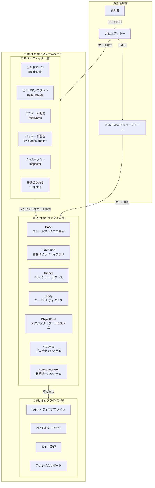
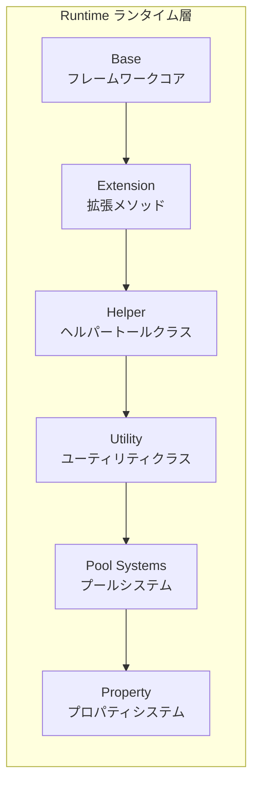

# 概要

GameFrameX はインディーズゲーム開発者向けに設計された最新のUnityゲームフレームワークで、完全なフロントエンドとバックエンドの統合ソリューションを提供します。フレームワークは**三層モジュラーアーキテクチャ**を採用し、丰富的ゲーム開発ツールとコンポーネントを備え、開発者が高品質なゲームプロジェクトを迅速に構築できるよう支援します。

> Source: [README.zh-CN.md](https://github.com/GameFrameX/com.gameframex.unity/blob/main/README.zh-CN.md#L1-L60)

---

## プロジェクト紹介

GameFrameXは、インディーズゲーム開発者に対して、強力で使いやすく、高度に拡張可能なゲーム開発フレームワークを提供することを目的としています。フレームワークは丁寧に設計されており、小規模な個人プロジェクトから中規模な商業ゲームまで、さまざまなニーズを満たすことができます。

### コア機能

| 機能 | 説明 |
|------|------|
| **三層アーキテクチャ** | Runtime（ランタイム）、Plugins（プラグイン）、Editor（エディター）が明確に分離 |
| **丰富ツールセット** | 多種多样的開発支援ツールとエディター拡張を実装 |
| **オブジェクトプール管理** | 効率的なメモリ管理とオブジェクト再利用メカニズム |
| **拡張メソッドライブラリ** | 丰富的Unityエンジン拡張メソッド |
| **ユーティリティクラス** | 暗号化、圧縮、ネットワークなどの常用機能をカバー |
| **マルチプラットフォームサポート** | PC、モバイル、WebGLなど複数のプラットフォームへのデプロイに対応 |
| **ホットリロードサポート** | HybridCLRホットリロードソリューションを実装 |
| **ミニゲーム対応** | ワンボタンで複数プラットフォームのミニゲーム環境に切り替え |

### システム要件

| 要件 | 仕様 |
|------|------|
| **Unityバージョン** | 2019.4以降 |
| **プラットフォームサポート** | Windows, macOS, Linux, iOS, Android, WebGL |
| **.NETバージョン** | .NET Standard 2.0+ |

---

## アーキテクチャ概要

GameFrameXは明確な三層アーキテクチャ設計を採用し、各モジュールがそれぞれの役割を担い、協調して動作します。この階層化設計により、コードの凝集度が高く結合度低い設計を実現し、保守性と拡張性が向上します。



### アーキテクチャ設計理念

1. **モジュラー設計**: 各モジュールが独立して特定の機能を担当し、単独でのテストと保守が容易
2. **インターフェース分離**: インターフェースを通じて疎結合を実現し、モジュール間の通信は抽象化を通じて行われる
3. **オンデマンドロード**: コンポーネントはオンデマンドで初期化され、不要なパフォーマンスオーバーヘッドを回避
4. **拡張性**: 丰富的な拡張ポイントを提供し、開発者がカスタム機能を簡単に追加可能

---

## コアモジュール詳細

### Runtime ランタイム層

ランタイムコアコード、ゲームランタイム所需的すべての機能を提供します。



| サブモジュール | 説明 | 主要機能 |
|--------|------|----------|
| **Base** | フレームワークコア基盤 | コンポーネント管理、イベントプール、ログシステム、参照プール、タスクプール、変数システム、ライフサイクル管理、シングルトンパターン |
| **Extension** | 拡張メソッドライブラリ | 共通拡張（文字列、コレクション、日時）、Unity型拡張（Transform、Vector）、シリアライザーリーダー、GameObject拡張 |
| **Helper** | ヘルパートールクラス | アプリケーション、カメラ、ファイル、パス、数学、ランダム、タイマー、ネットワーク、JSON、レンダリング、位置などの全方位的補助機能 |
| **ObjectPool** | オブジェクトプールシステム | オブジェクト再利用、メモリ最適化、パフォーマンス向上 |
| **Property** | プロパティシステム | バインディング可能プロパティ、データ監視、MVVMサポート |
| **ReferencePool** | 参照プールシステム | 参照型オブジェクト管理、GC最適化 |
| **Utility** | ユーティリティクラス | 暗号化・復号化（AES/RSA/DSA）、圧縮解凍、ハッシュ計算（MD5/SHA1/HMAC）、CRCチェックサム、JSONシリアライズ、ファイル操作、ID生成、型変換、テキスト処理、ログなど |

### Plugins プラグイン層

ネイティブプラットフォームプラグインとサードパーティー依存ライブラリ。

| サブモジュール | 説明 | 依存ライブラリ |
|--------|------|----------|
| **iOSプラグイン** | iOSネイティブプラットフォーム機能 | GameFrameX.mm |
| **圧縮ライブラリ** | ZIPファイル圧縮/解凍 | SharpZipLib |
| **メモリ管理** | 高効率メモリオペレーション | StringTools, Memory, Buffers |
| **ランタイムサポート** | .NETランタイム拡張 | CompilerServices.Unsafe |

### Editor エディター層

エディターツールと拡張、開発効率を向上させます。

| サブモジュール | 説明 | 主要機能 |
|--------|------|----------|
| **BuildHotfix** | ホットリロードビルド | HybridCLRホットリロードアセンブリのビルド与管理 |
| **BuildProduct** | 製品ビルド | ビルドプロセス自動化、前後処理フック |
| **BuildWebGLTools** | WebGLビルド | WebGLプラットフォーム専用ビルドツール |
| **Cropping** | 画像切り抜き | 可視化画像切り抜きツール |
| **Inspector** | カスタムインスペクターパネル | オブジェクトプール、参照プール可視化監視 |
| **InspectorLockShortcut** | パネルロック | ショートカットキーでInspectorパネルをロック |
| **MiniGame** | ミニゲーム対応 | ワンボタンで21個のミニゲームプラットフォームに切り替え |
| **PackageManager** | パッケージ管理 | 可視化パッケージ管理インターフェース |
| **UpdatePackages** | パッケージ更新 | プロジェクト依存関係の批量更新 |
| **Welcome** | ウェルカム画面 | 新規ユーザーガイドとクイックエントリーポイント |

---

## プラットフォームサポート

### オペレーティングシステムプラットフォーム

| プラットフォーム | ステータス | 対応バージョン |
|------|------|----------|
| Windows | ✅ 対応済み | Unity 2019.4+ |
| macOS | ✅ 対応済み | Unity 2019.4+ |
| Linux | ✅ 対応済み | Unity 2019.4+ |
| iOS | ✅ 対応済み | Unity 2019.4+ |
| Android | ✅ 対応済み | Unity 2019.4+ |
| WebGL | ✅ 対応済み | Unity 2019.4+ |

### ミニゲームプラットフォーム対応

GameFrameXはワンボタン切り替えのミニゲームプラットフォーム対応機能を提供し、**グローバル21の主流ミニゲームプラットフォーム**をサポート：

#### 中国ミニゲーム（9個）

微信、支付宝、抖音、快手，百度、京東、淘宝、美団、bilibili

#### 国際ミニゲーム（7個）

Discord、YouTube、Facebook、Google Play、TikTok、CrazyGames、Poki

#### デバイスメーカー（4個）

Huawei、OPPO、vivo、Xiaomi

#### ゲームプラットフォーム（1個）

TapTap

---

## コアコンセプト

### ゲームエントリーポイント

GameFrameXは`GameEntry`をゲームエントリーポイントとして使用し、`GameFrameworkEntry`で全てのフレームワークモジュールを管理します。

```csharp
using GameFrameX.Runtime;

// オブジェクトプールコンポーネントを取得
var objectPool = GameEntry.GetComponent<ObjectPoolComponent>();

// 参照プールコンポーネントを取得
var referencePool = GameEntry.GetComponent<ReferencePoolComponent>();

// 拡張メソッドを使用
transform.SetPositionX(10f);
gameObject.SetActiveOptimized(true);
```
> Source: [README.zh-CN.md](https://github.com/GameFrameX/com.gameframex.unity/blob/main/README.zh-CN.md#L366-L386)

### コンポーネントシステム

GameFrameXはコンポーネントベース設計を採用しており、すべての機能はコンポーネント（Component）を通じて提供されます。コンポーネントは`GameFrameworkComponent`基本クラスを継承し、`GameEntry.GetComponent<T>()`メソッドで取得できます。

```csharp
public sealed class ObjectPoolComponent : GameFrameworkComponent
{
    // オブジェクトプール管理実装
}
```
> Source: [Runtime/ObjectPool/ObjectPoolComponent.cs](https://github.com/GameFrameX/com.gameframex.unity/blob/main/Runtime/ObjectPool/ObjectPoolComponent.cs#L45-L46)

### モジュールシステム

フレームワークモジュール（Module）はインターフェースを通じてより高次の抽象化を提供し、オンデマンド作成と遅延ロードをサポート。

```csharp
public static T GetModule<T>() where T : class
{
    // 存在しない場合は自動的にモジュールを作成
    return GetModule(moduleType) as T;
}
```
> Source: [Runtime/Base/GameFrameworkEntry.cs](https://github.com/GameFrameX/com.gameframex.unity/blob/main/Runtime/Base/GameFrameworkEntry.cs#L95-L120)

---

## バージョン情報

| プロジェクト | 情報 |
|------|------|
| **パッケージ名** | com.gameframex.unity |
| **バージョン** | 1.10.0 |
| **Unityバージョン** | 2019.4+ |
| **ライセンス** | MIT + Apache 2.0 |
| **作者** | Blank |

---

## 関連リンク

- [📖 完全ドキュメント](https://gameframex.doc.alianblank.com)
- [🔧 インストールガイド](./2-installation)
- [🚀 クイックスタート](./3-quick-start)
- [💡 コアコンセプト](./4-core-concepts)
- [📦 ランタイムモジュール](./5-runtime.base)
- [🛠️ エディターツール](./6-editor-tools.build-tools)
- [🌐 プラットフォームサポート](./7-platforms)
- [📚 APIリファレンス](./8-api-reference)
- [❓ よくある質問](./9-troubleshooting)

---

## コミュニティとサポート

- 💬 **QQ Discussion Group**: 467608841
- 🐛 **問題報告**: [GitHub Issues](https://github.com/GameFrameX/com.gameframex.unity/issues)
- 💡 **機能提案**: [GitHub Discussions](https://github.com/GameFrameX/com.gameframex.unity/discussions)

---

このプロジェクトが役に立った場合は、⭐ Starを付けてください！
