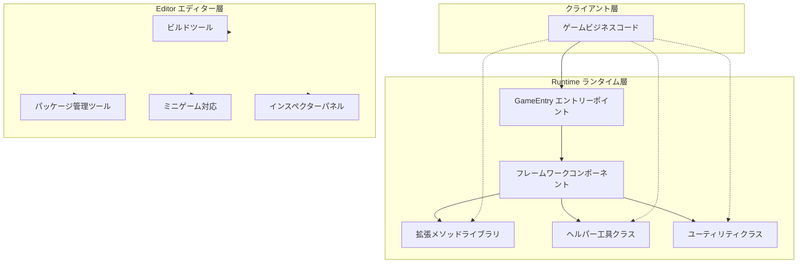
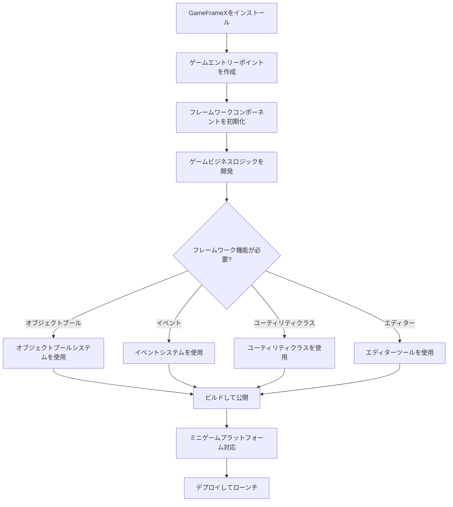
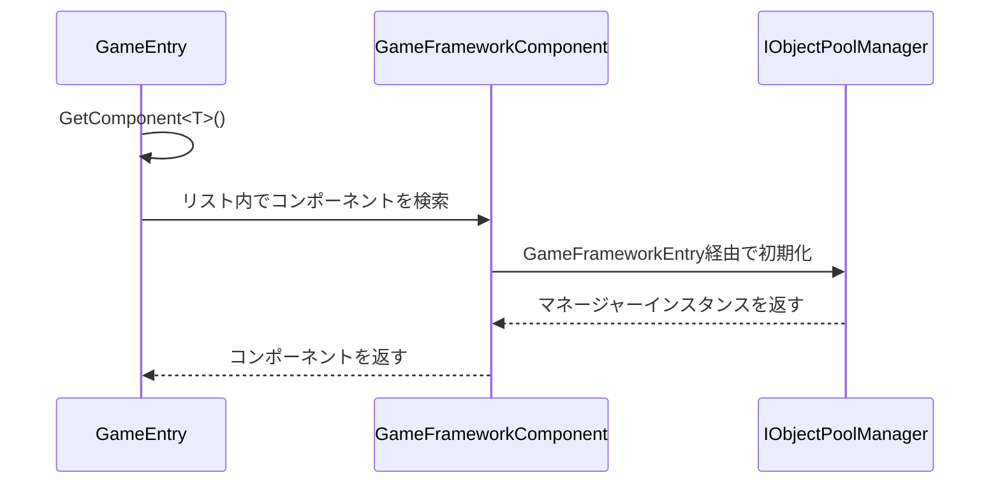

# クイックスタート

GameFrameXはインディーズゲーム開発者向けに設計された最新のUnityゲームフレームワークで、三層モジュラーアーキテクチャを採用し、完全なフロントエンドとバックエンドの統合ソリューションを提供し、開発者が高品質なゲームプロジェクトを迅速に構築できるよう支援します。

## 概要

GameFrameXフレームワークは丰富的なランタイムコンポーネントとエディターツールを提供します：

- **オブジェクトプールシステム**：効率的なメモリ管理とオブジェクト再利用メカニズム
- **イベントシステム**：パブリッシュ・サブスクライブパターンに基づく疎結合通信
- **参照プールシステム**：参照型オブジェクトのメモリ最適化
- **拡張メソッドライブラリ**：丰富的Unityエンジン拡張メソッド
- **ユーティリティクラス**：暗号化、圧縮、ネットワーク、JSONなどの常用機能
- **エディターツール**：ビルドツール、パッケージ管理、ミニゲームプラットフォーム対応など

### システム要件

| 要件 | 仕様 |
|------|------|
| Unityバージョン | 2019.4以降 |
| .NETバージョン | .NET Standard 2.0+ |
| 対応プラットフォーム | Windows, macOS, Linux, iOS, Android, WebGL |

## アーキテクチャ概要



## インストールガイド

### 方法一：Unity Package Manager（推奨）

1. Unityエディターを開く
2. `Window` → `Package Manager`を開く
3. 左上の`+`ボタンをクリック
4. `Add package from git URL`を選択
5. 入力：`https://github.com/GameFrameX/com.gameframex.unity.git`

### 方法二：手動ダウンロード

1. 最新の[Release](https://github.com/GameFrameX/com.gameframex.unity/releases)をダウンロード
2. プロジェクトの`Packages`ディレクトリに解凍

## 基本使用方法

### ゲームエントリーポイント

GameFrameXは`GameEntry`を静的エントリーポイントとして使用し、すべてのフレームワークコンポーネントにアクセスできます：

```csharp
using GameFrameX.Runtime;

public class GameManager : MonoBehaviour
{
    void Start()
    {
        // オブジェクトプールコンポーネントを取得
        var objectPool = GameEntry.GetComponent<ObjectPoolComponent>();

        // 参照プールコンポーネントを取得
        var referencePool = GameEntry.GetComponent<ReferencePoolComponent>();

        // 拡張メソッドを使用
        transform.SetPositionX(10f);
        gameObject.SetActiveOptimized(true);
    }
}
```

> Source: [Runtime/Base/GameEntry.cs](https://github.com/GameFrameX/com.gameframex.unity/blob/main/Runtime/Base/GameEntry.cs#L46-L70)

### フレームワークコンポーネント

GameFrameXは複数のフレームワークコンポーネントを提供し、すべて`GameEntry.GetComponent<T>()`で取得できます：

```csharp
// オブジェクトプールコンポーネント - 再利用可能なオブジェクトを効率的に管理
var objectPool = GameEntry.GetComponent<ObjectPoolComponent>();

// 参照プールコンポーネント - 参照型のメモリ管理を最適化
var referencePool = GameEntry.GetComponent<ReferencePoolComponent>();
```

> Source: [Runtime/ObjectPool/ObjectPoolComponent.cs](https://github.com/GameFrameX/com.gameframex.unity/blob/main/Runtime/ObjectPool/ObjectPoolComponent.cs#L45-L72)

## コア機能例

### オブジェクトプールシステム

オブジェクトプールシステムはゲームパフォーマンスを最適化するために頻繁にオブジェクトの作成と破棄を避けるために使用されます：

```csharp
// オブジェクトプールコンポーネントを取得
var objectPool = GameEntry.GetComponent<ObjectPoolComponent>();

// オブジェクトプールを作成（シングルスポーン方式）
objectPool.CreateSingleSpawnObjectPool<MyObject>("MyObjectPool", 10, 60f);

// プールからオブジェクトを取得
var obj = objectPool.Spawn<MyObject>("MyObjectPool");

// オブジェクトをプールに返す
objectPool.Unspawn(obj);

// オブジェクトプールを作成（マルチスポーン方式）
objectPool.CreateMultiSpawnObjectPool<MyObject>("MyObjectMultiPool", 100, 60f);

// オブジェクトプールを破棄
objectPool.DestroyPool("MyObjectPool");
```

### 拡張メソッド

GameFrameXは一般的な操作を簡素化する丰富的拡張メソッドを提供します：

#### Transform拡張

```csharp
// 位置成分を設定
transform.SetPositionX(10f);
transform.SetPositionY(20f);
transform.SetPositionZ(30f);

// ローカルスケール成分を設定
transform.SetLocalScaleX(2f);
transform.SetLocalScaleY(2f);
transform.SetLocalScaleZ(2f);

// ローカルスケールXYZを設定
transform.SetLocalScaleXYZ(2f, 2f, 2f);

// トランスフォームをリセット
transform.ResetTransformation();
```

> Source: [Runtime/Extension/UnityEngine.Transform/UnityEngine.TransformExtension.cs](https://github.com/GameFrameX/com.gameframex.unity/blob/main/Runtime/Extension/UnityEngine.Transform/UnityEngine.TransformExtension.cs#L55-L60)

#### Vector3拡張

```csharp
Vector3 pos = transform.position;

// 新しいベクトルを作成し、指定した成分を変更
pos = pos.WithX(5f).WithY(10f);

// ベクトル演算拡張
Vector3 direction = Vector3.Right;
direction = direction.RotateBy(45f, Vector3.Up);
```

#### GameObject拡張

```csharp
// 最適化されたアクティブ状態設定
gameObject.SetActiveOptimized(true);

// 再帰的にレイヤーを設定
gameObject.SetLayerRecursively(LayerMask.NameToLayer("UI"));

// コンポーネントを取得または追加
var component = gameObject.GetOrAddComponent<MyComponent>();
```

### ユーティリティクラス

GameFrameXは暗号化、圧縮、ネットワーク、JSONなど、各种常用機能を提供する静的ユーティリティクラスを提供します：

#### ファイル操作

```csharp
// バイト配列を書き込み
Utility.File.WriteAllBytes("path/to/file", data);

// バイト配列を読み込み
byte[] content = Utility.File.ReadAllBytes("path/to/file");

// テキストを書き込み
Utility.File.WriteAllText("path/to/file", "content");

// テキストを読み込み
string text = Utility.File.ReadAllText("path/to/file");
```

#### AES暗号化・復号化

```csharp
// AES暗号化
string encrypted = Utility.Encryption.Aes.Encrypt("plaintext", "key");

// AES復号化
string decrypted = Utility.Encryption.Aes.Decrypt(encrypted, "key");
```

#### ハッシュ計算

```csharp
// MD5ハッシュ
string md5 = Utility.Hash.Md5.ComputeHash("input");

// SHA1ハッシュ
string sha1 = Utility.Hash.Sha1.ComputeHash("input");

// HMAC SHA256
string hmac = Utility.Hash.HMACSha256.ComputeHash("input", "key");
```

#### JSONシリアライズ

```csharp
// オブジェクトをJSONに変換
string json = Utility.Json.ToJson(myObject);

// JSONをオブジェクトに変換
var obj = Utility.Json.FromJson<MyClass>(json);
```

#### 圧縮・解凍

```csharp
// データを圧縮
byte[] compressed = Utility.Compression.Compress(data);

// データを解凍
byte[] decompressed = Utility.Compression.Decompress(compressed);
```

### イベントシステム

イベントシステムはパブリッシュ・サブスクライブパターンを採用し、コンポーネント間の疎結合通信を実現します：

```csharp
// イベント引数を定義
public class PlayerDeadEventArgs : BaseEventArgs
{
    public int PlayerId { get; set; }
    public float Damage { get; set; }

    public static PlayerDeadEventArgs Create(int playerId, float damage)
    {
        var args = ReferencePool.Acquire<PlayerDeadEventArgs>();
        args.PlayerId = playerId;
        args.Damage = damage;
        return args;
    }
}

// イベントをサブスクライブ
GameEntry.Event.Subscribe(PlayerDeadEventArgs.EventId, OnPlayerDead);

// イベントを送信
GameEntry.Event.Fire(this, PlayerDeadEventArgs.Create(playerId, damage));

// サブスクライブを解除
GameEntry.Event.Unsubscribe(PlayerDeadEventArgs.EventId, OnPlayerDead);
```

> Source: [Runtime/Base/EventPool/EventPool.cs](https://github.com/GameFrameX/com.gameframex.unity/blob/main/Runtime/Base/EventPool/EventPool.cs)

## エディターツール

GameFrameXは`GameFrameX`メニュー下に丰富的なエディターツールを提供します：

### ビルドツール

```
GameFrameX/
├── Build/
│   ├── Windows X64
│   ├── Windows X32
│   ├── Mac Os
│   ├── Linux
│   ├── iOS
│   ├── Android
│   └── WebGL
├── Build Hotfix
└── Build WebGL With HybridCLR
```

### パッケージ管理ツール

```
GameFrameX/
├── Package Manager (パッケージマネージャー)
└── Update All Packages (すべてのパケットを更新)
```

### ミニゲームプラットフォーム対応

GameFrameXはワンボタンで**21の主流ミニゲームプラットフォーム**に切り替え可能：

```
GameFrameX/
├── Scripting Define Symbols/
│   ├── Domestic Mini Games/
│   │   ├── Enable WeChat Mini Game
│   │   ├── Enable Alipay Mini Game
│   │   ├── Enable DouYin Mini Game
│   │   ├── Enable KuaiShou Mini Game
│   │   ├── Enable Baidu Mini Game
│   │   ├── Enable JingDong Mini Game
│   │   ├── Enable Meituan Mini Game
│   │   ├── Enable Taobao Mini Game
│   │   └── Enable Bilibili Mini Game
│   ├── International Mini Games/
│   │   ├── Enable Discord Mini Game
│   │   ├── Enable YouTube Mini Game
│   │   ├── Enable Facebook Mini Game
│   │   ├── Enable Google Play Mini Game
│   │   ├── Enable TikTok Mini Game
│   │   ├── Enable CrazyGames Mini Game
│   │   └── Enable Poki Mini Game
│   ├── Device OEMs/
│   │   ├── Enable Huawei Mini Game
│   │   ├── Enable OPPO Mini Game
│   │   ├── Enable Vivo Mini Game
│   │   └── Enable Xiaomi Mini Game
│   └── Game Platforms/
│       └── Enable TapTap Mini Game
```

### ログ制御

```
GameFrameX/
├── Scripting Define Symbols/
│   ├── Disable All Logs
│   ├── Enable All Logs
│   ├── Enable Debug And Above Logs
│   ├── Enable Info And Above Logs
│   ├── Enable Warning And Above Logs
│   ├── Enable Error And Above Logs
│   └── Enable Fatal And Above Logs
```

### ユーティリティツール

```
GameFrameX/
├── Open Folder/
│   ├── Data Path
│   ├── Persistent Data Path
│   ├── Streaming Assets Path
│   ├── Temporary Cache Path
│   └── Console Log Path
├── Cropping (画像切り抜きツール)
└── Welcome (ウェルカムウィンドウ)
```

## ワークフロー

### 典型的なゲーム開発フロー



### コンポーネント初期化フロー



## クイックスタートチェックリスト

- [ ] GameFrameXパッケージをインストール
- [ ] GameEntryエントリーポイントを理解
- [ ] オブジェクトプールシステムの使用方法を学習
- [ ] 拡張メソッドの使用法を習得
- [ ] ユーティリティクラスに精通
- [ ] エディターツールを使用して効率を向上
- [ ] 必要に応じてミニゲームプラットフォームを設定

## 関連リンク

- [コアコンセプト](./4-core-concepts) - フレームワークコア設計を深く理解
- [ランタイムモジュール](./5-runtime.base) - 基本コンポーネントの詳細
- [イベントシステム](./5-runtime.event-system) - イベント駆動プログラミング
- [オブジェクトプールシステム](./5-runtime.object-pool) - パフォーマンス最適化
- [拡張メソッドライブラリ](./5-runtime.extension-methods) - 拡張メソッド完全リファレンス
- [ユーティリティクラス](./5-runtime.utility-classes) - ユーティリティクラスの詳細
- [エディターツール](./6-editor-tools.build-tools) - ビルドツール
- [ミニゲームプラットフォーム対応](./6-editor-tools.mini-game-platform) - 21プラットフォームサポート
- [プラットフォームサポート](./7-platforms) - マルチプラットフォームデプロイガイド
- [インストールガイド](./2-installation) - 詳細なインストール説明
