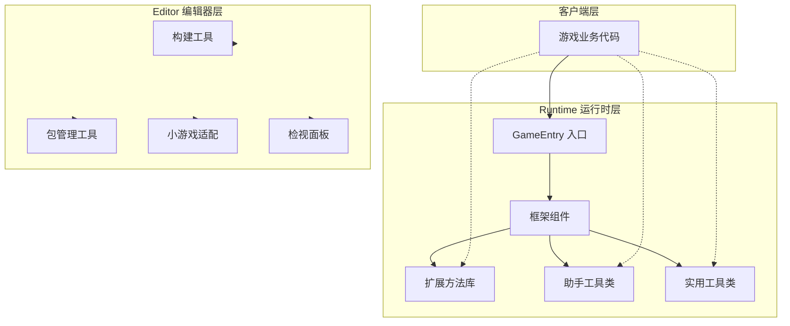
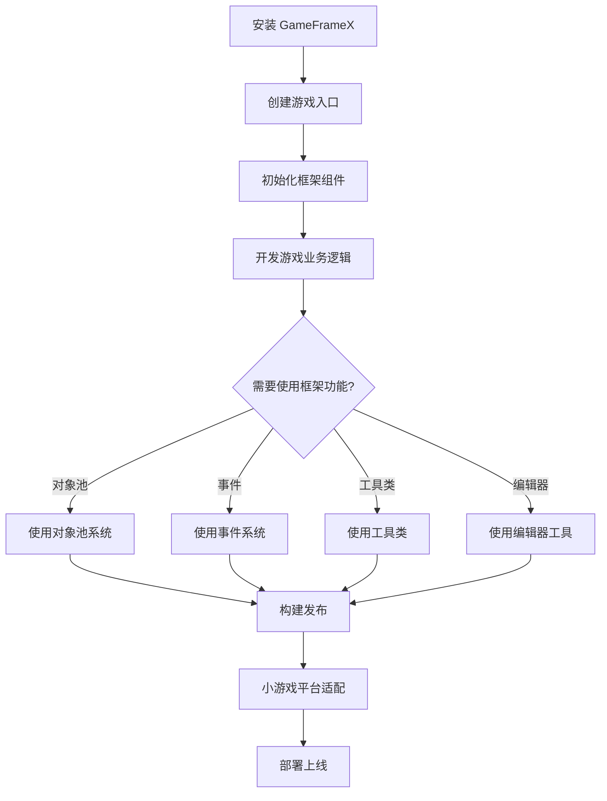
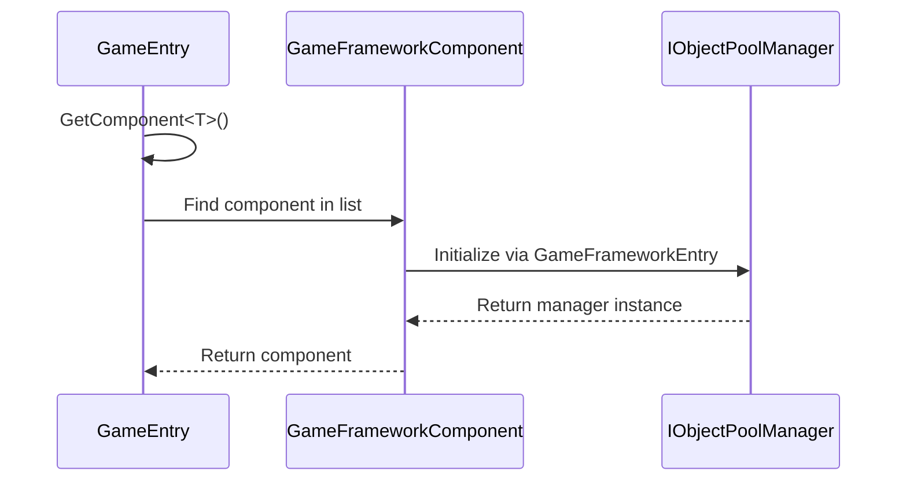

# クイックスタート

GameFrameX は专为独立游戏開発者設計的现代化 Unity 游戏フレームワーク，采用三层モジュール化アーキテクチャ設計，提供完全な的前后端一体化解決策，帮助開発者快速ビルド高质量的游戏プロジェクト。

## 概要

GameFrameX フレームワーク提供します丰富的ランタイムコンポーネント和エディタ工具，含みます：

- **对象池系统**：効率的的内存管理和对象复用机制
- **イベント系统**：基于リリース-購読モード的解耦通信
- **参照池系统**：参照タイプ对象的内存最適化
- **拡張メソッド库**：丰富的 Unity 引擎拡張メソッド
- **实用工具类**：加密、压缩、网络、JSON 等常用機能
- **エディタ工具**：ビルド工具、パッケージ管理、ミニゲームプラットフォーム适配等

### 系统要求

| 要求 | 规格 |
|------|------|
| Unity バージョン | 2019.4 或更高 |
| .NET バージョン | .NET Standard 2.0+ |
| サポートプラットフォーム | Windows, macOS, Linux, iOS, Android, WebGL |

## アーキテクチャ概览



## インストールガイド

### 方法一：Unity Package Manager（推奨）

1. 打开 Unity エディタ
2. 打开 `Window` → `Package Manager`
3. 点击左上角的 `+` ボタン
4. 选择 `Add package from git URL`
5. 输入: `https://github.com/GameFrameX/com.gameframex.unity.git`

### 方法二：手动下载

1. 下载最新的 [Release](https://github.com/GameFrameX/com.gameframex.unity/releases)
2. 解压到プロジェクト的 `Packages` ディレクトリ下

## 基本使用

### 游戏入口

GameFrameX 使用 `GameEntry` 作为静态入口点来访问所有フレームワークコンポーネント：

```csharp
using GameFrameX.Runtime;

public class GameManager : MonoBehaviour
{
    void Start()
    {
        // 获取对象池组件
        var objectPool = GameEntry.GetComponent<ObjectPoolComponent>();
        
        // 获取引用池组件
        var referencePool = GameEntry.GetComponent<ReferencePoolComponent>();
        
        // 使用扩展方法
        transform.SetPositionX(10f);
        gameObject.SetActiveOptimized(true);
    }
}
```

> Source: [Runtime/Base/GameEntry.cs](https://github.com/GameFrameX/com.gameframex.unity/blob/main/Runtime/Base/GameEntry.cs#L46-L70)

### フレームワークコンポーネント

GameFrameX 提供多种フレームワークコンポーネント，均可通过 `GameEntry.GetComponent<T>()` 取得：

```csharp
// 对象池组件 - 高效管理可复用对象
var objectPool = GameEntry.GetComponent<ObjectPoolComponent>();

// 引用池组件 - 优化引用类型内存管理
var referencePool = GameEntry.GetComponent<ReferencePoolComponent>();
```

> Source: [Runtime/ObjectPool/ObjectPoolComponent.cs](https://github.com/GameFrameX/com.gameframex.unity/blob/main/Runtime/ObjectPool/ObjectPoolComponent.cs#L45-L72)

## コア機能例

### 对象池系统

对象池系统用于最適化游戏性能，避免频繁作成和破棄对象：

```csharp
// 获取对象池组件
var objectPool = GameEntry.GetComponent<ObjectPoolComponent>();

// 创建对象池 (单次获取模式)
objectPool.CreateSingleSpawnObjectPool<MyObject>("MyObjectPool", 10, 60f);

// 从池中获取对象
var obj = objectPool.Spawn<MyObject>("MyObjectPool");

// 归还对象到池中
objectPool.Unspawn(obj);

// 创建对象池 (多次获取模式)
objectPool.CreateMultiSpawnObjectPool<MyObject>("MyObjectMultiPool", 100, 60f);

// 销毁对象池
objectPool.DestroyPool("MyObjectPool");
```

### 拡張メソッド

GameFrameX 提供します丰富的拡張メソッド，簡素化常见操作：

#### Transform 拡張

```csharp
// 设置位置分量
transform.SetPositionX(10f);
transform.SetPositionY(20f);
transform.SetPositionZ(30f);

// 设置局部缩放分量
transform.SetLocalScaleX(2f);
transform.SetLocalScaleY(2f);
transform.SetLocalScaleZ(2f);

// 设置局部缩放 XYZ
transform.SetLocalScaleXYZ(2f, 2f, 2f);

// 重置变换
transform.ResetTransformation();
```

> Source: [Runtime/Extension/UnityEngine.Transform/UnityEngine.TransformExtension.cs](https://github.com/GameFrameX/com.gameframex.unity/blob/main/Runtime/Extension/UnityEngine.Transform/UnityEngine.TransformExtension.cs#L55-L60)

#### Vector3 拡張

```csharp
Vector3 pos = transform.position;

// 创建新向量，修改指定分量
pos = pos.WithX(5f).WithY(10f);

// 向量运算扩展
Vector3 direction = Vector3.Right;
direction = direction.RotateBy(45f, Vector3.Up);
```

#### GameObject 拡張

```csharp
// 优化设置激活状态
gameObject.SetActiveOptimized(true);

// 递归设置层级
gameObject.SetLayerRecursively(LayerMask.NameToLayer("UI"));

// 获取或添加组件
var component = gameObject.GetOrAddComponent<MyComponent>();
```

### 实用工具类

GameFrameX 提供静态工具类，涵盖各种常用機能：

#### ファイル操作

```csharp
// 写入字节数组
Utility.File.WriteAllBytes("path/to/file", data);

// 读取字节数组
byte[] content = Utility.File.ReadAllBytes("path/to/file");

// 写入文本
Utility.File.WriteAllText("path/to/file", "content");

// 读取文本
string text = Utility.File.ReadAllText("path/to/file");
```

#### AES 加密解密

```csharp
// AES 加密
string encrypted = Utility.Encryption.Aes.Encrypt("plaintext", "key");

// AES 解密
string decrypted = Utility.Encryption.Aes.Decrypt(encrypted, "key");
```

#### 哈希计算

```csharp
// MD5 哈希
string md5 = Utility.Hash.Md5.ComputeHash("input");

// SHA1 哈希
string sha1 = Utility.Hash.Sha1.ComputeHash("input");

// HMAC SHA256
string hmac = Utility.Hash.HMACSha256.ComputeHash("input", "key");
```

#### JSON シリアライズ

```csharp
// 对象转 JSON
string json = Utility.Json.ToJson(myObject);

// JSON 转对象
var obj = Utility.Json.FromJson<MyClass>(json);
```

#### 压缩解压

```csharp
// 压缩数据
byte[] compressed = Utility.Compression.Compress(data);

// 解压数据
byte[] decompressed = Utility.Compression.Decompress(compressed);
```

### イベント系统

イベント系统采用リリース-購読モード，実装コンポーネント间的解耦通信：

```csharp
// 定义事件参数
public class PlayerDeadEventArgs : BaseEventArgs
{
    public int PlayerId { get; set; }
    public float Damage { get; set; }
    
    public static PlayerDeadEventArgs Create(int playerId, float damage)
    {
        var args = ReferencePool.Acquire<PlayerDeadEventArgs>();
        args.PlayerId = playerId;
        args.Damage = damage;
        return args;
    }
}

// 订阅事件
GameEntry.Event.Subscribe(PlayerDeadEventArgs.EventId, OnPlayerDead);

// 发送事件
GameEntry.Event.Fire(this, PlayerDeadEventArgs.Create(playerId, damage));

// 取消订阅
GameEntry.Event.Unsubscribe(PlayerDeadEventArgs.EventId, OnPlayerDead);
```

> Source: [Runtime/Base/EventPool/EventPool.cs](https://github.com/GameFrameX/com.gameframex.unity/blob/main/Runtime/Base/EventPool/EventPool.cs)

## エディタ工具

GameFrameX 提供丰富的エディタ工具，位于 `GameFrameX` メニュー下：

### ビルド工具

```
GameFrameX/
├── Build/
│   ├── Windows X64
│   ├── Windows X32
│   ├── Mac Os
│   ├── Linux
│   ├── iOS
│   ├── Android
│   └── WebGL
├── Build Hotfix
└── Build WebGL With HybridCLR
```

### パッケージ管理工具

```
GameFrameX/
├── Package Manager (包管理器)
└── Update All Packages (更新所有包)
```

### ミニゲームプラットフォーム适配

GameFrameX サポート一键切换 **21 个主流ミニゲームプラットフォーム**：

```
GameFrameX/
├── Scripting Define Symbols/
│   ├── Domestic Mini Games/
│   │   ├── Enable WeChat Mini Game
│   │   ├── Enable Alipay Mini Game
│   │   ├── Enable DouYin Mini Game
│   │   ├── Enable KuaiShou Mini Game
│   │   ├── Enable Baidu Mini Game
│   │   ├── Enable JingDong Mini Game
│   │   ├── Enable Meituan Mini Game
│   │   ├── Enable Taobao Mini Game
│   │   └── Enable Bilibili Mini Game
│   ├── International Mini Games/
│   │   ├── Enable Discord Mini Game
│   │   ├── Enable YouTube Mini Game
│   │   ├── Enable Facebook Mini Game
│   │   ├── Enable Google Play Mini Game
│   │   ├── Enable TikTok Mini Game
│   │   ├── Enable CrazyGames Mini Game
│   │   └── Enable Poki Mini Game
│   ├── Device OEMs/
│   │   ├── Enable Huawei Mini Game
│   │   ├── Enable OPPO Mini Game
│   │   ├── Enable Vivo Mini Game
│   │   └── Enable Xiaomi Mini Game
│   └── Game Platforms/
│       └── Enable TapTap Mini Game
```

### ログ控制

```
GameFrameX/
├── Scripting Define Symbols/
│   ├── Disable All Logs
│   ├── Enable All Logs
│   ├── Enable Debug And Above Logs
│   ├── Enable Info And Above Logs
│   ├── Enable Warning And Above Logs
│   ├── Enable Error And Above Logs
│   └── Enable Fatal And Above Logs
```

### 实用工具

```
GameFrameX/
├── Open Folder/
│   ├── Data Path
│   ├── Persistent Data Path
│   ├── Streaming Assets Path
│   ├── Temporary Cache Path
│   └── Console Log Path
├── Cropping (图片裁剪工具)
└── Welcome (欢迎窗口)
```

## ワークフロー

### 典型游戏开发フロー



### コンポーネント初期化フロー



## クイックスタート確認清单

- [ ] インストール GameFrameX パッケージ
- [ ] 理解する GameEntry 入口点
- [ ] 学习对象池系统的使用
- [ ] 掌握拡張メソッド的用法
- [ ] 熟悉实用工具类
- [ ] 使用エディタ工具提升效率
- [ ] 根据〜する必要があります設定ミニゲームプラットフォーム

## 関連リンク

- [コアコンセプト](./4-core-concepts) - 深入理解するフレームワークコア設計
- [ランタイムモジュール](./5-runtime.base) - 基本コンポーネント详解
- [イベント系统](./5-runtime.event-system) - イベント驱动编程
- [对象池系统](./5-runtime.object-pool) - 性能最適化
- [拡張メソッド库](./5-runtime.extension-methods) - 拡張メソッド完全なリファレンス
- [实用工具类](./5-runtime.utility-classes) - 工具类详解
- [エディタ工具](./6-editor-tools.build-tools) - ビルド工具
- [ミニゲームプラットフォーム适配](./6-editor-tools.mini-game-platform) - 21プラットフォームサポート
- [プラットフォームサポート](./7-platforms) - 多プラットフォームデプロイガイド
- [インストールガイド](./2-installation) - 詳細インストール説明
