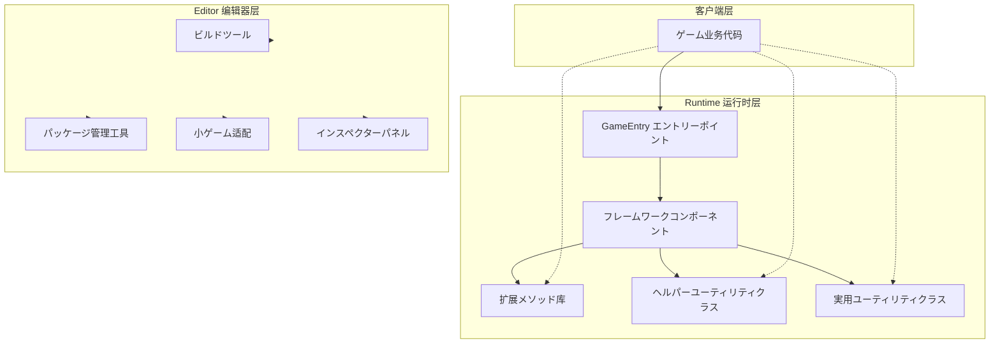
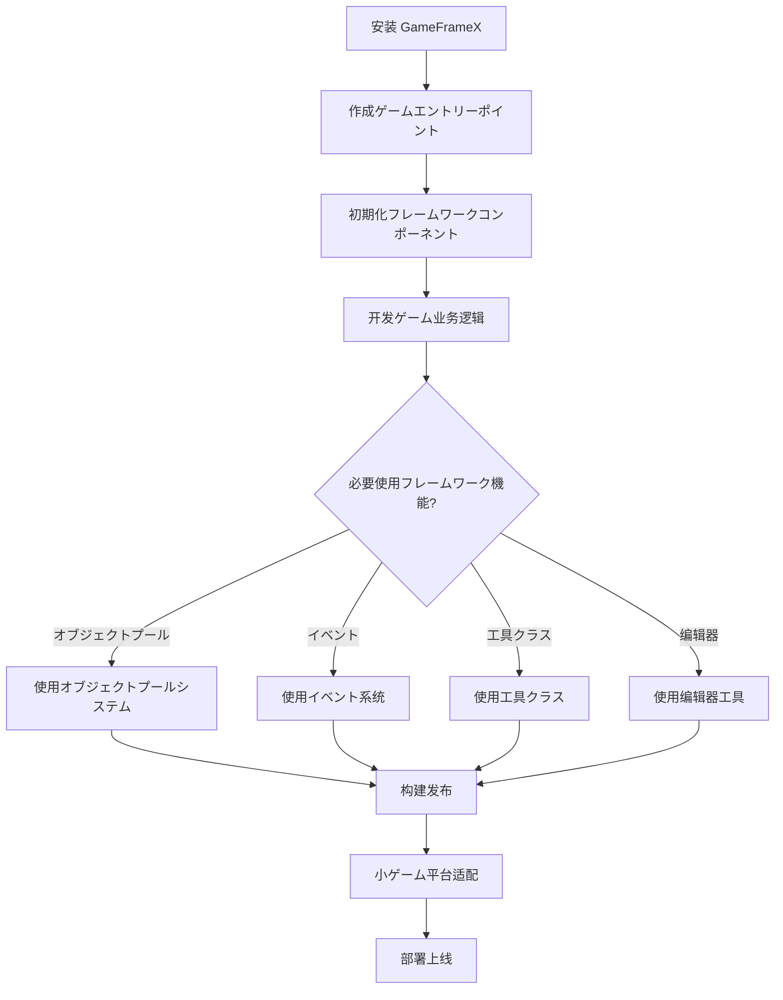
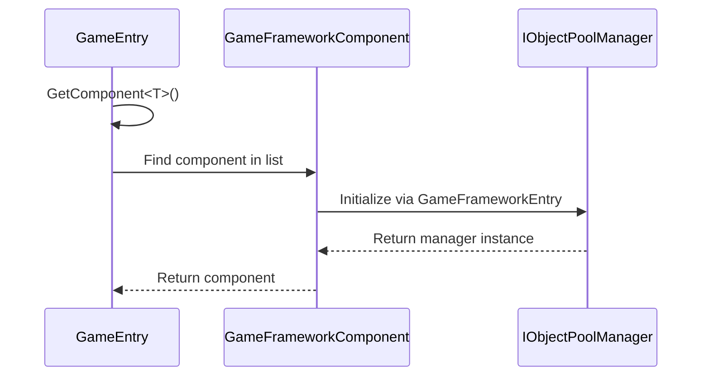

# 快速入门

GameFrameX は专インディゲーム開発者向け设计的近代化 Unity ゲームフレームワーク，采用三層モジュラーアーキテクチャ设计，提供完全なフロントエンドとバックエンド一体型解決策，帮助開発者快速构建高质量的ゲームプロジェクト。

## 概要

GameFrameX フレームワーク提供します丰富的运行时コンポーネント和编辑器工具，包括：

- **オブジェクトプールシステム**：高效的内存管理和オブジェクト再利用機構
- **イベント系统**：基づく发布-订阅模式的解耦通信
- **参照プールシステム**：引用クラス型对象的内存优化
- **扩展メソッド库**：丰富的 Unity 引擎扩展メソッド
- **実用ユーティリティクラス**：加密、压缩、网络、JSON 等常用機能
- **编辑器工具**：ビルドツール、パッケージ管理、小ゲーム平台适配等

### システム要件

| 要求 | 规格 |
|------|------|
| Unity 版本 | 2019.4 或更高 |
| .NET 版本 | .NET Standard 2.0+ |
| サポート平台 | Windows, macOS, Linux, iOS, Android, WebGL |

## アーキテクチャ概要



## 安装指南

### メソッド一：Unity Package Manager（推荐）

1. 打开 Unity 编辑器
2. 打开 `Window` → `Package Manager`
3. 点击左上角的 `+` 按钮
4. 选择 `Add package from git URL`
5. 输入: `https://github.com/GameFrameX/com.gameframex.unity.git`

### メソッド二：手动ダウンロード

1. ダウンロード最新的 [Release](https://github.com/GameFrameX/com.gameframex.unity/releases)
2. 解压到プロジェクト的 `Packages` ディレクトリ下

## 基础使用

### ゲームエントリーポイント

GameFrameX 使用 `GameEntry` 作为静态エントリーポイント点来访问所有フレームワークコンポーネント：

```csharp
using GameFrameX.Runtime;

public class GameManager : MonoBehaviour
{
    void Start()
    {
        // 取得オブジェクトプールコンポーネント
        var objectPool = GameEntry.GetComponent<ObjectPoolComponent>();
        
        // 取得参照プールコンポーネント
        var referencePool = GameEntry.GetComponent<ReferencePoolComponent>();
        
        // 使用扩展メソッド
        transform.SetPositionX(10f);
        gameObject.SetActiveOptimized(true);
    }
}
```

> Source: [Runtime/Base/GameEntry.cs](https://github.com/GameFrameX/com.gameframex.unity/blob/main/Runtime/Base/GameEntry.cs#L46-L70)

### フレームワークコンポーネント

GameFrameX 提供多种フレームワークコンポーネント，均可を通じて `GameEntry.GetComponent<T>()` 取得：

```csharp
// オブジェクトプールコンポーネント - 高效管理可复用对象
var objectPool = GameEntry.GetComponent<ObjectPoolComponent>();

// 参照プールコンポーネント - 优化引用クラス型内存管理
var referencePool = GameEntry.GetComponent<ReferencePoolComponent>();
```

> Source: [Runtime/ObjectPool/ObjectPoolComponent.cs](https://github.com/GameFrameX/com.gameframex.unity/blob/main/Runtime/ObjectPool/ObjectPoolComponent.cs#L45-L72)

## コア機能示例

### オブジェクトプールシステム

オブジェクトプールシステムに使用优化ゲーム性能，避免频繁作成和销毁对象：

```csharp
// 取得オブジェクトプールコンポーネント
var objectPool = GameEntry.GetComponent<ObjectPoolComponent>();

// 作成オブジェクトプール (单次取得模式)
objectPool.CreateSingleSpawnObjectPool<MyObject>("MyObjectPool", 10, 60f);

// 从池中取得对象
var obj = objectPool.Spawn<MyObject>("MyObjectPool");

// 归还对象到池中
objectPool.Unspawn(obj);

// 作成オブジェクトプール (多次取得模式)
objectPool.CreateMultiSpawnObjectPool<MyObject>("MyObjectMultiPool", 100, 60f);

// 销毁オブジェクトプール
objectPool.DestroyPool("MyObjectPool");
```

### 扩展メソッド

GameFrameX 提供します豊富な拡張メソッド，简化常见操作：

#### Transform 扩展

```csharp
// 設定位置分量
transform.SetPositionX(10f);
transform.SetPositionY(20f);
transform.SetPositionZ(30f);

// 設定局部缩放分量
transform.SetLocalScaleX(2f);
transform.SetLocalScaleY(2f);
transform.SetLocalScaleZ(2f);

// 設定局部缩放 XYZ
transform.SetLocalScaleXYZ(2f, 2f, 2f);

// 重置变换
transform.ResetTransformation();
```

> Source: [Runtime/Extension/UnityEngine.Transform/UnityEngine.TransformExtension.cs](https://github.com/GameFrameX/com.gameframex.unity/blob/main/Runtime/Extension/UnityEngine.Transform/UnityEngine.TransformExtension.cs#L55-L60)

#### Vector3 扩展

```csharp
Vector3 pos = transform.position;

// 作成新向量，修改指定分量
pos = pos.WithX(5f).WithY(10f);

// 向量运算扩展
Vector3 direction = Vector3.Right;
direction = direction.RotateBy(45f, Vector3.Up);
```

#### GameObject 扩展

```csharp
// 优化設定激活ステータス
gameObject.SetActiveOptimized(true);

// 递归設定层级
gameObject.SetLayerRecursively(LayerMask.NameToLayer("UI"));

// 取得或添加コンポーネント
var component = gameObject.GetOrAddComponent<MyComponent>();
```

### 実用ユーティリティクラス

GameFrameX 提供静态工具クラス，涵盖各种常用機能：

#### ファイル操作

```csharp
// 写入字节数组
Utility.File.WriteAllBytes("path/to/file", data);

// 读取字节数组
byte[] content = Utility.File.ReadAllBytes("path/to/file");

// 写入文本
Utility.File.WriteAllText("path/to/file", "content");

// 读取文本
string text = Utility.File.ReadAllText("path/to/file");
```

#### AES 加密解密

```csharp
// AES 加密
string encrypted = Utility.Encryption.Aes.Encrypt("plaintext", "key");

// AES 解密
string decrypted = Utility.Encryption.Aes.Decrypt(encrypted, "key");
```

#### 哈希计算

```csharp
// MD5 哈希
string md5 = Utility.Hash.Md5.ComputeHash("input");

// SHA1 哈希
string sha1 = Utility.Hash.Sha1.ComputeHash("input");

// HMAC SHA256
string hmac = Utility.Hash.HMACSha256.ComputeHash("input", "key");
```

#### JSON 序列化

```csharp
// 对象转 JSON
string json = Utility.Json.ToJson(myObject);

// JSON 转对象
var obj = Utility.Json.FromJson<MyClass>(json);
```

#### 压缩解压

```csharp
// 压缩数据
byte[] compressed = Utility.Compression.Compress(data);

// 解压数据
byte[] decompressed = Utility.Compression.Decompress(compressed);
```

### イベント系统

イベント系统采用发布-订阅模式，実装コンポーネント间的解耦通信：

```csharp
// 定义イベント参数
public class PlayerDeadEventArgs : BaseEventArgs
{
    public int PlayerId { get; set; }
    public float Damage { get; set; }
    
    public static PlayerDeadEventArgs Create(int playerId, float damage)
    {
        var args = ReferencePool.Acquire<PlayerDeadEventArgs>();
        args.PlayerId = playerId;
        args.Damage = damage;
        return args;
    }
}

// 订阅イベント
GameEntry.Event.Subscribe(PlayerDeadEventArgs.EventId, OnPlayerDead);

// 发送イベント
GameEntry.Event.Fire(this, PlayerDeadEventArgs.Create(playerId, damage));

// 取消订阅
GameEntry.Event.Unsubscribe(PlayerDeadEventArgs.EventId, OnPlayerDead);
```

> Source: [Runtime/Base/EventPool/EventPool.cs](https://github.com/GameFrameX/com.gameframex.unity/blob/main/Runtime/Base/EventPool/EventPool.cs)

## 编辑器工具

GameFrameX 提供丰富的编辑器工具，位于 `GameFrameX` 菜单下：

### ビルドツール

```
GameFrameX/
├── Build/
│   ├── Windows X64
│   ├── Windows X32
│   ├── Mac Os
│   ├── Linux
│   ├── iOS
│   ├── Android
│   └── WebGL
├── Build Hotfix
└── Build WebGL With HybridCLR
```

### パッケージ管理工具

```
GameFrameX/
├── Package Manager (パッケージ管理器)
└── Update All Packages (更新所有包)
```

### 小ゲーム平台适配

GameFrameX サポートワンスイッチ切り替え **21 个主流小ゲーム平台**：

```
GameFrameX/
├── Scripting Define Symbols/
│   ├── Domestic Mini Games/
│   │   ├── Enable WeChat Mini Game
│   │   ├── Enable Alipay Mini Game
│   │   ├── Enable DouYin Mini Game
│   │   ├── Enable KuaiShou Mini Game
│   │   ├── Enable Baidu Mini Game
│   │   ├── Enable JingDong Mini Game
│   │   ├── Enable Meituan Mini Game
│   │   ├── Enable Taobao Mini Game
│   │   └── Enable Bilibili Mini Game
│   ├── International Mini Games/
│   │   ├── Enable Discord Mini Game
│   │   ├── Enable YouTube Mini Game
│   │   ├── Enable Facebook Mini Game
│   │   ├── Enable Google Play Mini Game
│   │   ├── Enable TikTok Mini Game
│   │   ├── Enable CrazyGames Mini Game
│   │   └── Enable Poki Mini Game
│   ├── Device OEMs/
│   │   ├── Enable Huawei Mini Game
│   │   ├── Enable OPPO Mini Game
│   │   ├── Enable Vivo Mini Game
│   │   └── Enable Xiaomi Mini Game
│   └── Game Platforms/
│       └── Enable TapTap Mini Game
```

### 日志控制

```
GameFrameX/
├── Scripting Define Symbols/
│   ├── Disable All Logs
│   ├── Enable All Logs
│   ├── Enable Debug And Above Logs
│   ├── Enable Info And Above Logs
│   ├── Enable Warning And Above Logs
│   ├── Enable Error And Above Logs
│   └── Enable Fatal And Above Logs
```

### 实用工具

```
GameFrameX/
├── Open Folder/
│   ├── Data Path
│   ├── Persistent Data Path
│   ├── Streaming Assets Path
│   ├── Temporary Cache Path
│   └── Console Log Path
├── Cropping (画像切り抜き工具)
└── Welcome (欢迎窗口)
```

## 工作フロー

### 典型ゲーム开发フロー



### コンポーネント初期化フロー



## 快速入门检查清单

- [ ] 安装 GameFrameX 包
- [ ] 了解 GameEntry エントリーポイント点
- [ ] 学习オブジェクトプールシステム的使用
- [ ] 掌握扩展メソッド的用法
- [ ] 熟悉実用ユーティリティクラス
- [ ] 使用编辑器工具提升效率
- [ ] に基づいて必要配置小ゲーム平台

## 関連リンク

- [コア概念](./4-core-concepts) - フレームワークコアを深く理解する设计
- [运行时模块](./5-runtime.base) - 基础コンポーネント详解
- [イベント系统](./5-runtime.event-system) - イベント驱动编程
- [オブジェクトプールシステム](./5-runtime.object-pool) - 性能优化
- [扩展メソッド库](./5-runtime.extension-methods) - 扩展メソッド完整参考
- [実用ユーティリティクラス](./5-runtime.utility-classes) - 工具クラス详解
- [编辑器工具](./6-editor-tools.build-tools) - ビルドツール
- [小ゲーム平台适配](./6-editor-tools.mini-game-platform) - 21平台サポート
- [平台サポート](./7-platforms) - マルチプラットフォームデプロイ指南
- [安装指南](./2-installation) - 详细安装説明
