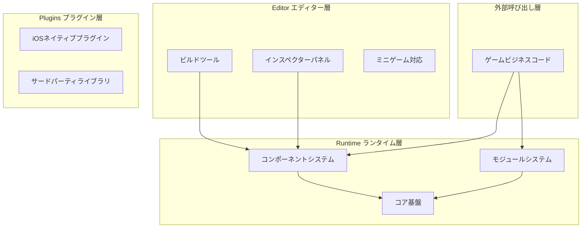
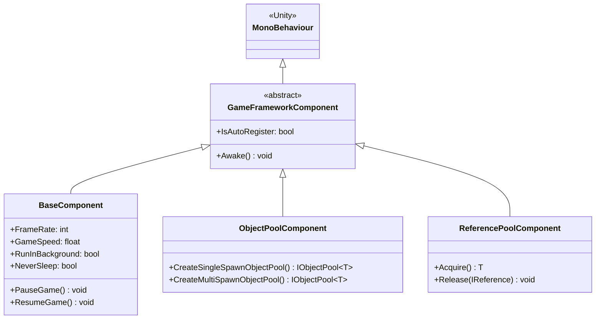
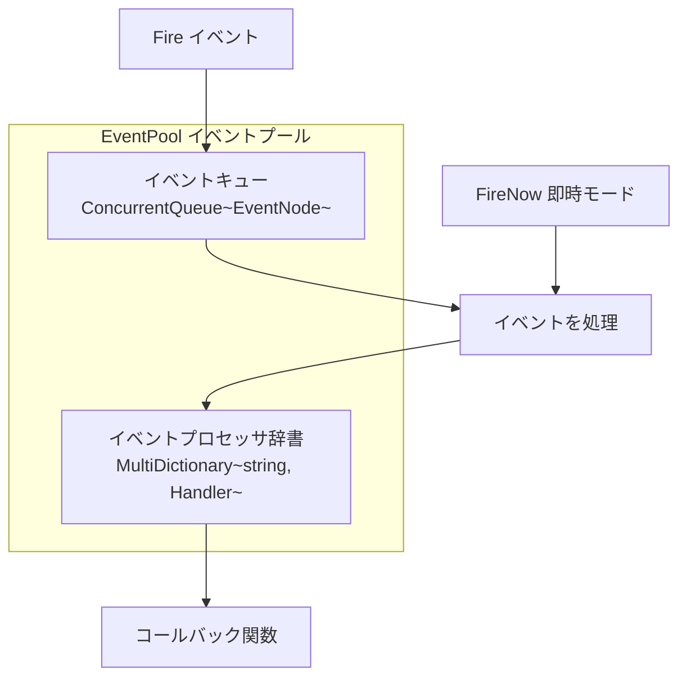
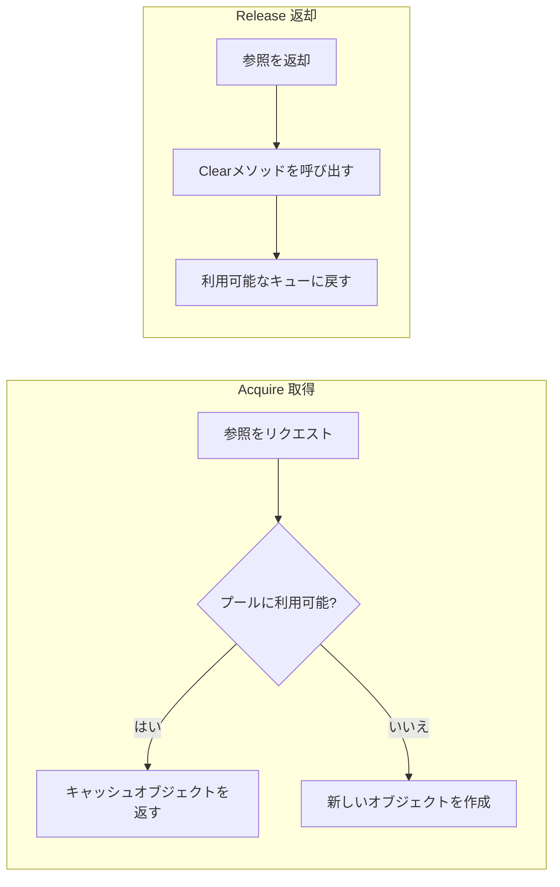

# コアコンセプト

GameFrameXフレームワークは最新の三層モジュラーアーキテクチャ設計を採用しており、インディーズゲーム開発者に完全なフロントエンドとバックエンドの統合ソリューションを提供します。このドキュメントでは、フレームワークのコアコンセプト、アーキテクチャ設計、重要な設計パターンについて詳しく説明します。

## 概要

GameFrameXはUnityゲーム開発者向けに設計された最新のフレームワークであり、そのコアテーマはモジュラーアーキテクチャと丰富的な組み込みツールを通じて、開発者が高品質なゲームプロジェクトを迅速に構築することです。フレームワークは**コンポーネントベース設計**を採用しており、各种機能を独立したコンポーネントとして封装し、開発者はプロジェクトのニーズに応じて柔軟に組み合わせることができます。

### 設計目標

フレームワークの設計は以下のコア原則に従っています：

1. **モジュラー設計**：各機能モジュールは独立して封装され、インターフェースを通じて通信し、置き換えと拡張が容易
2. **パフォーマンス優先**：オブジェクトプール、参照プールなどの技術でメモリ割り当てを最適化し、ガベージコレクションの負荷を減少
3. **開発効率**：丰富的な拡張メソッド、ツールクラス、エディターツールを提供し、開発効率を向上
4. **クロスプラットフォームサポート**：PC、モバイル、WebGL以及多种ミニゲームプラットフォームをサポート

### システムアーキテクチャ

GameFrameXフレームワークは明確な三層アーキテクチャ設計を採用しています：



## コアコンポーネントシステム

GameFrameXのコアはコンポーネントシステムであり、すべての機能はコンポーネントの方法で提供されます。コンポーネントシステムは两大類に分けられます：**コンポーネント（Component）**と**モジュール（Module）**。

### コンポーネント（Component）

コンポーネントは`MonoBehaviour`を継承し、GameObjectにアタッチされたUnityコンポーネントです。各コンポーネントはゲーム起動時に自動的に`GameEntry`に登録され、`GameEntry.GetComponent<T>()`メソッドで取得できます。



> Source: [GameFrameworkComponent.cs](https://github.com/GameFrameX/com.gameframex.unity/blob/main/Runtime/Base/GameFrameworkComponent.cs#L44-L95)

#### コンポーネント登録メカニズム

コンポーネントは`Awake()`メソッドで自動的に`GameEntry`に登録されます：

```csharp
protected virtual void Awake()
{
    GameEntry.RegisterComponent(this);
    if (IsAutoRegister)
    {
        GameFrameworkEntry.RegisterModule(InterfaceComponentType, ImplementationComponentType);
    }
}
```

> Source: [GameFrameworkComponent.cs](https://github.com/GameFrameX/com.gameframex.unity/blob/main/Runtime/Base/GameFrameworkComponent.cs#L85-L94)

### モジュール（Module）

モジュールは純粋なC#クラスであり、Unityの`MonoBehaviour`に依存せず、Unityのライフサイクル无关のロジックサービスを実装するために使用されます。モジュールには優先順位の概念があり、`Update`ポーリングと`Shutdown`時に優先順位の順序で実行されます。

```csharp
public abstract class GameFrameworkModule
{
    /// <summary>
    /// ゲームフレームワークモジュールの優先順位を取得
    /// </summary>
    protected internal virtual int Priority
    {
        get { return 0; }
    }

    /// <summary>
    /// ゲームフレームワークモジュールのポーリング
    /// </summary>
    protected internal abstract void Update(float elapseSeconds, float realElapseSeconds);

    /// <summary>
    /// ゲームフレームワークモジュールを閉じるしてクリーンアップ
    /// </summary>
    protected internal abstract void Shutdown();
}
```

> Source: [GameFrameworkModule.cs](https://github.com/GameFrameX/com.gameframex.unity/blob/main/Runtime/Base/GameFrameworkModule.cs#L40-L70)

### フレームワークエントリーポイント（GameEntry）

`GameEntry`はフレームワークの静的エントリーポイントであり、すべてのコンポーネント登録と取得を管理します：

```csharp
public static class GameEntry
{
    private static readonly GameFrameworkLinkedList<GameFrameworkComponent> GameFrameworkComponents = new GameFrameworkLinkedList<GameFrameworkComponent>();

    /// <summary>
    /// ゲームフレームワークコンポーネントを取得
    /// </summary>
    public static T GetComponent<T>() where T : GameFrameworkComponent
    {
        return (T)GetComponent(typeof(T));
    }

    /// <summary>
    /// ゲームフレームワークコンポーネントを登録
    /// </summary>
    internal static void RegisterComponent(GameFrameworkComponent gameFrameworkComponent)
    {
        // コンポーネント登録ロジック...
    }
}
```

> Source: [GameEntry.cs](https://github.com/GameFrameX/com.gameframex.unity/blob/main/Runtime/Base/GameEntry.cs#L46-L195)

## イベントシステム

GameFrameXは強力なイベントプールシステムを提供し、**スレッドセーフな非同期イベント配信**と**同期即時イベント配信**の两种モードをサポートします。イベントシステムはパブリッシュ・サブスクライブパターンを採用し、モジュール間の疎結合通信を実現します。

### イベントプールアーキテクチャ



### イベント使用例

```csharp
// イベント引数を定義
public class PlayerDeadEventArgs : BaseEventArgs
{
    public static int EventId => typeof(PlayerDeadEventArgs).GetHashCode();
    public int PlayerId { get; private set; }
    public float Damage { get; private set; }

    public static PlayerDeadEventArgs Create(int playerId, float damage)
    {
        var args = ReferencePool.Acquire<PlayerDeadEventArgs>();
        args.PlayerId = playerId;
        args.Damage = damage;
        return args;
    }

    public override void Clear()
    {
        PlayerId = 0;
        Damage = 0;
    }
}

// イベントをサブスクライブ
GameEntry.Event.Subscribe(PlayerDeadEventArgs.EventId, OnPlayerDead);

// イベントを送信（非同期、次フレームで処理）
GameEntry.Event.Fire(this, PlayerDeadEventArgs.Create(playerId, damage));

// イベントを送信（同期、即時処理）
GameEntry.Event.FireNow(this, PlayerDeadEventArgs.Create(playerId, damage));

// サブスクライブを解除
GameEntry.Event.Unsubscribe(PlayerDeadEventArgs.EventId, OnPlayerDead);
```

> Source: [EventPool.cs](https://github.com/GameFrameX/com.gameframex.unity/blob/main/Runtime/Base/EventPool/EventPool.cs#L200-L335)

### イベントプールモード

イベントプールは複数のモードをサポートし、組み合わせることで異なる動作を実現できます：

| モード | 説明 |
|------|------|
| `AllowMultiHandler` | 同じイベントに複数のプロセッサを許可 |
| `AllowDuplicateHandler` | 重複するプロセッサを許可 |
| `AllowNoHandler` | イベントにプロセッサがないことを許可 |

```csharp
// 複数のプロセッサをサポートするイベントプールを作成
var eventPool = new EventPool<MyEventArgs>(EventPoolMode.AllowMultiHandler | EventPoolMode.AllowDuplicateHandler);
```

> Source: [EventPoolMode.cs](https://github.com/GameFrameX/com.gameframex.unity/blob/main/Runtime/Base/EventPool/EventPoolMode.cs)

## 参照プールシステム

参照プールはGameFrameXフレームワークのコアメモリ最適化技術の一つであり、**Unityオブジェクト以外**のメモリ割り当てを管理するために特に使用されます。参照プールを通じて、频繁なオブジェクトの作成と破棄によってもたらされるガベージコレクション負荷を避けることができます。

### 参照プール原理



### 使用方法

参照プールを使用する必要があるクラスは、`IReference`インターフェースを実装する必要があります：

```csharp
public class MyData : IReference
{
    public int Id { get; set; }
    public string Name { get; set; }
    public float Value { get; set; }

    // Clearメソッドを実装する必要がある
    public void Clear()
    {
        Id = 0;
        Name = null;
        Value = 0;
    }
}

// 参照プールからオブジェクトを取得
var data = ReferencePool.Acquire<MyData>();
data.Id = 1;
data.Name = "Test";
data.Value = 100f;

// 参照プールに戻す
ReferencePool.Release(data);

// 事前割り当てされた参照を追加
ReferencePool.Add<MyData>(10);
```

> Source: [ReferencePool.cs](https://github.com/GameFrameX/com.gameframex.unity/blob/main/Runtime/Base/ReferencePool/ReferencePool.cs#L120-L167)

## オブジェクトプールシステム

オブジェクトプールシステムは**Unityオブジェクト**（GameObject、Componentなど）の再利用を管理するために特別に使用され、ゲーム開発におけるパフォーマンス最適化の重要な手段です。

### オブジェクトプールタイプ

| タイプ | 説明 | 適用シナリオ |
|------|------|----------|
| `SingleSpawnObjectPool` | シングルスポーンプール | 弾、アイテムなど一回限りのオブジェクト |
| `MultiSpawnObjectPool` | マルチスポーンプール | NPC、UI要素など再利用可能なオブジェクト |

### 使用例

```csharp
// オブジェクトプールを作成
var pool = GameEntry.ObjectPool.CreateMultiSpawnObjectPool<MyObject>("MyPool", 10, 60f, 100);

// プールからオブジェクトを取得
var obj = pool.Spawn();

// オブジェクトをプールに戻す
pool.Unspawn(obj);

// オブジェクトプールを破棄
GameEntry.ObjectPool.DestroyObjectPool<MyObject>("MyPool");
```

> Source: [ObjectPoolComponent.cs](https://github.com/GameFrameX/com.gameframex.unity/blob/main/Runtime/ObjectPool/ObjectPoolComponent.cs#L650-L1045)

### 有効期限と自動解放

オブジェクトプールはオブジェクトの有効期限設定をサポートし、タイムアウト後に使用されていないオブジェクトは自動的に解放されます：

```csharp
// 有効期限付きのオブジェクトプールを作成（60秒後に期限切れ）
var pool = GameEntry.ObjectPool.CreateMultiSpawnObjectPool<MyObject>("ExpirePool", 60f);

// 自動解放間隔を設定（30秒ごとにチェック）
pool.AutoReleaseInterval = 30f;
```

## シングルトンパターン

GameFrameXは两种のシングルトンベースクラスを提供しており、異なるシナリオに使用されます。

### 一般的なシングルトン（GameFrameworkSingleton）

純粋なC#クラスに適し、双重ロックチェックを使用してスレッドセーフティを確保：

```csharp
public class MySingleton : GameFrameworkSingleton<MySingleton>
{
    public void DoSomething()
    {
        // ビジネスロジック
    }
}

// 使用
MySingleton.Instance.DoSomething();
```

> Source: [GameFrameworkSingleton.cs](https://github.com/GameFrameX/com.gameframex.unity/blob/main/Runtime/Base/GameFrameworkSingleton.cs#L11-L46)

### Monoシングルトン（GameFrameworkMonoSingleton）

GameObjectにアタッチする必要があるコンポーネントに適しています：

```csharp
public class MyMonoSingleton : GameFrameworkMonoSingleton<MyMonoSingleton>
{
    protected override void OnWake()
    {
        // 初期化ロジック
    }
}

// 使用
MyMonoSingleton.Instance.DoSomething();
```

> Source: [GameFrameworkMonoSingleton.cs](https://github.com/GameFrameX/com.gameframex.unity/blob/main/Runtime/Base/GameFrameworkMonoSingleton.cs)

## プロパティシステム

プロパティシステム（BindableProperty）はMVVMアーキテクチャパターンをサポートし、プロパティ値が変化したときに自動的にオブザーバーに通知します。

### バインディング可能プロパティ

```csharp
// バインディング可能プロパティを定義
public BindableProperty<int> Score = new BindableProperty<int>(0);
public BindableProperty<string> PlayerName = new BindableProperty<string>("Player");

// 値変化イベントをサブスクライブ
Score.Add(OnScoreChanged);
PlayerName.RegisterWithInitValue(OnNameChanged);

// 値が変化したときに自動的にコールバックをトリガー
Score.Value = 100;  // OnScoreChanged(100)をトリガー

// イベントを削除
Score.Remove(OnScoreChanged);

// すべてのイベントをクリア
Score.Clear();
```

> Source: [BindableProperty.cs](https://github.com/GameFrameX/com.gameframex.unity/blob/main/Runtime/Property/BindableProperty.cs#L7-L89)

### MVVMパターン応用

BindablePropertyはMVVMアーキテクチャを強くサポートできます：

```csharp
// Model - データモデル
public class PlayerModel
{
    public BindableProperty<int> Health = new BindableProperty<int>(100);
    public BindableProperty<int> Mana = new BindableProperty<int>(50);
    public BindableProperty<Vector3> Position = new BindableProperty<Vector3>();
}

// ViewModel - ビューモデル
public class PlayerViewModel
{
    private readonly PlayerModel _model;

    public PlayerViewModel(PlayerModel model)
    {
        _model = model;
    }

    public void TakeDamage(int damage)
    {
        _model.Health.Value -= damage;
    }
}

// View - ビュー（UIスクリプト内）
public class PlayerHUD : MonoBehaviour
{
    public Text healthText;
    private PlayerModel _model;

    public void Bind(PlayerModel model)
    {
        _model = model;
        _model.Health.RegisterWithInitValue(OnHealthChanged);
    }

    private void OnHealthChanged(int health)
    {
        healthText.text = $"HP: {health}";
    }
}
```

## 拡張メソッドライブラリ

GameFrameXは丰富的な拡張メソッドライブラリを提供し、文字列、コレクション、日時、Unity型など複数の分野をカバーします。

### Transform拡張

```csharp
// 位置成分を設定
transform.SetPositionX(10f);
transform.SetPositionY(20f);
transform.SetPositionZ(30f);

// 一括設定
transform.SetLocalScaleXYZ(2f, 2f, 2f);

// トランスフォームをリセット
transform.ResetTransformation();

// 子オブジェクトを検索
var child = transform.FindChildRecursive("ChildName");
```

### Vector拡張

```csharp
Vector3 pos = transform.position;
pos = pos.WithX(5f).WithY(10f);  // 新しい値を作成し、他の成分を維持
Vector3 direction = pos.NormalizeTo();
float angle = transform.forward.AngleTo(Vector3.forward);
```

### GameObject拡張

```csharp
// 最適化されたアクティブ/非アクティブ設定
gameObject.SetActiveOptimized(true);

// 再帰的にレイヤーを設定
gameObject.SetLayerRecursively(LayerMask.NameToLayer("UI"));

// コンポーネントを取得または追加
var component = gameObject.GetOrAddComponent<MyComponent>();
```

> Source: [UnityEngage.GameObjectExtension.cs](https://github.com/GameFrameX/com.gameframex.unity/blob/main/Runtime/Extension/UnityEngage.GameObject/UnityEngage.GameObjectExtension.cs)

## ユーティリティクラス

フレームワークは暗号化、圧縮、ファイル操作、ネットワークなど多个方面をカバーする完全なツールクラスを提供します。

### 暗号化・復号化

```csharp
// AES暗号化
string encrypted = Utility.Encryption.Aes.Encrypt("plaintext", "key");
string decrypted = Utility.Encryption.Aes.Decrypt(encrypted, "key");

// MD5ハッシュ
string md5 = Utility.Hash.Md5.ComputeHash("input");

// SHA1ハッシュ
string sha1 = Utility.Hash.Sha1.ComputeHash("input");
```

### ファイル操作

```csharp
// ファイルを読み込む
byte[] data = Utility.File.ReadAllBytes("path/to/file");
string content = Utility.File.ReadAllString("path/to/file");

// ファイルを書き込む
Utility.File.WriteAllBytes("path/to/file", data);
Utility.File.WriteAllString("path/to/file", content);
```

### JSONシリアライズ

```csharp
// オブジェクトをJSONに変換
string json = Utility.Json.ToJson(myObject);

// JSONをオブジェクトに変換
var obj = Utility.Json.FromJson<MyClass>(json);
```

## 関連リンク

- [基本コンポーネント](./5-runtime.base)
- [イベントシステム](./5-runtime.event-system)
- [オブジェクトプールシステム](./5-runtime.object-pool)
- [参照プールシステム](./5-runtime.reference-pool)
- [プロパティシステム](./5-runtime.property-system)
- [拡張メソッドライブラリ](./5-runtime.extension-methods)
- [ツールクラス](./5-runtime.utility-classes)
- [APIリファレンス](./8-api-reference)
