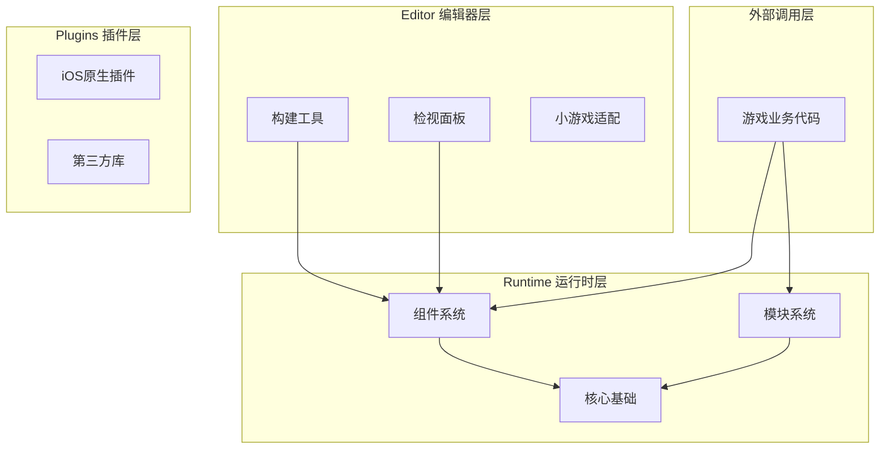
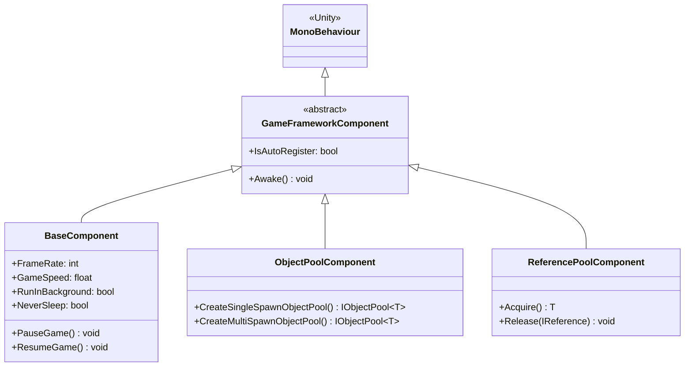
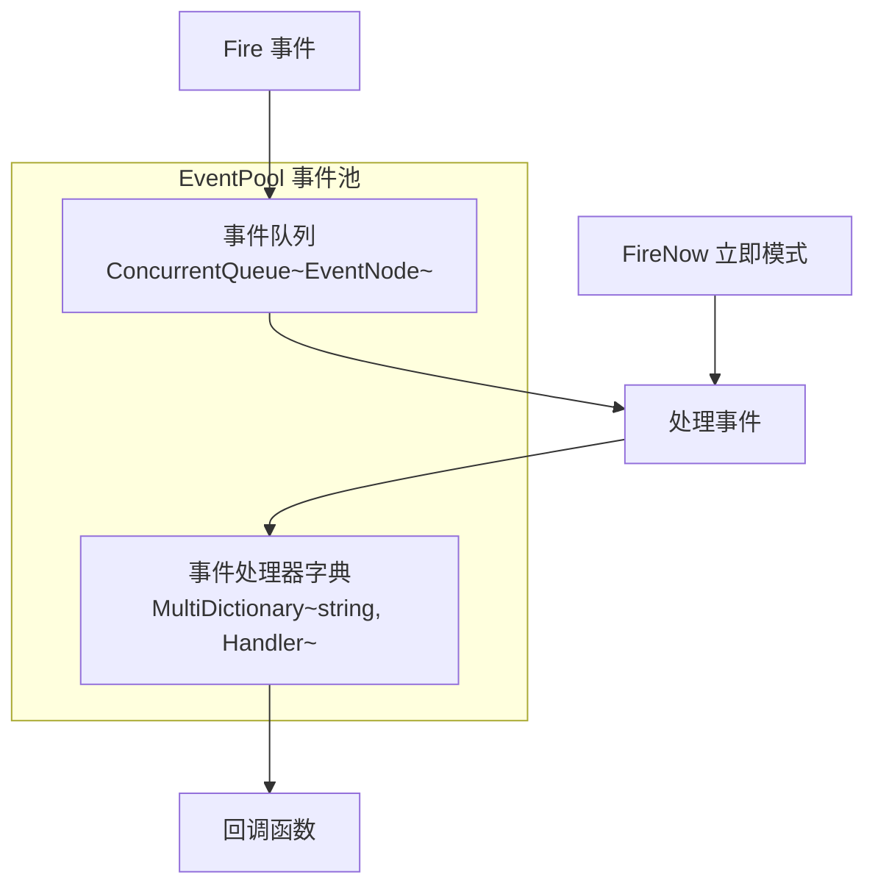
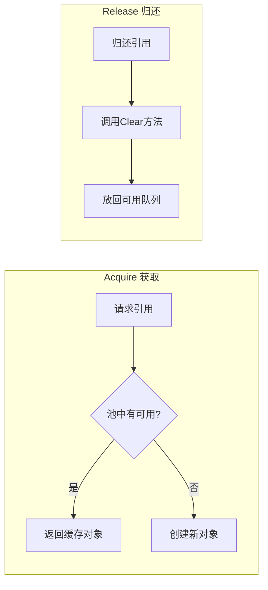

# コアコンセプト

GameFrameX フレームワーク采用现代化的三层モジュール化アーキテクチャ設計，为独立游戏開発者提供完全な的前后端一体化解決策。このドキュメント詳細介绍フレームワーク的コアコンセプト、アーキテクチャ設計和关键設計モード。

## 概要

GameFrameX は专为 Unity 游戏開発者設計的现代化フレームワーク，其コア理念是通过モジュール化アーキテクチャ和丰富的内置工具，帮助開発者快速ビルド高质量的游戏プロジェクト。フレームワーク采用**コンポーネント化設計**，将各种機能カプセル化为独立的コンポーネント，開発者〜できます根据プロジェクト需求柔軟组合使用。

### 設計目标

フレームワーク的設計遵循以下コア原则：

1. **モジュール化設計**：每个機能モジュール独立カプセル化，通过インターフェース进行通信，便于置換和拡張
2. **性能优先**：通过对象池、参照池等技术最適化内存分配，减少垃圾回收压力
3. **开发效率**：提供丰富的拡張メソッド、工具类和エディタ工具，提升开发效率
4. **跨プラットフォームサポート**：サポート PC、移动端、WebGL および多种ミニゲームプラットフォーム

### システムアーキテクチャ

GameFrameX フレームワーク采用清晰的三层アーキテクチャ設計：



## コアコンポーネント系统

GameFrameX 的コア是コンポーネント系统，所有機能都通过コンポーネント的方法提供。コンポーネント系统分为两大类：**コンポーネント（Component）** 和 **モジュール（Module）**。

### コンポーネント（Component）

コンポーネント継承自 `MonoBehaviour`，是附着在 GameObject 上的 Unity コンポーネント。每个コンポーネント在游戏启动时自动登録到 `GameEntry` 中，〜できます通过 `GameEntry.GetComponent<T>()` メソッド取得。



> Source: [GameFrameworkComponent.cs](https://github.com/GameFrameX/com.gameframex.unity/blob/main/Runtime/Base/GameFrameworkComponent.cs#L44-L95)

#### コンポーネント登録机制

コンポーネント在 `Awake()` メソッド中自动登録到 `GameEntry`：

```csharp
protected virtual void Awake()
{
    GameEntry.RegisterComponent(this);
    if (IsAutoRegister)
    {
        GameFrameworkEntry.RegisterModule(InterfaceComponentType, ImplementationComponentType);
    }
}
```

> Source: [GameFrameworkComponent.cs](https://github.com/GameFrameX/com.gameframex.unity/blob/main/Runtime/Base/GameFrameworkComponent.cs#L85-L94)

### モジュール（Module）

モジュール是纯 C# 类，不依赖 Unity 的 `MonoBehaviour`，用于実装与 Unity ライフサイクル无关的逻辑服务。モジュール具有优先级コンセプト，在 `Update` 轮询和 `Shutdown` 时按照优先级顺序执行。

```csharp
public abstract class GameFrameworkModule
{
    /// <summary>
    /// 获取游戏框架模块优先级
    /// </summary>
    protected internal virtual int Priority
    {
        get { return 0; }
    }

    /// <summary>
    /// 游戏框架模块轮询
    /// </summary>
    protected internal abstract void Update(float elapseSeconds, float realElapseSeconds);

    /// <summary>
    /// 关闭并清理游戏框架模块
    /// </summary>
    protected internal abstract void Shutdown();
}
```

> Source: [GameFrameworkModule.cs](https://github.com/GameFrameX/com.gameframex.unity/blob/main/Runtime/Base/GameFrameworkModule.cs#L40-L70)

### フレームワークエントリ（GameEntry）

`GameEntry` 是フレームワーク的静态入口点，负责管理所有コンポーネント的登録和取得：

```csharp
public static class GameEntry
{
    private static readonly GameFrameworkLinkedList<GameFrameworkComponent> GameFrameworkComponents = new GameFrameworkLinkedList<GameFrameworkComponent>();

    /// <summary>
    /// 获取游戏框架组件
    /// </summary>
    public static T GetComponent<T>() where T : GameFrameworkComponent
    {
        return (T)GetComponent(typeof(T));
    }

    /// <summary>
    /// 注册游戏框架组件
    /// </summary>
    internal static void RegisterComponent(GameFrameworkComponent gameFrameworkComponent)
    {
        // 组件注册逻辑...
    }
}
```

> Source: [GameEntry.cs](https://github.com/GameFrameX/com.gameframex.unity/blob/main/Runtime/Base/GameEntry.cs#L46-L195)

## イベント系统

GameFrameX 提供します機能強力的イベント池系统，サポート**线程安全的异步イベント分发**和**同步立つまりイベント分发**两种モード。イベント系统采用リリース-購読モード，実装モジュール间的松耦合通信。

### イベント池アーキテクチャ



### イベント使用例

```csharp
// 定义事件参数
public class PlayerDeadEventArgs : BaseEventArgs
{
    public static int EventId => typeof(PlayerDeadEventArgs).GetHashCode();
    public int PlayerId { get; private set; }
    public float Damage { get; private set; }
    
    public static PlayerDeadEventArgs Create(int playerId, float damage)
    {
        var args = ReferencePool.Acquire<PlayerDeadEventArgs>();
        args.PlayerId = playerId;
        args.Damage = damage;
        return args;
    }
    
    public override void Clear()
    {
        PlayerId = 0;
        Damage = 0;
    }
}

// 订阅事件
GameEntry.Event.Subscribe(PlayerDeadEventArgs.EventId, OnPlayerDead);

// 发送事件（异步，在下一帧处理）
GameEntry.Event.Fire(this, PlayerDeadEventArgs.Create(playerId, damage));

// 发送事件（同步，立即处理）
GameEntry.Event.FireNow(this, PlayerDeadEventArgs.Create(playerId, damage));

// 取消订阅
GameEntry.Event.Unsubscribe(PlayerDeadEventArgs.EventId, OnPlayerDead);
```

> Source: [EventPool.cs](https://github.com/GameFrameX/com.gameframex.unity/blob/main/Runtime/Base/EventPool/EventPool.cs#L200-L335)

### イベント池モード

イベント池サポート多种モード，〜できます通过组合来実装不同的行为：

| モード | 説明 |
|------|------|
| `AllowMultiHandler` | 允许同一イベント有多个処理器 |
| `AllowDuplicateHandler` | 允许重复的処理器 |
| `AllowNoHandler` | 允许イベント没有処理器 |

```csharp
// 创建支持多处理器的事件池
var eventPool = new EventPool<MyEventArgs>(EventPoolMode.AllowMultiHandler | EventPoolMode.AllowDuplicateHandler);
```

> Source: [EventPoolMode.cs](https://github.com/GameFrameX/com.gameframex.unity/blob/main/Runtime/Base/EventPool/EventPoolMode.cs)

## 参照池系统

参照池是 GameFrameX フレームワーク的コア内存最適化技术之一，专门用于管理**非 Unity 对象**的内存分配。通过参照池，〜できます避免频繁作成和破棄对象带来的垃圾回收压力。

### 参照池原理



### 使用方法

任何〜する必要があります使用参照池的类，都〜する必要があります実装 `IReference` インターフェース：

```csharp
public class MyData : IReference
{
    public int Id { get; set; }
    public string Name { get; set; }
    public float Value { get; set; }
    
    // 必须实现 Clear 方法
    public void Clear()
    {
        Id = 0;
        Name = null;
        Value = 0;
    }
}

// 从引用池获取对象
var data = ReferencePool.Acquire<MyData>();
data.Id = 1;
data.Name = "Test";
data.Value = 100f;

// 归还到引用池
ReferencePool.Release(data);

// 添加预分配的引用
ReferencePool.Add<MyData>(10);
```

> Source: [ReferencePool.cs](https://github.com/GameFrameX/com.gameframex.unity/blob/main/Runtime/Base/ReferencePool/ReferencePool.cs#L120-L167)

## 对象池系统

对象池系统专门用于管理 **Unity 对象**（如 GameObject、Component）的复用，是游戏开发中最適化性能的重要な手段。

### 对象池タイプ

| タイプ | 説明 | 适用シーン |
|------|------|----------|
| `SingleSpawnObjectPool` | 单次取得池 | 子弹、道具等一次性对象 |
| `MultiSpawnObjectPool` | 多次取得池 | NPC、UI 元素等可复用对象 |

### 使用例

```csharp
// 创建对象池
var pool = GameEntry.ObjectPool.CreateMultiSpawnObjectPool<MyObject>("MyPool", 10, 60f, 100);

// 从池中获取对象
var obj = pool.Spawn();

// 归还对象到池中
pool.Unspawn(obj);

// 销毁对象池
GameEntry.ObjectPool.DestroyObjectPool<MyObject>("MyPool");
```

> Source: [ObjectPoolComponent.cs](https://github.com/GameFrameX/com.gameframex.unity/blob/main/Runtime/ObjectPool/ObjectPoolComponent.cs#L650-L1045)

### 过期时间与自动解放

对象池サポート設定对象的过期时间，超时未使用的对象会自动解放：

```csharp
// 创建带过期时间的对象池（60秒后过期）
var pool = GameEntry.ObjectPool.CreateMultiSpawnObjectPool<MyObject>("ExpirePool", 60f);

// 设置自动释放间隔（每30秒检查一次）
pool.AutoReleaseInterval = 30f;
```

## 单例モード

GameFrameX 提供します两种单例基底クラス，分别用于不同的シーン。

### 普通单例（GameFrameworkSingleton）

適しています纯 C# 类，使用双重锁定確認確認してください线程安全：

```csharp
public class MySingleton : GameFrameworkSingleton<MySingleton>
{
    public void DoSomething()
    {
        // 业务逻辑
    }
}

// 使用
MySingleton.Instance.DoSomething();
```

> Source: [GameFrameworkSingleton.cs](https://github.com/GameFrameX/com.gameframex.unity/blob/main/Runtime/Base/GameFrameworkSingleton.cs#L11-L46)

### Mono 单例（GameFrameworkMonoSingleton）

適しています〜する必要があります挂载到 GameObject 上的コンポーネント：

```csharp
public class MyMonoSingleton : GameFrameworkMonoSingleton<MyMonoSingleton>
{
    protected override void OnWake()
    {
        // 初始化逻辑
    }
}

// 使用
MyMonoSingleton.Instance.DoSomething();
```

> Source: [GameFrameworkMonoSingleton.cs](https://github.com/GameFrameX/com.gameframex.unity/blob/main/Runtime/Base/GameFrameworkMonoSingleton.cs)

## プロパティ系统

プロパティ系统（BindableProperty）为 MVVM アーキテクチャモード提供しますサポート，允许プロパティ值变化时自动通知观察者。

### 可绑定プロパティ

```csharp
// 定义可绑定属性
public BindableProperty<int> Score = new BindableProperty<int>(0);
public BindableProperty<string> PlayerName = new BindableProperty<string>("Player");

// 订阅值变化事件
Score.Add(OnScoreChanged);
PlayerName.RegisterWithInitValue(OnNameChanged);

// 值变化时自动触发回调
Score.Value = 100;  // 触发 OnScoreChanged(100)

// 移除事件
Score.Remove(OnScoreChanged);

// 清除所有事件
Score.Clear();
```

> Source: [BindableProperty.cs](https://github.com/GameFrameX/com.gameframex.unity/blob/main/Runtime/Property/BindableProperty.cs#L7-L89)

### MVVM モード应用

BindableProperty 〜できます很好地サポート MVVM アーキテクチャ：

```csharp
// Model - 数据模型
public class PlayerModel
{
    public BindableProperty<int> Health = new BindableProperty<int>(100);
    public BindableProperty<int> Mana = new BindableProperty<int>(50);
    public BindableProperty<Vector3> Position = new BindableProperty<Vector3>();
}

// ViewModel - 视图模型
public class PlayerViewModel
{
    private readonly PlayerModel _model;
    
    public PlayerViewModel(PlayerModel model)
    {
        _model = model;
    }
    
    public void TakeDamage(int damage)
    {
        _model.Health.Value -= damage;
    }
}

// View - 视图（在 UI 脚本中）
public class PlayerHUD : MonoBehaviour
{
    public Text healthText;
    private PlayerModel _model;
    
    public void Bind(PlayerModel model)
    {
        _model = model;
        _model.Health.RegisterWithInitValue(OnHealthChanged);
    }
    
    private void OnHealthChanged(int health)
    {
        healthText.text = $"HP: {health}";
    }
}
```

## 拡張メソッド库

GameFrameX 提供します丰富的拡張メソッド库，涵盖字符串、集合、日期时间、Unity タイプ等多个领域。

### Transform 拡張

```csharp
// 设置位置分量
transform.SetPositionX(10f);
transform.SetPositionY(20f);
transform.SetPositionZ(30f);

// 批量设置
transform.SetLocalScaleXYZ(2f, 2f, 2f);

// 重置变换
transform.ResetTransformation();

// 查找子物体
var child = transform.FindChildRecursive("ChildName");
```

### Vector 拡張

```csharp
Vector3 pos = transform.position;
pos = pos.WithX(5f).WithY(10f);  // 创建新值，保留其他分量
Vector3 direction = pos.NormalizeTo();
float angle = transform.forward.AngleTo(Vector3.forward);
```

### GameObject 拡張

```csharp
// 优化的激活/禁用
gameObject.SetActiveOptimized(true);

// 递归设置层级
gameObject.SetLayerRecursively(LayerMask.NameToLayer("UI"));

// 获取或添加组件
var component = gameObject.GetOrAddComponent<MyComponent>();
```

> Source: [UnityEngage.GameObjectExtension.cs](https://github.com/GameFrameX/com.gameframex.unity/blob/main/Runtime/Extension/UnityEngage.GameObject/UnityEngage.GameObjectExtension.cs)

## 实用工具类

フレームワーク提供します全面的工具类，涵盖加密、压缩、ファイル操作、网络等多个方面。

### 加密解密

```csharp
// AES 加密
string encrypted = Utility.Encryption.Aes.Encrypt("plaintext", "key");
string decrypted = Utility.Encryption.Aes.Decrypt(encrypted, "key");

// MD5 哈希
string md5 = Utility.Hash.Md5.ComputeHash("input");

// SHA1 哈希
string sha1 = Utility.Hash.Sha1.ComputeHash("input");
```

### ファイル操作

```csharp
// 读取文件
byte[] data = Utility.File.ReadAllBytes("path/to/file");
string content = Utility.File.ReadAllString("path/to/file");

// 写入文件
Utility.File.WriteAllBytes("path/to/file", data);
Utility.File.WriteAllString("path/to/file", content);
```

### JSON シリアライズ

```csharp
// 对象转 JSON
string json = Utility.Json.ToJson(myObject);

// JSON 转对象
var obj = Utility.Json.FromJson<MyClass>(json);
```

## 関連リンク

- [基本コンポーネント](./5-runtime.base)
- [イベント系统](./5-runtime.event-system)
- [对象池系统](./5-runtime.object-pool)
- [参照池系统](./5-runtime.reference-pool)
- [プロパティ系统](./5-runtime.property-system)
- [拡張メソッド库](./5-runtime.extension-methods)
- [工具类](./5-runtime.utility-classes)
- [API リファレンス](./8-api-reference)
