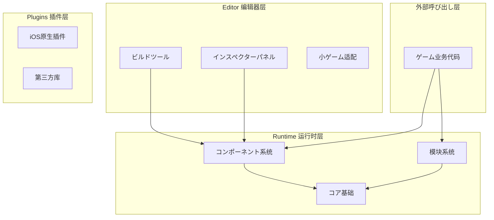
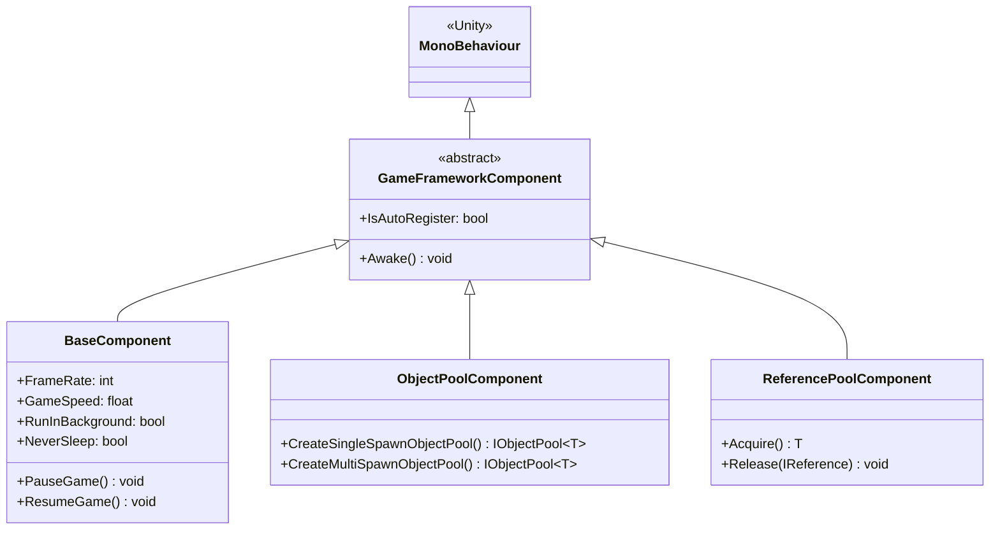
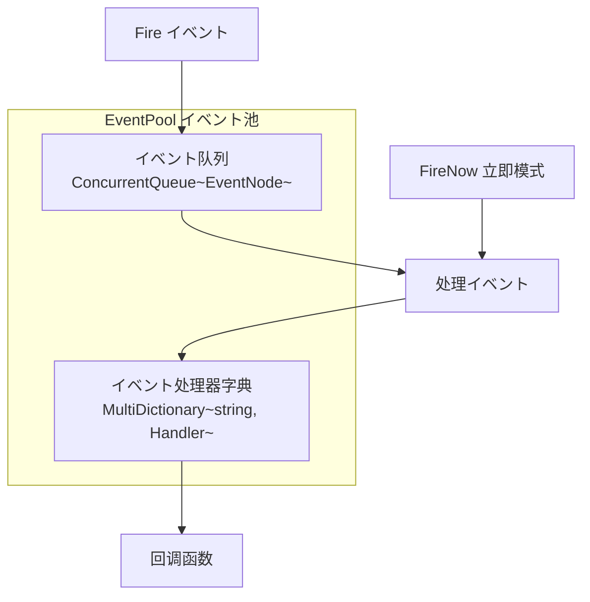
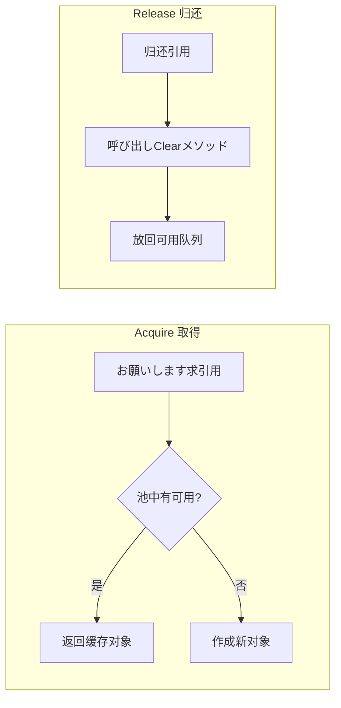

# コア概念

GameFrameX フレームワーク采用近代化的三層モジュラーアーキテクチャ设计，インディゲーム開発者向け提供完全なフロントエンドとバックエンド一体型解決策。本文档详细介绍フレームワーク的コア概念、アーキテクチャ設計和关键设计模式。

## 概要

GameFrameX は专为 Unity ゲーム開発者设计的近代化フレームワーク，其コア理念是を通じて模块化架构和丰富的内置工具，帮助開発者快速构建高质量的ゲームプロジェクト。フレームワーク采用**コンポーネント化设计**，将各种機能封装为独立的コンポーネント，開発者可能に基づいてプロジェクト需求灵活组合使用。

### 设计目标

フレームワーク的设计遵循以下コア原则：

1. **モジュラー設計**：每个機能模块独立封装，を通じてインターフェース进行通信，便于替换和扩展
2. **性能优先**：を通じてオブジェクトプール、参照プール等技术优化内存分配，减少垃圾回收压力
3. **开发效率**：提供豊富な拡張メソッド、工具クラス和编辑器工具，開発効率の向上
4. **跨平台サポート**：サポート PC、移动端、WebGL 以及多种小ゲーム平台

### 系统架构

GameFrameX フレームワーク采用清晰的三层アーキテクチャ設計：



## コアコンポーネント系统

GameFrameX 的コア是コンポーネント系统，所有機能都を通じてコンポーネント的方法提供。コンポーネント系统分为两大クラス：**コンポーネント（Component）** 和 **模块（Module）**。

### コンポーネント（Component）

コンポーネントを継承 `MonoBehaviour`，是附着在 GameObject 上的 Unity コンポーネント。每个コンポーネント在ゲーム启动时自动注册到 `GameEntry` 中，可能を通じて `GameEntry.GetComponent<T>()` メソッド取得。



> Source: [GameFrameworkComponent.cs](https://github.com/GameFrameX/com.gameframex.unity/blob/main/Runtime/Base/GameFrameworkComponent.cs#L44-L95)

#### コンポーネント注册机制

コンポーネント在 `Awake()` メソッド中自动注册到 `GameEntry`：

```csharp
protected virtual void Awake()
{
    GameEntry.RegisterComponent(this);
    if (IsAutoRegister)
    {
        GameFrameworkEntry.RegisterModule(InterfaceComponentType, ImplementationComponentType);
    }
}
```

> Source: [GameFrameworkComponent.cs](https://github.com/GameFrameX/com.gameframex.unity/blob/main/Runtime/Base/GameFrameworkComponent.cs#L85-L94)

### 模块（Module）

模块是纯 C# クラス，不依赖 Unity 的 `MonoBehaviour`，に使用実装与 Unity 生命周期无关的逻辑服务。模块具有优先级概念，在 `Update` 轮询和 `Shutdown` 时按照优先级顺序执行。

```csharp
public abstract class GameFrameworkModule
{
    /// <summary>
    /// 取得ゲームフレームワーク模块优先级
    /// </summary>
    protected internal virtual int Priority
    {
        get { return 0; }
    }

    /// <summary>
    /// ゲームフレームワーク模块轮询
    /// </summary>
    protected internal abstract void Update(float elapseSeconds, float realElapseSeconds);

    /// <summary>
    /// 关闭并清理ゲームフレームワーク模块
    /// </summary>
    protected internal abstract void Shutdown();
}
```

> Source: [GameFrameworkModule.cs](https://github.com/GameFrameX/com.gameframex.unity/blob/main/Runtime/Base/GameFrameworkModule.cs#L40-L70)

### フレームワークエントリーポイント（GameEntry）

`GameEntry` 是フレームワーク的静态エントリーポイント点，负责管理所有コンポーネント的注册和取得：

```csharp
public static class GameEntry
{
    private static readonly GameFrameworkLinkedList<GameFrameworkComponent> GameFrameworkComponents = new GameFrameworkLinkedList<GameFrameworkComponent>();

    /// <summary>
    /// 取得ゲームフレームワークコンポーネント
    /// </summary>
    public static T GetComponent<T>() where T : GameFrameworkComponent
    {
        return (T)GetComponent(typeof(T));
    }

    /// <summary>
    /// 注册ゲームフレームワークコンポーネント
    /// </summary>
    internal static void RegisterComponent(GameFrameworkComponent gameFrameworkComponent)
    {
        // コンポーネント注册逻辑...
    }
}
```

> Source: [GameEntry.cs](https://github.com/GameFrameX/com.gameframex.unity/blob/main/Runtime/Base/GameEntry.cs#L46-L195)

## イベント系统

GameFrameX 提供します機能强大的イベント池系统，サポート**线程安全的异步イベント分发**和**同步立即イベント分发**两种模式。イベント系统采用发布-订阅模式，実装模块间的松耦合通信。

### イベント池架构



### イベント使用示例

```csharp
// 定义イベント参数
public class PlayerDeadEventArgs : BaseEventArgs
{
    public static int EventId => typeof(PlayerDeadEventArgs).GetHashCode();
    public int PlayerId { get; private set; }
    public float Damage { get; private set; }
    
    public static PlayerDeadEventArgs Create(int playerId, float damage)
    {
        var args = ReferencePool.Acquire<PlayerDeadEventArgs>();
        args.PlayerId = playerId;
        args.Damage = damage;
        return args;
    }
    
    public override void Clear()
    {
        PlayerId = 0;
        Damage = 0;
    }
}

// 订阅イベント
GameEntry.Event.Subscribe(PlayerDeadEventArgs.EventId, OnPlayerDead);

// 发送イベント（异步，在下一帧处理）
GameEntry.Event.Fire(this, PlayerDeadEventArgs.Create(playerId, damage));

// 发送イベント（同步，立即处理）
GameEntry.Event.FireNow(this, PlayerDeadEventArgs.Create(playerId, damage));

// 取消订阅
GameEntry.Event.Unsubscribe(PlayerDeadEventArgs.EventId, OnPlayerDead);
```

> Source: [EventPool.cs](https://github.com/GameFrameX/com.gameframex.unity/blob/main/Runtime/Base/EventPool/EventPool.cs#L200-L335)

### イベント池模式

イベント池サポート多种模式，可能を通じて组合来実装不同的行为：

| 模式 | 説明 |
|------|------|
| `AllowMultiHandler` | 允许同一イベント有多个处理器 |
| `AllowDuplicateHandler` | 允许重复的处理器 |
| `AllowNoHandler` | 允许イベント没有处理器 |

```csharp
// 作成サポート多处理器的イベント池
var eventPool = new EventPool<MyEventArgs>(EventPoolMode.AllowMultiHandler | EventPoolMode.AllowDuplicateHandler);
```

> Source: [EventPoolMode.cs](https://github.com/GameFrameX/com.gameframex.unity/blob/main/Runtime/Base/EventPool/EventPoolMode.cs)

## 参照プールシステム

参照プール是 GameFrameX フレームワーク的コア内存优化技术之一，专门に使用管理**非 Unity 对象**的内存分配。を通じて参照プール，可能避免频繁作成和销毁对象带来的垃圾回收压力。

### 参照プール原理



### 使用メソッド

任何必要使用参照プール的クラス，都必要実装 `IReference` インターフェース：

```csharp
public class MyData : IReference
{
    public int Id { get; set; }
    public string Name { get; set; }
    public float Value { get; set; }
    
    // 必須実装 Clear メソッド
    public void Clear()
    {
        Id = 0;
        Name = null;
        Value = 0;
    }
}

// 从参照プール取得对象
var data = ReferencePool.Acquire<MyData>();
data.Id = 1;
data.Name = "Test";
data.Value = 100f;

// 归还到参照プール
ReferencePool.Release(data);

// 添加预分配的引用
ReferencePool.Add<MyData>(10);
```

> Source: [ReferencePool.cs](https://github.com/GameFrameX/com.gameframex.unity/blob/main/Runtime/Base/ReferencePool/ReferencePool.cs#L120-L167)

## オブジェクトプールシステム

オブジェクトプールシステム专门に使用管理 **Unity 对象**（如 GameObject、Component）的复用，是ゲーム开发中优化性能的重要手段。

### オブジェクトプールクラス型

| クラス型 | 説明 | 适用シーン |
|------|------|----------|
| `SingleSpawnObjectPool` | 单次取得池 | 子弹、道具等一次性对象 |
| `MultiSpawnObjectPool` | 多次取得池 | NPC、UI 元素等可复用对象 |

### 使用例

```csharp
// 作成オブジェクトプール
var pool = GameEntry.ObjectPool.CreateMultiSpawnObjectPool<MyObject>("MyPool", 10, 60f, 100);

// 从池中取得对象
var obj = pool.Spawn();

// 归还对象到池中
pool.Unspawn(obj);

// 销毁オブジェクトプール
GameEntry.ObjectPool.DestroyObjectPool<MyObject>("MyPool");
```

> Source: [ObjectPoolComponent.cs](https://github.com/GameFrameX/com.gameframex.unity/blob/main/Runtime/ObjectPool/ObjectPoolComponent.cs#L650-L1045)

### 过期时间与自动释放

オブジェクトプールサポート設定对象的过期时间，超时未使用的对象会自动释放：

```csharp
// 作成带过期时间的オブジェクトプール（60秒后过期）
var pool = GameEntry.ObjectPool.CreateMultiSpawnObjectPool<MyObject>("ExpirePool", 60f);

// 設定自动释放间隔（每30秒检查一次）
pool.AutoReleaseInterval = 30f;
```

## 单例模式

GameFrameX 提供します两种单例基クラス，分别に使用不同的シーン。

### 普通单例（GameFrameworkSingleton）

适に使用纯 C# クラス，使用双重锁定检查确保线程安全：

```csharp
public class MySingleton : GameFrameworkSingleton<MySingleton>
{
    public void DoSomething()
    {
        // 业务逻辑
    }
}

// 使用
MySingleton.Instance.DoSomething();
```

> Source: [GameFrameworkSingleton.cs](https://github.com/GameFrameX/com.gameframex.unity/blob/main/Runtime/Base/GameFrameworkSingleton.cs#L11-L46)

### Mono 单例（GameFrameworkMonoSingleton）

适に使用必要挂载到 GameObject 上的コンポーネント：

```csharp
public class MyMonoSingleton : GameFrameworkMonoSingleton<MyMonoSingleton>
{
    protected override void OnWake()
    {
        // 初期化逻辑
    }
}

// 使用
MyMonoSingleton.Instance.DoSomething();
```

> Source: [GameFrameworkMonoSingleton.cs](https://github.com/GameFrameX/com.gameframex.unity/blob/main/Runtime/Base/GameFrameworkMonoSingleton.cs)

## プロパティシステム

プロパティシステム（BindableProperty）为 MVVM 架构模式提供しますサポート，允许プロパティ值变化时自动通知观察者。

### 可绑定プロパティ

```csharp
// 定义可绑定プロパティ
public BindableProperty<int> Score = new BindableProperty<int>(0);
public BindableProperty<string> PlayerName = new BindableProperty<string>("Player");

// 订阅值变化イベント
Score.Add(OnScoreChanged);
PlayerName.RegisterWithInitValue(OnNameChanged);

// 值变化时自动触发回调
Score.Value = 100;  // 触发 OnScoreChanged(100)

// 移除イベント
Score.Remove(OnScoreChanged);

// 清除所有イベント
Score.Clear();
```

> Source: [BindableProperty.cs](https://github.com/GameFrameX/com.gameframex.unity/blob/main/Runtime/Property/BindableProperty.cs#L7-L89)

### MVVM 模式应用

BindableProperty 可能很好地サポート MVVM 架构：

```csharp
// Model - 数据模型
public class PlayerModel
{
    public BindableProperty<int> Health = new BindableProperty<int>(100);
    public BindableProperty<int> Mana = new BindableProperty<int>(50);
    public BindableProperty<Vector3> Position = new BindableProperty<Vector3>();
}

// ViewModel - 视图模型
public class PlayerViewModel
{
    private readonly PlayerModel _model;
    
    public PlayerViewModel(PlayerModel model)
    {
        _model = model;
    }
    
    public void TakeDamage(int damage)
    {
        _model.Health.Value -= damage;
    }
}

// View - 视图（在 UI 脚本中）
public class PlayerHUD : MonoBehaviour
{
    public Text healthText;
    private PlayerModel _model;
    
    public void Bind(PlayerModel model)
    {
        _model = model;
        _model.Health.RegisterWithInitValue(OnHealthChanged);
    }
    
    private void OnHealthChanged(int health)
    {
        healthText.text = $"HP: {health}";
    }
}
```

## 扩展メソッド库

GameFrameX 提供します豊富な拡張メソッド库，涵盖字符串、集合、日期时间、Unity クラス型等多个领域。

### Transform 扩展

```csharp
// 設定位置分量
transform.SetPositionX(10f);
transform.SetPositionY(20f);
transform.SetPositionZ(30f);

// 批量設定
transform.SetLocalScaleXYZ(2f, 2f, 2f);

// 重置变换
transform.ResetTransformation();

// 查找子物体
var child = transform.FindChildRecursive("ChildName");
```

### Vector 扩展

```csharp
Vector3 pos = transform.position;
pos = pos.WithX(5f).WithY(10f);  // 作成新值，保留其他分量
Vector3 direction = pos.NormalizeTo();
float angle = transform.forward.AngleTo(Vector3.forward);
```

### GameObject 扩展

```csharp
// 优化的激活/禁用
gameObject.SetActiveOptimized(true);

// 递归設定层级
gameObject.SetLayerRecursively(LayerMask.NameToLayer("UI"));

// 取得或添加コンポーネント
var component = gameObject.GetOrAddComponent<MyComponent>();
```

> Source: [UnityEngage.GameObjectExtension.cs](https://github.com/GameFrameX/com.gameframex.unity/blob/main/Runtime/Extension/UnityEngage.GameObject/UnityEngage.GameObjectExtension.cs)

## 実用ユーティリティクラス

フレームワーク提供します全面的工具クラス，涵盖加密、压缩、ファイル操作、网络等多个方面。

### 加密解密

```csharp
// AES 加密
string encrypted = Utility.Encryption.Aes.Encrypt("plaintext", "key");
string decrypted = Utility.Encryption.Aes.Decrypt(encrypted, "key");

// MD5 哈希
string md5 = Utility.Hash.Md5.ComputeHash("input");

// SHA1 哈希
string sha1 = Utility.Hash.Sha1.ComputeHash("input");
```

### ファイル操作

```csharp
// 读取ファイル
byte[] data = Utility.File.ReadAllBytes("path/to/file");
string content = Utility.File.ReadAllString("path/to/file");

// 写入ファイル
Utility.File.WriteAllBytes("path/to/file", data);
Utility.File.WriteAllString("path/to/file", content);
```

### JSON 序列化

```csharp
// 对象转 JSON
string json = Utility.Json.ToJson(myObject);

// JSON 转对象
var obj = Utility.Json.FromJson<MyClass>(json);
```

## 関連リンク

- [基础コンポーネント](./5-runtime.base)
- [イベント系统](./5-runtime.event-system)
- [オブジェクトプールシステム](./5-runtime.object-pool)
- [参照プールシステム](./5-runtime.reference-pool)
- [プロパティシステム](./5-runtime.property-system)
- [扩展メソッド库](./5-runtime.extension-methods)
- [工具クラス](./5-runtime.utility-classes)
- [API 参考](./8-api-reference)
