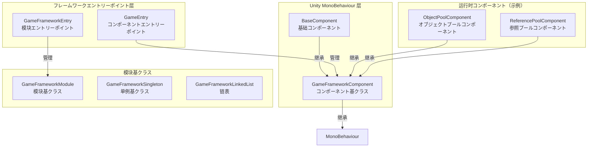
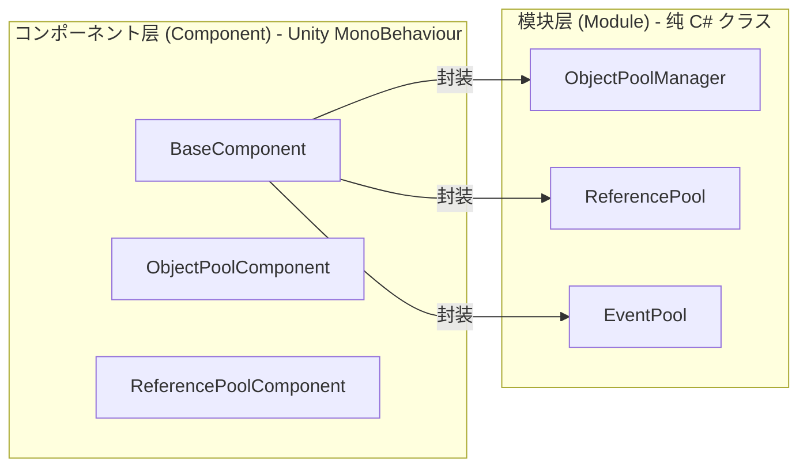
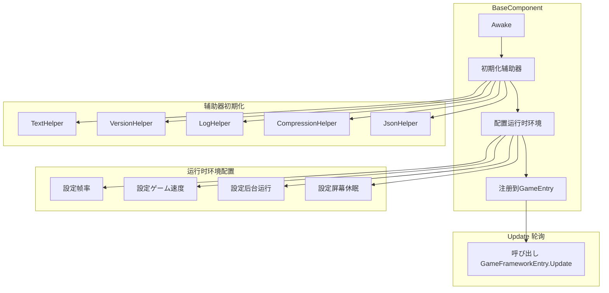

# 基础コンポーネント

基础コンポーネント是 GameFrameX フレームワーク的コア底层架构，提供しますゲーム运行时所需的基础機能和コンポーネント管理机制。它们构成了整个フレームワーク的支柱，其他所有機能模块都依赖于这些基础コンポーネント。

## 概要

GameFrameX 的基础コンポーネント位于 `Runtime/Base` ディレクトリ下，包含了フレームワーク的コアエントリーポイント、コンポーネント基クラス、模块基クラス以及基础数据结构。这些コンポーネント负责：

- **ゲーム运行时环境配置**：帧率、ゲーム速度、后台运行、屏幕休眠等
- **コンポーネント生命周期管理**：注册、取得、销毁
- **模块系统**：模块的作成、轮询、关闭
- **单例与数据结构**：提供常用的设计模式実装

### コアクラス关系



## 架构详解

### コンポーネント系统架构

GameFrameX 采用双层アーキテクチャ設計：コンポーネント层（Component）和模块层（Module）。



**设计意图：**
- **コンポーネント层**を継承 `MonoBehaviour`，可能直接挂载到 Unity シーン中的 GameObject 上
- **模块层**是纯 C# クラス，负责具体的业务逻辑実装
- コンポーネント层作为模块层的门面（Facade），对外提供统一的访问方法

### BaseComponent 详解

`BaseComponent` 是フレームワーク的コアコンポーネント，必須挂载在シーン中。它负责初期化ゲーム运行时环境和各种辅助工具。



### コンポーネント注册与取得フロー


## コア機能

### 1. 运行时环境控制

BaseComponent 提供します对ゲーム运行时环境的全面控制能力：

| 機能 | プロパティ | 説明 |
|------|------|------|
| 帧率控制 | `FrameRate` | 設定 `Application.targetFrameRate` |
| ゲーム速度 | `GameSpeed` | 控制 `Time.timeScale`，サポート慢动作 |
| 暂停ステータス | `IsGamePaused` | 读取ゲーム是否已暂停 |
| 正常速度 | `IsNormalGameSpeed` | 检查是否以1x速度运行 |
| 后台运行 | `RunInBackground` | 設定 `Application.runInBackground` |
| 屏幕休眠 | `NeverSleep` | 控制 `Screen.sleepTimeout` |

**代码示例：**

```csharp
// 取得基础コンポーネント
var baseComponent = GameEntry.GetComponent<BaseComponent>();

// 控制帧率
baseComponent.FrameRate = 60;

// 暂停ゲーム
baseComponent.PauseGame();

// 恢复ゲーム
baseComponent.ResumeGame();

// 禁止休眠
baseComponent.NeverSleep = true;
```
> Source: [BaseComponent.cs](https://github.com/GameFrameX/com.gameframex.unity/blob/main/Runtime/Base/BaseComponent.cs#L220-L243)

### 2. コンポーネント访问

を通じて `GameEntry` 静态クラス可能访问所有已注册的フレームワークコンポーネント：

```csharp
// を通じて泛型取得コンポーネント
var baseComponent = GameEntry.GetComponent<BaseComponent>();
var objectPool = GameEntry.GetComponent<ObjectPoolComponent>();

// を通じてクラス型取得コンポーネント
var component = GameEntry.GetComponent(typeof(BaseComponent));

// を通じてクラス型名称取得コンポーネント
var component = GameEntry.GetComponent("BaseComponent");
```
> Source: [GameEntry.cs](https://github.com/GameFrameX/com.gameframex.unity/blob/main/Runtime/Base/GameEntry.cs#L67-L121)

### 3. 模块管理

`GameFrameworkEntry` 负责管理所有フレームワーク模块的作成、轮询和销毁：

```csharp
// 取得模块（を通じてインターフェース）
var module = GameFrameworkEntry.GetModule<IObjectPoolManager>();

// 模块会自动按优先级排序
// Update 会在每一帧被呼び出し
```
> Source: [GameFrameworkEntry.cs](https://github.com/GameFrameX/com.gameframex.unity/blob/main/Runtime/Base/GameFrameworkEntry.cs#L95-L120)

### 4. フレームワーク关闭

フレームワークサポート三种关闭模式：

```csharp
// 仅关闭フレームワーク（不退出）
GameEntry.Shutdown(ShutdownType.None);

// 关闭并重启ゲーム
GameEntry.Shutdown(ShutdownType.Restart);

// 关闭并退出ゲーム
GameEntry.Shutdown(ShutdownType.Quit);
```
> Source: [ShutdownType.cs](https://github.com/GameFrameX/com.gameframex.unity/blob/main/Runtime/Base/ShutdownType.cs#L41-L66)

## 基础数据结构

### 单例模式

GameFrameX 提供します线程安全的单例基クラス：

```csharp
public class MySingleton : GameFrameworkSingleton<MySingleton>
{
    public void DoSomething()
    {
        // 单例メソッド
    }
}

// 使用
MySingleton.Instance.DoSomething();
```
> Source: [GameFrameworkSingleton.cs](https://github.com/GameFrameX/com.gameframex.unity/blob/main/Runtime/Base/GameFrameworkSingleton.cs#L1-L47)

### 链表数据结构

自定义链表実装，带有节点缓存机制：

```csharp
var list = new GameFrameworkLinkedList<GameFrameworkComponent>();
list.AddLast(component);
var node = list.First;
// ... 使用链表
```
> Source: [GameFrameworkLinkedList.cs](https://github.com/GameFrameX/com.gameframex.unity/blob/main/Runtime/Base/GameFrameworkLinkedList.cs#L47-L59)

## 設定选项

在 Unity 编辑器中，BaseComponent 提供します以下可配置项：

| 配置项 | クラス型 | 默认值 | 説明 |
|--------|------|--------|------|
| TextHelperTypeName | string | "UnityGameFramework.Runtime.DefaultTextHelper" | 文本辅助器クラス型 |
| VersionHelperTypeName | string | "UnityGameFramework.Runtime.DefaultVersionHelper" | 版本辅助器クラス型 |
| LogHelperTypeName | string | "UnityGameFramework.Runtime.DefaultLogHelper" | 日志辅助器クラス型 |
| CompressionHelperTypeName | string | "UnityGameFramework.Runtime.DefaultCompressionHelper" | 压缩辅助器クラス型 |
| JsonHelperTypeName | string | "UnityGameFramework.Runtime.DefaultJsonHelper" | JSON辅助器クラス型 |
| FrameRate | int | 30 | ゲーム目标帧率 |
| GameSpeed | float | 1f | ゲーム运行速度 |
| RunInBackground | bool | true | 是否允许后台运行 |
| NeverSleep | bool | true | 是否禁止屏幕休眠 |

## API 参考

### `BaseComponent`

ゲーム基础コンポーネント，提供运行时环境配置。

#### プロパティ

| プロパティ | クラス型 | 説明 |
|------|------|------|
| `FrameRate` | int | 取得或設定ゲーム帧率 |
| `GameSpeed` | float | 取得或設定ゲーム速度 |
| `IsGamePaused` | bool | 取得ゲーム是否已暂停 |
| `IsNormalGameSpeed` | bool | 取得ゲーム是否以正常速度运行 |
| `RunInBackground` | bool | 取得或設定是否允许后台运行 |
| `NeverSleep` | bool | 取得或設定是否禁止休眠 |

#### メソッド

| メソッド | 返回クラス型 | 説明 |
|------|----------|------|
| `PauseGame()` | void | 暂停ゲーム |
| `ResumeGame()` | void | 恢复ゲーム |
| `ResetNormalGameSpeed()` | void | 重置为正常ゲーム速度 |

### `GameEntry`

フレームワークコンポーネント访问エントリーポイント点。

#### メソッド

| メソッド | 返回クラス型 | 説明 |
|------|----------|------|
| `GetComponent<T>()` | T | 取得指定クラス型的コンポーネント |
| `GetComponent(Type)` | GameFrameworkComponent | を通じてクラス型取得コンポーネント |
| `GetComponent(string)` | GameFrameworkComponent | を通じてクラス型名称取得コンポーネント |
| `Shutdown(ShutdownType)` | void | 关闭フレームワーク |

### `GameFrameworkEntry`

フレームワーク模块管理エントリーポイント。

#### メソッド

| メソッド | 返回クラス型 | 説明 |
|------|----------|------|
| `GetModule<T>()` | T | 取得指定インターフェース的模块 |
| `GetModule(Type)` | GameFrameworkModule | を通じてクラス型取得模块 |
| `Update(float, float)` | void | 轮询所有模块 |
| `Shutdown()` | void | 关闭所有模块 |

### `GameFrameworkComponent`

コンポーネント抽象基底クラス。

#### プロパティ

| プロパティ | クラス型 | 説明 |
|------|------|------|
| `IsAutoRegister` | bool | 取得或設定是否自动注册 |
| `ImplementationComponentType` | Type | 実装クラスクラス型 |
| `InterfaceComponentType` | Type | インターフェースクラスクラス型 |

### `GameFrameworkModule`

模块抽象基底クラス。

#### プロパティ

| プロパティ | クラス型 | 説明 |
|------|------|------|
| `Priority` | int | 模块优先级，优先级高的先轮询 |

#### メソッド

| メソッド | 返回クラス型 | 説明 |
|------|----------|------|
| `Update(float, float)` | void | 轮询模块 |
| `Shutdown()` | void | 关闭并清理模块 |

## 使用例

### 初期化フレームワーク

1. 在 Unity シーン中作成一个空 GameObject，名前を付ける "GameFrame"
2. 添加 `BaseComponent` コンポーネント
3. に基づいて必要配置各项参数
4. 运行ゲーム

```csharp
// GameEntry.cs 会被自动作成
// BaseComponent 在 Awake 中完成初期化
```
> Source: [BaseComponent.cs](https://github.com/GameFrameX/com.gameframex.unity/blob/main/Runtime/Base/BaseComponent.cs#L153-L192)

### 暂停/恢复ゲーム

```csharp
var baseComponent = GameEntry.GetComponent<BaseComponent>();

// 暂停ゲーム（时间静止）
baseComponent.PauseGame();

// 检查是否暂停
if (baseComponent.IsGamePaused)
{
    Debug.Log("ゲーム已暂停");
}

// 恢复ゲーム
baseComponent.ResumeGame();

// 或者重置为正常速度
baseComponent.ResetNormalGameSpeed();
```
> Source: [BaseComponent.cs](https://github.com/GameFrameX/com.gameframex.unity/blob/main/Runtime/Base/BaseComponent.cs#L216-L257)

### 作成自定义模块

```csharp
public interface IMyModule : GameFramework.IModule
{
    void DoSomething();
}

public class MyModule : GameFrameworkModule, IMyModule
{
    // 优先级：数值越大越先被处理
    internal override int Priority => 10;

    // 每帧轮询
    protected internal override void Update(float elapseSeconds, float realElapseSeconds)
    {
        // 轮询逻辑
    }

    // 关闭时清理リソース
    protected internal override void Shutdown()
    {
        // 清理逻辑
    }

    public void DoSomething()
    {
        // 业务逻辑
    }
}
```
> Source: [GameFrameworkModule.cs](https://github.com/GameFrameX/com.gameframex.unity/blob/main/Runtime/Base/GameFrameworkModule.cs#L40-L70)

## 関連リンク

- [イベント系统](./5-runtime.event-system) - フレームワーク内置的イベント系统
- [オブジェクトプールシステム](./5-runtime.object-pool) - オブジェクトプール管理
- [参照プールシステム](./5-runtime.reference-pool) - 参照プール管理
- [任务池系统](./5-runtime.task-pool) - 异步任务管理
- [扩展メソッド库](./5-runtime.extension-methods) - 常用扩展メソッド
- [API 参考](./8-api-reference) - 完整 API 文档
