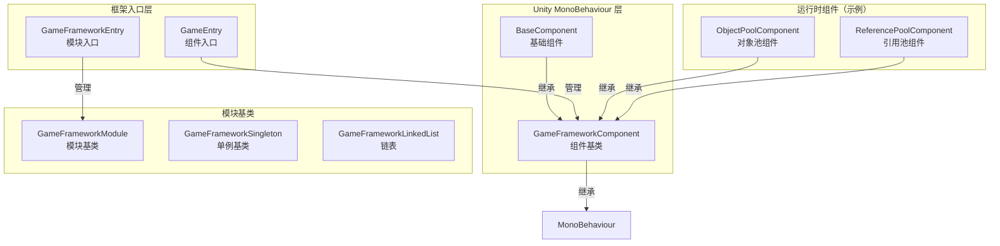
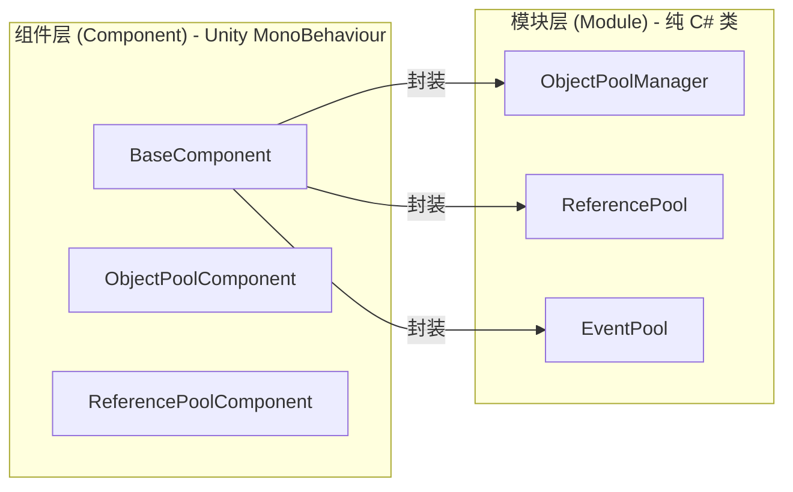
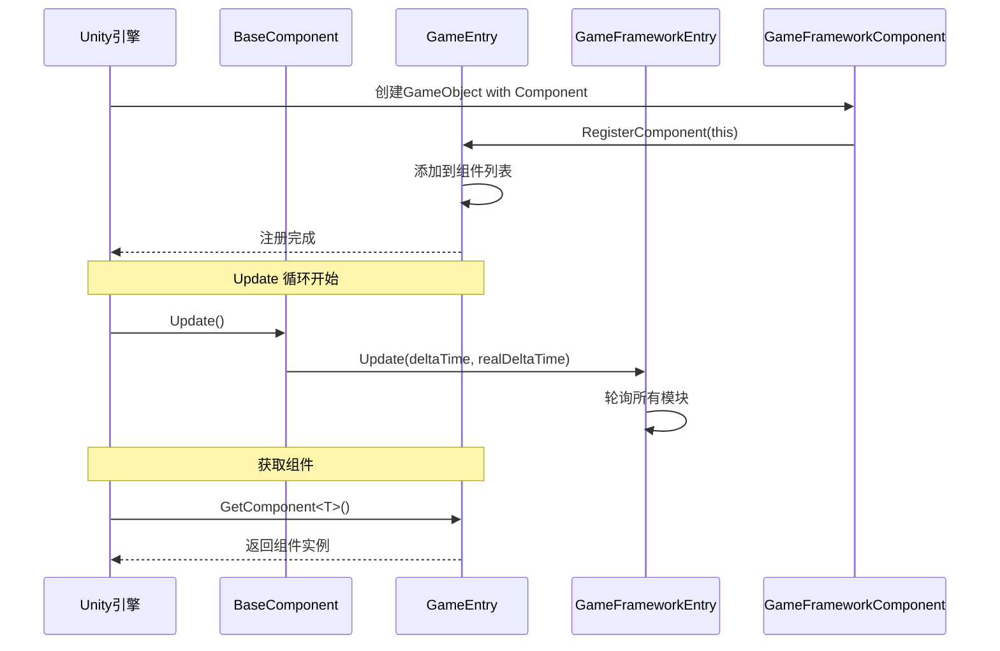

# 基本コンポーネント

基本コンポーネント是 GameFrameX フレームワーク的コア底层アーキテクチャ，提供します游戏ランタイム所需的基本機能和コンポーネント管理机制。它们构成了整个フレームワーク的支柱，其他所有機能モジュール都依赖于这些基本コンポーネント。

## 概要

GameFrameX 的基本コンポーネント位于 `Runtime/Base` ディレクトリ下，パッケージ含了フレームワーク的コア入口、コンポーネント基底クラス、モジュール基底クラスおよび基本数据结构。这些コンポーネント负责：

- **游戏ランタイム環境設定**：帧率、游戏速度、后台运行、屏幕休眠等
- **コンポーネントライフサイクル管理**：登録、取得、破棄
- **モジュール系统**：モジュール的作成、轮询、閉じる
- **单例与数据结构**：提供常用的設計モード実装

### コア类关系



## アーキテクチャ详解

### コンポーネント系统アーキテクチャ

GameFrameX 采用双层アーキテクチャ設計：コンポーネント層（Component）和モジュール层（Module）。



**設計意图：**
- **コンポーネント層**継承自 `MonoBehaviour`，〜できます直接挂载到 Unity シーン中的 GameObject 上
- **モジュール层**是纯 C# 类，负责具体的业务逻辑実装
- コンポーネント層作为モジュール层的门面（Facade），对外提供統一された的访问方法

### BaseComponent 详解

`BaseComponent` 是フレームワーク的コアコンポーネント，〜しなければなりません挂载在シーン中。它负责初期化游戏ランタイム環境和各种辅助工具。


### コンポーネント登録与取得フロー



## コア機能

### 1. ランタイム環境控制

BaseComponent 提供します对游戏ランタイム環境的全面控制能力：

| 機能 | プロパティ | 説明 |
|------|------|------|
| 帧率控制 | `FrameRate` | 設定 `Application.targetFrameRate` |
| 游戏速度 | `GameSpeed` | 控制 `Time.timeScale`，サポート慢动作 |
| 暂停ステータス | `IsGamePaused` | 读取游戏是否已暂停 |
| 正常速度 | `IsNormalGameSpeed` | 確認是否以1x速度运行 |
| 后台运行 | `RunInBackground` | 設定 `Application.runInBackground` |
| 屏幕休眠 | `NeverSleep` | 控制 `Screen.sleepTimeout` |

**コード例：**

```csharp
// 获取基础组件
var baseComponent = GameEntry.GetComponent<BaseComponent>();

// 控制帧率
baseComponent.FrameRate = 60;

// 暂停游戏
baseComponent.PauseGame();

// 恢复游戏
baseComponent.ResumeGame();

// 禁止休眠
baseComponent.NeverSleep = true;
```
> Source: [BaseComponent.cs](https://github.com/GameFrameX/com.gameframex.unity/blob/main/Runtime/Base/BaseComponent.cs#L220-L243)

### 2. コンポーネント访问

通过 `GameEntry` 静态类〜できます访问所有已登録的フレームワークコンポーネント：

```csharp
// 通过泛型获取组件
var baseComponent = GameEntry.GetComponent<BaseComponent>();
var objectPool = GameEntry.GetComponent<ObjectPoolComponent>();

// 通过类型获取组件
var component = GameEntry.GetComponent(typeof(BaseComponent));

// 通过类型名称获取组件
var component = GameEntry.GetComponent("BaseComponent");
```
> Source: [GameEntry.cs](https://github.com/GameFrameX/com.gameframex.unity/blob/main/Runtime/Base/GameEntry.cs#L67-L121)

### 3. モジュール管理

`GameFrameworkEntry` 负责管理所有フレームワークモジュール的作成、轮询和破棄：

```csharp
// 获取模块（通过接口）
var module = GameFrameworkEntry.GetModule<IObjectPoolManager>();

// 模块会自动按优先级排序
// Update 会在每一帧被调用
```
> Source: [GameFrameworkEntry.cs](https://github.com/GameFrameX/com.gameframex.unity/blob/main/Runtime/Base/GameFrameworkEntry.cs#L95-L120)

### 4. フレームワーク閉じる

フレームワークサポート三种閉じるモード：

```csharp
// 仅关闭框架（不退出）
GameEntry.Shutdown(ShutdownType.None);

// 关闭并重启游戏
GameEntry.Shutdown(ShutdownType.Restart);

// 关闭并退出游戏
GameEntry.Shutdown(ShutdownType.Quit);
```
> Source: [ShutdownType.cs](https://github.com/GameFrameX/com.gameframex.unity/blob/main/Runtime/Base/ShutdownType.cs#L41-L66)

## 基本数据结构

### 单例モード

GameFrameX 提供します线程安全的单例基底クラス：

```csharp
public class MySingleton : GameFrameworkSingleton<MySingleton>
{
    public void DoSomething()
    {
        // 单例方法
    }
}

// 使用
MySingleton.Instance.DoSomething();
```
> Source: [GameFrameworkSingleton.cs](https://github.com/GameFrameX/com.gameframex.unity/blob/main/Runtime/Base/GameFrameworkSingleton.cs#L1-L47)

### 链表数据结构

自定義链表実装，带有节点缓存机制：

```csharp
var list = new GameFrameworkLinkedList<GameFrameworkComponent>();
list.AddLast(component);
var node = list.First;
// ... 使用链表
```
> Source: [GameFrameworkLinkedList.cs](https://github.com/GameFrameX/com.gameframex.unity/blob/main/Runtime/Base/GameFrameworkLinkedList.cs#L47-L59)

## 設定オプション

在 Unity エディタ中，BaseComponent 提供します以下可設定项：

| 設定项 | タイプ | デフォルト值 | 説明 |
|--------|------|--------|------|
| TextHelperTypeName | string | "UnityGameFramework.Runtime.DefaultTextHelper" | 文本辅助器タイプ |
| VersionHelperTypeName | string | "UnityGameFramework.Runtime.DefaultVersionHelper" | バージョン辅助器タイプ |
| LogHelperTypeName | string | "UnityGameFramework.Runtime.DefaultLogHelper" | ログ辅助器タイプ |
| CompressionHelperTypeName | string | "UnityGameFramework.Runtime.DefaultCompressionHelper" | 压缩辅助器タイプ |
| JsonHelperTypeName | string | "UnityGameFramework.Runtime.DefaultJsonHelper" | JSON辅助器タイプ |
| FrameRate | int | 30 | 游戏目标帧率 |
| GameSpeed | float | 1f | 游戏运行速度 |
| RunInBackground | bool | true | 是否允许后台运行 |
| NeverSleep | bool | true | 是否禁止屏幕休眠 |

## API リファレンス

### `BaseComponent`

游戏基本コンポーネント，提供ランタイム環境設定。

#### プロパティ

| プロパティ | タイプ | 説明 |
|------|------|------|
| `FrameRate` | int | 取得或設定游戏帧率 |
| `GameSpeed` | float | 取得或設定游戏速度 |
| `IsGamePaused` | bool | 取得游戏是否已暂停 |
| `IsNormalGameSpeed` | bool | 取得游戏是否以正常速度运行 |
| `RunInBackground` | bool | 取得或設定是否允许后台运行 |
| `NeverSleep` | bool | 取得或設定是否禁止休眠 |

#### メソッド

| メソッド | 返すタイプ | 説明 |
|------|----------|------|
| `PauseGame()` | void | 暂停游戏 |
| `ResumeGame()` | void | 恢复游戏 |
| `ResetNormalGameSpeed()` | void | 重置为正常游戏速度 |

### `GameEntry`

フレームワークコンポーネント访问入口点。

#### メソッド

| メソッド | 返すタイプ | 説明 |
|------|----------|------|
| `GetComponent<T>()` | T | 取得指定タイプ的コンポーネント |
| `GetComponent(Type)` | GameFrameworkComponent | 通过タイプ取得コンポーネント |
| `GetComponent(string)` | GameFrameworkComponent | 通过タイプ名称取得コンポーネント |
| `Shutdown(ShutdownType)` | void | 閉じるフレームワーク |

### `GameFrameworkEntry`

フレームワークモジュール管理入口。

#### メソッド

| メソッド | 返すタイプ | 説明 |
|------|----------|------|
| `GetModule<T>()` | T | 取得指定インターフェース的モジュール |
| `GetModule(Type)` | GameFrameworkModule | 通过タイプ取得モジュール |
| `Update(float, float)` | void | 轮询所有モジュール |
| `Shutdown()` | void | 閉じる所有モジュール |

### `GameFrameworkComponent`

コンポーネント抽象基底クラス。

#### プロパティ

| プロパティ | タイプ | 説明 |
|------|------|------|
| `IsAutoRegister` | bool | 取得或設定是否自动登録 |
| `ImplementationComponentType` | Type | 実装类タイプ |
| `InterfaceComponentType` | Type | インターフェース类タイプ |

### `GameFrameworkModule`

モジュール抽象基底クラス。

#### プロパティ

| プロパティ | タイプ | 説明 |
|------|------|------|
| `Priority` | int | モジュール优先级，优先级高的先轮询 |

#### メソッド

| メソッド | 返すタイプ | 説明 |
|------|----------|------|
| `Update(float, float)` | void | 轮询モジュール |
| `Shutdown()` | void | 閉じる并清理モジュール |

## 使用例

### 初期化フレームワーク

1. 在 Unity シーン中作成一个空 GameObject，命名为 "GameFrame"
2. 追加 `BaseComponent` コンポーネント
3. 根据〜する必要があります設定各项パラメータ
4. 运行游戏

```csharp
// GameEntry.cs 会被自动创建
// BaseComponent 在 Awake 中完成初始化
```
> Source: [BaseComponent.cs](https://github.com/GameFrameX/com.gameframex.unity/blob/main/Runtime/Base/BaseComponent.cs#L153-L192)

### 暂停/恢复游戏

```csharp
var baseComponent = GameEntry.GetComponent<BaseComponent>();

// 暂停游戏（时间静止）
baseComponent.PauseGame();

// 检查是否暂停
if (baseComponent.IsGamePaused)
{
    Debug.Log("游戏已暂停");
}

// 恢复游戏
baseComponent.ResumeGame();

// 或者重置为正常速度
baseComponent.ResetNormalGameSpeed();
```
> Source: [BaseComponent.cs](https://github.com/GameFrameX/com.gameframex.unity/blob/main/Runtime/Base/BaseComponent.cs#L216-L257)

### 作成自定義モジュール

```csharp
public interface IMyModule : GameFramework.IModule
{
    void DoSomething();
}

public class MyModule : GameFrameworkModule, IMyModule
{
    // 优先级：数值越大越先被处理
    internal override int Priority => 10;

    // 每帧轮询
    protected internal override void Update(float elapseSeconds, float realElapseSeconds)
    {
        // 轮询逻辑
    }

    // 关闭时清理资源
    protected internal override void Shutdown()
    {
        // 清理逻辑
    }

    public void DoSomething()
    {
        // 业务逻辑
    }
}
```
> Source: [GameFrameworkModule.cs](https://github.com/GameFrameX/com.gameframex.unity/blob/main/Runtime/Base/GameFrameworkModule.cs#L40-L70)

## 関連リンク

- [イベント系统](./5-runtime.event-system) - フレームワーク内置的イベント系统
- [对象池系统](./5-runtime.object-pool) - 对象池管理
- [参照池系统](./5-runtime.reference-pool) - 参照池管理
- [任务池系统](./5-runtime.task-pool) - 异步任务管理
- [拡張メソッド库](./5-runtime.extension-methods) - 常用拡張メソッド
- [API リファレンス](./8-api-reference) - 完全な API ドキュメント
