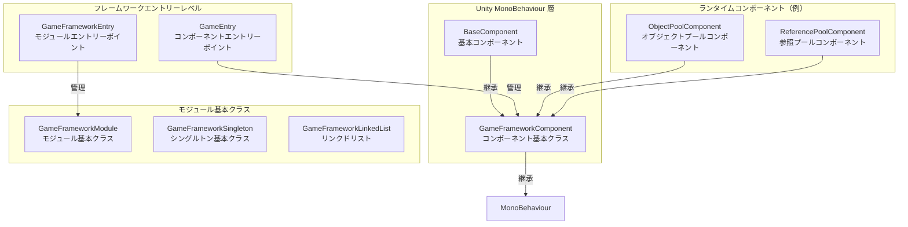
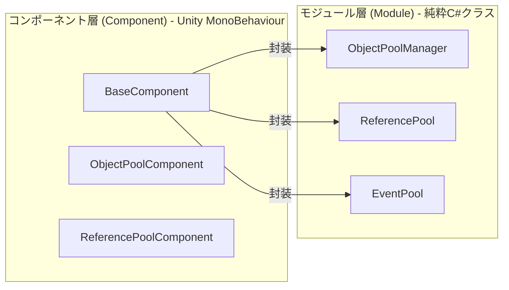
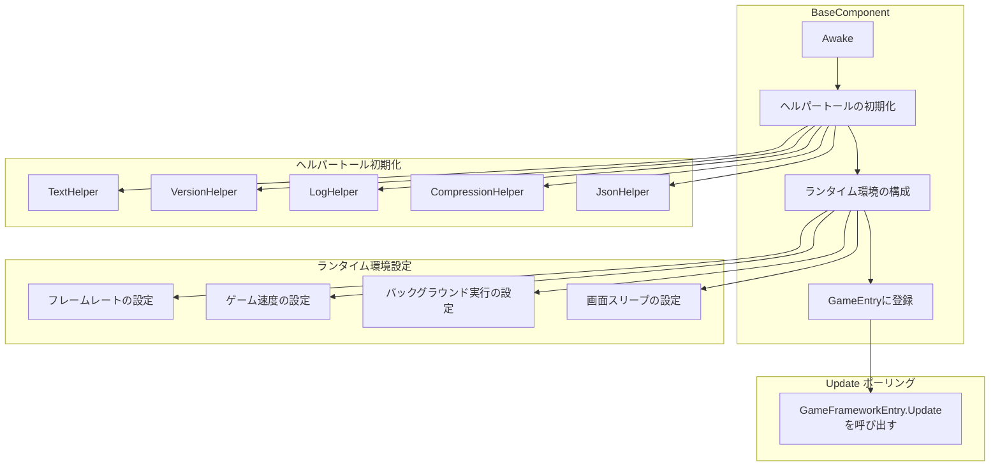

# 基本コンポーネント

基本コンポーネントはGameFrameXフレームワークのコア基盤アーキテクチャであり、ゲームランタイム所需の基本機能とコンポーネント管理メカニズムを提供します。これらはフレームワーク全体の柱を構成し、他のすべての機能モジュールはこれらの基本コンポーネントに依存しています。

## 概要

GameFrameXの基本コンポーネントは`Runtime/Base`ディレクトリにあり、フレームワークのコアエントリーポイント、コンポーネント基本クラス、モジュール基本クラス、基本データ構造体を含みます。これらのコンポーネントは以下の責任を負います：

- **ゲームランタイム環境設定**：フレームレート、ゲーム速度、バックグラウンド実行、画面スリープなど
- **コンポーネントライフサイクル管理**：登録、取得、破棄
- **モジュールシステム**：モジュールの作成、ポーリング、終了
- **シングルトンとデータ構造**：一般的に使用されるデザインパターンの実装

### コアクラス関係



## アーキテクチャ詳細

### コンポーネントシステムアーキテクチャ

GameFrameXは二層アーキテクチャ設計を採用しています：コンポーネント層（Component）とモジュール層（Module）。



**設計意図：**
- **コンポーネント層**は`MonoBehaviour`を継承し、Unityシーン内のGameObjectに直接アタッチ可能
- **モジュール層**は純粋なC#クラスであり、具体的なビジネスロジック実装を担当
- コンポーネント層はモジュール層のファサード（Facade）として機能し、外部に統一のアクセス方法を提供

### BaseComponent詳細

`BaseComponent`はフレームワークのコアコンポーネントであり、シーンにアタッチする必要があります。ゲームランタイム環境と各種ヘルパートールを初期化する責務を負います。



### コンポーネント登録と取得フロー


## コア機能

### 1. ランタイム環境制御

BaseComponentはゲームランタイム環境の全面的制御能力を提供します：

| 機能 | プロパティ | 説明 |
|------|------|------|
| フレームレート制御 | `FrameRate` | `Application.targetFrameRate`を設定 |
| ゲーム速度 | `GameSpeed` | `Time.timeScale`を制御、スローモーション対応 |
| 一時停止状態 | `IsGamePaused` | ゲームが一時停止しているかどうかを取得 |
| 通常速度 | `IsNormalGameSpeed` | 1x速度で実行しているかどうかを確認 |
| バックグラウンド実行 | `RunInBackground` | `Application.runInBackground`を設定 |
| 画面スリープ | `NeverSleep` | `Screen.sleepTimeout`を制御 |

**コード例：**

```csharp
// 基本コンポーネントを取得
var baseComponent = GameEntry.GetComponent<BaseComponent>();

// フレームレートを制御
baseComponent.FrameRate = 60;

// ゲームを一時停止
baseComponent.PauseGame();

// ゲームを再開
baseComponent.ResumeGame();

// スリープを禁止
baseComponent.NeverSleep = true;
```
> Source: [BaseComponent.cs](https://github.com/GameFrameX/com.gameframex.unity/blob/main/Runtime/Base/BaseComponent.cs#L220-L243)

### 2. コンポーネントアクセス

`GameEntry`静的クラスを通じてすべての登録済みフレームワークコンポーネントにアクセスできます：

```csharp
// ジェネリックでコンポーネントを取得
var baseComponent = GameEntry.GetComponent<BaseComponent>();
var objectPool = GameEntry.GetComponent<ObjectPoolComponent>();

// 型でコンポーネントを取得
var component = GameEntry.GetComponent(typeof(BaseComponent));

// 型名でコンポーネントを取得
var component = GameEntry.GetComponent("BaseComponent");
```
> Source: [GameEntry.cs](https://github.com/GameFrameX/com.gameframex.unity/blob/main/Runtime/Base/GameEntry.cs#L67-L121)

### 3. モジュール管理

`GameFrameworkEntry`はすべてのフレームワークモジュールの作成、ポーリング、破棄を管理します：

```csharp
// モジュールを取得（インターフェース経由）
var module = GameFrameworkEntry.GetModule<IObjectPoolManager>();

// モジュールは自動的に優先順位でソートされる
// Updateは毎フレーム呼び出される
```
> Source: [GameFrameworkEntry.cs](https://github.com/GameFrameX/com.gameframex.unity/blob/main/Runtime/Base/GameFrameworkEntry.cs#L95-L120)

### 4. フレームワーク終了

フレームワークは三種類の終了モードをサポートしています：

```csharp
// フレームワークのみ終了（終了しない）
GameEntry.Shutdown(ShutdownType.None);

// ゲームをリスタート
GameEntry.Shutdown(ShutdownType.Restart);

// ゲームを終了
GameEntry.Shutdown(ShutdownType.Quit);
```
> Source: [ShutdownType.cs](https://github.com/GameFrameX/com.gameframex.unity/blob/main/Runtime/Base/ShutdownType.cs#L41-L66)

## 基本データ構造

### シングルトンパターン

GameFrameXはスレッドセーフなシングルトンベースクラスを提供します：

```csharp
public class MySingleton : GameFrameworkSingleton<MySingleton>
{
    public void DoSomething()
    {
        // シングルトンメソッド
    }
}

// 使用
MySingleton.Instance.DoSomething();
```
> Source: [GameFrameworkSingleton.cs](https://github.com/GameFrameX/com.gameframex.unity/blob/main/Runtime/Base/GameFrameworkSingleton.cs#L1-L47)

### リンクドリストデータ構造

カスタムリンクドリスト実装、ノードキャッシュメカニズム付き：

```csharp
var list = new GameFrameworkLinkedList<GameFrameworkComponent>();
list.AddLast(component);
var node = list.First;
// ... リンクリストを使用
```
> Source: [GameFrameworkLinkedList.cs](https://github.com/GameFrameX/com.gameframex.unity/blob/main/Runtime/Base/GameFrameworkLinkedList.cs#L47-L59)

## 設定オプション

Unityエディターで、BaseComponentは以下の設定項目を提供します：

| 設定項目 | 型 | デフォルト値 | 説明 |
|--------|------|--------|------|
| TextHelperTypeName | string | "UnityGameFramework.Runtime.DefaultTextHelper" | テキストヘルパートール型 |
| VersionHelperTypeName | string | "UnityGameFramework.Runtime.DefaultVersionHelper" | バージョンヘルパートール型 |
| LogHelperTypeName | string | "UnityGameFramework.Runtime.DefaultLogHelper" | ログヘルパートール型 |
| CompressionHelperTypeName | string | "UnityGameFramework.Runtime.DefaultCompressionHelper" | 圧縮ヘルパートール型 |
| JsonHelperTypeName | string | "UnityGameFramework.Runtime.DefaultJsonHelper" | JSONヘルパートール型 |
| FrameRate | int | 30 | ゲームターゲットフレームレート |
| GameSpeed | float | 1f | ゲーム実行速度 |
| RunInBackground | bool | true | バックグラウンド実行を許可するか |
| NeverSleep | bool | true | 画面スリープを禁止するか |

## APIリファレンス

### `BaseComponent`

ゲーム基本コンポーネント、ランタイム環境設定を提供します。

#### プロパティ

| プロパティ | 型 | 説明 |
|------|------|------|
| `FrameRate` | int | ゲームフレームレートを取得または設定 |
| `GameSpeed` | float | ゲーム速度を取得または設定 |
| `IsGamePaused` | bool | ゲームが一時停止しているかどうかを取得 |
| `IsNormalGameSpeed` | bool | ゲームが通常速度で実行しているかどうかを取得 |
| `RunInBackground` | bool | バックグラウンド実行を許可するかどうかを取得または設定 |
| `NeverSleep` | bool | スリープを禁止するかどうかを取得または設定 |

#### メソッド

| メソッド | 戻り値型 | 説明 |
|------|----------|------|
| `PauseGame()` | void | ゲームを一時停止 |
| `ResumeGame()` | void | ゲームを再開 |
| `ResetNormalGameSpeed()` | void | 通常ゲーム速度にリセット |

### `GameEntry`

フレームワークコンポーネントアクセスエントリーポイント。

#### メソッド

| メソッド | 戻り値型 | 説明 |
|------|----------|------|
| `GetComponent<T>()` | T | 指定した型のコンポーネントを取得 |
| `GetComponent(Type)` | GameFrameworkComponent | 型でコンポーネントを取得 |
| `GetComponent(string)` | GameFrameworkComponent | 型名でコンポーネントを取得 |
| `Shutdown(ShutdownType)` | void | フレームワークを終了 |

### `GameFrameworkEntry`

フレームワークモジュール管理エントリーポイント。

#### メソッド

| メソッド | 戻り値型 | 説明 |
|------|----------|------|
| `GetModule<T>()` | T | 指定したインターフェースのモジュールを取得 |
| `GetModule(Type)` | GameFrameworkModule | 型でモジュールを取得 |
| `Update(float, float)` | void | すべてのモジュールをポーリング |
| `Shutdown()` | void | すべてのモジュールを終了 |

### `GameFrameworkComponent`

コンポーネント抽象基本クラス。

#### プロパティ

| プロパティ | 型 | 説明 |
|------|------|------|
| `IsAutoRegister` | bool | 自動登録するかどうかを取得または設定 |
| `ImplementationComponentType` | Type | 実装クラス型 |
| `InterfaceComponentType` | Type | インターフェースクラス型 |

### `GameFrameworkModule`

モジュール抽象基本クラス。

#### プロパティ

| プロパティ | 型 | 説明 |
|------|------|------|
| `Priority` | int | モジュールの優先順位、優先順位が高いほど先にポーリング |

#### メソッド

| メソッド | 戻り値型 | 説明 |
|------|----------|------|
| `Update(float, float)` | void | モジュールをポーリング |
| `Shutdown()` | void | モジュールを終了してクリーンアップ |

## 使用例

### フレームワークの初期化

1. Unityシーンで空のGameObjectを作成し、「GameFrame」と命名
2. `BaseComponent`コンポーネントを追加
3. 必要に応じて各パラメータを設定
4. ゲームを実行

```csharp
// GameEntry.csは自動的に作成される
// BaseComponentはAwakeで初期化を完了
```
> Source: [BaseComponent.cs](https://github.com/GameFrameX/com.gameframex.unity/blob/main/Runtime/Base/BaseComponent.cs#L153-L192)

### ゲームの一時停止/再開

```csharp
var baseComponent = GameEntry.GetComponent<BaseComponent>();

// ゲームを一時停止（時間停止）
baseComponent.PauseGame();

// 一時停止しているか確認
if (baseComponent.IsGamePaused)
{
    Debug.Log("ゲームが一時停止しています");
}

// ゲームを再開
baseComponent.ResumeGame();

// または通常速度にリセット
baseComponent.ResetNormalGameSpeed();
```
> Source: [BaseComponent.cs](https://github.com/GameFrameX/com.gameframex.unity/blob/main/Runtime/Base/BaseComponent.cs#L216-L257)

### カスタムモジュールの作成

```csharp
public interface IMyModule : GameFramework.IModule
{
    void DoSomething();
}

public class MyModule : GameFrameworkModule, IMyModule
{
    // 優先順位：値が大きいほど先に処理される
    internal override int Priority => 10;

    // 毎フレームポーリング
    protected internal override void Update(float elapseSeconds, float realElapseSeconds)
    {
        // ポーリングロジック
    }

    // 終了時にリソースをクリーンアップ
    protected internal override void Shutdown()
    {
        // クリーンアップロジック
    }

    public void DoSomething()
    {
        // ビジネスロジック
    }
}
```
> Source: [GameFrameworkModule.cs](https://github.com/GameFrameX/com.gameframex.unity/blob/main/Runtime/Base/GameFrameworkModule.cs#L40-L70)

## 関連リンク

- [イベントシステム](./5-runtime.event-system) - フレームワーク組み込みイベントシステム
- [オブジェクトプールシステム](./5-runtime.object-pool) - オブジェクトプール管理
- [参照プールシステム](./5-runtime.reference-pool) - 参照プール管理
- [タスクプールシステム](./5-runtime.task-pool) - 非同期タスク管理
- [拡張メソッドライブラリ](./5-runtime.extension-methods) - 常用拡張メソッド
- [APIリファレンス](./8-api-reference) - 完全なAPIドキュメント
