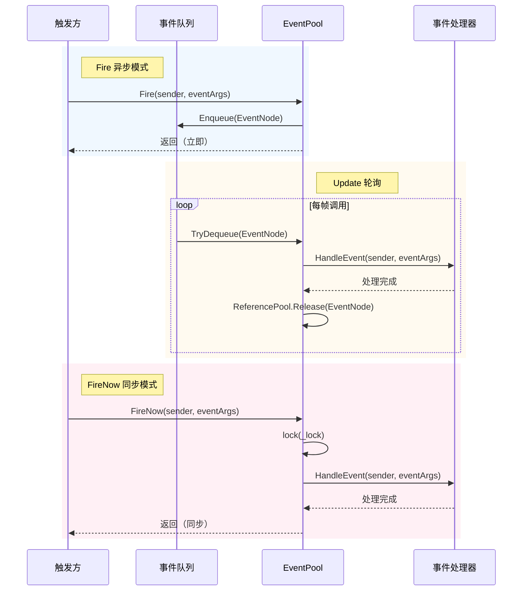
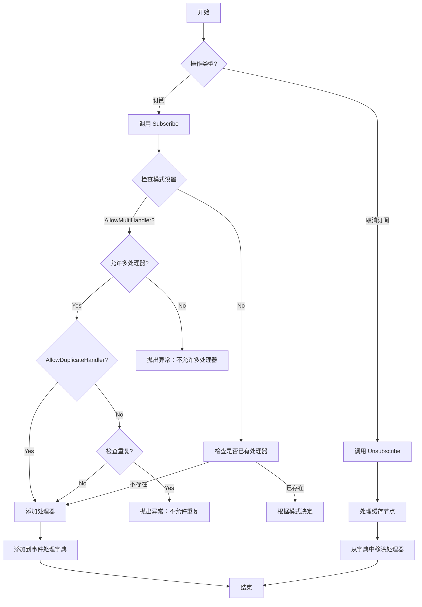

# イベント系统

GameFrameX イベント系统は轻量级、高性能的跨コンポーネント通信解決策，采用リリース-購読モード実装解耦。

## 概要

イベント系统是 GameFrameX フレームワーク的コアモジュール之一，提供します一套完全な的游戏イベント管理机制。它采用**リリース-購読（Publish-Subscribe）モード**，允许游戏中的不同モジュール在不直接相互依赖的情况下进行通信。

### コア特性

- **ジェネリックイベント池**：基于 `EventPool<T>` ジェネリック类，サポートタイプ安全的イベント処理
- **线程安全**：サポート在后台线程トリガーイベント，在主线程コールバック処理
- **双モード分发**：サポート异步队列モード（`Fire`）和同步立つまりモード（`FireNow`）
- **柔軟設定**：通过 `EventPoolMode` 标志列挙型，可設定是否允许多処理器、重复処理器等
- **内存最適化**：使用参照池技术复用イベント节点，减少垃圾回收压力

### 适用シーン

- UI 与游戏逻辑的解耦通信
- モジュール间的松耦合交互
- 异步イベント処理（如网络响应、リソースロード完成等）
- 多モジュールステータス同步

## アーキテクチャ

```mermaid
classDiagram
    class GameFrameworkEventArgs {
        <<abstract>>
        +Clear() void
    }
    
    class BaseEventArgs {
        <<abstract>>
        +Id: string { get }
    }
    
    class EventPoolMode {
        <<enum>>
        +Default
        +AllowNoHandler
        +AllowMultiHandler
        +AllowDuplicateHandler
    }
    
    class EventPool~T~ {
        -_lock: object
        -_eventHandlers: GameFrameworkMultiDictionary
        -_events: ConcurrentQueue~EventNode~
        -_eventPoolMode: EventPoolMode
        +Subscribe(id, handler) void
        +Unsubscribe(id, handler) void
        +Fire(sender, e) void
        +FireNow(sender, e) void
        +Update(elapseSeconds, realElapseSeconds) void
    }
    
    class EventNode {
        <<internal>>
        -_sender: object
        -_eventArgs: T
        +Sender: object
        +EventArgs: T
        +Create(sender, e): EventNode
        +Clear() void
    }
    
    GameFrameworkEventArgs <|-- BaseEventArgs
    BaseEventArgs <|-- T
    EventPoolMode --* EventPool
    EventPool *-- EventNode
    EventNode ..> T
```

### コンポーネント説明

| コンポーネント | 説明 |
|------|------|
| `GameFrameworkEventArgs` | 所有イベントパラメータ的基底クラス，継承自 `EventArgs` 并実装 `IReference` インターフェース |
| `BaseEventArgs` | フレームワークイベントパラメータ基底クラス，定義了イベント ID プロパティ |
| `EventPool<T>` | ジェネリックイベント池，管理特定タイプイベント的購読、取消購読和分发 |
| `EventNode` | 内部类，用于パッケージ装イベント以进行队列処理 |
| `EventPoolMode` | イベント池モード列挙型，控制イベント処理行为 |

## コアコンセプト

### イベントパラメータ

所有自定義イベントパラメータ〜しなければなりません継承自 `BaseEventArgs`，并実装 `Id` プロパティ以标识イベントタイプ。

```csharp
public sealed class PlayerhpChangedEventArgs : BaseEventArgs
{
    public override string Id => "PlayerHpChanged";
    
    public int OldHp { get; private set; }
    public int NewHp { get; private set; }
    
    public static PlayerHpChangedEventArgs Create(int oldHp, int newHp)
    {
        var args = ReferencePool.Acquire<PlayerHpChangedEventArgs>();
        args.OldHp = oldHp;
        args.NewHp = newHp;
        return args;
    }
    
    public override void Clear()
    {
        OldHp = 0;
        NewHp = 0;
    }
}
```

> Source: [BaseEventArgs.cs](https://github.com/GameFrameX/com.gameframex.unity/blob/main/Runtime/Base/EventPool/BaseEventArgs.cs#L34-L54)

### イベント池モード

`EventPoolMode` 是 flags 列挙型，サポート以下オプション：

| モード | 説明 |
|------|------|
| `Default` | デフォルトモード，〜しなければなりません存在且仅一个イベント処理函数 |
| `AllowNoHandler` | 允许不存在イベント処理函数时抛出イベント |
| `AllowMultiHandler` | 允许存在多个イベント処理函数 |
| `AllowDuplicateHandler` | 允许重复的イベント処理函数（需配合 AllowMultiHandler） |

```csharp
[Flags]
public enum EventPoolMode : byte
{
    Default = 0,
    AllowNoHandler = 1,
    AllowMultiHandler = 2,
    AllowDuplicateHandler = 4
}
```

> Source: [EventPoolMode.cs](https://github.com/GameFrameX/com.gameframex.unity/blob/main/Runtime/Base/EventPool/EventPoolMode.cs#L37-L77)

## ワークフロー

### イベント分发フロー



### イベント購読与取消購読



## 使用例

### 基本用法

#### 1. 定義イベントパラメータ

```csharp
public sealed class ScoreChangedEventArgs : BaseEventArgs
{
    public override string Id => "ScoreChanged";
    
    public int OldScore { get; private set; }
    public int NewScore { get; private set; }
    
    public static ScoreChangedEventArgs Create(int oldScore, int newScore)
    {
        var args = ReferencePool.Acquire<ScoreChangedEventArgs>();
        args.OldScore = oldScore;
        args.NewScore = newScore;
        return args;
    }
    
    public override void Clear()
    {
        OldScore = 0;
        NewScore = 0;
    }
}
```

#### 2. 作成イベント池并購読

```csharp
// 创建事件池（支持多处理器）
var eventPool = new EventPool<ScoreChangedEventArgs>(EventPoolMode.AllowMultiHandler);

// 订阅事件
EventHandler<ScoreChangedEventArgs> handler = (sender, e) =>
{
    Debug.Log($"分数变化: {e.OldScore} -> {e.NewScore}");
};
eventPool.Subscribe("ScoreChanged", handler);

// 触发事件（异步，在下一帧处理）
eventPool.Fire(this, ScoreChangedEventArgs.Create(100, 150));

// 触发事件（同步，立即处理）
eventPool.FireNow(this, ScoreChangedEventArgs.Create(150, 200));

// 取消订阅
eventPool.Unsubscribe("ScoreChanged", handler);
```

> Source: [EventPool.cs](https://github.com/GameFrameX/com.gameframex.unity/blob/main/Runtime/Base/EventPool/EventPool.cs#L200-L335)

#### 3. 在 Update 中轮询処理イベント

```csharp
private EventPool<ScoreChangedEventArgs> _eventPool;

void Update(float elapseSeconds, float realElapseSeconds)
{
    // 必须定期调用 Update 处理队列中的事件
    _eventPool.Update(elapseSeconds, realElapseSeconds);
}
```

### 高级用法

#### 設定デフォルト処理器

当イベント没有登録任何処理器时，デフォルト処理器会被呼び出し：

```csharp
var eventPool = new EventPool<ScoreChangedEventArgs>(EventPoolMode.AllowNoHandler);

eventPool.SetDefaultHandler((sender, e) =>
{
    Debug.Log($"默认处理器: 分数变化 {e.OldScore} -> {e.NewScore}");
});

// 即使没有订阅者，也会调用默认处理器
eventPool.Fire(this, ScoreChangedEventArgs.Create(0, 100));
```

#### 组合モード

〜できます组合多个モード标志：

```csharp
// 允许多处理器且允许无处理器
var mode = EventPoolMode.AllowMultiHandler | EventPoolMode.AllowNoHandler;
var eventPool = new EventPool<ScoreChangedEventArgs>(mode);
```

#### 线程安全イベントトリガー

在后台线程中安全地トリガーイベント，イベント会在主线程的 Update 中処理：

```csharp
// 在后台线程中触发
Task.Run(() =>
{
    // 线程安全 - 事件会被加入队列
    eventPool.Fire(networkClient, ScoreChangedEventArgs.Create(oldScore, newScore));
});

// 在主线程的 Update 中处理
void Update(float elapseSeconds, float realElapseSeconds)
{
    eventPool.Update(elapseSeconds, realElapseSeconds);
}
```

## API リファレンス

### EventPool<T>

ジェネリックイベント池类，管理特定タイプイベント的購読、取消購読和分发。

#### コンストラクタ

```csharp
public EventPool(EventPoolMode mode)
```

**パラメータ：**
- `mode` (EventPoolMode): イベント池モード，控制処理器行为

**例：**
```csharp
var eventPool = new EventPool<ScoreChangedEventArgs>(EventPoolMode.Default);
```

#### プロパティ

| プロパティ | タイプ | 説明 |
|------|------|------|
| `EventHandlerCount` | int | 取得已登録的イベント処理函数数量 |
| `EventCount` | int | 取得队列中等待処理的イベント数量 |

#### メソッド

##### Subscribe

購読イベント処理函数。

```csharp
public void Subscribe(string id, EventHandler<T> handler)
```

**パラメータ：**
- `id` (string): イベントタイプ标识
- `handler` (EventHandler<T>): 要購読的イベント処理函数

**例外：**
- `GameFrameworkException`: 当不允许多処理器但已存在処理器，或不允许重复処理器时

---

##### Unsubscribe

取消購読イベント処理函数。

```csharp
public void Unsubscribe(string id, EventHandler<T> handler)
```

**パラメータ：**
- `id` (string): イベントタイプ标识
- `handler` (EventHandler<T>): 要取消購読的イベント処理函数

---

##### Fire

以异步モードトリガーイベント（线程安全，イベント在下一帧分发）。

```csharp
public void Fire(object sender, T e)
```

**パラメータ：**
- `sender` (object): イベント发送者
- `e` (T): イベントパラメータ

**例外：**
- `GameFrameworkException`: 当イベントパラメータ为空时

---

##### FireNow

以同步モード立つまりトリガーイベント（非线程安全）。

```csharp
public void FireNow(object sender, T e)
```

**パラメータ：**
- `sender` (object): イベント发送者
- `e` (T): イベントパラメータ

---

##### Update

轮询并処理队列中的所有イベント。

```csharp
public void Update(float elapseSeconds, float realElapseSeconds)
```

**パラメータ：**
- `elapseSeconds` (float): 逻辑流逝时间（秒）
- `realElapseSeconds` (float): 真实流逝时间（秒）

---

##### Shutdown

閉じる并清理イベント池。

```csharp
public void Shutdown()
```

---

##### Check

確認是否存在指定的イベント処理函数。

```csharp
public bool Check(string id, EventHandler<T> handler)
```

**パラメータ：**
- `id` (string): イベントタイプ标识
- `handler` (EventHandler<T>): 要確認的イベント処理函数

**返す：** 是否存在该処理函数

---

##### Count

取得指定イベントタイプ的処理函数数量。

```csharp
public int Count(string id)
```

**パラメータ：**
- `id` (string): イベントタイプ标识

**返す：** 処理函数数量

---

##### SetDefaultHandler

設定デフォルトイベント処理函数。

```csharp
public void SetDefaultHandler(EventHandler<T> handler)
```

**パラメータ：**
- `handler` (EventHandler<T>): デフォルトイベント処理函数

---

### BaseEventArgs

所有自定義イベントパラメータ的基底クラス。

```csharp
public abstract class BaseEventArgs : GameFrameworkEventArgs
{
    public abstract string Id { get; }
}
```

**プロパティ：**
- `Id` (string): イベントタイプ唯一标识（抽象プロパティ，〜しなければなりません実装）

---

### EventPoolMode

イベント池モード列挙型（Flags）。

```csharp
[Flags]
public enum EventPoolMode : byte
{
    Default = 0,
    AllowNoHandler = 1,
    AllowMultiHandler = 2,
    AllowDuplicateHandler = 4
}
```

## ベストプラクティス

### イベント定義规范

1. **使用有意义的 ID**：イベント ID 应清晰説明イベントタイプ，如 `"PlayerHpChanged"`、`"GameStart"`
2. **実装 Create 工厂メソッド**：提供静态 Create メソッド从参照池取得インスタンス
3. **実装 Clear メソッド**：オーバーライド Clear メソッド清理所有数据，確認してください对象可复用
4. **使用参照池**：通过 ReferencePool 取得和解放イベントパラメータ，减少内存分配

### 性能最適化

1. **避免频繁購読/取消購読**：在モジュール初期化时購読，破棄时取消購読
2. **使用异步モード**：对于后台线程トリガー的イベント，使用 Fire 而非 FireNow
3. **合理設定モード**：根据实际需求选择合适的 EventPoolMode，避免不必要的確認

### エラー処理

1. **確認処理器存在性**：使用 Check メソッド在取消購読前検証
2. **例外捕获**：イベント処理器中的例外会被捕获并记录，但不会中断其他処理器
3. **空值確認**：Fire 和 FireNow 会对イベントパラメータ进行空值確認

## 関連リンク

- [参照池系统](./5-runtime.reference-pool) - イベント系统使用参照池管理イベント节点和イベントパラメータ的内存
- [对象池系统](./5-runtime.object-pool) - 类似的池化技术用于游戏对象管理
- [任务池系统](./5-runtime.task-pool) - 与イベント系统配合使用的异步任务管理
- [基本コンポーネント](./5-runtime.base) - GameFrameX フレームワーク的基本コンポーネントアーキテクチャ
