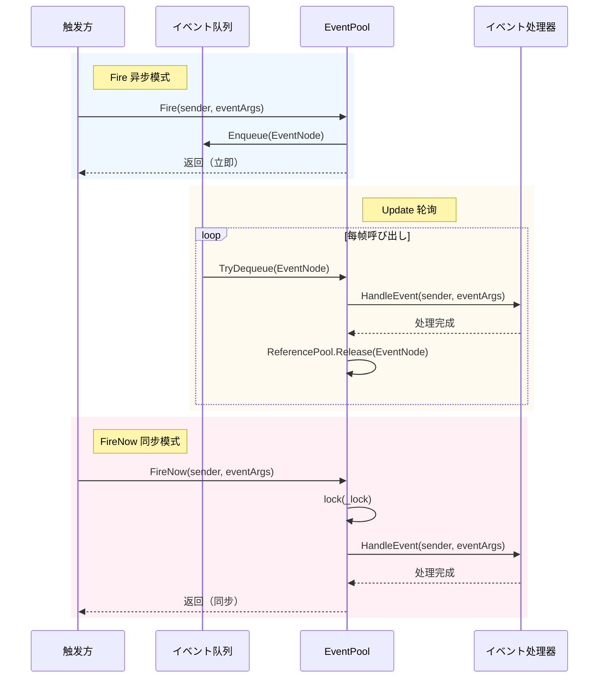
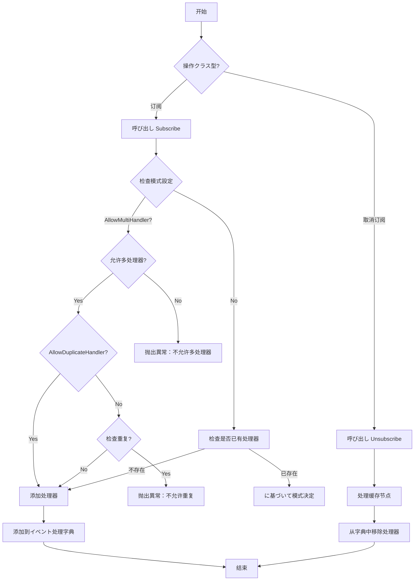

# イベント系统

GameFrameX イベント系统は轻量级、高性能的跨コンポーネント通信解決策，采用发布-订阅模式実装解耦。

## 概要

イベント系统是 GameFrameX フレームワーク的コア模块之一，提供します一套完整的ゲームイベント管理机制。它采用**发布-订阅（Publish-Subscribe）模式**，允许ゲーム中的不同模块在不直接相互依赖的情况下进行通信。

### コア機能

- **泛型イベント池**：基づく `EventPool<T>` 泛型クラス，サポートクラス型安全的イベント处理
- **线程安全**：サポート在后台线程触发イベント，在主线程回调处理
- **双模式分发**：サポート异步队列模式（`Fire`）和同步立即模式（`FireNow`）
- **灵活配置**：を通じて `EventPoolMode` 标志枚举，可配置是否允许多处理器、重复处理器等
- **内存优化**：使用参照プール技术复用イベント节点，减少垃圾回收压力

### 适用シーン

- UI 与ゲーム逻辑的解耦通信
- 模块间的松耦合交互
- 异步イベント处理（如网络响应、リソース加载完成等）
- 多模块ステータス同步

## 架构

```mermaid
classDiagram
    class GameFrameworkEventArgs {
        <<abstract>>
        +Clear() void
    }
    
    class BaseEventArgs {
        <<abstract>>
        +Id: string { get }
    }
    
    class EventPoolMode {
        <<enum>>
        +Default
        +AllowNoHandler
        +AllowMultiHandler
        +AllowDuplicateHandler
    }
    
    class EventPool~T~ {
        -_lock: object
        -_eventHandlers: GameFrameworkMultiDictionary
        -_events: ConcurrentQueue~EventNode~
        -_eventPoolMode: EventPoolMode
        +Subscribe(id, handler) void
        +Unsubscribe(id, handler) void
        +Fire(sender, e) void
        +FireNow(sender, e) void
        +Update(elapseSeconds, realElapseSeconds) void
    }
    
    class EventNode {
        <<internal>>
        -_sender: object
        -_eventArgs: T
        +Sender: object
        +EventArgs: T
        +Create(sender, e): EventNode
        +Clear() void
    }
    
    GameFrameworkEventArgs <|-- BaseEventArgs
    BaseEventArgs <|-- T
    EventPoolMode --* EventPool
    EventPool *-- EventNode
    EventNode ..> T
```

### コンポーネント説明

| コンポーネント | 説明 |
|------|------|
| `GameFrameworkEventArgs` | 所有イベント参数的基クラス，を継承 `EventArgs` 并実装 `IReference` インターフェース |
| `BaseEventArgs` | フレームワークイベント参数基クラス，定义了イベント ID プロパティ |
| `EventPool<T>` | 泛型イベント池，管理特定クラス型イベント的订阅、取消订阅和分发 |
| `EventNode` | 内部クラス，に使用包装イベント以进行队列处理 |
| `EventPoolMode` | イベント池模式枚举，控制イベント处理行为 |

## コアコンセプト

### イベント参数

所有自定义イベント参数必須を継承 `BaseEventArgs`，并実装 `Id` プロパティ以标识イベントクラス型。

```csharp
public sealed class PlayerhpChangedEventArgs : BaseEventArgs
{
    public override string Id => "PlayerHpChanged";
    
    public int OldHp { get; private set; }
    public int NewHp { get; private set; }
    
    public static PlayerHpChangedEventArgs Create(int oldHp, int newHp)
    {
        var args = ReferencePool.Acquire<PlayerHpChangedEventArgs>();
        args.OldHp = oldHp;
        args.NewHp = newHp;
        return args;
    }
    
    public override void Clear()
    {
        OldHp = 0;
        NewHp = 0;
    }
}
```

> Source: [BaseEventArgs.cs](https://github.com/GameFrameX/com.gameframex.unity/blob/main/Runtime/Base/EventPool/BaseEventArgs.cs#L34-L54)

### イベント池模式

`EventPoolMode` 是 flags 枚举，サポート以下选项：

| 模式 | 説明 |
|------|------|
| `Default` | 默认模式，必須存在且仅一个イベント处理函数 |
| `AllowNoHandler` | 允许不存在イベント处理函数时抛出イベント |
| `AllowMultiHandler` | 允许存在多个イベント处理函数 |
| `AllowDuplicateHandler` | 允许重复的イベント处理函数（需配合 AllowMultiHandler） |

```csharp
[Flags]
public enum EventPoolMode : byte
{
    Default = 0,
    AllowNoHandler = 1,
    AllowMultiHandler = 2,
    AllowDuplicateHandler = 4
}
```

> Source: [EventPoolMode.cs](https://github.com/GameFrameX/com.gameframex.unity/blob/main/Runtime/Base/EventPool/EventPoolMode.cs#L37-L77)

## 工作フロー

### イベント分发フロー



### イベント订阅与取消订阅



## 使用例

### 基本用法

#### 1. 定义イベント参数

```csharp
public sealed class ScoreChangedEventArgs : BaseEventArgs
{
    public override string Id => "ScoreChanged";
    
    public int OldScore { get; private set; }
    public int NewScore { get; private set; }
    
    public static ScoreChangedEventArgs Create(int oldScore, int newScore)
    {
        var args = ReferencePool.Acquire<ScoreChangedEventArgs>();
        args.OldScore = oldScore;
        args.NewScore = newScore;
        return args;
    }
    
    public override void Clear()
    {
        OldScore = 0;
        NewScore = 0;
    }
}
```

#### 2. 作成イベント池并订阅

```csharp
// 作成イベント池（サポート多处理器）
var eventPool = new EventPool<ScoreChangedEventArgs>(EventPoolMode.AllowMultiHandler);

// 订阅イベント
EventHandler<ScoreChangedEventArgs> handler = (sender, e) =>
{
    Debug.Log($"分数变化: {e.OldScore} -> {e.NewScore}");
};
eventPool.Subscribe("ScoreChanged", handler);

// 触发イベント（异步，在下一帧处理）
eventPool.Fire(this, ScoreChangedEventArgs.Create(100, 150));

// 触发イベント（同步，立即处理）
eventPool.FireNow(this, ScoreChangedEventArgs.Create(150, 200));

// 取消订阅
eventPool.Unsubscribe("ScoreChanged", handler);
```

> Source: [EventPool.cs](https://github.com/GameFrameX/com.gameframex.unity/blob/main/Runtime/Base/EventPool/EventPool.cs#L200-L335)

#### 3. 在 Update 中轮询处理イベント

```csharp
private EventPool<ScoreChangedEventArgs> _eventPool;

void Update(float elapseSeconds, float realElapseSeconds)
{
    // 必須定期呼び出し Update 处理队列中的イベント
    _eventPool.Update(elapseSeconds, realElapseSeconds);
}
```

### 高级用法

#### 設定默认处理器

当イベント没有注册任何处理器时，默认处理器会被呼び出し：

```csharp
var eventPool = new EventPool<ScoreChangedEventArgs>(EventPoolMode.AllowNoHandler);

eventPool.SetDefaultHandler((sender, e) =>
{
    Debug.Log($"默认处理器: 分数变化 {e.OldScore} -> {e.NewScore}");
});

// 即使没有订阅者，也会呼び出し默认处理器
eventPool.Fire(this, ScoreChangedEventArgs.Create(0, 100));
```

#### 组合模式

可能组合多个模式标志：

```csharp
// 允许多处理器且允许无处理器
var mode = EventPoolMode.AllowMultiHandler | EventPoolMode.AllowNoHandler;
var eventPool = new EventPool<ScoreChangedEventArgs>(mode);
```

#### 线程安全イベント触发

在后台线程中安全地触发イベント，イベント会在主线程的 Update 中处理：

```csharp
// 在后台线程中触发
Task.Run(() =>
{
    // 线程安全 - イベント会被加入队列
    eventPool.Fire(networkClient, ScoreChangedEventArgs.Create(oldScore, newScore));
});

// 在主线程的 Update 中处理
void Update(float elapseSeconds, float realElapseSeconds)
{
    eventPool.Update(elapseSeconds, realElapseSeconds);
}
```

## API 参考

### EventPool<T>

泛型イベント池クラス，管理特定クラス型イベント的订阅、取消订阅和分发。

#### 构造函数

```csharp
public EventPool(EventPoolMode mode)
```

**参数：**
- `mode` (EventPoolMode): イベント池模式，控制处理器行为

**示例：**
```csharp
var eventPool = new EventPool<ScoreChangedEventArgs>(EventPoolMode.Default);
```

#### プロパティ

| プロパティ | クラス型 | 説明 |
|------|------|------|
| `EventHandlerCount` | int | 取得已注册的イベント处理函数数量 |
| `EventCount` | int | 取得队列中等待处理的イベント数量 |

#### メソッド

##### Subscribe

订阅イベント处理函数。

```csharp
public void Subscribe(string id, EventHandler<T> handler)
```

**参数：**
- `id` (string): イベントクラス型标识
- `handler` (EventHandler<T>): 要订阅的イベント处理函数

**異常：**
- `GameFrameworkException`: 当不允许多处理器但已存在处理器，或不允许重复处理器时

---

##### Unsubscribe

取消订阅イベント处理函数。

```csharp
public void Unsubscribe(string id, EventHandler<T> handler)
```

**参数：**
- `id` (string): イベントクラス型标识
- `handler` (EventHandler<T>): 要取消订阅的イベント处理函数

---

##### Fire

以异步模式触发イベント（线程安全，イベント在下一帧分发）。

```csharp
public void Fire(object sender, T e)
```

**参数：**
- `sender` (object): イベント发送者
- `e` (T): イベント参数

**異常：**
- `GameFrameworkException`: 当イベント参数为空时

---

##### FireNow

以同步模式立即触发イベント（非线程安全）。

```csharp
public void FireNow(object sender, T e)
```

**参数：**
- `sender` (object): イベント发送者
- `e` (T): イベント参数

---

##### Update

轮询并处理队列中的所有イベント。

```csharp
public void Update(float elapseSeconds, float realElapseSeconds)
```

**参数：**
- `elapseSeconds` (float): 逻辑流逝时间（秒）
- `realElapseSeconds` (float): 真实流逝时间（秒）

---

##### Shutdown

关闭并清理イベント池。

```csharp
public void Shutdown()
```

---

##### Check

检查是否存在指定的イベント处理函数。

```csharp
public bool Check(string id, EventHandler<T> handler)
```

**参数：**
- `id` (string): イベントクラス型标识
- `handler` (EventHandler<T>): 要检查的イベント处理函数

**返回：** 是否存在该处理函数

---

##### Count

取得指定イベントクラス型的处理函数数量。

```csharp
public int Count(string id)
```

**参数：**
- `id` (string): イベントクラス型标识

**返回：** 处理函数数量

---

##### SetDefaultHandler

設定默认イベント处理函数。

```csharp
public void SetDefaultHandler(EventHandler<T> handler)
```

**参数：**
- `handler` (EventHandler<T>): 默认イベント处理函数

---

### BaseEventArgs

所有自定义イベント参数的基クラス。

```csharp
public abstract class BaseEventArgs : GameFrameworkEventArgs
{
    public abstract string Id { get; }
}
```

**プロパティ：**
- `Id` (string): イベントクラス型唯一标识（抽象プロパティ，必須実装）

---

### EventPoolMode

イベント池模式枚举（Flags）。

```csharp
[Flags]
public enum EventPoolMode : byte
{
    Default = 0,
    AllowNoHandler = 1,
    AllowMultiHandler = 2,
    AllowDuplicateHandler = 4
}
```

## 最佳实践

### イベント定义规范

1. **使用有意义的 ID**：イベント ID 应清晰説明イベントクラス型，如 `"PlayerHpChanged"`、`"GameStart"`
2. **実装 Create 工厂メソッド**：提供静态 Create メソッド从参照プール取得インスタンス
3. **実装 Clear メソッド**：重写 Clear メソッド清理所有数据，确保对象可复用
4. **使用参照プール**：を通じて ReferencePool 取得和释放イベント参数，减少内存分配

### 性能优化

1. **避免频繁订阅/取消订阅**：在模块初期化时订阅，销毁时取消订阅
2. **使用异步模式**：对于后台线程触发的イベント，使用 Fire 而非 FireNow
3. **合理設定模式**：に基づいて实际需求选择合适的 EventPoolMode，避免不必要的检查

### 错误处理

1. **检查处理器存在性**：使用 Check メソッド在取消订阅前验证
2. **異常捕获**：イベント处理器中的異常会被捕获并记录，但不会中断其他处理器
3. **空值检查**：Fire 和 FireNow 会对イベント参数进行空值检查

## 関連リンク

- [参照プールシステム](./5-runtime.reference-pool) - イベント系统使用参照プール管理イベント节点和イベント参数的内存
- [オブジェクトプールシステム](./5-runtime.object-pool) - クラス似的池化技术に使用ゲーム对象管理
- [任务池系统](./5-runtime.task-pool) - 与イベント系统配合使用的异步任务管理
- [基础コンポーネント](./5-runtime.base) - GameFrameX フレームワーク的基础コンポーネント架构
