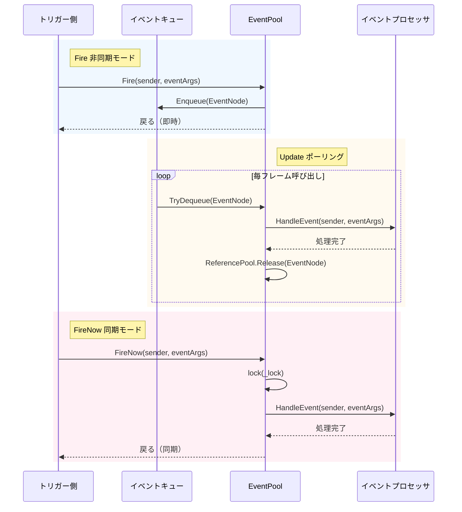
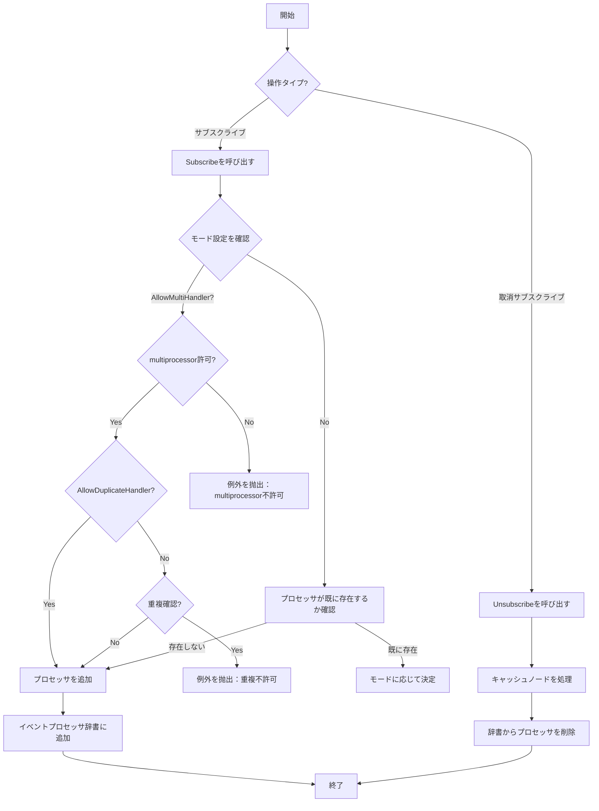

# イベントシステム

GameFrameXイベントシステムは、軽量で高性能なコンポーネント間通信ソリューションであり、パブリッシュ・サブスクライブパターンを採用して疎結合を実現します。

## 概要

イベントシステムはGameFrameXフレームワークのコアモジュールの1つであり、完全なゲームイベント管理メカニズムを提供します。**パブリッシュ・サブスクライブ（Publish-Subscribe）パターン**を採用しており、ゲーム内の異なるモジュールが直接的に相互依存せずに通信できます。

### コア機能

- **ジェネリックイベントプール**：`EventPool<T>`ジェネリッククラスに基づき、型安全のイベント処理をサポート
- **スレッドセーフ**：バックグラウンドスレッドでイベントをトリガーし、メイスレッドでコールバックを処理可能
- **dualモード配信**：`Fire`（非同期キューモード）と`FireNow`（同期即時モード）をサポート
- **柔軟な設定**：`EventPoolMode`フラグ列挙体を通じて、 multiprocessor許可、重复processor許可などを設定可能
- **メモリ最適化**：参照プール技術を使用してイベントノードを再利用し、ガベージコレクションの負荷を軽減

### 適用シナリオ

- UIとゲームロジックの疎結合通信
- モジュール間の疎結合相互作用
- 非同期イベント処理（ネットワーク応答、リソースロード完了など）
- マルチモジュール状態同期

## アーキテクチャ

```mermaid
classDiagram
    class GameFrameworkEventArgs {
        <<abstract>>
        +Clear() void
    }

    class BaseEventArgs {
        <<abstract>>
        +Id: string { get }
    }

    class EventPoolMode {
        <<enum>>
        +Default
        +AllowNoHandler
        +AllowMultiHandler
        +AllowDuplicateHandler
    }

    class EventPool~T~ {
        -_lock: object
        -_eventHandlers: GameFrameworkMultiDictionary
        -_events: ConcurrentQueue~EventNode~
        -_eventPoolMode: EventPoolMode
        +Subscribe(id, handler) void
        +Unsubscribe(id, handler) void
        +Fire(sender, e) void
        +FireNow(sender, e) void
        +Update(elapseSeconds, realElapseSeconds) void
    }

    class EventNode {
        <<internal>>
        -_sender: object
        -_eventArgs: T
        +Sender: object
        +EventArgs: T
        +Create(sender, e): EventNode
        +Clear() void
    }

    GameFrameworkEventArgs <|-- BaseEventArgs
    BaseEventArgs <|-- T
    EventPoolMode --* EventPool
    EventPool *-- EventNode
    EventNode ..> T
```

### コンポーネント説明

| コンポーネント | 説明 |
|------|------|
| `GameFrameworkEventArgs` | すべてのイベント引数の基本クラス、`EventArgs`を継承し`IReference`インターフェースを実装 |
| `BaseEventArgs` | フレームワークイベント引数の基本クラス、イベントIDプロパティを定義 |
| `EventPool<T>` | ジェネリックイベントプール、特定タイプイベントのサブスクライブ、取消サブスクライブ、配信を管理 |
| `EventNode` | 内部クラス、キュー処理用にイベントをラップするために使用 |
| `EventPoolMode` | イベントプールモード列挙体、イベント処理動作を制御 |

## コアコンセプト

### イベント引数

すべてのカスタムイベント引数は`BaseEventArgs`を継承し、イベントタイプを識別する`Id`プロパティを実装する必要があります。

```csharp
public sealed class PlayerhpChangedEventArgs : BaseEventArgs
{
    public override string Id => "PlayerHpChanged";

    public int OldHp { get; private set; }
    public int NewHp { get; private set; }

    public static PlayerHpChangedEventArgs Create(int oldHp, int newHp)
    {
        var args = ReferencePool.Acquire<PlayerHpChangedEventArgs>();
        args.OldHp = oldHp;
        args.NewHp = newHp;
        return args;
    }

    public override void Clear()
    {
        OldHp = 0;
        NewHp = 0;
    }
}
```

> Source: [BaseEventArgs.cs](https://github.com/GameFrameX/com.gameframex.unity/blob/main/Runtime/Base/EventPool/BaseEventArgs.cs#L34-L54)

### イベントプールモード

`EventPoolMode`はflags列挙体で、以下のオプションをサポート：

| モード | 説明 |
|------|------|
| `Default` | デフォルトモード、存在する必要があり唯一つのイベント処理関数のみ |
| `AllowNoHandler` | イベント処理関数が存在しない場合에도イベントを抛出することを許可 |
| `AllowMultiHandler` | 複数のイベント処理関数の存在を許可 |
| `AllowDuplicateHandler` | 重複したイベント処理関数を許可（AllowMultiHandlerと組み合わせる必要がある） |

```csharp
[Flags]
public enum EventPoolMode : byte
{
    Default = 0,
    AllowNoHandler = 1,
    AllowMultiHandler = 2,
    AllowDuplicateHandler = 4
}
```

> Source: [EventPoolMode.cs](https://github.com/GameFrameX/com.gameframex.unity/blob/main/Runtime/Base/EventPool/EventPoolMode.cs#L37-L77)

## ワークフロー

### イベント配信フロー



### イベントサブスクライブと取消サブスクライブ



## 使用例

### 基本使用方法

#### 1. イベント引数を定義

```csharp
public sealed class ScoreChangedEventArgs : BaseEventArgs
{
    public override string Id => "ScoreChanged";

    public int OldScore { get; private set; }
    public int NewScore { get; private set; }

    public static ScoreChangedEventArgs Create(int oldScore, int newScore)
    {
        var args = ReferencePool.Acquire<ScoreChangedEventArgs>();
        args.OldScore = oldScore;
        args.NewScore = newScore;
        return args;
    }

    public override void Clear()
    {
        OldScore = 0;
        NewScore = 0;
    }
}
```

#### 2. イベントプールを作成し、サブスクライブ

```csharp
// イベントプールを作成（multiprocessorサポート）
var eventPool = new EventPool<ScoreChangedEventArgs>(EventPoolMode.AllowMultiHandler);

// イベントをサブスクライブ
EventHandler<ScoreChangedEventArgs> handler = (sender, e) =>
{
    Debug.Log($"スコア変化: {e.OldScore} -> {e.NewScore}");
};
eventPool.Subscribe("ScoreChanged", handler);

// イベントをトリガー（非同期、次フレームで処理）
eventPool.Fire(this, ScoreChangedEventArgs.Create(100, 150));

// イベントをトリガー（同期、即時処理）
eventPool.FireNow(this, ScoreChangedEventArgs.Create(150, 200));

// サブスクライブを解除
eventPool.Unsubscribe("ScoreChanged", handler);
```

> Source: [EventPool.cs](https://github.com/GameFrameX/com.gameframex.unity/blob/main/Runtime/Base/EventPool/EventPool.cs#L200-L335)

#### 3. Updateでポーリングしてイベントを処理

```csharp
private EventPool<ScoreChangedEventArgs> _eventPool;

void Update(float elapseSeconds, float realElapseSeconds)
{
    // キューのイベントを処理するために定期的にUpdateを呼び出す必要がある
    _eventPool.Update(elapseSeconds, realElapseSeconds);
}
```

### 上級使用方法

#### デフォルトプロセッサを設定

イベントに登録されたプロセッサがない場合、デフォルトプロセッサが呼び出されます：

```csharp
var eventPool = new EventPool<ScoreChangedEventArgs>(EventPoolMode.AllowNoHandler);

eventPool.SetDefaultHandler((sender, e) =>
{
    Debug.Log($"デフォルトプロセッサ: スコア変化 {e.OldScore} -> {e.NewScore}");
});

// サブスクライバがなくてもデフォルトプロセッサが呼び出される
eventPool.Fire(this, ScoreChangedEventArgs.Create(0, 100));
```

#### モードの組み合わせ

複数のモードフラグを組み合わせ可能：

```csharp
// multiprocessor許可かつプロセッサなし許可
var mode = EventPoolMode.AllowMultiHandler | EventPoolMode.AllowNoHandler;
var eventPool = new EventPool<ScoreChangedEventArgs>(mode);
```

#### スレッドセーフイベントトリガー

バックグラウンドスレッドで安全にイベントをトリガーし、イベントはメイスレッドのUpdateで処理されます：

```csharp
// バックグラウンドスレッドでトリガー
Task.Run(() =>
{
    // スレッドセーフ - イベントがキューに追加される
    eventPool.Fire(networkClient, ScoreChangedEventArgs.Create(oldScore, newScore));
});

// メイスレッドのUpdateで処理
void Update(float elapseSeconds, float realElapseSeconds)
{
    eventPool.Update(elapseSeconds, realElapseSeconds);
}
```

## APIリファレンス

### EventPool<T>

ジェネリックイベントプールクラス、特定タイプイベントのサブスクライブ、取消サブスクライブ、配信を管理します。

#### コンストラクター

```csharp
public EventPool(EventPoolMode mode)
```

**パラメータ：**
- `mode` (EventPoolMode): イベントプールモード、プロセッサ動作を制御

**例：**
```csharp
var eventPool = new EventPool<ScoreChangedEventArgs>(EventPoolMode.Default);
```

#### プロパティ

| プロパティ | 型 | 説明 |
|------|------|------|
| `EventHandlerCount` | int | 登録済みイベント処理関数の数を取得 |
| `EventCount` | int | キュー内の待機イベント数を取得 |

#### メソッド

##### Subscribe

イベント処理関数をサブスクライブ。

```csharp
public void Subscribe(string id, EventHandler<T> handler)
```

**パラメータ：**
- `id` (string): イベントタイプ識別子
- `handler` (EventHandler<T>): サブスクライブするイベント処理関数

**例外：**
- `GameFrameworkException`: multiprocessorが許可されていないが既にプロセッサが存在する場合、または重複プロセッサが許可されていない場合

---

##### Unsubscribe

イベント処理関数のサブスクライブを解除。

```csharp
public void Unsubscribe(string id, EventHandler<T> handler)
```

**パラメータ：**
- `id` (string): イベントタイプ識別子
- `handler` (EventHandler<T>): サブスクライブ解除するイベント処理関数

---

##### Fire

非同期モードでイベントをトリガー（スレッドセーフ、次フレームで配信）。

```csharp
public void Fire(object sender, T e)
```

**パラメータ：**
- `sender` (object): イベント送信者
- `e` (T): イベント引数

**例外：**
- `GameFrameworkException`: イベント引数がnullの場合

---

##### FireNow

同期モードで即座にイベントをトリガー（非スレッドセーフ）。

```csharp
public void FireNow(object sender, T e)
```

**パラメータ：**
- `sender` (object): イベント送信者
- `e` (T): イベント引数

---

##### Update

キューのすべてのイベントをポーリングして処理。

```csharp
public void Update(float elapseSeconds, float realElapseSeconds)
```

**パラメータ：**
- `elapseSeconds` (float): 論理経過時間（秒）
- `realElapseSeconds` (float): 実際の経過時間（秒）

---

##### Shutdown

イベントプールを終了してクリーンアップ。

```csharp
public void Shutdown()
```

---

##### Check

指定したイベント処理関数が存在するかどうかを確認。

```csharp
public bool Check(string id, EventHandler<T> handler)
```

**パラメータ：**
- `id` (string): イベントタイプ識別子
- `handler` (EventHandler<T>): 確認するイベント処理関数

**戻り値：** 該当処理関数が存在するかどうか

---

##### Count

指定したイベントタイプの処理関数数を取得。

```csharp
public int Count(string id)
```

**パラメータ：**
- `id` (string): イベントタイプ識別子

**戻り値：** 処理関数数

---

##### SetDefaultHandler

デフォルトイベント処理関数を設定。

```csharp
public void SetDefaultHandler(EventHandler<T> handler)
```

**パラメータ：**
- `handler` (EventHandler<T>): デフォルトイベント処理関数

---

### BaseEventArgs

すべてのカスタムイベント引数の基本クラス。

```csharp
public abstract class BaseEventArgs : GameFrameworkEventArgs
{
    public abstract string Id { get; }
}
```

**プロパティ：**
- `Id` (string): イベントタイプの一意識別子（抽象プロパティ、実装必須）

---

### EventPoolMode

イベントプールモード列挙体（Flags）。

```csharp
[Flags]
public enum EventPoolMode : byte
{
    Default = 0,
    AllowNoHandler = 1,
    AllowMultiHandler = 2,
    AllowDuplicateHandler = 4
}
```

## ベストプラクティス

### イベント定義規則

1. **意味のあるIDを使用**：イベントIDはイベントタイプを明確に説明するべきです（例：`"PlayerHpChanged"`、`"GameStart"`）
2. **Create factoryメソッドを実装**：静的Createメソッドを提供して参照プールからインスタンスを取得
3. **Clearメソッドを実装**：すべてのデータをクリーンアップするためにClearメソッドをオーバーライドし、オブジェクトの再利用を確保
4. **参照プールを使用**：ReferencePoolを通じてイベント引数を取得して開放し、メモリ割り当てを軽減

### パフォーマンス最適化

1. **频繁なサブスクライブ/取消サブスクライブを避ける**：モジュール初期化時にサブスクライブ、破棄時に取消サブスクライブ
2. **非同期モードを使用**：バックグラウンドスレッドでトリガーされるイベントにはFireを使用（FireNowではなく）
3. **モードを合理的に設定**：実際のニーズに応じて適切なEventPoolModeを選択，不要なチェックを避ける

### エラー処理

1. **プロセッサの存在性を確認**：取消サブスクライブ前にCheckメソッドを使用して確認
2. **例外捕获**：イベントプロセッサの例外は捕获されて記録されますが、他のプロセッサを中断しません
3. **null値確認**：FireとFireNowはイベント引数に対してnull値確認を行います

## 関連リンク

- [参照プールシステム](./5-runtime.reference-pool) - イベントシステムは参照プールを使用してイベントノードとイベント引数のメモリを管理
- [オブジェクトプールシステム](./5-runtime.object-pool) - ゲームオブジェクト管理のための類似のプール化技術
- [タスクプールシステム](./5-runtime.task-pool) - イベントシステムと連携使用的非同期タスク管理
- [基本コンポーネント](./5-runtime.base) - GameFrameXフレームワークの基本コンポーネントアーキテクチャ
