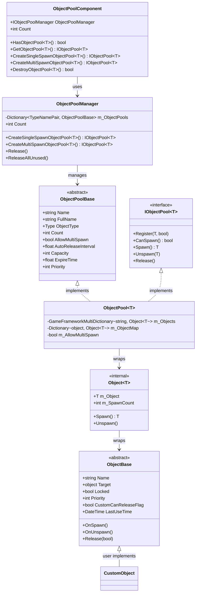
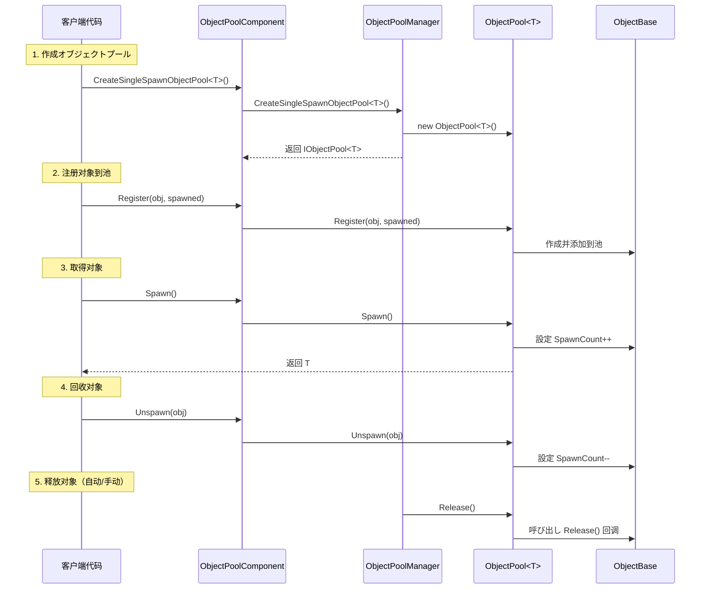

# オブジェクトプールシステム

オブジェクトプールシステム是 GameFrameX フレームワーク的コア模块之一，に使用管理ゲーム对象的复用，避免频繁的对象作成和销毁带来的性能开销和 GC 压力。该系统提供します完整的对象生命周期管理，包括对象的取得、回收、自动释放等機能。

## 概要

在ゲーム开发中，频繁作成和销毁对象（如子弹、特效、UI 元素等）是常见的性能瓶颈。オブジェクトプールシステムを通じて预先作成一定数量的对象并重复利用，显著降低了内存分配开销和 GC 触发频率。

GameFrameX オブジェクトプールシステム提供以下コア機能：

- **クラス型安全的泛型池管理**：サポート强クラス型的オブジェクトプール操作
- **单次/多次取得模式**：灵活控制对象的复用策略
- **自动释放机制**：基づく时间过期和容量阈值的自动回收
- **优先级系统**：精细控制对象释放优先级
- **锁定机制**：保护重要对象不被意外释放

## 架构



### コンポーネント説明

| コンポーネント | 説明 | 层级 |
|------|------|------|
| `ObjectPoolComponent` | Unity コンポーネント，挂在 GameObject 上供シーン使用 | API 层 |
| `ObjectPoolManager` | コア管理器，管理所有オブジェクトプール | コア层 |
| `ObjectPoolBase` | オブジェクトプール抽象基底クラス | 抽象层 |
| `ObjectPool<T>` | 泛型オブジェクトプール実装 | 実装层 |
| `ObjectBase` | 可池化对象的抽象基底クラス | 抽象层 |
| `Object<T>` | 内部对象包装器 | 内部実装 |

## コアコンセプト

### オブジェクトプールクラス型

系统サポート两种オブジェクトプールクラス型：

**1. 单次取得オブジェクトプール (Single Spawn)**
- 同一时间只能有一个消费者使用对象
- 适に使用独占性リソース，如玩家角色、载具等

```csharp
// 作成一个单次取得オブジェクトプール
IObjectPool<Bullet> bulletPool = objectPoolComponent.CreateSingleSpawnObjectPool<Bullet>("Bullet Pool", 100, 60f, 10);
```

> Source: [Runtime/ObjectPool/ObjectPoolComponent.cs](https://github.com/GameFrameX/com.gameframex.unity/blob/main/Runtime/ObjectPool/ObjectPoolComponent.cs#L257-L260)

**2. 多次取得オブジェクトプール (Multi Spawn)**
- 同一时间可能同时被多个消费者使用
- 适に使用可复用リソース，如子弹、特效等

```csharp
// 作成一个多次取得オブジェクトプール
IObjectPool<Effect> effectPool = objectPoolComponent.CreateMultiSpawnObjectPool<Effect>("Effect Pool", 50, 30f, 5);
```

> Source: [Runtime/ObjectPool/ObjectPoolComponent.cs](https://github.com/GameFrameX/com.gameframex.unity/blob/main/Runtime/ObjectPool/ObjectPoolComponent.cs#L655-L658)

### 关键参数

| 参数 | 説明 | 默认值 |
|------|------|--------|
| `name` | オブジェクトプール名称，に使用标识和查找 | 空字符串 |
| `capacity` | オブジェクトプール容量，最大对象数量 | int.MaxValue |
| `expireTime` | 对象过期时间（秒），超过此时间未使用则可被释放 | float.MaxValue（永不过期） |
| `autoReleaseInterval` | 自动释放间隔（秒），每隔此时间尝试释放过期对象 | 依赖作成参数 |
| `priority` | オブジェクトプール优先级，影响释放顺序 | 0 |

## 使用フロー



## 作成可池化对象

要使用オブジェクトプールシステム，必要继承 `ObjectBase` クラス并実装関連メソッド：

```csharp
using GameFrameX.ObjectPool;
using GameFrameX.Runtime;

public class Bullet : ObjectBase
{
    private BulletController m_Controller;
    
    // 初期化对象
    public void Initialize(BulletController controller)
    {
        Initialize(null, controller.Target, 0);
        m_Controller = controller;
    }
    
    // 对象被取得时呼び出し
    protected internal override void OnSpawn()
    {
        base.OnSpawn();
        m_Controller.gameObject.SetActive(true);
    }
    
    // 对象被回收时呼び出し
    protected internal override void OnUnspawn()
    {
        base.OnUnspawn();
        m_Controller.gameObject.SetActive(false);
    }
    
    // 对象被释放时呼び出し
    protected internal override void Release(bool isShutdown)
    {
        if (isShutdown || m_Controller == null)
        {
            if (m_Controller != null)
            {
                UnityEngine.Object.Destroy(m_Controller.gameObject);
            }
        }
        m_Controller = null;
    }
}
```

> Source: [Runtime/ObjectPool/ObjectBase.cs](https://github.com/GameFrameX/com.gameframex.unity/blob/main/Runtime/ObjectPool/ObjectBase.cs#L201-L223)

### 扩展メソッド

系统还提供します扩展メソッド方便用户使用：

```csharp
// 扩展メソッド示例（伪代码）
public static class ObjectPoolExtensions
{
    public static T Spawn<T>(this IObjectPool<T> pool) where T : ObjectBase
    {
        return pool.Spawn();
    }
    
    public static void Unspawn<T>(this IObjectPool<T> pool, T obj) where T : ObjectBase
    {
        pool.Unspawn(obj);
    }
}
```

## 使用例

### 基本用法

```csharp
using GameFrameX.Runtime;
using GameFrameX.ObjectPool;
using UnityEngine;

// 1. 取得オブジェクトプールコンポーネント
var objectPoolComponent = UnityEngine.Object.FindObjectOfType<ObjectPoolComponent>();

// 2. 作成オブジェクトプール（多次取得模式，适合子弹）
var bulletPool = objectPoolComponent.CreateMultiSpawnObjectPool<Bullet>("Bullet Pool", 100, 60f);

// 3. 注册对象到池中
var bulletObj = new Bullet();
bulletObj.Initialize(bulletController);
bulletPool.Register(bulletObj, false);

// 4. 从池中取得对象
var bullet = bulletPool.Spawn();

// 5. 使用完毕后回收对象
bulletPool.Unspawn(bullet);
```

> Source: [Runtime/ObjectPool/ObjectPoolManager.ObjectPool.cs](https://github.com/GameFrameX/com.gameframex.unity/blob/main/Runtime/ObjectPool/ObjectPoolManager.ObjectPool.cs#L256-L292)

### 高级用法：自定义释放策略

```csharp
// 自定义释放过滤器
IObjectPool<Bullet> bulletPool = objectPoolComponent.GetObjectPool<Bullet>("Bullet Pool");

// 释放符合条件的对象
bulletPool.Release(10, (candidateObjects, toReleaseCount, expireTime) =>
{
    // 优先释放优先级低的对象
    var releaseList = new List<Bullet>();
    var sorted = candidateObjects.OrderByDescending(b => b.Priority)
                                 .ThenBy(b => b.LastUseTime);
    
    int count = 0;
    foreach (var bullet in sorted)
    {
        if (count >= toReleaseCount) break;
        releaseList.Add(bullet);
        count++;
    }
    return releaseList;
});
```

> Source: [Runtime/ObjectPool/ObjectPoolManager.ObjectPool.cs](https://github.com/GameFrameX/com.gameframex.unity/blob/main/Runtime/ObjectPool/ObjectPoolManager.ObjectPool.cs#L498-L529)

### 高级用法：对象锁定

```csharp
// 锁定对象，防止被自动释放
bulletPool.SetLocked(bullet, true);

// 解锁对象，允许被释放
bulletPool.SetLocked(bullet, false);
```

> Source: [Runtime/ObjectPool/ObjectPoolManager.ObjectPool.cs](https://github.com/GameFrameX/com.gameframex.unity/blob/main/Runtime/ObjectPool/ObjectPoolManager.ObjectPool.cs#L336-L374)

### 高级用法：設定优先级

```csharp
// 設定对象优先级（数值越大优先级越高，越晚被释放）
bulletPool.SetPriority(bullet, 100);
```

> Source: [Runtime/ObjectPool/ObjectPoolManager.ObjectPool.cs](https://github.com/GameFrameX/com.gameframex.unity/blob/main/Runtime/ObjectPool/ObjectPoolManager.ObjectPool.cs#L376-L414)

## 設定选项

### ObjectPoolComponent 配置

在 Unity 编辑器中，`ObjectPoolComponent` コンポーネント提供以下可配置项：

| 配置项 | クラス型 | 説明 |
|--------|------|------|
| ImplementationComponentType | Type | オブジェクトプール管理器実装クラス型 |
| InterfaceComponentType | Type | オブジェクトプール管理器インターフェースクラス型 |

> 详情お願いします参考 ObjectPoolComponent 源码

### オブジェクトプール参数配置

| 参数 | クラス型 | 默认值 | 説明 |
|------|------|--------|------|
| name | string | "" | オブジェクトプール名称 |
| capacity | int | int.MaxValue | オブジェクトプール容量 |
| expireTime | float | float.MaxValue | 对象过期时间（秒） |
| autoReleaseInterval | float | float.MaxValue | 自动释放间隔 |
| priority | int | 0 | オブジェクトプール优先级 |

## API 参考

### ObjectPoolComponent

```csharp
// 作成单次取得オブジェクトプール
IObjectPool<T> CreateSingleSpawnObjectPool<T>(string name, float autoReleaseInterval, int capacity, float expireTime, int priority)
```

**参数：**
- `name` (string): オブジェクトプール名称
- `autoReleaseInterval` (float): 自动释放间隔秒数
- `capacity` (int): オブジェクトプール容量
- `expireTime` (float): 对象过期秒数
- `priority` (int): オブジェクトプール优先级

```csharp
// 作成多次取得オブジェクトプール
IObjectPool<T> CreateMultiSpawnObjectPool<T>(string name, float autoReleaseInterval, int capacity, float expireTime, int priority)
```

> Source: [Runtime/ObjectPool/ObjectPoolComponent.cs](https://github.com/GameFrameX/com.gameframex.unity/blob/main/Runtime/ObjectPool/ObjectPoolComponent.cs#L1026-L1029)

### IObjectPool<T>

```csharp
// 注册对象到池
void Register(T obj, bool spawned)

// 检查是否可能取得对象
bool CanSpawn(string name)

// 取得对象
T Spawn(string name)

// 回收对象
void Unspawn(T obj)

// 释放对象
void Release()
```

> Source: [Runtime/ObjectPool/IObjectPool.cs](https://github.com/GameFrameX/com.gameframex.unity/blob/main/Runtime/ObjectPool/IObjectPool.cs#L92-L129)

## 関連リンク

- [参照プールシステム](./5-runtime.reference-pool) - 另一种池化机制，に使用管理引用クラス型对象
- [任务池系统](./5-runtime.task-pool) - 异步任务池管理
- [基础コンポーネント](./5-runtime.base) - GameFramework 基础コンポーネント
- [API 参考](./8-api-reference) - 完整的 API 文档
