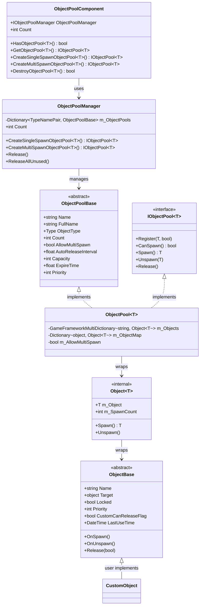
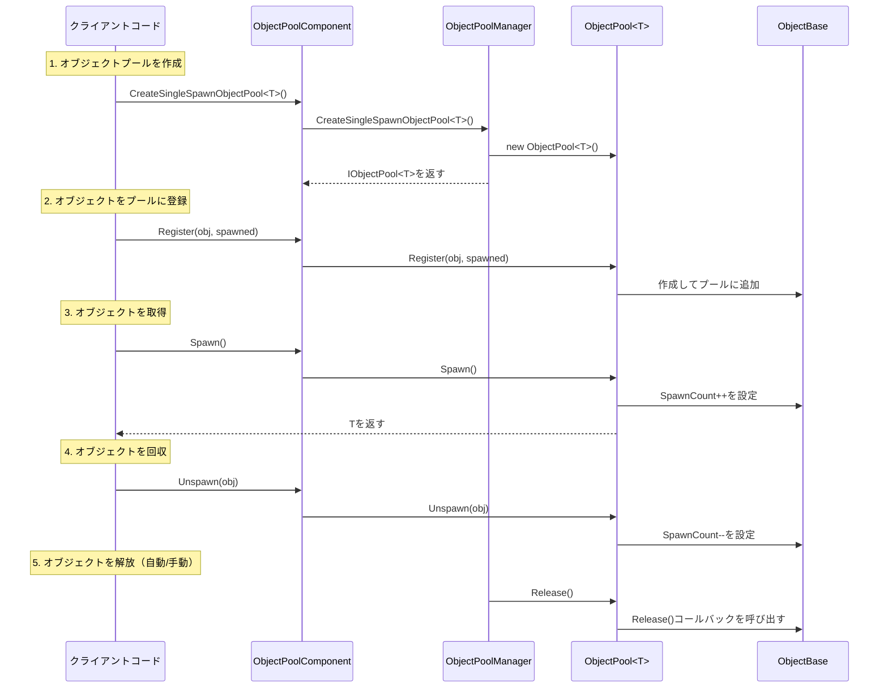

# オブジェクトプールシステム

オブジェクトプールシステムはGameFrameXフレームワークのコアモジュールの1つであり、ゲームオブジェクトの再利用を管理し、频繁なオブジェクト作成と破棄によるパフォーマンスオーバーヘッドとGC負荷を回避します。このシステムは完全なオブジェクトライフサイクル管理を提供し、オブジェクトの取得、回収、自動解放などの機能を含みます。

## 概要

ゲーム開発では、頻繁なオブジェクト作成と破棄（弾、特殊効果、UI要素など）は一般的なパフォーマンスボトルネックです。オブジェクトプールシステムは事前に一定数のオブジェクトを作成し再利用することで、メモリアロケーションオーバーヘッドとGCトリガー頻度を大幅に軽減します。

GameFrameXオブジェクトプールシステムは以下のコア機能を提供します：

- **型安全なジェネリックプール管理**：強い型のオブジェクトプール操作をサポート
- **シングル/マルチスポーン方式**：オブジェクトの再利用戦略を柔軟に制御
- **自動解放メカニズム**：時間期限切れと容量閾値に基づく自動回収
- **優先順位システム**：オブジェクト解放優先順位を細やかに制御
- **ロックメカニズム**：重要なオブジェクトが偶発的に解放されるのを保護

## アーキテクチャ



### コンポーネント説明

| コンポーネント | 説明 | レベル |
|------|------|------|
| `ObjectPoolComponent` | Unityコンポーネント、GameObjectにアタッチしてシーンで使用 | API層 |
| `ObjectPoolManager` | コアマネージャー、すべてのオブジェクトプールを管理 | コア層 |
| `ObjectPoolBase` | オブジェクトプール抽象基本クラス | 抽象層 |
| `ObjectPool<T>` | ジェネリックオブジェクトプール実装 | 実装層 |
| `ObjectBase` | プール可能オブジェクトの抽象基本クラス | 抽象層 |
| `Object<T>` | 内部オブジェクトラッパー | 内部実装 |

## コアコンセプト

### オブジェクトプールタイプ

システムは二種類のオブジェクトプールタイプをサポート：

**1. シングルスポーンオブジェクトプール（Single Spawn）**
- 同時に一人の消費者のみがオブジェクトを使用可能
- 排他的リソースに適合（プレイヤーキャラクター、車両など）

```csharp
// シングルスポーンオブジェクトプールを作成
IObjectPool<Bullet> bulletPool = objectPoolComponent.CreateSingleSpawnObjectPool<Bullet>("Bullet Pool", 100, 60f, 10);
```

> Source: [Runtime/ObjectPool/ObjectPoolComponent.cs](https://github.com/GameFrameX/com.gameframex.unity/blob/main/Runtime/ObjectPool/ObjectPoolComponent.cs#L257-L260)

**2. マルチスポーンオブジェクトプール（Multi Spawn）**
- 同時に複数の消費者が使用可能
- 再利用可能リソースに適合（弾、特殊効果など）

```csharp
// マルチスポーンオブジェクトプールを作成
IObjectPool<Effect> effectPool = objectPoolComponent.CreateMultiSpawnObjectPool<Effect>("Effect Pool", 50, 30f, 5);
```

> Source: [Runtime/ObjectPool/ObjectPoolComponent.cs](https://github.com/GameFrameX/com.gameframex.unity/blob/main/Runtime/ObjectPool/ObjectPoolComponent.cs#L655-L658)

### 主要パラメータ

| パラメータ | 説明 | デフォルト値 |
|------|------|--------|
| `name` | オブジェクトプール名、識別と検索に使用 | 空文字列 |
| `capacity` | オブジェクトプール容量、最大オブジェクト数 | int.MaxValue |
| `expireTime` | オブジェクト期限切れ時間（秒）、超過此時間未使用の場合は解放可能 | float.MaxValue（期限切れなし） |
| `autoReleaseInterval` | 自動解放間隔（秒）、此時間ごとに期限切れオブジェクトの解放を試行 | 作成パラメータに依存 |
| `priority` | オブジェクトプール優先順位、解放順序に影響 | 0 |

## 使用フロー



## プール可能オブジェクトの作成

オブジェクトプールシステムを使用するには、`ObjectBase`クラスを継承して関連メソッドを実装する必要があります：

```csharp
using GameFrameX.ObjectPool;
using GameFrameX.Runtime;

public class Bullet : ObjectBase
{
    private BulletController m_Controller;

    // オブジェクトを初期化
    public void Initialize(BulletController controller)
    {
        Initialize(null, controller.Target, 0);
        m_Controller = controller;
    }

    // オブジェクトが取得されたときに呼び出される
    protected internal override void OnSpawn()
    {
        base.OnSpawn();
        m_Controller.gameObject.SetActive(true);
    }

    // オブジェクトが回収されたときに呼び出される
    protected internal override void OnUnspawn()
    {
        base.OnUnspawn();
        m_Controller.gameObject.SetActive(false);
    }

    // オブジェクトが解放されたときに呼び出される
    protected internal override void Release(bool isShutdown)
    {
        if (isShutdown || m_Controller == null)
        {
            if (m_Controller != null)
            {
                UnityEngine.Object.Destroy(m_Controller.gameObject);
            }
        }
        m_Controller = null;
    }
}
```

> Source: [Runtime/ObjectPool/ObjectBase.cs](https://github.com/GameFrameX/com.gameframex.unity/blob/main/Runtime/ObjectPool/ObjectBase.cs#L201-L223)

### 拡張メソッド

システムはユーザーが使用しやすい拡張メソッドも提供します：

```csharp
// 拡張メソッド例（疑似コード）
public static class ObjectPoolExtensions
{
    public static T Spawn<T>(this IObjectPool<T> pool) where T : ObjectBase
    {
        return pool.Spawn();
    }

    public static void Unspawn<T>(this IObjectPool<T> pool, T obj) where T : ObjectBase
    {
        pool.Unspawn(obj);
    }
}
```

## 使用例

### 基本使用方法

```csharp
using GameFrameX.Runtime;
using GameFrameX.ObjectPool;
using UnityEngine;

// 1. オブジェクトプールコンポーネントを取得
var objectPoolComponent = UnityEngine.Object.FindObjectOfType<ObjectPoolComponent>();

// 2. オブジェクトプールを作成（マルチスポーンモード、弾に適合）
var bulletPool = objectPoolComponent.CreateMultiSpawnObjectPool<Bullet>("Bullet Pool", 100, 60f);

// 3. オブジェクトをプールに登録
var bulletObj = new Bullet();
bulletObj.Initialize(bulletController);
bulletPool.Register(bulletObj, false);

// 4. プールからオブジェクトを取得
var bullet = bulletPool.Spawn();

// 5. 使用後にオブジェクトを回収
bulletPool.Unspawn(bullet);
```

> Source: [Runtime/ObjectPool/ObjectPoolManager.ObjectPool.cs](https://github.com/GameFrameX/com.gameframex.unity/blob/main/Runtime/ObjectPool/ObjectPoolManager.ObjectPool.cs#L256-L292)

### 上級使用方法：カスタム解放戦略

```csharp
// カスタム解放フィルター
IObjectPool<Bullet> bulletPool = objectPoolComponent.GetObjectPool<Bullet>("Bullet Pool");

// 条件に合致するオブジェクトを解放
bulletPool.Release(10, (candidateObjects, toReleaseCount, expireTime) =>
{
    // 優先順位の低いオブジェクトを先に解放
    var releaseList = new List<Bullet>();
    var sorted = candidateObjects.OrderByDescending(b => b.Priority)
                                 .ThenBy(b => b.LastUseTime);

    int count = 0;
    foreach (var bullet in sorted)
    {
        if (count >= toReleaseCount) break;
        releaseList.Add(bullet);
        count++;
    }
    return releaseList;
});
```

> Source: [Runtime/ObjectPool/ObjectPoolManager.ObjectPool.cs](https://github.com/GameFrameX/com.gameframex.unity/blob/main/Runtime/ObjectPool/ObjectPoolManager.ObjectPool.cs#L498-L529)

### 上級使用方法：オブジェクトロック

```csharp
// オブジェクトをロックして自動解放を防止
bulletPool.SetLocked(bullet, true);

// オブジェクトのロックを解除して解放を許可
bulletPool.SetLocked(bullet, false);
```

> Source: [Runtime/ObjectPool/ObjectPoolManager.ObjectPool.cs](https://github.com/GameFrameX/com.gameframex.unity/blob/main/Runtime/ObjectPool/ObjectPoolManager.ObjectPool.cs#L336-L374)

### 上級使用方法：優先順位の設定

```csharp
// オブジェクト優先順位を設定（値が大きいほど優先順位が高く、後に解放される）
bulletPool.SetPriority(bullet, 100);
```

> Source: [Runtime/ObjectPool/ObjectPoolManager.ObjectPool.cs](https://github.com/GameFrameX/com.gameframex.unity/blob/main/Runtime/ObjectPool/ObjectPoolManager.ObjectPool.cs#L376-L414)

## 設定オプション

### ObjectPoolComponent設定

Unityエディターで、`ObjectPoolComponent`コンポーネントは以下の設定項目を提供します：

| 設定項目 | 型 | 説明 |
|--------|------|------|
| ImplementationComponentType | Type | オブジェクトプールマネージャー実装タイプ |
| InterfaceComponentType | Type | オブジェクトプールマネージャーインターフェースタイプ |

> 詳細についてはObjectPoolComponentソースコードを参照

### オブジェクトプールパラメータ設定

| パラメータ | 型 | デフォルト値 | 説明 |
|------|------|--------|------|
| name | string | "" | オブジェクトプール名 |
| capacity | int | int.MaxValue | オブジェクトプール容量 |
| expireTime | float | float.MaxValue | オブジェクト期限切れ時間（秒） |
| autoReleaseInterval | float | float.MaxValue | 自動解放間隔 |
| priority | int | 0 | オブジェクトプール優先順位 |

## APIリファレンス

### ObjectPoolComponent

```csharp
// シングルスポーンオブジェクトプールを作成
IObjectPool<T> CreateSingleSpawnObjectPool<T>(string name, float autoReleaseInterval, int capacity, float expireTime, int priority)
```

**パラメータ：**
- `name` (string): オブジェクトプール名
- `autoReleaseInterval` (float): 自動解放間隔秒数
- `capacity` (int): オブジェクトプール容量
- `expireTime` (float): オブジェクト期限切れ秒数
- `priority` (int): オブジェクトプール優先順位

```csharp
// マルチスポーンオブジェクトプールを作成
IObjectPool<T> CreateMultiSpawnObjectPool<T>(string name, float autoReleaseInterval, int capacity, float expireTime, int priority)
```

> Source: [Runtime/ObjectPool/ObjectPoolComponent.cs](https://github.com/GameFrameX/com.gameframex.unity/blob/main/Runtime/ObjectPool/ObjectPoolComponent.cs#L1026-L1029)

### `IObjectPool<T>`

```csharp
// オブジェクトをプールに登録
void Register(T obj, bool spawned)

// オブジェクトを取得できるか確認
bool CanSpawn(string name)

// オブジェクトを取得
T Spawn(string name)

// オブジェクトを回収
void Unspawn(T obj)

// オブジェクトを解放
void Release()
```

> Source: [Runtime/ObjectPool/IObjectPool.cs](https://github.com/GameFrameX/com.gameframex.unity/blob/main/Runtime/ObjectPool/IObjectPool.cs#L92-L129)

## 関連リンク

- [参照プールシステム](./5-runtime.reference-pool) - もう1つのプール化メカニズム、参照型オブジェクトの管理に使用
- [タスクプールシステム](./5-runtime.task-pool) - 非同期タスクプール管理
- [基本コンポーネント](./5-runtime.base) - GameFramework基本コンポーネント
- [APIリファレンス](./8-api-reference) - 完全なAPIドキュメント
