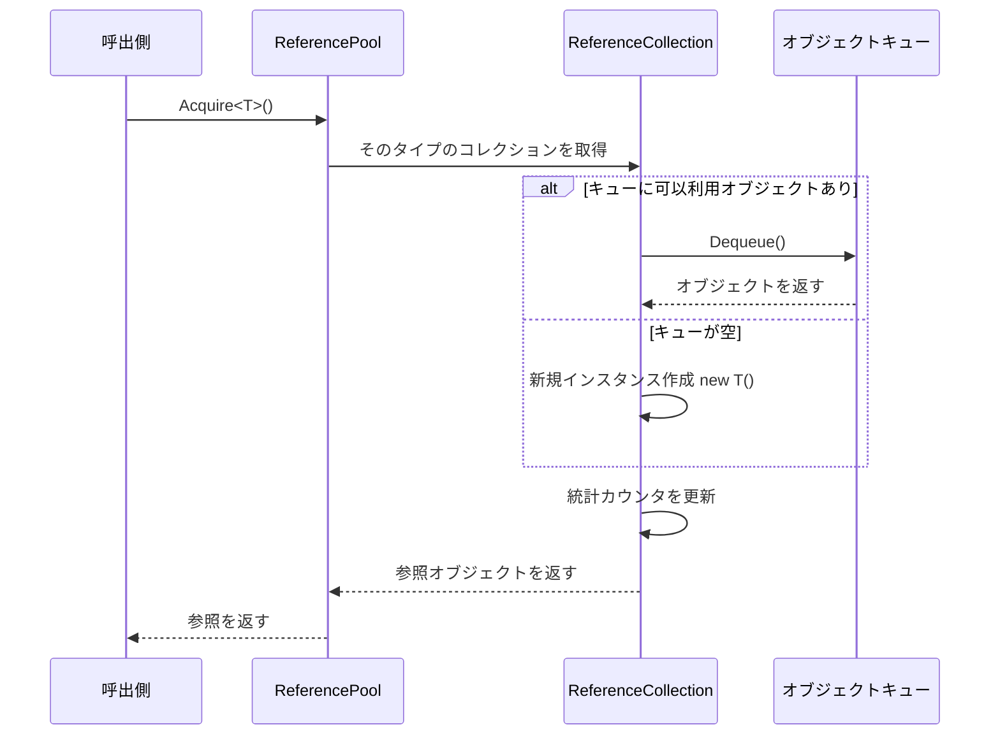
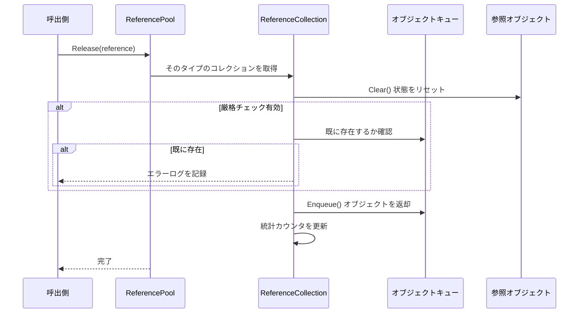

# 参照プールシステム

参照プールシステムはGameFrameXフレームワークのコアコンポーネントの1つであり、再利用可能な参照オブジェクトの管理に使用され、オブジェクト再利用によってガベージコレクション（GC）によるパフォーマンスオーバーヘッドを軽減します。

## 概要

ゲーム開発では、频繁なオブジェクト作成と破棄はパフォーマンス问题の主要原因の1つです。特に高频シナリオ（パーティクルシステム、イベントシステム、ネットワークメッセージ処理など）では、毎秒数千個の临时オブジェクトが作成される可能性があり、これにより频繁な垃圾回収が発生し、ゲームが引っかかる原因となります。

参照プールシステムは以下のようにこの問題を解決します：

1. **オブジェクト再利用**：プールからオブジェクトを取得して使用、使用完毕后プールに戻す、频繁な作成破棄を回避
2. **タイプ別管理**：各タイプの参照には独立したサブプールがあり、型安全を保証
3. **状態リセット**：戻すときに`Clear()`メソッドを自動呼び出してオブジェクト状態をリセット
4. **統計監視**：完全な取得/返却/追加/削除統計を提供、パフォーマンス調整に便宜

## アーキテクチャ

```mermaid
graph TD
    subgraph External["外部呼び出し"]
        Developer["開発者コード"]
    end

    subgraph API["参照プール API"]
        RP["ReferencePool 静的クラス"]
    end

    subgraph Internal["内部実装"]
        RC["ReferenceCollection<br/>(タイプ別1つ)"]
        Queue["Queue~IReference~<br/>(オブジェクトキュー)"]
    end

    subgraph Data["データモデル"]
        IRef["IReference インターフェース"]
        Info["ReferencePoolInfo<br/>(統計情報)"]
    end

    subgraph Unity["Unity 統合"]
        RPC["ReferencePoolComponent<br/>(Unityコンポーネント)"]
        RSCT["ReferenceStrictCheckType<br/>(チェックモード列挙体)"]
    end

    Developer --> RP
    RP --> RC
    RC --> Queue
    IRef -.->|"実装|", Queue
    RC --> Info
    RPC -.-> RP
    RP -.-> RSCT
```

### コアコンポーネント

| コンポーネント | 型 | 説明 |
|------|------|------|
| `IReference` | インターフェース | すべてのプール可能オブジェクトが実装する必要があるインターフェース、`Clear()`メソッドを含む |
| `ReferencePool` | 静的クラス | 参照プールのメインAPI、取得/返却/追加/削除などの操作を提供 |
| `ReferenceCollection` | 内部クラス | 特定タイプ参照オブジェクトの内部コレクションを管理 |
| `ReferencePoolInfo` | 構造体 | 参照プールの統計情報を含む |
| `ReferencePoolComponent` | Unityコンポーネント | Unity統合コンポーネント、設定と監視のために使用 |

## 動作原理

### 参照取得フロー



### 参照返却フロー



### 厳格チェックモード

参照プールは以下の三種類の厳格チェックモードをサポートし、`ReferenceStrictCheckType`列挙体で構成されます：

| モード | 説明 | 適用シナリオ |
|------|------|----------|
| `AlwaysEnable` | 常に厳格チェックを有効にする | デバッグ段階で重複返却を捕获 |
| `OnlyEnableWhenDevelopment` | 開発ビルド時のみ有効にする | 開発時のデバッグ、本番環境ではパフォーマンスを維持 |
| `OnlyEnableInEditor` | エディター内でのみ有効にする | 純粋なエディター デバッグ |
| `AlwaysDisable` | 常に厳格チェックを無効にする | 本番環境で最高パフォーマンス |

厳格チェックは参照を返却する際にそのオブジェクトが既にプールにあることを検証し、重複返却によるメモリ問題を回避します。

## 使用例

### 基本使用方法

まず、`IReference`インターフェースを実装してプール可能な参照クラスを作成する必要があります：

```csharp
using GameFrameX.Runtime;

public class MyData : IReference
{
    public string Name;
    public int Value;
    public Dictionary<string, object> ExtraData;

    public void Clear()
    {
        Name = null;
        Value = 0;
        ExtraData?.Clear();
    }
}
```

次に、参照プールを使用してオブジェクトの取得と返却を行います：

```csharp
// プールから参照を取得
MyData data = ReferencePool.Acquire<MyData>();
data.Name = "Test";
data.Value = 100;

// 使用完毕后プールに戻す
ReferencePool.Release(data);
```

### プールを事前加熱

ゲーム開始時にプールを事前加熱し、一定量の参照オブジェクトを事前に作成できます：

```csharp
// 事前加熱：特定タイプに100個の参照を事前追加
ReferencePool.Add<MyData>(100);
```

### プール統計情報を取得

ランタイムで参照プール状態を監視：

```csharp
// すべての参照プールの統計情報を取得
ReferencePoolInfo[] infos = ReferencePool.GetAllReferencePoolInfos();

foreach (var info in infos)
{
    Debug.Log($"Type: {info.Type.Name}");
    Debug.Log($"未使用: {info.UnusedReferenceCount}");
    Debug.Log($"使用中: {info.UsingReferenceCount}");
    Debug.Log($"取得回数: {info.AcquireReferenceCount}");
    Debug.Log($"返却回数: {info.ReleaseReferenceCount}");
}
```

### プールをクリア

適切なタイミングですべての参照プールをクリア：

```csharp
// すべての参照プールをクリア
ReferencePool.ClearAll();
```

### Unityコンポーネントを使用して設定

Unityシーンに参照プールコンポーネントを追加：

```csharp
// Inspectorで厳格チェックモードを設定
// ReferencePoolComponentは自動的に参照プール設定を初期化
```

> Source: [ReferencePoolComponent.cs](https://github.com/GameFrameX/com.gameframex.unity/blob/main/Runtime/ReferencePool/ReferencePoolComponent.cs#L42-L95)

## APIリファレンス

### `ReferencePool`

参照プールの静的メインクラス、すべてのプール操作を提供します。

#### `Acquire<T>() where T : class, IReference, new(): T`

指定タイプの参照をプールから取得。

```csharp
T item = ReferencePool.Acquire<T>();
```
> Source: [ReferencePool.cs](https://github.com/GameFrameX/com.gameframex.unity/blob/main/Runtime/Base/ReferencePool/ReferencePool.cs#L129-L132)

**パラメータ：**
- なし（ジェネリックパラメータ`T`が参照タイプを指定）

**戻り値：** 取得した参照インスタンス

**説明：** プールに可用な参照がある場合は取り出し、ない場合は新規インスタンスを作成

---

#### `Acquire(Type referenceType): IReference`

指定タイプの参照をプールから取得（Typeパラメータを使用）。

```csharp
IReference item = ReferencePool.Acquire(typeof(MyData));
```
> Source: [ReferencePool.cs](https://github.com/GameFrameX/com.gameframex.unity/blob/main/Runtime/Base/ReferencePool/ReferencePool.cs#L143-L147)

**パラメータ：**
- `referenceType` (Type): 参照のタイプ

**戻り値：** 取得した参照インスタンス

---

#### `Release(IReference reference): void`

参照を参照プールに戻す。

```csharp
ReferencePool.Release(myData);
```
> Source: [ReferencePool.cs](https://github.com/GameFrameX/com.gameframex.unity/blob/main/Runtime/Base/ReferencePool/ReferencePool.cs#L157-L167)

**パラメータ：**
- `reference` (IReference): 返却する参照

**例外：**
- `GameFrameworkException`: 参照がnullの場合

---

#### `Add<T>(int count) where T : class, IReference, new(): void`

参照プールに特定数量的参照を追加。

```csharp
// 事前加熱：100個の参照を追加
ReferencePool.Add<MyData>(100);
```
> Source: [ReferencePool.cs](https://github.com/GameFrameX/com.gameframex.unity/blob/main/Runtime/Base/ReferencePool/ReferencePool.cs#L178-L181)

**パラメータ：**
- `count` (int): 追加する数量

---

#### `Remove<T>(int count) where T : class, IReference: void`

参照プールから特定数量的未使用参照を削除。

```csharp
ReferencePool.Remove<MyData>(10);
```
> Source: [ReferencePool.cs](https://github.com/GameFrameX/com.gameframex.unity/blob/main/Runtime/Base/ReferencePool/ReferencePool.cs#L207-L210)

**パラメータ：**
- `count` (int): 削除する数量

---

#### `RemoveAll<T>() where T : class, IReference: void`

参照プールから特定タイプのすべての未使用参照を削除。

```csharp
ReferencePool.RemoveAll<MyData>();
```
> Source: [ReferencePool.cs](https://github.com/GameFrameX/com.gameframex.unity/blob/main/Runtime/Base/ReferencePool/ReferencePool.cs#L235-L238)

---

#### `ClearAll(): void`

すべての参照プール内のすべての参照をクリア。

```csharp
ReferencePool.ClearAll();
```
> Source: [ReferencePool.cs](https://github.com/GameFrameX/com.gameframex.unity/blob/main/Runtime/Base/ReferencePool/ReferencePool.cs#L107-L118)

---

#### `GetAllReferencePoolInfos(): ReferencePoolInfo[]`

すべての参照プールの統計情報を取得。

```csharp
ReferencePoolInfo[] infos = ReferencePool.GetAllReferencePoolInfos();
```
> Source: [ReferencePool.cs](https://github.com/GameFrameX/com.gameframex.unity/blob/main/Runtime/Base/ReferencePool/ReferencePool.cs#L82-L98)

**戻り値：** すべての参照プール情報を含む配列

---

#### `EnableStrictCheck: bool`

厳格チェックモードを有効にするかどうかを取得または設定。

```csharp
// 厳格チェックを有効にする
ReferencePool.EnableStrictCheck = true;

// 現在の状態を確認
if (ReferencePool.EnableStrictCheck)
{
    // ...
}
```
> Source: [ReferencePool.cs](https://github.com/GameFrameX/com.gameframex.unity/blob/main/Runtime/Base/ReferencePool/ReferencePool.cs#L56-L60)

---

#### `Count: int`

現在管理している参照プール数を取得。

```csharp
int poolCount = ReferencePool.Count;
```
> Source: [ReferencePool.cs](https://github.com/GameFrameX/com.gameframex.unity/blob/main/Runtime/Base/ReferencePool/ReferencePool.cs#L69-L72)

---

### `IReference`

すべてのプール可能オブジェクトが実装する必要があるインターフェース。

```csharp
public interface IReference
{
    void Clear();
}
```
> Source: [IReference.cs](https://github.com/GameFrameX/com.gameframex.unity/blob/main/Runtime/Base/ReferencePool/IReference.cs#L40-L49)

#### `Clear(): void`

参照をクリアし、オブジェクトを初期状態に戻す。このメソッドはオブジェクトがプールから取り出されたとき**ではない**に呼び出され、オブジェクトがプールに戻されたときにシステムによって自動呼び出しされます。

```csharp
public class MyData : IReference
{
    public string Name;
    public int Value;

    public void Clear()
    {
        Name = null;
        Value = 0;
    }
}
```

**実装提案：**
- すべての書き込み可能プロパティをデフォルト値にリセット
- 内部参照の非管理リソース（存在する場合）を解放またはクリア
- コレクションメンバーをクリア（List、Dictionaryなど）

---

### `ReferencePoolInfo`

参照プール統計情報を含む構造体。

> Source: [ReferencePoolInfo.cs](https://github.com/GameFrameX/com.gameframex.unity/blob/main/Runtime/Base/ReferencePool/ReferencePoolInfo.cs#L44-L162)

| プロパティ | 型 | 説明 |
|------|------|------|
| `Type` | Type | 参照プールが管理するタイプ |
| `UnusedReferenceCount` | int | プール内の未使用（可用）の参照数量 |
| `UsingReferenceCount` | int | 現在使用中の参照数量 |
| `AcquireReferenceCount` | int | 総参照取得回数 |
| `ReleaseReferenceCount` | int | 総参照返却回数 |
| `AddReferenceCount` | int | 総参照追加回数 |
| `RemoveReferenceCount` | int | 総参照削除回数 |

---

### `ReferenceStrictCheckType`

参照厳格チェックモードの列挙体タイプ。

> Source: [ReferenceStrictCheckType.cs](https://github.com/GameFrameX/com.gameframex.unity/blob/main/Runtime/ReferencePool/ReferenceStrictCheckType.cs#L40-L61)

| 値 | 説明 |
|------|------|
| `AlwaysEnable` | 常に厳格チェックを有効にする |
| `OnlyEnableWhenDevelopment` | 開発ビルド時のみ有効にする |
| `OnlyEnableInEditor` | エディター内でのみ有効にする |
| `AlwaysDisable` | 常に厳格チェックを無効にする |

---

## パフォーマンス最適化提案

### 1. プールを事前加熱

ゲーム開始またはシーン切り替え時にプールを事前加熱：

```csharp
void WarmUpPools()
{
    // 推定使用量に基づいて事前加熱
    ReferencePool.Add<MyData>(50);
    ReferencePool.Add<AnotherData>(30);
}
```

### 2. Clearメソッドを合理的に実装

`Clear()`メソッドが効率的に実行されることを確認：

```csharp
// ✅ 推奨：新しいインスタンスを作成するのではなく直接代入
public void Clear()
{
    Name = null;
    Value = 0;
    ExtraData.Clear(); // nullにするのではなくクリア
}

// ❌ 回避：新しいインスタンスを作成
public void Clear()
{
    ExtraData = new Dictionary<string, object>(); // 毎回新しいオブジェクトを作成
}
```

### 3. 本番環境で厳格チェックを無効化

リリースバージョンで最高パフォーマンスを得るために厳格チェックを無効化：

```csharp
// Releaseビルドで設定
ReferencePool.EnableStrictCheck = false;

// またはコンポーネント設定経由
// ReferencePoolComponentのStrict Check TypeをAlwaysDisableに設定
```

### 4. プール状態を監視

定期的にプール状態を確認し、潜在的なメモリ問題を識別：

```csharp
void LogPoolStats()
{
    foreach (var info in ReferencePool.GetAllReferencePoolInfos())
    {
        // 漏れがないか確認（使用中が多いが未使用が少ない）
        if (info.UsingReferenceCount > 100 && info.UnusedReferenceCount < 5)
        {
            Debug.LogWarning($"Potential leak: {info.Type.Name}");
        }
    }
}
```

## よくある質問

### Q: 参照プールとオブジェクトプールの違いは？

参照プールは`IReference`インターフェースを実装するオブジェクト専用であり、轻量级再利用を重視。オブジェクトプール（Object Pool）はより広範な概念で、任意の再利用可能なオブジェクトに使用可能。GameFrameXは参照プールとオブジェクトプールシステムの両方を 제공하고、詳細については[オブジェクトプールシステム](./5-runtime.object-pool)を参照してください。

### Q: なぜClearメソッドは取得時に呼び出されないのか？

設計上の決定：取得時に直近使用時のデータを保持することでキャッシュヒット率を上げることができます。クリーンなオブジェクトが必要な場合は、`Clear()`を手動呼び出すか、`ReferencePool.Release()`を使用して返却後に新しいオブジェクトを取得してください。

### Q: 参照プールのメモリ使用量をどう處理するか？

- `Remove()`メソッドを使用して余分な空き参照を削除
- `ClearAll()`を使用して適切なシナリオですべてのプールをクリア
- `UnusedReferenceCount`を監視して过多な空きオブジェクトを避ける

---

## 関連リンク

- [オブジェクトプールシステム](./5-runtime.object-pool) - もう1つのオブジェクト再利用メカニズム
- [タスクプールシステム](./5-runtime.task-pool) - 非同期タスク管理
- [APIリファレンス](./8-api-reference) - 完全なAPIドキュメント
