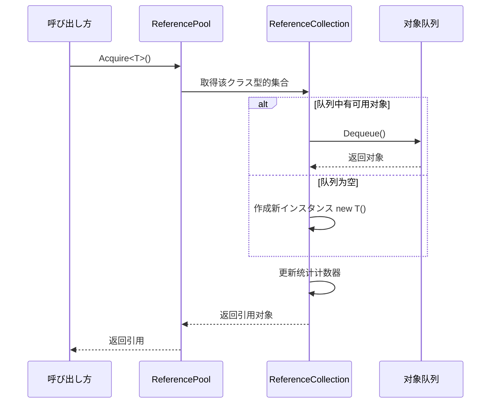
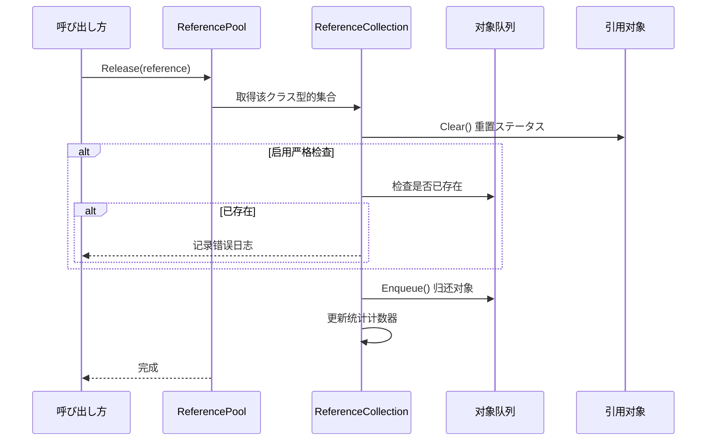

# 参照プールシステム

参照プールシステム是 GameFrameX フレームワーク的コアコンポーネント之一，に使用管理可复用的引用对象，を通じて对象复用来减少垃圾回收（GC）带来的性能开销。

## 概要

在ゲーム开发中，频繁作成和销毁对象是导致性能问题的主要原因之一。特别是在高频シーン（如粒子系统、イベント系统、网络消息处理等）中，每秒可能作成数千个临时对象，这会触发频繁的垃圾回收，导致ゲーム卡顿。

参照プールシステムを通じて以下方法解决这一问题：

1. **对象复用**：从池中取得对象使用，使用完毕后归还池中，避免频繁作成销毁
2. **按クラス型管理**：每种クラス型的引用有独立的子池，确保クラス型安全
3. **ステータス重置**：归还时自动呼び出し `Clear()` メソッド重置对象ステータス
4. **统计监控**：提供完整的取得/归还/添加/移除统计，便于性能调优

## 架构

```mermaid
graph TD
    subgraph External["外部呼び出し"]
        Developer["開発者代码"]
    end

    subgraph API["参照プール API"]
        RP["ReferencePool 静态クラス"]
    end

    subgraph Internal["内部実装"]
        RC["ReferenceCollection<br/>(每クラス型一个)"]
        Queue["Queue~IReference~<br/>(对象队列)"]
    end

    subgraph Data["数据模型"]
        IRef["IReference インターフェース"]
        Info["ReferencePoolInfo<br/>(统计信息)"]
    end

    subgraph Unity["Unity 集成"]
        RPC["ReferencePoolComponent<br/>(Unity コンポーネント)"]
        RSCT["ReferenceStrictCheckType<br/>(检查模式枚举)"]
    end

    Developer --> RP
    RP --> RC
    RC --> Queue
    IRef -.->|"実装|", Queue
    RC --> Info
    RPC -.-> RP
    RP -.-> RSCT
```

### コアコンポーネント

| コンポーネント | クラス型 | 説明 |
|------|------|------|
| `IReference` | インターフェース | 所有可池化对象必須実装的インターフェース，包含 `Clear()` メソッド |
| `ReferencePool` | 静态クラス | 参照プール的主 API，提供取得/归还/添加/移除等操作 |
| `ReferenceCollection` | 内部クラス | 管理特定クラス型引用对象的内部集合 |
| `ReferencePoolInfo` | 结构体 | 包含参照プール的统计信息 |
| `ReferencePoolComponent` | Unity コンポーネント | Unity 集成コンポーネント，に使用配置和监控参照プール |

## 工作原理

### 引用取得フロー



### 引用归还フロー



### 严格检查模式

参照プールサポート三种严格检查模式，を通じて `ReferenceStrictCheckType` 枚举配置：

| 模式 | 説明 | 适用シーン |
|------|------|----------|
| `AlwaysEnable` | 始终启用严格检查 | 调试阶段捕获重复归还 |
| `OnlyEnableWhenDevelopment` | 仅在开发构建时启用 | 开发时调试，生产环境保持性能 |
| `OnlyEnableInEditor` | 仅在编辑器中启用 | 纯编辑器调试 |
| `AlwaysDisable` | 始终禁用严格检查 | 生产环境最大化性能 |

严格检查会在归还引用时验证该对象是否已在池中，避免重复归还导致的内存问题。

## 使用例

### 基本用法

首先，必要実装 `IReference` インターフェース作成可池化的引用クラス：

```csharp
using GameFrameX.Runtime;

public class MyData : IReference
{
    public string Name;
    public int Value;
    public Dictionary<string, object> ExtraData;

    public void Clear()
    {
        Name = null;
        Value = 0;
        ExtraData?.Clear();
    }
}
```

然后使用参照プール取得和归还对象：

```csharp
// 从池中取得引用
MyData data = ReferencePool.Acquire<MyData>();
data.Name = "Test";
data.Value = 100;

// 使用完毕归还池中
ReferencePool.Release(data);
```

### 预热池

可能在ゲーム开始时预热池，提前作成一定数量的引用对象：

```csharp
// 预热：为某种クラス型预先添加 100 个引用
ReferencePool.Add<MyData>(100);
```

### 取得池统计信息

在运行时监控参照プールステータス：

```csharp
// 取得所有参照プール的统计信息
ReferencePoolInfo[] infos = ReferencePool.GetAllReferencePoolInfos();

foreach (var info in infos)
{
    Debug.Log($"Type: {info.Type.Name}");
    Debug.Log($"未使用: {info.UnusedReferenceCount}");
    Debug.Log($"使用中: {info.UsingReferenceCount}");
    Debug.Log($"取得次数: {info.AcquireReferenceCount}");
    Debug.Log($"归还次数: {info.ReleaseReferenceCount}");
}
```

### 清空池

在适当的时机清空所有参照プール：

```csharp
// 清空所有参照プール
ReferencePool.ClearAll();
```

### 使用 Unity コンポーネント配置

在 Unity シーン中添加参照プールコンポーネント：

```csharp
// 在 Inspector 中配置严格检查模式
// ReferencePoolComponent 会自动初期化参照プール配置
```

> Source: [ReferencePoolComponent.cs](https://github.com/GameFrameX/com.gameframex.unity/blob/main/Runtime/ReferencePool/ReferencePoolComponent.cs#L42-L95)

## API 参考

### `ReferencePool`

参照プール的静态主クラス，提供所有池操作。

#### `Acquire<T>() where T : class, IReference, new(): T`

从参照プール取得指定クラス型的引用。

```csharp
T item = ReferencePool.Acquire<T>();
```
> Source: [ReferencePool.cs](https://github.com/GameFrameX/com.gameframex.unity/blob/main/Runtime/Base/ReferencePool/ReferencePool.cs#L129-L132)

**参数：**
- 无（泛型参数 `T` 指定引用クラス型）

**返回：** 取得的引用インスタンス

**説明：** 如果池中有可用引用则取出，否则作成新インスタンス

---

#### `Acquire(Type referenceType): IReference`

从参照プール取得指定クラス型的引用（使用 Type 参数）。

```csharp
IReference item = ReferencePool.Acquire(typeof(MyData));
```
> Source: [ReferencePool.cs](https://github.com/GameFrameX/com.gameframex.unity/blob/main/Runtime/Base/ReferencePool/ReferencePool.cs#L143-L147)

**参数：**
- `referenceType` (Type): 引用的クラス型

**返回：** 取得的引用インスタンス

---

#### `Release(IReference reference): void`

将引用归还到参照プール。

```csharp
ReferencePool.Release(myData);
```
> Source: [ReferencePool.cs](https://github.com/GameFrameX/com.gameframex.unity/blob/main/Runtime/Base/ReferencePool/ReferencePool.cs#L157-L167)

**参数：**
- `reference` (IReference): 要归还的引用

**抛出：**
- `GameFrameworkException`: 当引用为 null 时

---

#### `Add<T>(int count) where T : class, IReference, new(): void`

向参照プール中追加指定数量的引用。

```csharp
// 预热：添加 100 个引用
ReferencePool.Add<MyData>(100);
```
> Source: [ReferencePool.cs](https://github.com/GameFrameX/com.gameframex.unity/blob/main/Runtime/Base/ReferencePool/ReferencePool.cs#L178-L181)

**参数：**
- `count` (int): 要添加的数量

---

#### `Remove<T>(int count) where T : class, IReference: void`

从参照プール中移除指定数量的未使用引用。

```csharp
ReferencePool.Remove<MyData>(10);
```
> Source: [ReferencePool.cs](https://github.com/GameFrameX/com.gameframex.unity/blob/main/Runtime/Base/ReferencePool/ReferencePool.cs#L207-L210)

**参数：**
- `count` (int): 要移除的数量

---

#### `RemoveAll<T>() where T : class, IReference: void`

从参照プール中移除指定クラス型的所有未使用引用。

```csharp
ReferencePool.RemoveAll<MyData>();
```
> Source: [ReferencePool.cs](https://github.com/GameFrameX/com.gameframex.unity/blob/main/Runtime/Base/ReferencePool/ReferencePool.cs#L235-L238)

---

#### `ClearAll(): void`

清除所有参照プール中的所有引用。

```csharp
ReferencePool.ClearAll();
```
> Source: [ReferencePool.cs](https://github.com/GameFrameX/com.gameframex.unity/blob/main/Runtime/Base/ReferencePool/ReferencePool.cs#L107-L118)

---

#### `GetAllReferencePoolInfos(): ReferencePoolInfo[]`

取得所有参照プール的统计信息。

```csharp
ReferencePoolInfo[] infos = ReferencePool.GetAllReferencePoolInfos();
```
> Source: [ReferencePool.cs](https://github.com/GameFrameX/com.gameframex.unity/blob/main/Runtime/Base/ReferencePool/ReferencePool.cs#L82-L98)

**返回：** 包含所有参照プール信息的数组

---

#### `EnableStrictCheck: bool`

取得或設定是否启用严格检查模式。

```csharp
// 启用严格检查
ReferencePool.EnableStrictCheck = true;

// 检查当前ステータス
if (ReferencePool.EnableStrictCheck)
{
    // ...
}
```
> Source: [ReferencePool.cs](https://github.com/GameFrameX/com.gameframex.unity/blob/main/Runtime/Base/ReferencePool/ReferencePool.cs#L56-L60)

---

#### `Count: int`

取得当前管理的参照プール数量。

```csharp
int poolCount = ReferencePool.Count;
```
> Source: [ReferencePool.cs](https://github.com/GameFrameX/com.gameframex.unity/blob/main/Runtime/Base/ReferencePool/ReferencePool.cs#L69-L72)

---

### `IReference`

所有可池化对象必須実装的インターフェース。

```csharp
public interface IReference
{
    void Clear();
}
```
> Source: [IReference.cs](https://github.com/GameFrameX/com.gameframex.unity/blob/main/Runtime/Base/ReferencePool/IReference.cs#L40-L49)

#### `Clear(): void`

清理引用，将对象重置为初始ステータス。该メソッド在对象从池中取出时**不会**被呼び出し，仅在对象归还池中时由系统自动呼び出し。

```csharp
public class MyData : IReference
{
    public string Name;
    public int Value;

    public void Clear()
    {
        Name = null;
        Value = 0;
    }
}
```

**実装建议：**
- 将所有可写プロパティ重置为默认值
- 释放或清空内部引用的非托管リソース（如有）
- 清空集合クラス成员（如 List、Dictionary）

---

### `ReferencePoolInfo`

包含参照プール统计信息的结构体。

> Source: [ReferencePoolInfo.cs](https://github.com/GameFrameX/com.gameframex.unity/blob/main/Runtime/Base/ReferencePool/ReferencePoolInfo.cs#L44-L162)

| プロパティ | クラス型 | 説明 |
|------|------|------|
| `Type` | Type | 参照プール管理的クラス型 |
| `UnusedReferenceCount` | int | 池中未使用（可用）的引用数量 |
| `UsingReferenceCount` | int | 当前正在被使用的引用数量 |
| `AcquireReferenceCount` | int | 总共取得引用的次数 |
| `ReleaseReferenceCount` | int | 总共归还引用的次数 |
| `AddReferenceCount` | int | 总共添加引用的次数 |
| `RemoveReferenceCount` | int | 总共移除引用的次数 |

---

### `ReferenceStrictCheckType`

引用严格检查模式的枚举クラス型。

> Source: [ReferenceStrictCheckType.cs](https://github.com/GameFrameX/com.gameframex.unity/blob/main/Runtime/ReferencePool/ReferenceStrictCheckType.cs#L40-L61)

| 值 | 説明 |
|------|------|
| `AlwaysEnable` | 始终启用严格检查 |
| `OnlyEnableWhenDevelopment` | 仅在开发构建时启用 |
| `OnlyEnableInEditor` | 仅在编辑器中启用 |
| `AlwaysDisable` | 始终禁用严格检查 |

---

## 性能优化建议

### 1. 预热池

在ゲーム开始或切换シーン时预热池：

```csharp
void WarmUpPools()
{
    // に基づいて预估使用量预热
    ReferencePool.Add<MyData>(50);
    ReferencePool.Add<AnotherData>(30);
}
```

### 2. 合理実装 Clear メソッド

确保 `Clear()` メソッド高效执行：

```csharp
// ✅ 推荐：直接赋值而非作成新インスタンス
public void Clear()
{
    Name = null;
    Value = 0;
    ExtraData.Clear(); // 清空而非置空
}

// ❌ 避免：作成新インスタンス
public void Clear()
{
    ExtraData = new Dictionary<string, object>(); // 每次作成新对象
}
```

### 3. 生产环境禁用严格检查

在发布版本中禁用严格检查以获得最佳性能：

```csharp
// 在 Release 构建設定
ReferencePool.EnableStrictCheck = false;

// 或を通じてコンポーネント配置
// 将 ReferencePoolComponent 的 Strict Check Type 設定为 AlwaysDisable
```

### 4. 监控池ステータス

定期检查池ステータス，识别潜在的内存问题：

```csharp
void LogPoolStats()
{
    foreach (var info in ReferencePool.GetAllReferencePoolInfos())
    {
        // 检查是否有泄漏（使用中很多但未使用很少）
        if (info.UsingReferenceCount > 100 && info.UnusedReferenceCount < 5)
        {
            Debug.LogWarning($"Potential leak: {info.Type.Name}");
        }
    }
}
```

## よくある質問

### Q: 参照プール和オブジェクトプール有什么区别？

参照プール专门に使用実装 `IReference` インターフェース的对象，强调轻量级复用。オブジェクトプール（Object Pool）概念更广泛，可能に使用任何可复用的对象。GameFrameX 同时提供します参照プール和オブジェクトプールシステム，详情お願いします参阅 [オブジェクトプールシステム](./5-runtime.object-pool)。

### Q: 为什么 Clear メソッド在取得时不被呼び出し？

设计决策：取得时保持对象最近一次使用的数据可能提高缓存命中率。如果必要干净的对象，可能手动呼び出し `Clear()` 或使用 `ReferencePool.Release()` 后再取得新对象。

### Q: 如何处理参照プール的内存占用？

- 使用 `Remove()` メソッド移除多余的空闲引用
- 使用 `ClearAll()` 在适当シーン清空所有池
- 监控 `UnusedReferenceCount` 避免过多空闲对象

---

## 関連リンク

- [オブジェクトプールシステム](./5-runtime.object-pool) - 另一种オブジェクト再利用機構
- [任务池系统](./5-runtime.task-pool) - 异步任务管理
- [API 参考](./8-api-reference) - 完整 API 文档
