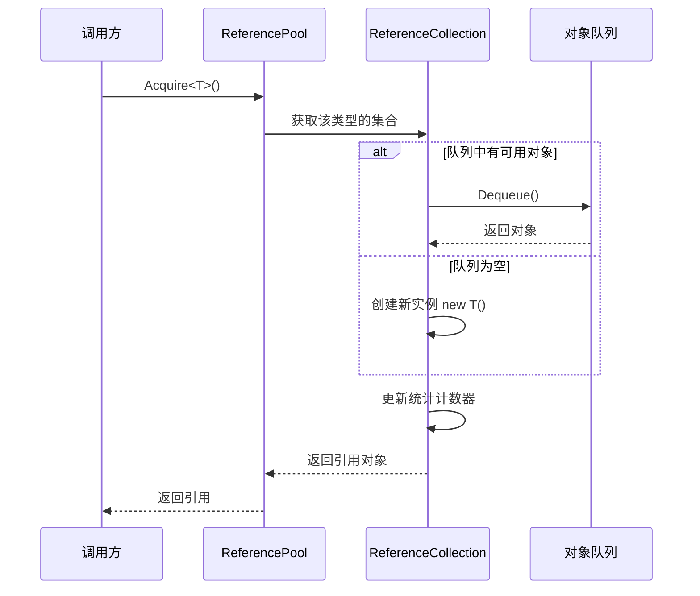
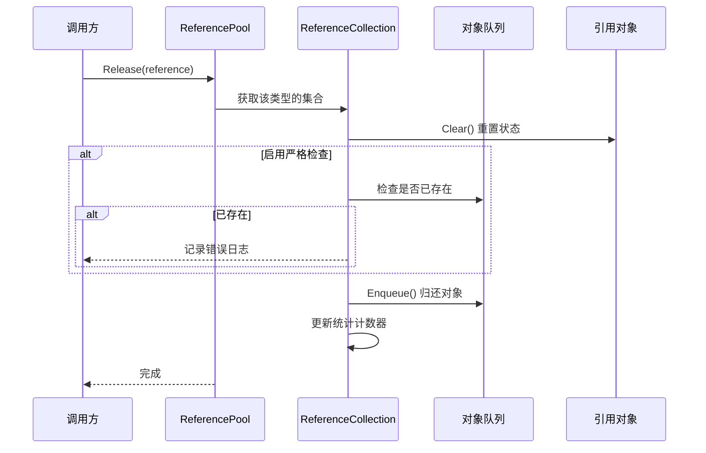

# 参照池系统

参照池系统是 GameFrameX フレームワーク的コアコンポーネント之一，用于管理可复用的参照对象，通过对象复用来减少垃圾回收（GC）带来的性能开销。

## 概要

在游戏开发中，频繁作成和破棄对象是导致性能問題的主な原因之一。特别是在高频シーン（如粒子系统、イベント系统、网络メッセージ処理等）中，每秒〜の可能性があります作成数千个临时对象，这会トリガー频繁的垃圾回收，导致游戏卡顿。

参照池系统通过以下方法解决这一問題：

1. **对象复用**：从池中取得对象使用，使用完毕后归还池中，避免频繁作成破棄
2. **按タイプ管理**：每种タイプ的参照有独立的子池，確認してくださいタイプ安全
3. **ステータス重置**：归还时自动呼び出し `Clear()` メソッド重置对象ステータス
4. **统计监控**：提供完全な的取得/归还/追加/移除统计，便于性能调优

## アーキテクチャ

```mermaid
graph TD
    subgraph External["外部调用"]
        Developer["开发者代码"]
    end

    subgraph API["引用池 API"]
        RP["ReferencePool 静态类"]
    end

    subgraph Internal["内部实现"]
        RC["ReferenceCollection<br/>(每类型一个)"]
        Queue["Queue~IReference~<br/>(对象队列)"]
    end

    subgraph Data["数据模型"]
        IRef["IReference 接口"]
        Info["ReferencePoolInfo<br/>(统计信息)"]
    end

    subgraph Unity["Unity 集成"]
        RPC["ReferencePoolComponent<br/>(Unity 组件)"]
        RSCT["ReferenceStrictCheckType<br/>(检查模式枚举)"]
    end

    Developer --> RP
    RP --> RC
    RC --> Queue
    IRef -.->|"实现|", Queue
    RC --> Info
    RPC -.-> RP
    RP -.-> RSCT
```

### コアコンポーネント

| コンポーネント | タイプ | 説明 |
|------|------|------|
| `IReference` | インターフェース | 所有可池化对象〜しなければなりません実装的インターフェース，パッケージ含 `Clear()` メソッド |
| `ReferencePool` | 静态类 | 参照池的主 API，提供取得/归还/追加/移除等操作 |
| `ReferenceCollection` | 内部类 | 管理特定タイプ参照对象的内部集合 |
| `ReferencePoolInfo` | 结构体 | パッケージ含参照池的统计情報 |
| `ReferencePoolComponent` | Unity コンポーネント | Unity 集成コンポーネント，用于設定和监控参照池 |

## 工作原理

### 参照取得フロー



### 参照归还フロー



### 严格確認モード

参照池サポート三种严格確認モード，通过 `ReferenceStrictCheckType` 列挙型設定：

| モード | 説明 | 适用シーン |
|------|------|----------|
| `AlwaysEnable` | 始终启用严格確認 | デバッグフェーズ捕获重复归还 |
| `OnlyEnableWhenDevelopment` | 仅在开发ビルド时启用 | 开发时デバッグ，本番環境保持性能 |
| `OnlyEnableInEditor` | 仅在エディタ中启用 | 纯エディタデバッグ |
| `AlwaysDisable` | 始终禁用严格確認 | 本番環境最大化性能 |

严格確認会在归还参照时検証该对象是否已在池中，避免重复归还导致的内存問題。

## 使用例

### 基本用法

まず，〜する必要があります実装 `IReference` インターフェース作成可池化的参照类：

```csharp
using GameFrameX.Runtime;

public class MyData : IReference
{
    public string Name;
    public int Value;
    public Dictionary<string, object> ExtraData;

    public void Clear()
    {
        Name = null;
        Value = 0;
        ExtraData?.Clear();
    }
}
```

次に使用参照池取得和归还对象：

```csharp
// 从池中获取引用
MyData data = ReferencePool.Acquire<MyData>();
data.Name = "Test";
data.Value = 100;

// 使用完毕归还池中
ReferencePool.Release(data);
```

### 预热池

〜できます在游戏开始时预热池，提前作成一定数量的参照对象：

```csharp
// 预热：为某种类型预先添加 100 个引用
ReferencePool.Add<MyData>(100);
```

### 取得池统计情報

在ランタイム监控参照池ステータス：

```csharp
// 获取所有引用池的统计信息
ReferencePoolInfo[] infos = ReferencePool.GetAllReferencePoolInfos();

foreach (var info in infos)
{
    Debug.Log($"Type: {info.Type.Name}");
    Debug.Log($"未使用: {info.UnusedReferenceCount}");
    Debug.Log($"使用中: {info.UsingReferenceCount}");
    Debug.Log($"获取次数: {info.AcquireReferenceCount}");
    Debug.Log($"归还次数: {info.ReleaseReferenceCount}");
}
```

### 清空池

在适当的时机清空所有参照池：

```csharp
// 清空所有引用池
ReferencePool.ClearAll();
```

### 使用 Unity コンポーネント設定

在 Unity シーン中追加参照池コンポーネント：

```csharp
// 在 Inspector 中配置严格检查模式
// ReferencePoolComponent 会自动初始化引用池配置
```

> Source: [ReferencePoolComponent.cs](https://github.com/GameFrameX/com.gameframex.unity/blob/main/Runtime/ReferencePool/ReferencePoolComponent.cs#L42-L95)

## API リファレンス

### `ReferencePool`

参照池的静态主类，提供所有池操作。

#### `Acquire<T>() where T : class, IReference, new(): T`

从参照池取得指定タイプ的参照。

```csharp
T item = ReferencePool.Acquire<T>();
```
> Source: [ReferencePool.cs](https://github.com/GameFrameX/com.gameframex.unity/blob/main/Runtime/Base/ReferencePool/ReferencePool.cs#L129-L132)

**パラメータ：**
- 无（ジェネリックパラメータ `T` 指定参照タイプ）

**返す：** 取得的参照インスタンス

**説明：** もし池中有可用参照则取出，否则作成新インスタンス

---

#### `Acquire(Type referenceType): IReference`

从参照池取得指定タイプ的参照（使用 Type パラメータ）。

```csharp
IReference item = ReferencePool.Acquire(typeof(MyData));
```
> Source: [ReferencePool.cs](https://github.com/GameFrameX/com.gameframex.unity/blob/main/Runtime/Base/ReferencePool/ReferencePool.cs#L143-L147)

**パラメータ：**
- `referenceType` (Type): 参照的タイプ

**返す：** 取得的参照インスタンス

---

#### `Release(IReference reference): void`

将参照归还到参照池。

```csharp
ReferencePool.Release(myData);
```
> Source: [ReferencePool.cs](https://github.com/GameFrameX/com.gameframex.unity/blob/main/Runtime/Base/ReferencePool/ReferencePool.cs#L157-L167)

**パラメータ：**
- `reference` (IReference): 要归还的参照

**抛出：**
- `GameFrameworkException`: 当参照为 null 时

---

#### `Add<T>(int count) where T : class, IReference, new(): void`

向参照池中追加指定数量的参照。

```csharp
// 预热：添加 100 个引用
ReferencePool.Add<MyData>(100);
```
> Source: [ReferencePool.cs](https://github.com/GameFrameX/com.gameframex.unity/blob/main/Runtime/Base/ReferencePool/ReferencePool.cs#L178-L181)

**パラメータ：**
- `count` (int): 要追加的数量

---

#### `Remove<T>(int count) where T : class, IReference: void`

从参照池中移除指定数量的未使用参照。

```csharp
ReferencePool.Remove<MyData>(10);
```
> Source: [ReferencePool.cs](https://github.com/GameFrameX/com.gameframex.unity/blob/main/Runtime/Base/ReferencePool/ReferencePool.cs#L207-L210)

**パラメータ：**
- `count` (int): 要移除的数量

---

#### `RemoveAll<T>() where T : class, IReference: void`

从参照池中移除指定タイプ的所有未使用参照。

```csharp
ReferencePool.RemoveAll<MyData>();
```
> Source: [ReferencePool.cs](https://github.com/GameFrameX/com.gameframex.unity/blob/main/Runtime/Base/ReferencePool/ReferencePool.cs#L235-L238)

---

#### `ClearAll(): void`

清除所有参照池中的所有参照。

```csharp
ReferencePool.ClearAll();
```
> Source: [ReferencePool.cs](https://github.com/GameFrameX/com.gameframex.unity/blob/main/Runtime/Base/ReferencePool/ReferencePool.cs#L107-L118)

---

#### `GetAllReferencePoolInfos(): ReferencePoolInfo[]`

取得所有参照池的统计情報。

```csharp
ReferencePoolInfo[] infos = ReferencePool.GetAllReferencePoolInfos();
```
> Source: [ReferencePool.cs](https://github.com/GameFrameX/com.gameframex.unity/blob/main/Runtime/Base/ReferencePool/ReferencePool.cs#L82-L98)

**返す：** パッケージ含所有参照池情報的数组

---

#### `EnableStrictCheck: bool`

取得或設定是否启用严格確認モード。

```csharp
// 启用严格检查
ReferencePool.EnableStrictCheck = true;

// 检查当前状态
if (ReferencePool.EnableStrictCheck)
{
    // ...
}
```
> Source: [ReferencePool.cs](https://github.com/GameFrameX/com.gameframex.unity/blob/main/Runtime/Base/ReferencePool/ReferencePool.cs#L56-L60)

---

#### `Count: int`

取得当前管理的参照池数量。

```csharp
int poolCount = ReferencePool.Count;
```
> Source: [ReferencePool.cs](https://github.com/GameFrameX/com.gameframex.unity/blob/main/Runtime/Base/ReferencePool/ReferencePool.cs#L69-L72)

---

### `IReference`

所有可池化对象〜しなければなりません実装的インターフェース。

```csharp
public interface IReference
{
    void Clear();
}
```
> Source: [IReference.cs](https://github.com/GameFrameX/com.gameframex.unity/blob/main/Runtime/Base/ReferencePool/IReference.cs#L40-L49)

#### `Clear(): void`

清理参照，将对象重置为初始ステータス。该メソッド在对象从池中取出时**不会**被呼び出し，仅在对象归还池中时由系统自动呼び出し。

```csharp
public class MyData : IReference
{
    public string Name;
    public int Value;

    public void Clear()
    {
        Name = null;
        Value = 0;
    }
}
```

**実装お勧め：**
- 将所有可写プロパティ重置为デフォルト值
- 解放或清空内部参照的非托管リソース（如有）
- 清空集合类成员（如 List、Dictionary）

---

### `ReferencePoolInfo`

パッケージ含参照池统计情報的结构体。

> Source: [ReferencePoolInfo.cs](https://github.com/GameFrameX/com.gameframex.unity/blob/main/Runtime/Base/ReferencePool/ReferencePoolInfo.cs#L44-L162)

| プロパティ | タイプ | 説明 |
|------|------|------|
| `Type` | Type | 参照池管理的タイプ |
| `UnusedReferenceCount` | int | 池中未使用（可用）的参照数量 |
| `UsingReferenceCount` | int | 当前〜中被使用的参照数量 |
| `AcquireReferenceCount` | int | 总共取得参照的次数 |
| `ReleaseReferenceCount` | int | 总共归还参照的次数 |
| `AddReferenceCount` | int | 总共追加参照的次数 |
| `RemoveReferenceCount` | int | 总共移除参照的次数 |

---

### `ReferenceStrictCheckType`

参照严格確認モード的列挙型タイプ。

> Source: [ReferenceStrictCheckType.cs](https://github.com/GameFrameX/com.gameframex.unity/blob/main/Runtime/ReferencePool/ReferenceStrictCheckType.cs#L40-L61)

| 值 | 説明 |
|------|------|
| `AlwaysEnable` | 始终启用严格確認 |
| `OnlyEnableWhenDevelopment` | 仅在开发ビルド时启用 |
| `OnlyEnableInEditor` | 仅在エディタ中启用 |
| `AlwaysDisable` | 始终禁用严格確認 |

---

## 性能最適化お勧め

### 1. 预热池

在游戏开始或切换シーン时预热池：

```csharp
void WarmUpPools()
{
    // 根据预估使用量预热
    ReferencePool.Add<MyData>(50);
    ReferencePool.Add<AnotherData>(30);
}
```

### 2. 合理実装 Clear メソッド

確認してください `Clear()` メソッド効率的执行：

```csharp
// ✅ 推荐：直接赋值而非创建新实例
public void Clear()
{
    Name = null;
    Value = 0;
    ExtraData.Clear(); // 清空而非置空
}

// ❌ 避免：创建新实例
public void Clear()
{
    ExtraData = new Dictionary<string, object>(); // 每次创建新对象
}
```

### 3. 本番環境禁用严格確認

在リリースバージョン中禁用严格確認以获得最佳性能：

```csharp
// 在 Release 构建设置
ReferencePool.EnableStrictCheck = false;

// 或通过组件配置
// 将 ReferencePoolComponent 的 Strict Check Type 设置为 AlwaysDisable
```

### 4. 监控池ステータス

定期確認池ステータス，识别潜在的内存問題：

```csharp
void LogPoolStats()
{
    foreach (var info in ReferencePool.GetAllReferencePoolInfos())
    {
        // 检查是否有泄漏（使用中很多但未使用很少）
        if (info.UsingReferenceCount > 100 && info.UnusedReferenceCount < 5)
        {
            Debug.LogWarning($"Potential leak: {info.Type.Name}");
        }
    }
}
```

## よくある問題

### Q: 参照池和对象池有什么区别？

参照池专门用于実装 `IReference` インターフェース的对象，强调轻量级复用。对象池（Object Pool）コンセプト更广泛，〜できます用于任何可复用的对象。GameFrameX 同時に提供します参照池和对象池系统，详情请参照 [对象池系统](./5-runtime.object-pool)。

### Q: 为什么 Clear メソッド在取得时不被呼び出し？

設計决策：取得时保持对象最近一次使用的数据〜できます提高缓存命中率。もし〜する必要があります干净的对象，〜できます手动呼び出し `Clear()` 或使用 `ReferencePool.Release()` 后再取得新对象。

### Q: 如何処理参照池的内存占用？

- 使用 `Remove()` メソッド移除多余的空闲参照
- 使用 `ClearAll()` 在适当シーン清空所有池
- 监控 `UnusedReferenceCount` 避免过多空闲对象

---

## 関連リンク

- [对象池系统](./5-runtime.object-pool) - 另一种对象复用机制
- [任务池系统](./5-runtime.task-pool) - 异步任务管理
- [API リファレンス](./8-api-reference) - 完全な API ドキュメント
