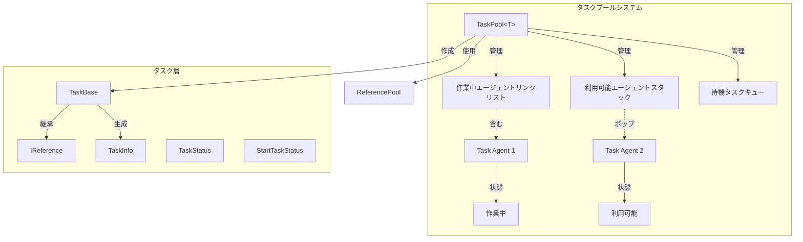
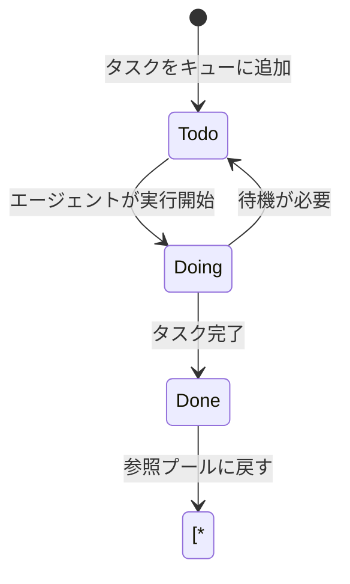
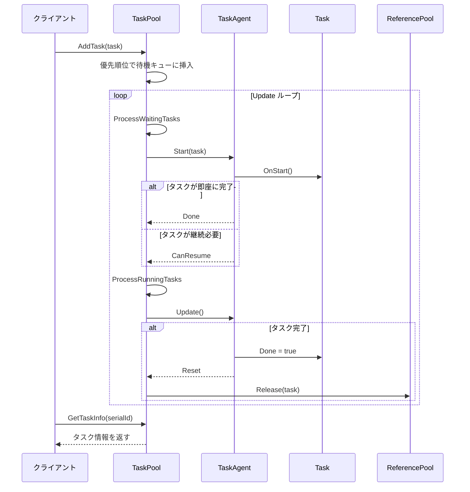

# タスクプールシステム

タスクプールシステムはGameFrameXフレームワークのコアモジュールの1つであり、汎用的なタスク管理与调度機能を提供します。タスクプールを通じて、開発者は時間を要する操作をタスクとして封装し、マルチタスクエージェントを使用して並行処理を行い、ゲームパフォーマンスを向上させます。

## 概要

タスクプールシステムは**エージェント-タスク**パターン設計を採用しており、以下のコアコンセプトを含みます：

- **タスクエージェント (Task Agent)**：実際にタスクを実行するworker、 各エージェントは一度に1つのタスクのみ処理可能
- **タスク (Task)**：具体的なビジネスロジックを封装した実行可能ユニット
- **タスクプール (Task Pool)**：タスクキューとタスクエージェントコンテナを管理するコアクラス

このシステムは以下をサポート：
- タスク優先順位スケジューリング（高優先順位タスクが優先的に処理）
- タスク状態查询（保留中、実行中、完了済み）
- タスクタグ管理（タグ별로クエリ、タスクを削除）
- 一時停止/恢复タスクプール
- 参照プール統合によるオブジェクト再利用

## アーキテクチャ



### コアコンポーネント説明

| コンポーネント | 型 | 責務 |
|------|------|------|
| `TaskPool<T>` | クラス | タスクプールコア、タスクエージェントとタスクキューを管理 |
| `TaskBase` | 抽象クラス | タスク基本クラス、一般的なタスクプロパティを定義 |
| `ITaskAgent<T>` | インターフェース | タスクエージェントインターフェース、タスク実行メソッドを定義 |
| `TaskInfo` | 構造体 | タスク情報コンテナ |
| `TaskStatus` | 列挙体 | タスク状態（保留中、実行中、完了済み） |
| `StartTaskStatus` | 列挙体 | タスク起動結果 |

## コアコンセプト

### タスク状態フロー



### タスク優先順位

タスクプールは**優先順位キュー**を使用してタスクをスケジュール：
- 値が大きいほど優先順位が高い
- 高優先順位タスクは低優先順位タスクの前に割込み
- デフォルト優先順位は0

### 参照プール統合

タスク完了後は自動的に参照プールに解放され、オブジェクト再利用を実現：
- タスクオブジェクトは`IReference`インターフェースを実装
- 完了時に`ReferencePool.Release(task)`を呼出して返却

## 使用例

### 1. カスタムタスクを定義

```csharp
using GameFrameX.Runtime;

// TaskBaseを継承してカスタムタスクを実装
public class DownloadTask : TaskBase
{
    private string m_Url;
    private string m_SavePath;

    public void Initialize(int serialId, string tag, int priority, string url, string savePath)
    {
        base.Initialize(serialId, tag, priority, null);
        m_Url = url;
        m_SavePath = savePath;
    }

    public override string Description
    {
        get { return $"ファイルをダウンロード: {m_Url}"; }
    }

    protected internal override void OnStart()
    {
        base.OnStart();
        // ダウンロードロジックを開始
    }

    protected internal override void OnUpdate(float elapseSeconds, float realElapseSeconds)
    {
        base.OnUpdate(elapseSeconds, realElapseSeconds);
        // ダウンロード進捗を更新
        // 完了時にDone = trueを設定
    }

    public override void Clear()
    {
        base.Clear();
        m_Url = null;
        m_SavePath = null;
    }
}
```
> Source: [TaskBase.cs](https://github.com/GameFrameX/com.gameframex.unity/blob/main/Runtime/Base/TaskPool/TaskBase.cs#L40-L182)

### 2. タスクエージェントを実装

```csharp
using GameFrameX.Runtime;

public class DownloadTaskAgent : ITaskAgent<DownloadTask>
{
    public DownloadTask Task { get; private set; }

    public void Initialize()
    {
        // エージェントリソースを初期化
    }

    public void Update(float elapseSeconds, float realElapseSeconds)
    {
        if (Task == null || Task.Done)
        {
            return;
        }

        // タスクロジックを実行
    }

    public StartTaskStatus Start(DownloadTask task)
    {
        Task = task;
        task.OnStart();

        if (task.Done)
        {
            return StartTaskStatus.Done;
        }

        return StartTaskStatus.CanResume;
    }

    public void Reset()
    {
        if (Task != null)
        {
            Task.OnRelease();
            Task = null;
        }
    }

    public void Shutdown()
    {
        // エージェントリソースを解放
    }
}
```
> Source: [ITaskAgent.cs](https://github.com/GameFrameX/com.gameframex.unity/blob/main/Runtime/Base/TaskPool/ITaskAgent.cs#L41-L94)

### 3. タスクプールを使用

```csharp
// タスクプールインスタンスを作成
var taskPool = new TaskPool<DownloadTask>();

// タスクエージェントを追加（複数追加して並行処理可以实现）
taskPool.AddAgent(new DownloadTaskAgent());
taskPool.AddAgent(new DownloadTaskAgent());
taskPool.AddAgent(new DownloadTaskAgent());

// タスクを作成して追加
var task = ReferencePool.Acquire<DownloadTask>();
task.Initialize(1, "ダウンロード", 10, "http://example.com/file.png", "Assets/file.png");
taskPool.AddTask(task);

// Updateで呼び出し
void Update()
{
    taskPool.Update(Time.deltaTime, Time.unscaledDeltaTime);
}

// タスク情報をクエリ
TaskInfo[] allTasks = taskPool.GetAllTaskInfos();
TaskInfo[] downloadTasks = taskPool.GetTaskInfos("ダウンロード");
TaskInfo singleTask = taskPool.GetTaskInfo(1);

// 一時停止/恢复
taskPool.Paused = true;  // 一時停止
taskPool.Paused = false; // 恢复

// タスクを削除
taskPool.RemoveTask(1);           // 指定シリアル番号タスクを削除
taskPool.RemoveTasks("ダウンロード");     // 指定タグのすべてのタスクを削除
taskPool.RemoveAllTasks();       // すべてのタスクを削除

// タスクプールを終了
taskPool.Shutdown();
```
> Source: [TaskPool.cs](https://github.com/GameFrameX/com.gameframex.unity/blob/main/Runtime/Base/TaskPool/TaskPool.cs#L44-L525)

## コアフロー

### タスク処理フロー



## APIリファレンス

### TaskPool<T>

タスクプールジェネリッククラス。

```csharp
public sealed class TaskPool<T> where T : TaskBase
```
> Source: [TaskPool.cs](https://github.com/GameFrameX/com.gameframex.unity/blob/main/Runtime/Base/TaskPool/TaskPool.cs#L44-L525)

#### プロパティ

| プロパティ | 型 | 説明 |
|------|------|------|
| `Paused` | `bool` | タスクプールが一時停止されているかどうかを取得または設定 |
| `TotalAgentCount` | `int` | タスクエージェント総数を取得 |
| `FreeAgentCount` | `int` | 利用可能なタスクエージェント数を取得 |
| `WorkingAgentCount` | `int` | 作業中のタスクエージェント数を取得 |
| `WaitingTaskCount` | `int` | 待機タスク数を取得 |

#### メソッド

##### `AddAgent(agent)`

タスクエージェントを追加。

```csharp
public void AddAgent(ITaskAgent<T> agent)
```

**パラメータ：**
- `agent` (ITaskAgent<T>): 追加するタスクエージェント

> Source: [TaskPool.cs#L172-L181](https://github.com/GameFrameX/com.gameframex.unity/blob/main/Runtime/Base/TaskPool/TaskPool.cs#L172-L181)

##### `AddTask(task)`

タスクを待機キューに追加。

```csharp
public void AddTask(T task)
```

**パラメータ：**
- `task` (T): 追加するタスク

> Source: [TaskPool.cs#L326-L348](https://github.com/GameFrameX/com.gameframex.unity/blob/main/Runtime/Base/TaskPool/TaskPool.cs#L326-L348)

##### `Update(elapseSeconds, realElapseSeconds)`

タスクプールポーリング処理。

```csharp
public void Update(float elapseSeconds, float realElapseSeconds)
```

**パラメータ：**
- `elapseSeconds` (float): 論理経過時間
- `realElapseSeconds` (float): 実際の経過時間

> Source: [TaskPool.cs#L136-L145](https://github.com/GameFrameX/com.gameframex.unity/blob/main/Runtime/Base/TaskPool/TaskPool.cs#L136-L145)

##### `GetTaskInfo(serialId)`

シリアル番号でタスク情報を取得。

```csharp
public TaskInfo GetTaskInfo(int serialId)
```

**パラメータ：**
- `serialId` (int): タスクのシリアル番号

**戻り値：** TaskInfo - タスク情報構造体

> Source: [TaskPool.cs#L191-L212](https://github.com/GameFrameX/com.gameframex.unity/blob/main/Runtime/Base/TaskPool/TaskPool.cs#L191-L212)

##### `GetTaskInfos(tag)`

タグでタスク情報配列を取得。

```csharp
public TaskInfo[] GetTaskInfos(string tag)
```

**パラメータ：**
- `tag` (string): タスクタグ

**戻り値：** TaskInfo[] - タスク情報配列

> Source: [TaskPool.cs#L222-L228](https://github.com/GameFrameX/com.gameframex.unity/blob/main/Runtime/Base/TaskPool/TaskPool.cs#L222-L228)

##### `GetAllTaskInfos()`

すべてのタスク情報を取得。

```csharp
public TaskInfo[] GetAllTaskInfos()
```

**戻り値：** TaskInfo[] - すべてのタスク情報配列

> Source: [TaskPool.cs#L272-L289](https://github.com/GameFrameX/com.gameframex.unity/blob/main/Runtime/Base/TaskPool/TaskPool.cs#L272-L289)

##### `RemoveTask(serialId)`

指定シリアル番号タスクを削除。

```csharp
public bool RemoveTask(int serialId)
```

**パラメータ：**
- `serialId` (int): タスクのシリアル番号

**戻り値：** bool - 削除成功かどうか

> Source: [TaskPool.cs#L358-L390](https://github.com/GameFrameX/com.gameframex.unity/blob/main/Runtime/Base/TaskPool/TaskPool.cs#L358-L390)

##### `RemoveTasks(tag)`

指定タグのすべてのタスクを削除。

```csharp
public int RemoveTasks(string tag)
```

**パラメータ：**
- `tag` (string): タスクタグ

**戻り値：** int - 削除したタスク数

> Source: [TaskPool.cs#L400-L439](https://github.com/GameFrameX/com.gameframex.unity/blob/main/Runtime/Base/TaskPool/TaskPool.cs#L400-L439)

##### `RemoveAllTasks()`

すべてのタスクを削除。

```csharp
public int RemoveAllTasks()
```

**戻り値：** int - 削除したタスク数

> Source: [TaskPool.cs#L448-L471](https://github.com/GameFrameX/com.gameframex.unity/blob/main/Runtime/Base/TaskPool/TaskPool.cs#L448-L471)

##### `Shutdown()`

タスクプールを終了してクリーンアップ。

```csharp
public void Shutdown()
```

> Source: [TaskPool.cs#L154-L162](https://github.com/GameFrameX/com.gameframex.unity/blob/main/Runtime/Base/TaskPool/TaskPool.cs#L154-L162)

---

### TaskBase

タスク基本クラス。

```csharp
public abstract class TaskBase : IReference
```
> Source: [TaskBase.cs](https://github.com/GameFrameX/com.gameframex.unity/blob/main/Runtime/Base/TaskPool/TaskBase.cs#L40-L182)

#### プロパティ

| プロパティ | 型 | 説明 |
|------|------|------|
| `SerialId` | `int` | タスクのシリアル番号を取得 |
| `Tag` | `string` | タスクのタグを取得 |
| `Priority` | `int` | タスクの優先順位を取得 |
| `UserData` | `object` | タスクのユーザーカスタムデータを取得 |
| `Done` | `bool` | タスクが完了したかどうかを取得または設定 |
| `Description` | `string` | タスクの説明を取得（仮想プロパティ） |

#### 定数

| 定数 | 値 | 説明 |
|------|-----|------|
| `DefaultPriority` | 0 | タスクのデフォルト優先順位 |

---

### TaskStatus

タスク状態列挙体。

```csharp
public enum TaskStatus : byte
```
> Source: [TaskStatus.cs](https://github.com/GameFrameX/com.gameframex.unity/blob/main/Runtime/Base/TaskPool/TaskStatus.cs#L41-L66)

| メンバー | 値 | 説明 |
|------|-----|------|
| `Todo` | 0 | 未開始 |
| `Doing` | 1 | 実行中 |
| `Done` | 2 | 完了済み |

---

### StartTaskStatus

タスク起動状態列挙体。

```csharp
public enum StartTaskStatus : byte
```
> Source: [StartTaskStatus.cs](https://github.com/GameFrameX/com.gameframex.unity/blob/main/Runtime/Base/TaskPool/StartTaskStatus.cs#L41-L74)

| メンバー | 値 | 説明 |
|------|-----|------|
| `Done` | 0 | タスクが即座に完了可能 |
| `CanResume` | 1 | タスクが継続処理可能 |
| `HasToWait` | 2 | タスクは他のタスクを待つ必要がある |
| `UnknownError` | 3 | 未知のエラー |

---

### TaskInfo

タスク情報構造体。

```csharp
public struct TaskInfo
```
> Source: [TaskInfo.cs](https://github.com/GameFrameX/com.gameframex.unity/blob/main/Runtime/Base/TaskPool/TaskInfo.cs#L44-L209)

#### プロパティ

| プロパティ | 型 | 説明 |
|------|------|------|
| `IsValid` | `bool` | タスク情報が有効かどうかを取得 |
| `SerialId` | `int` | タスクシリアル番号を取得 |
| `Tag` | `string` | タスクタグを取得 |
| `Priority` | `int` | タスク優先順位を取得 |
| `UserData` | `object` | ユーザーデータを取得 |
| `Status` | `TaskStatus` | タスク状態を取得 |
| `Description` | `string` | タスク説明を取得 |

---

### ITaskAgent<T>

タスクエージェントインターフェース。

```csharp
public interface ITaskAgent<T> where T : TaskBase
```
> Source: [ITaskAgent.cs](https://github.com/GameFrameX/com.gameframex.unity/blob/main/Runtime/Base/TaskPool/ITaskAgent.cs#L41-L94)

#### プロパティ

| プロパティ | 型 | 説明 |
|------|------|------|
| `Task` | `T` | 現在のタスクを取得 |

#### メソッド

##### `Initialize()`

タスクエージェントを初期化。

```csharp
void Initialize()
```

##### `Update(elapseSeconds, realElapseSeconds)`

タスクエージェントポーリング。

```csharp
void Update(float elapseSeconds, float realElapseSeconds)
```

##### `Start(task)`

タスク処理を開始。

```csharp
StartTaskStatus Start(T task)
```

##### `Reset()`

タスクエージェントをリセット。

```csharp
void Reset()
```

##### `Shutdown()`

タスクエージェントを終了。

```csharp
void Shutdown()
```

## ベストプラクティス

### 1. タスクエージェントプール化

タスクタイプと负载に基づいて适当な数のエージェントを作成：

```csharp
// CPU集約型タスクはエージェント数 = CPUコア数推荐
// IO集約型タスクはより多くのエージェントを作成可能
int agentCount = SystemInfo.processorCount;
for (int i = 0; i < agentCount; i++)
{
    taskPool.AddAgent(new DownloadTaskAgent());
}
```

### 2. タスク優先順位戦略

- キーネタスク（UIフィードバック、ネットワークコールバック）：高優先順位（100）
- 常规タスク（リソースロード）：中優先順位（50）
- バックグラウンドタスク（ログ報告）：低優先順位（0）

### 3. タスクライフサイクル管理

- タスクの`Clear()`メソッドですべての参照をクリーンアップ
- タスクで大量的オブジェクトを保持しないように回避
- 不要なタスクを及时に削除してメモリを解放

## 関連リンク

- [オブジェクトプールシステム](./5-runtime.object-pool) - オブジェクト再利用メカニズム
- [参照プールシステム](./5-runtime.reference-pool) - 参照オブジェクト管理
- [イベントシステム](./5-runtime.event-system) - フレームワークイベントメカニズム
- [基本コンポーネント](./5-runtime.base) - フレームワーク基本コンポーネント
- [APIリファレンス](./8-api-reference) - 完全なAPIドキュメント
