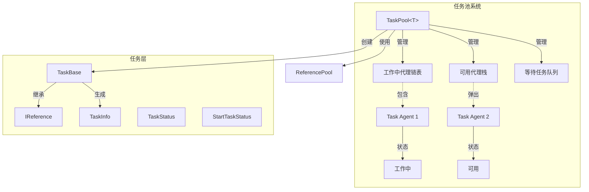
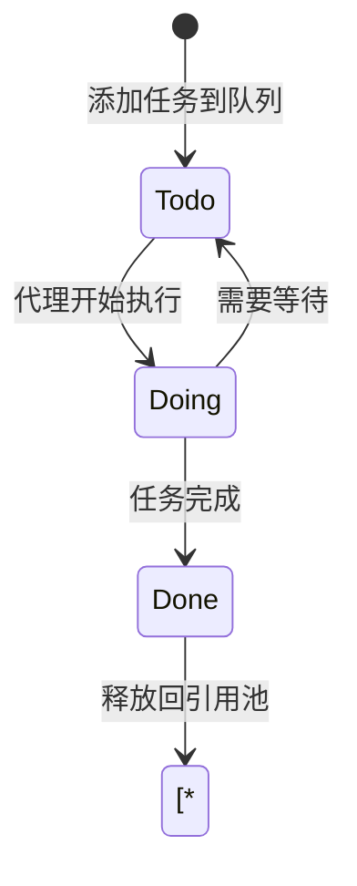

# 任务池系统

任务池系统是 GameFrameX フレームワーク的コアモジュール之一，提供汎用的任务管理和调度機能。通过任务池，開発者〜できます将耗时的操作カプセル化为任务，利用多任务代理并行処理，提高游戏性能表现。

## 概要

任务池系统采用**代理-任务**モード設計，パッケージ含以下コアコンセプト：

- **任务代理 (Task Agent)**：实际执行任务的worker，每个代理一次只能処理一个任务
- **任务 (Task)**：カプセル化具体业务逻辑的可执行单元
- **任务池 (Task Pool)**：管理任务队列和任务代理容器的コア类

该系统サポート：
- 任务优先级调度（高优先级任务优先処理）
- 任务ステータス查询（待処理、执行中、已完成）
- 任务标签管理（按标签查询、移除任务）
- 暂停/恢复任务池
- 与参照池集成実装对象复用

## アーキテクチャ



### コアコンポーネント説明

| コンポーネント | タイプ | 职责 |
|------|------|------|
| `TaskPool<T>` | 类 | 任务池コア，管理任务代理和任务队列 |
| `TaskBase` | 抽象类 | 任务基底クラス，定義任务汎用プロパティ |
| `ITaskAgent<T>` | インターフェース | 任务代理インターフェース，定義任务执行メソッド |
| `TaskInfo` | 结构体 | 任务情報容器 |
| `TaskStatus` | 列挙型 | 任务ステータス（待処理、执行中、已完成） |
| `StartTaskStatus` | 列挙型 | 任务启动結果 |

## コアコンセプト

### 任务ステータス流转



### 任务优先级

任务池使用**优先级队列**调度任务：
- 数值越大优先级越高
- 高优先级任务会插队到低优先级任务之前
- デフォルト优先级为 0

### 参照池集成

任务完成后会自动解放到参照池，実装对象复用：
- 任务对象実装 `IReference` インターフェース
- 完成后呼び出し `ReferencePool.Release(task)` 归还

## 使用例

### 1. 定義自定義任务

```csharp
using GameFrameX.Runtime;

// 继承 TaskBase 实现自定义任务
public class DownloadTask : TaskBase
{
    private string m_Url;
    private string m_SavePath;
    
    public void Initialize(int serialId, string tag, int priority, string url, string savePath)
    {
        base.Initialize(serialId, tag, priority, null);
        m_Url = url;
        m_SavePath = savePath;
    }
    
    public override string Description
    {
        get { return $"下载文件: {m_Url}"; }
    }
    
    protected internal override void OnStart()
    {
        base.OnStart();
        // 开始下载逻辑
    }
    
    protected internal override void OnUpdate(float elapseSeconds, float realElapseSeconds)
    {
        base.OnUpdate(elapseSeconds, realElapseSeconds);
        // 更新下载进度
        // 完成时设置 Done = true
    }
    
    public override void Clear()
    {
        base.Clear();
        m_Url = null;
        m_SavePath = null;
    }
}
```
> Source: [TaskBase.cs](https://github.com/GameFrameX/com.gameframex.unity/blob/main/Runtime/Base/TaskPool/TaskBase.cs#L40-L182)

### 2. 実装任务代理

```csharp
using GameFrameX.Runtime;

public class DownloadTaskAgent : ITaskAgent<DownloadTask>
{
    public DownloadTask Task { get; private set; }
    
    public void Initialize()
    {
        // 初始化代理资源
    }
    
    public void Update(float elapseSeconds, float realElapseSeconds)
    {
        if (Task == null || Task.Done)
        {
            return;
        }
        
        // 执行任务逻辑
    }
    
    public StartTaskStatus Start(DownloadTask task)
    {
        Task = task;
        task.OnStart();
        
        if (task.Done)
        {
            return StartTaskStatus.Done;
        }
        
        return StartTaskStatus.CanResume;
    }
    
    public void Reset()
    {
        if (Task != null)
        {
            Task.OnRelease();
            Task = null;
        }
    }
    
    public void Shutdown()
    {
        // 释放代理资源
    }
}
```
> Source: [ITaskAgent.cs](https://github.com/GameFrameX/com.gameframex.unity/blob/main/Runtime/Base/TaskPool/ITaskAgent.cs#L41-L94)

### 3. 使用任务池

```csharp
// 创建任务池实例
var taskPool = new TaskPool<DownloadTask>();

// 添加任务代理（可以添加多个实现并行处理）
taskPool.AddAgent(new DownloadTaskAgent());
taskPool.AddAgent(new DownloadTaskAgent());
taskPool.AddAgent(new DownloadTaskAgent());

// 创建并添加任务
var task = ReferencePool.Acquire<DownloadTask>();
task.Initialize(1, "下载", 10, "http://example.com/file.png", "Assets/file.png");
taskPool.AddTask(task);

// 在 Update 中调用
void Update()
{
    taskPool.Update(Time.deltaTime, Time.unscaledDeltaTime);
}

// 查询任务信息
TaskInfo[] allTasks = taskPool.GetAllTaskInfos();
TaskInfo[] downloadTasks = taskPool.GetTaskInfos("下载");
TaskInfo singleTask = taskPool.GetTaskInfo(1);

// 暂停/恢复
taskPool.Paused = true;  // 暂停
taskPool.Paused = false; // 恢复

// 移除任务
taskPool.RemoveTask(1);           // 移除指定序列号任务
taskPool.RemoveTasks("下载");     // 移除指定标签的所有任务
taskPool.RemoveAllTasks();       // 移除所有任务

// 关闭任务池
taskPool.Shutdown();
```
> Source: [TaskPool.cs](https://github.com/GameFrameX/com.gameframex.unity/blob/main/Runtime/Base/TaskPool/TaskPool.cs#L44-L525)

## コアフロー

### 任务処理フロー


## API リファレンス

### TaskPool<T>

任务池ジェネリック类。

```csharp
public sealed class TaskPool<T> where T : TaskBase
```
> Source: [TaskPool.cs](https://github.com/GameFrameX/com.gameframex.unity/blob/main/Runtime/Base/TaskPool/TaskPool.cs#L44-L525)

#### プロパティ

| プロパティ | タイプ | 説明 |
|------|------|------|
| `Paused` | `bool` | 取得或設定任务池是否被暂停 |
| `TotalAgentCount` | `int` | 取得任务代理总数量 |
| `FreeAgentCount` | `int` | 取得可用任务代理数量 |
| `WorkingAgentCount` | `int` | 取得工作中任务代理数量 |
| `WaitingTaskCount` | `int` | 取得等待任务数量 |

#### メソッド

##### `AddAgent(agent)`

增加任务代理。

```csharp
public void AddAgent(ITaskAgent<T> agent)
```

**パラメータ：**
- `agent` (ITaskAgent<T>): 要增加的任务代理

> Source: [TaskPool.cs#L172-L181](https://github.com/GameFrameX/com.gameframex.unity/blob/main/Runtime/Base/TaskPool/TaskPool.cs#L172-L181)

##### `AddTask(task)`

增加任务到等待队列。

```csharp
public void AddTask(T task)
```

**パラメータ：**
- `task` (T): 要增加的任务

> Source: [TaskPool.cs#L326-L348](https://github.com/GameFrameX/com.gameframex.unity/blob/main/Runtime/Base/TaskPool/TaskPool.cs#L326-L348)

##### `Update(elapseSeconds, realElapseSeconds)`

任务池轮询処理。

```csharp
public void Update(float elapseSeconds, float realElapseSeconds)
```

**パラメータ：**
- `elapseSeconds` (float): 逻辑流逝时间
- `realElapseSeconds` (float): 真实流逝时间

> Source: [TaskPool.cs#L136-L145](https://github.com/GameFrameX/com.gameframex.unity/blob/main/Runtime/Base/TaskPool/TaskPool.cs#L136-L145)

##### `GetTaskInfo(serialId)`

根据序列编号取得任务情報。

```csharp
public TaskInfo GetTaskInfo(int serialId)
```

**パラメータ：**
- `serialId` (int): 任务的序列编号

**返す：** TaskInfo - 任务情報结构

> Source: [TaskPool.cs#L191-L212](https://github.com/GameFrameX/com.gameframex.unity/blob/main/Runtime/Base/TaskPool/TaskPool.cs#L191-L212)

##### `GetTaskInfos(tag)`

根据标签取得任务情報数组。

```csharp
public TaskInfo[] GetTaskInfos(string tag)
```

**パラメータ：**
- `tag` (string): 任务标签

**返す：** TaskInfo[] - 任务情報数组

> Source: [TaskPool.cs#L222-L228](https://github.com/GameFrameX/com.gameframex.unity/blob/main/Runtime/Base/TaskPool/TaskPool.cs#L222-L228)

##### `GetAllTaskInfos()`

取得所有任务情報。

```csharp
public TaskInfo[] GetAllTaskInfos()
```

**返す：** TaskInfo[] - 所有任务情報数组

> Source: [TaskPool.cs#L272-L289](https://github.com/GameFrameX/com.gameframex.unity/blob/main/Runtime/Base/TaskPool/TaskPool.cs#L272-L289)

##### `RemoveTask(serialId)`

移除指定序列编号的任务。

```csharp
public bool RemoveTask(int serialId)
```

**パラメータ：**
- `serialId` (int): 任务的序列编号

**返す：** bool - 是否移除成功

> Source: [TaskPool.cs#L358-L390](https://github.com/GameFrameX/com.gameframex.unity/blob/main/Runtime/Base/TaskPool/TaskPool.cs#L358-L390)

##### `RemoveTasks(tag)`

移除指定标签的所有任务。

```csharp
public int RemoveTasks(string tag)
```

**パラメータ：**
- `tag` (string): 任务标签

**返す：** int - 移除的任务数量

> Source: [TaskPool.cs#L400-L439](https://github.com/GameFrameX/com.gameframex.unity/blob/main/Runtime/Base/TaskPool/TaskPool.cs#L400-L439)

##### `RemoveAllTasks()`

移除所有任务。

```csharp
public int RemoveAllTasks()
```

**返す：** int - 移除的任务数量

> Source: [TaskPool.cs#L448-L471](https://github.com/GameFrameX/com.gameframex.unity/blob/main/Runtime/Base/TaskPool/TaskPool.cs#L448-L471)

##### `Shutdown()`

閉じる并清理任务池。

```csharp
public void Shutdown()
```

> Source: [TaskPool.cs#L154-L162](https://github.com/GameFrameX/com.gameframex.unity/blob/main/Runtime/Base/TaskPool/TaskPool.cs#L154-L162)

---

### TaskBase

任务基底クラス。

```csharp
public abstract class TaskBase : IReference
```
> Source: [TaskBase.cs](https://github.com/GameFrameX/com.gameframex.unity/blob/main/Runtime/Base/TaskPool/TaskBase.cs#L40-L182)

#### プロパティ

| プロパティ | タイプ | 説明 |
|------|------|------|
| `SerialId` | `int` | 取得任务的序列编号 |
| `Tag` | `string` | 取得任务的标签 |
| `Priority` | `int` | 取得任务的优先级 |
| `UserData` | `object` | 取得任务的ユーザー自定義数据 |
| `Done` | `bool` | 取得或設定任务是否完成 |
| `Description` | `string` | 取得任务説明（虚プロパティ） |

#### 常量

| 常量 | 值 | 説明 |
|------|-----|------|
| `DefaultPriority` | 0 | 任务デフォルト优先级 |

---

### TaskStatus

任务ステータス列挙型。

```csharp
public enum TaskStatus : byte
```
> Source: [TaskStatus.cs](https://github.com/GameFrameX/com.gameframex.unity/blob/main/Runtime/Base/TaskPool/TaskStatus.cs#L41-L66)

| 成员 | 值 | 説明 |
|------|-----|------|
| `Todo` | 0 | 未开始 |
| `Doing` | 1 | 执行中 |
| `Done` | 2 | 已完成 |

---

### StartTaskStatus

任务启动ステータス列挙型。

```csharp
public enum StartTaskStatus : byte
```
> Source: [StartTaskStatus.cs](https://github.com/GameFrameX/com.gameframex.unity/blob/main/Runtime/Base/TaskPool/StartTaskStatus.cs#L41-L74)

| 成员 | 值 | 説明 |
|------|-----|------|
| `Done` | 0 | 任务可立つまり完成 |
| `CanResume` | 1 | 任务〜できます继续処理 |
| `HasToWait` | 2 | 任务需等待其他任务 |
| `UnknownError` | 3 | 未知エラー |

---

### TaskInfo

任务情報结构体。

```csharp
public struct TaskInfo
```
> Source: [TaskInfo.cs](https://github.com/GameFrameX/com.gameframex.unity/blob/main/Runtime/Base/TaskPool/TaskInfo.cs#L44-L209)

#### プロパティ

| プロパティ | タイプ | 説明 |
|------|------|------|
| `IsValid` | `bool` | 取得任务情報是否有效 |
| `SerialId` | `int` | 取得任务序列编号 |
| `Tag` | `string` | 取得任务标签 |
| `Priority` | `int` | 取得任务优先级 |
| `UserData` | `object` | 取得ユーザー数据 |
| `Status` | `TaskStatus` | 取得任务ステータス |
| `Description` | `string` | 取得任务説明 |

---

### ITaskAgent<T>

任务代理インターフェース。

```csharp
public interface ITaskAgent<T> where T : TaskBase
```
> Source: [ITaskAgent.cs](https://github.com/GameFrameX/com.gameframex.unity/blob/main/Runtime/Base/TaskPool/ITaskAgent.cs#L41-L94)

#### プロパティ

| プロパティ | タイプ | 説明 |
|------|------|------|
| `Task` | `T` | 取得当前任务 |

#### メソッド

##### `Initialize()`

初期化任务代理。

```csharp
void Initialize()
```

##### `Update(elapseSeconds, realElapseSeconds)`

任务代理轮询。

```csharp
void Update(float elapseSeconds, float realElapseSeconds)
```

##### `Start(task)`

开始処理任务。

```csharp
StartTaskStatus Start(T task)
```

##### `Reset()`

重置任务代理。

```csharp
void Reset()
```

##### `Shutdown()`

閉じる任务代理。

```csharp
void Shutdown()
```

## ベストプラクティス

### 1. 任务代理池化

根据任务タイプ和负载作成适当数量的代理：

```csharp
// CPU 密集型任务建议代理数 = CPU 核心数
// IO 密集型任务可以创建更多代理
int agentCount = SystemInfo.processorCount;
for (int i = 0; i < agentCount; i++)
{
    taskPool.AddAgent(new DownloadTaskAgent());
}
```

### 2. 任务优先级策略

- 关键任务（UI反馈、网络コールバック）：高优先级（100）
- 常规任务（リソースロード）：中等优先级（50）
- 后台任务（ログ上报）：低优先级（0）

### 3. 任务ライフサイクル管理

- 在任务 `Clear()` メソッド中清理所有参照
- 避免在任务中持有大量对象
- 及时移除不〜する必要があります的任务以解放内存

## 関連リンク

- [对象池系统](./5-runtime.object-pool) - 对象复用机制
- [参照池系统](./5-runtime.reference-pool) - 参照对象管理
- [イベント系统](./5-runtime.event-system) - フレームワークイベント机制
- [基本コンポーネント](./5-runtime.base) - フレームワーク基本コンポーネント
- [API リファレンス](./8-api-reference) - 完全な API ドキュメント
