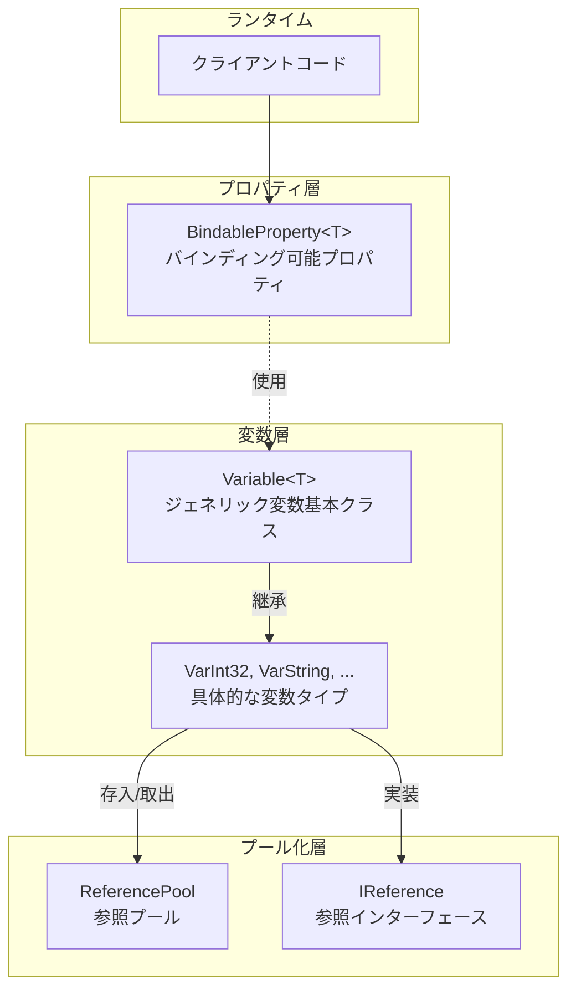
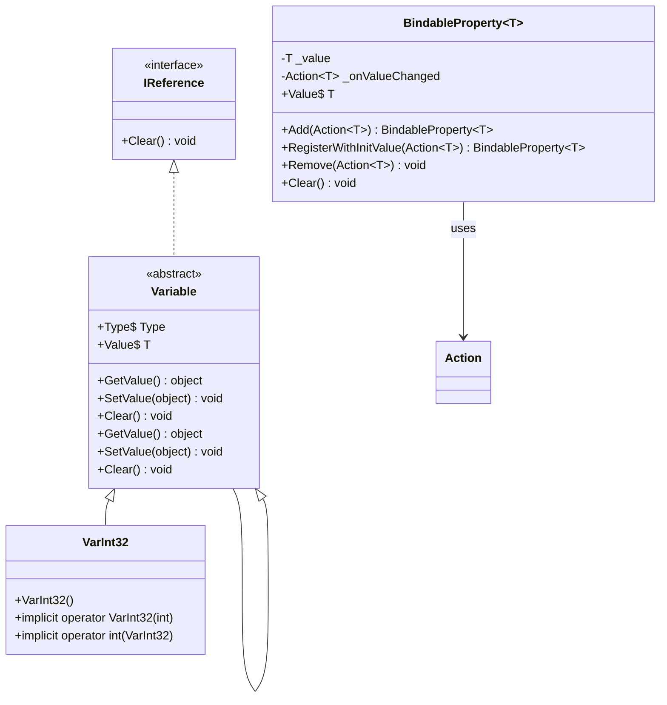
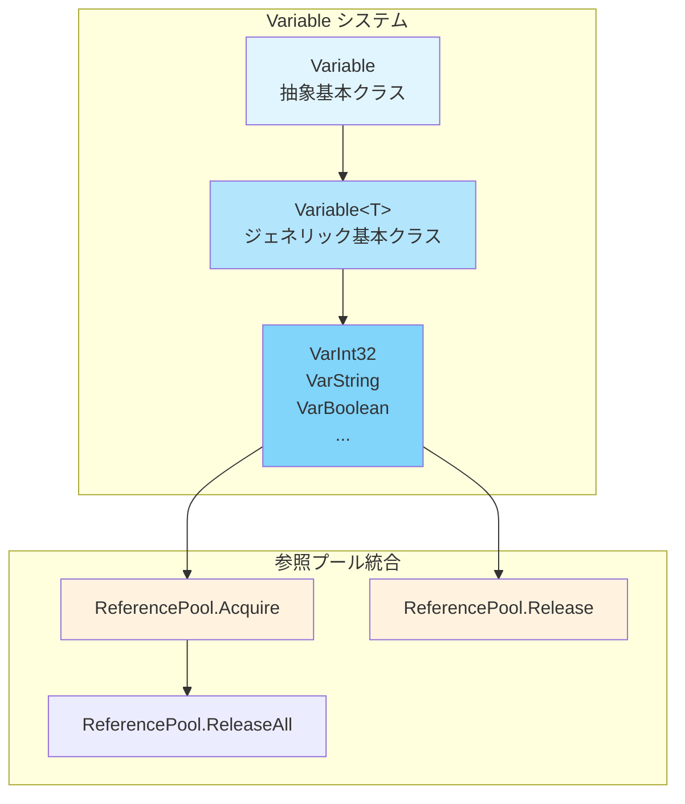

# プロパティシステム

GameFrameXプロパティシステムは、完整的属性と変数管理メカニズムを提供し、バインディング可能プロパティ（BindableProperty）と型付け変数（Variable）の2つのコアコンポーネントを含みます。このシステムはプロパティ値变化監視、参照プール管理、ジェネリック型安全操作をサポートしています。

## 概要

プロパティシステムはGameFrameXフレームワークの基本コンポーネントの1つであり、主に以下の2つの部分で構成されます：

1. **BindableProperty<T>** - バインディング可能プロパティ、プロパティ値变化通知メカニズムを提供、オブザーバーパターンに基づいて実装
2. **Variable**システム - 型付け変数コンテナ、参照プールを統合して効率的なメモリ管理を実現

このシステムは以下のシナリオに適しています：
- プロパティ値变化を監視する必要があるUIバインディング
- 一時変数を効率的に管理する必要があるゲームロジック
- 型安全のデータ传递が必要
- ガベージコレクション压力を軽減する必要がある高性能シナリオ

## Architecture

プロパティシステムの 아키텍처設計はモジュラ原則に従い、主に以下の層を含みます：



### コアコンポーネント関係



## BindableProperty バインディング可能プロパティ

`BindableProperty<T>`はプロパティシステムのコアコンポーネントであり、プロパティ値变化通知機能を提供します。オプザーバーパターン设计上、プロパティ値が変化したときに登録済みコールバックを自動トリガーします。

### コア機能

- **ジェネリックサポート** - 任意の型Tをサポート
- **値变化監視** - Action<T>コールバックメカニズムを通じて変化を通知
- **メソッドチェーン呼び出し** - Fluent APIスタイルの регистрация 方法をサポート
- **自動比較** - 不必要な更新を避けるために`Equals`メソッドを使用

### 使用例

#### 基本使用方法

バインディング可能プロパティを作成し、値変化を監視：

```csharp
using GameFrameX.Runtime;

// バインディング可能プロパティを作成、デフォルト値は0
var health = new BindableProperty<int>(100);

// 値变化監視を登録
health.Add(newValue =>
{
    Debug.Log($"HPが変化しました: {newValue}");
});

// 値を変更するとコールバックがトリガーされる
health.Value = 90; // 出力: "HPが変化しました: 90"
health.Value = 80; // 出力: "HPが変化しました: 80"

// 同じ値はコールバックをトリガーしない
health.Value = 80; // コールバックトリガーなし
```
> Source: [BindableProperty.cs](https://github.com/GameFrameX/com.gameframex.unity/blob/main/Runtime/Property/BindableProperty.cs#L1-L90)

#### 登録時に即座にコールバックを実行

`RegisterWithInitValue`を使用して登録時に即座にコールバックを実行、初始化シナリオに適しています：

```csharp
var score = new BindableProperty<int>(0);

// 登録して現在の値を即座に取得
score.RegisterWithInitValue(currentScore =>
{
    Debug.Log($"現在のスコア: {currentScore}");
});
// 出力: "現在のスコア: 0"
```
> Source: [BindableProperty.cs](https://github.com/GameFrameX/com.gameframex.unity/blob/main/Runtime/Property/BindableProperty.cs#L63-L68)

#### 監視を削除

```csharp
var health = new BindableProperty<int>(100);

Action<int> listener = newValue => Debug.Log($"変化: {newValue}");
health.Add(listener);

// 特定のモニターを削除
health.Remove(listener);

// すべてのモニターをクリア
health.Clear();
```
> Source: [BindableProperty.cs](https://github.com/GameFrameX/com.gameframex.unity/blob/main/Runtime/Property/BindableProperty.cs#L70-L88)

### 実際の応用シナリオ

#### MVVMパターンでのデータバインディング

```csharp
public class PlayerModel
{
    // データバインディング用のバインディング可能プロパティ
    public BindableProperty<int> Health { get; } = new BindableProperty<int>(100);
    public BindableProperty<int> Gold { get; } = new BindableProperty<int>(0);
    public BindableProperty<string> Name { get; } = new BindableProperty<string>("");
}

public class PlayerView
{
    private PlayerModel _model;

    public void Bind(PlayerModel model)
    {
        _model = model;

        // HP変化監視を登録
        _model.Health.Add(OnHealthChanged);

        // 金币変化監視を登録
        _model.Gold.Add(OnGoldChanged);
    }

    private void OnHealthChanged(int health)
    {
        Debug.Log($"UI更新: HP = {health}");
    }

    private void OnGoldChanged(int gold)
    {
        Debug.Log($"UI更新: 金币 = {gold}");
    }
}
```

#### ステートマシンでの状態変化監視

```csharp
public class GameState
{
    public BindableProperty<GameStateType> CurrentState { get; }
        = new BindableProperty<GameStateType>(GameStateType.Init);

    public void ChangeState(GameStateType newState)
    {
        CurrentState.Value = newState;
    }
}

// 状態監視
gameState.CurrentState.Add(state =>
{
    switch (state)
    {
        case GameStateType.Playing:
            StartGame();
            break;
        case GameStateType.Paused:
            PauseGame();
            break;
    }
});
```

## Variable 変数システム

Variableシステムは型安全な変数封装一套を提供し、参照プールと統合して効率的なメモリ管理を実現します。各Variable型は`IReference`インターフェースを実装し、参照プールで統一的に管理できます。

### 아키텍처設計



### 組み込み変数タイプ

GameFrameXは30+種類の事前定義Variable型を提供します：

| 分類 | 型 |
|------|------|
| 基本数値 | VarInt16, VarInt32, VarInt64, VarUInt16, VarUInt32, VarUInt64 |
| 浮動小数点 | VarSingle, VarDouble, VarDecimal |
| 他の数値 | VarByte, VarSByte, VarChar |
| 文字列 | VarString |
| 布尔値 | VarBoolean |
| 日時 | VarDateTime |
| Unity基本 | VarVector2, VarVector3, VarVector4, VarQuaternion, VarRect |
| Unityオブジェクト | VarColor, VarColor32, VarGameObject, VarMaterial, VarTexture, VarTransform, VarUnityObject |
| 配列 | VarByteArray, VarCharArray |
| オブジェクト | VarObject |

### 使用例

#### 基本使用方法

```csharp
using GameFrameX.Runtime;

// 変数を作成
VarInt32 score = ReferencePool.Acquire<VarInt32>();
score.Value = 100;

// 暗黙の変換を使用
int value = score; // 値を取得
score = 200;      // 値を設定

// 参照プールに解放
ReferencePool.Release(score);
```
> Source: [VarInt32.cs](parameterNameValuePairs=)

#### 暗黙の変換

Variable型はC#暗黙の変換をサポートし、コードをより簡潔にします：

```csharp
using GameFrameX.Runtime;

// 元の型からVariableを作成
VarString playerName = ReferencePool.Acquire<VarString>();
playerName.Value = "Player1";

// 暗黙の変換 - 値を取得
string name = playerName; // name = "Player1"

// 暗黙の変換 - 値を設定
playerName = "Player2";    // playerName.Value = "Player2"

// 使用後に解放
ReferencePool.Release(playerName);
```
> Source: [VarString.cs](https://github.com/GameFrameX/com.gameframex.unity/blob/main/Runtime/Variable/VarString.cs#L42-L84)

#### 参照プール統合

Variableシステムは参照プールと深く統合され、効率的なメモリ管理を提供します：

```csharp
// 参照プールから取得
VarInt32 counter = ReferencePool.Acquire<VarInt32>();
counter.Value = 0;

// 使用
counter.Value++;

// 参照プールに解放
ReferencePool.Release(counter);

// Variableは自動的にClearメソッドを呼び出して状態をリセット
// 再度取得時はクリーンなオブジェクト
VarInt32 counter2 = ReferencePool.Acquire<VarInt32>();
// counter2.Valueは0にリセット済み
```
> Source: [GenericVariable.cs](https://github.com/GameFrameX/com.gameframex.unity/blob/main/Runtime/Base/Variable/GenericVariable.cs#L106-L127)

### 変数基本クラス実装

Variableクラスのコア実装：

```csharp
public abstract class Variable<T> : Variable
{
    private T m_Value;

    // 型安全な値アクセス
    public T Value
    {
        get { return m_Value; }
        set { m_Value = value; }
    }

    // 基本クラスの抽象メソッドを実装
    public override object GetValue()
    {
        return m_Value;
    }

    public override void SetValue(object value)
    {
        m_Value = (T)value;
    }

    // 変数を空にする、参照プールに回收するために使用
    public override void Clear()
    {
        m_Value = default(T);
    }
}
```
> Source: [GenericVariable.cs](https://github.com/GameFrameX/com.gameframex.unity/blob/main/Runtime/Base/Variable/GenericVariable.cs#L45-L127)

## Core Flow

### BindableProperty値变化フロー

```mermaid
sequenceDiagram
    participant C as Client<br/>クライアント
    participant BP as BindableProperty&lt;T&gt;<br/>バインディング可能プロパティ
    participant CB as Callback<br/>コールバック関数

    C->>BP: BindablePropertyを作成
    BP->>BP: デフォルト値を保存

    C->>BP: Add(callback)
    BP->>BP: コールバックを_onValueChangedに登録

    C->>BP: Value = newValue
    BP->>BP: Equals(oldValue, newValue)?

    alt 値が等しくない
        BP->>BP: _valueを更新
        BP->>CB: _onValueChanged.Invoke(newValue)
        CB-->>C: コールバックロジックを実行
    else 値が等しい
        BP-->>C: コールバックをトリガーしない
    end
```

### Variable参照プールフロー

```mermaid
sequenceDiagram
    participant C as Client
    participant RP as ReferencePool
    participant V as Variable&lt;T&gt;

    C->>RP: Acquire&lt;VarInt32&gt;()
    RP->>V: インスタンスを作成または再利用
    V->>RP: Variableインスタンスを返す
    RP-->>C: インスタンスを返す

    C->>V: 値を設定/読み取り
    V-->>C: 操作完了

    C->>RP: Release(variable)
    RP->>V: Clear()で状態をリセット
    RP->>RP: 利用可能キューに追加
```

## API Reference

### BindableProperty<T>

```csharp
public sealed class BindableProperty<T>
```

バインディング可能プロパティクラス、プロパティ値变化通知機能を提供します。

#### コンストラクター

| コンストラクター | 説明 |
|---------|------|
| `BindableProperty()` | デフォルトコンストラクター |
| `BindableProperty(T defaultValue)` | デフォルト値付きのコンストラクター |

**パラメータ：**
- `defaultValue` (T): デフォルトプロパティ値

#### プロパティ

| プロパティ | 型 | 説明 |
|------|------|------|
| `Value` | `T` | プロパティ値を取得または設定、設定時に値变化があればコールバックをトリガー |

#### メソッド

##### `Add(Action<T> callback): BindableProperty<T>`

値变化コールバックを登録。

**パラメータ：**
- `callback` (Action<T>): 値变化時に実行するコールバック

**戻り値：** 自身を返す、チェーン呼び出しをサポート

---

##### `RegisterWithInitValue(Action<T> callback): BindableProperty<T>`

コールバックを登録して登録時に即座に1回実行（初期化に使用）。

**パラメータ：**
- `callback` (Action<T>): コールバック関数

**戻り値：** 自身を返す、チェーン呼び出しをサポート

---

##### `Remove(Action<T> callback): void`

指定したコールバックを削除。

**パラメータ：**
- `callback` (Action<T>): 削除するコールバック関数

---

##### `Clear(): void`

登録済みすべてのコールバックをクリア。

---

### Variable<T>

```csharp
public abstract class Variable<T> : Variable
```

ジェネリック変数基本クラス、具体型を封装して参照プールをサポート。

#### プロパティ

| プロパティ | 型 | 説明 |
|------|------|------|
| `Type` | `Type` (override) | 変数型を取得 |
| `Value` | `T` | 変数値を取得または設定 |

#### メソッド

##### `GetValue(): object`

変数値を取得（基本クラス抽象メソッド実装）。

**戻り値：** 変数値のobject包装

---

##### `SetValue(object value): void`

変数値を設定（基本クラス抽象メソッド実装）。

**パラメータ：**
- `value` (object): 設定する値

---

##### `Clear(): void`

変数値を空にし、デフォルト値にリセット（参照プール回收用）。

---

### VarInt32 例

```csharp
public sealed class VarInt32 : Variable<int>
{
    public VarInt32() { }

    // 暗黙の変換：int -> VarInt32
    public static implicit operator VarInt32(int value)
    {
        VarInt32 varValue = ReferencePool.Acquire<VarInt32>();
        varValue.Value = value;
        return varValue;
    }

    // 暗黙の変換：VarInt32 -> int
    public static implicit operator int(VarInt32 value)
    {
        return value.Value;
    }
}
```
> Source: [VarInt32.cs](https://github.com/GameFrameX/com.gameframex.unity/blob/main/Runtime/Variable/VarInt32.cs#L41-L81)

## ベストプラクティス

### BindableProperty使用提案

1. **Model層で使用** - BindablePropertyはデータモデルのデータキャリアとして適している
2. **頻繁な作成を避ける** - クラス初期化時に作成し、Updateでの作成を避けることを推奨
3. **タイムリーに監視を削除** - オブジェクト破棄時に`Clear()`または`Remove()`を呼び出してメモリリークを避ける

### Variable使用提案

1. **参照プールと組み合わせて使用** - Variableは参照プール用に設計されており、`ReferencePool.Acquire`で取得、`ReferencePool.Release`で解放する必要がある
2. **適切な型を選択** - 対応するVar型を使用するとより良いパフォーマンスと型安全性が得られる
3. **ライフサイクルに注意** - VariableインスタンスはRelease後に使用すべきでない

### パフォーマンス最適化

```csharp
// ❌ 非推奨：毎回新しいインスタンスを作成
public void ProcessScore(int score)
{
    VarInt32 var = new VarInt32();
    var.Value = score;
    // 処理...
}

// ✅ 推奨：参照プールを使用
public void ProcessScore(int score)
{
    VarInt32 var = ReferencePool.Acquire<VarInt32>();
    var.Value = score;
    // 処理...
    ReferencePool.Release(var); // 使用後に解放
}
```

## Related Links

- [基本コンポーネント](./5-runtime.base) - BaseComponentコンポーネントドキュメント
- [参照プールシステム](./5-runtime.reference-pool) - ReferencePool詳細ドキュメント
- [イベントシステム](./5-runtime.event-system) - イベントシステムドキュメント
- [オブジェクトプールシステム](./5-runtime.object-pool) - オブジェクトプールシステムドキュメント
