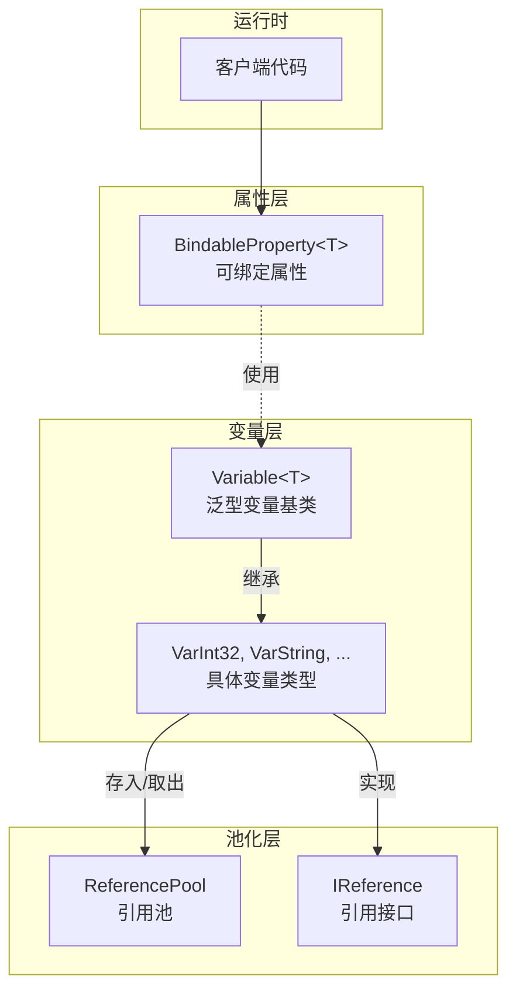
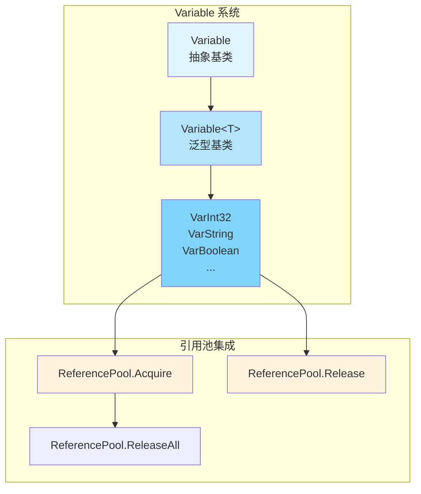

# プロパティ系统

GameFrameX プロパティ系统提供します一套完全な的プロパティ和变量管理机制，含みます可绑定プロパティ（BindableProperty）和タイプ化变量（Variable）两大コアコンポーネント。该系统サポートプロパティ值变化监听、参照池管理およびジェネリックタイプ安全操作。

## 概要

プロパティ系统是 GameFrameX フレームワーク的基本コンポーネント之一，主な由以下两部分组成：

1. **BindableProperty<T>** - 可绑定プロパティ，提供プロパティ值变化通知机制，基于观察者モード実装
2. **Variable** 系统 - タイプ化变量容器，集成参照池実装効率的内存管理

该系统適しています以下シーン：
- 〜する必要があります监听プロパティ值变化的 UI 绑定
- 〜する必要があります効率的管理临时变量的游戏逻辑
- 〜する必要がありますタイプ安全的数据传递
- 〜する必要があります减少垃圾回收压力的高性能シーン

## Architecture

プロパティ系统的アーキテクチャ設計遵循モジュール化原则，主なパッケージ含以下层次：



### コアコンポーネント关系

```mermaid
classDiagram
    class IReference {
        <<interface>>
        +Clear() void
    }
    
    class Variable {
        <<abstract>>
        +Type$ Type
        +GetValue() object
        +SetValue(object) void
        +Clear() void
    }
    
    class Variable<T> {
        <<abstract>>
        +Value$ T
        +GetValue() object
        +SetValue(object) void
        +Clear() void
    }
    
    class VarInt32 {
        +VarInt32()
        +implicit operator VarInt32(int)
        +implicit operator int(VarInt32)
    }
    
    class BindableProperty~T~ {
        -T _value
        -Action~T~ _onValueChanged
        +Value$ T
        +Add(Action~T~) BindableProperty~T~
        +RegisterWithInitValue(Action~T~) BindableProperty~T~
        +Remove(Action~T~) void
        +Clear() void
    }
    
    IReference <|.. Variable
    Variable <|-- Variable
    Variable~T~ --|> Variable
    Variable~T~ <|-- VarInt32
    BindableProperty~T~ --> Action : uses
```

## BindableProperty 可绑定プロパティ

`BindableProperty<T>` 是プロパティ系统的コアコンポーネント，提供プロパティ值变化通知機能。基于观察者モード設計，当プロパティ值发生变化时，自动トリガー已登録的コールバック確認。

### コア特性

- **ジェネリックサポート** - サポート任意タイプ T
- **值变化监听** - 通过 Action<T> コールバック机制通知变化
- **メソッド链式呼び出し** - サポート Fluent API 风格的登録方法
- **自动比较** - 使用 `Equals` メソッド避免不必要的アップデート

### 使用例

#### 基本用法

作成可绑定プロパティ并监听值变化：

```csharp
using GameFrameX.Runtime;

// 创建可绑定属性，默认值为 0
var health = new BindableProperty<int>(100);

// 注册值变化监听
health.Add(newValue => 
{
    Debug.Log($"生命值已变化: {newValue}");
});

// 修改值时会触发回调
health.Value = 90; // 输出: "生命值已变化: 90"
health.Value = 80; // 输出: "生命值已变化: 80"

// 相同值不会触发回调
health.Value = 80; // 不触发回调
```
> Source: [BindableProperty.cs](https://github.com/GameFrameX/com.gameframex.unity/blob/main/Runtime/Property/BindableProperty.cs#L1-L90)

#### 登録时立つまり执行コールバック

使用 `RegisterWithInitValue` 在登録时立つまり执行コールバック，適しています初期化シーン：

```csharp
var score = new BindableProperty<int>(0);

// 注册并立即获取当前值
score.RegisterWithInitValue(currentScore =>
{
    Debug.Log($"当前分数: {currentScore}");
});
// 输出: "当前分数: 0"
```
> Source: [BindableProperty.cs](https://github.com/GameFrameX/com.gameframex.unity/blob/main/Runtime/Property/BindableProperty.cs#L63-L68)

#### 移除监听

```csharp
var health = new BindableProperty<int>(100);

Action<int> listener = newValue => Debug.Log($"变化: {newValue}");
health.Add(listener);

// 移除特定监听器
health.Remove(listener);

// 清除所有监听器
health.Clear();
```
> Source: [BindableProperty.cs](https://github.com/GameFrameX/com.gameframex.unity/blob/main/Runtime/Property/BindableProperty.cs#L70-L88)

### 实际应用シーン

#### MVVM モード中的数据绑定

```csharp
public class PlayerModel
{
    // 可绑定属性用于数据绑定
    public BindableProperty<int> Health { get; } = new BindableProperty<int>(100);
    public BindableProperty<int> Gold { get; } = new BindableProperty<int>(0);
    public BindableProperty<string> Name { get; } = new BindableProperty<string>("");
}

public class PlayerView
{
    private PlayerModel _model;
    
    public void Bind(PlayerModel model)
    {
        _model = model;
        
        // 注册生命值变化监听
        _model.Health.Add(OnHealthChanged);
        
        // 注册金币变化监听
        _model.Gold.Add(OnGoldChanged);
    }
    
    private void OnHealthChanged(int health)
    {
        Debug.Log($"UI更新: 生命值 = {health}");
    }
    
    private void OnGoldChanged(int gold)
    {
        Debug.Log($"UI更新: 金币 = {gold}");
    }
}
```

#### ステータス机中的ステータス变化监听

```csharp
public class GameState
{
    public BindableProperty<GameStateType> CurrentState { get; } 
        = new BindableProperty<GameStateType>(GameStateType.Init);
    
    public void ChangeState(GameStateType newState)
    {
        CurrentState.Value = newState;
    }
}

// 状态监听
gameState.CurrentState.Add(state => 
{
    switch (state)
    {
        case GameStateType.Playing:
            StartGame();
            break;
        case GameStateType.Paused:
            PauseGame();
            break;
    }
});
```

## Variable 变量系统

Variable 系统提供します一套タイプ安全的变量カプセル化，结合参照池実装効率的的内存管理。每个 Variable タイプ都実装了 `IReference` インターフェース，〜できます被参照池統一された管理。

### アーキテクチャ設計



### 内置变量タイプ

GameFrameX 提供します 30+ 种预定義的 Variable タイプ：

| 分类 | タイプ |
|------|------|
| 基本数值 | VarInt16, VarInt32, VarInt64, VarUInt16, VarUInt32, VarUInt64 |
| 浮点数 | VarSingle, VarDouble, VarDecimal |
| 其他数值 | VarByte, VarSByte, VarChar |
| 字符串 | VarString |
| 布尔值 | VarBoolean |
| 日期时间 | VarDateTime |
| Unity 基本 | VarVector2, VarVector3, VarVector4, VarQuaternion, VarRect |
| Unity 对象 | VarColor, VarColor32, VarGameObject, VarMaterial, VarTexture, VarTransform, VarUnityObject |
| 数组 | VarByteArray, VarCharArray |
| 对象 | VarObject |

### 使用例

#### 基本用法

```csharp
using GameFrameX.Runtime;

// 创建变量
VarInt32 score = ReferencePool.Acquire<VarInt32>();
score.Value = 100;

// 使用隐式转换
int value = score; // 获取值
score = 200;      // 设置值

// 释放回引用池
ReferencePool.Release(score);
```
> Source: [VarInt32.cs](parameterNameValuePairs=)

#### 隐式转换

Variable タイプサポート C# 隐式转换，使コード更加シンプル：

```csharp
using GameFrameX.Runtime;

// 从原始类型创建 Variable
VarString playerName = ReferencePool.Acquire<VarString>();
playerName.Value = "Player1";

// 隐式转换 - 获取值
string name = playerName; // name = "Player1"

// 隐式转换 - 设置值
playerName = "Player2";    // playerName.Value = "Player2"

// 使用完成后释放
ReferencePool.Release(playerName);
```
> Source: [VarString.cs](https://github.com/GameFrameX/com.gameframex.unity/blob/main/Runtime/Variable/VarString.cs#L42-L84)

#### 参照池集成

Variable 系统与参照池深度集成，提供効率的的内存管理：

```csharp
// 从引用池获取
VarInt32 counter = ReferencePool.Acquire<VarInt32>();
counter.Value = 0;

// 使用
counter.Value++;

// 释放回引用池
ReferencePool.Release(counter);

// Variable 会自动调用 Clear 方法重置状态
// 再次获取时是干净的对象
VarInt32 counter2 = ReferencePool.Acquire<VarInt32>();
// counter2.Value 已重置为 0
```
> Source: [GenericVariable.cs](https://github.com/GameFrameX/com.gameframex.unity/blob/main/Runtime/Base/Variable/GenericVariable.cs#L106-L127)

### 变量基底クラス実装

Variable 类的コア実装：

```csharp
public abstract class Variable<T> : Variable
{
    private T m_Value;
    
    // 类型安全的值访问
    public T Value
    {
        get { return m_Value; }
        set { m_Value = value; }
    }
    
    // 实现基类的抽象方法
    public override object GetValue()
    {
        return m_Value;
    }
    
    public override void SetValue(object value)
    {
        m_Value = (T)value;
    }
    
    // 清空变量，用于回收到引用池
    public override void Clear()
    {
        m_Value = default(T);
    }
}
```
> Source: [GenericVariable.cs](https://github.com/GameFrameX/com.gameframex.unity/blob/main/Runtime/Base/Variable/GenericVariable.cs#L45-L127)

## Core Flow

### BindableProperty 值变化フロー

```mermaid
sequenceDiagram
    participant C as Client<br/>客户端
    participant BP as BindableProperty&lt;T&gt;<br/>可绑定属性
    participant CB as Callback<br/>回调函数
    
    C->>BP: 创建 BindableProperty
    BP->>BP: 存储默认值
    
    C->>BP: Add(callback)
    BP->>BP: 注册回调到 _onValueChanged
    
    C->>BP: Value = newValue
    BP->>BP: Equals(oldValue, newValue)?
    
    alt 值不相等
        BP->>BP: 更新 _value
        BP->>CB: _onValueChanged.Invoke(newValue)
        CB-->>C: 执行回调逻辑
    else 值相等
        BP-->>C: 不触发回调
    end
```

### Variable 参照池フロー

```mermaid
sequenceDiagram
    participant C as Client
    participant RP as ReferencePool
    participant V as Variable&lt;T&gt;
    
    C->>RP: Acquire&lt;VarInt32&gt;()
    RP->>V: 创建或复用实例
    V->>RP: 返回 Variable 实例
    RP-->>C: 返回实例
    
    C->>V: 设置/读取值
    V-->>C: 操作完成
    
    C->>RP: Release(variable)
    RP->>V: Clear() 重置状态
    RP->>RP: 加入可用队列
```

## API Reference

### BindableProperty<T>

```csharp
public sealed class BindableProperty<T>
```

可绑定プロパティ类，提供プロパティ值变化通知機能。

#### コンストラクタ

| コンストラクタ | 説明 |
|---------|------|
| `BindableProperty()` | デフォルトコンストラクタ |
| `BindableProperty(T defaultValue)` | 带デフォルト值的コンストラクタ |

**パラメータ：**
- `defaultValue` (T): デフォルトプロパティ值

#### プロパティ

| プロパティ | タイプ | 説明 |
|------|------|------|
| `Value` | `T` | 取得或設定プロパティ值，設定时もし值变化会トリガーコールバック |

#### メソッド

##### `Add(Action<T> callback): BindableProperty<T>`

登録值变化コールバック。

**パラメータ：**
- `callback` (Action<T>): 值变化时执行的コールバック

**返す：** 返す自身，サポート链式呼び出し

---

##### `RegisterWithInitValue(Action<T> callback): BindableProperty<T>`

登録コールバック并在登録时立つまり执行一次（常用于初期化）。

**パラメータ：**
- `callback` (Action<T>): コールバック函数

**返す：** 返す自身，サポート链式呼び出し

---

##### `Remove(Action<T> callback): void`

移除指定的コールバック。

**パラメータ：**
- `callback` (Action<T>): 要移除的コールバック函数

---

##### `Clear(): void`

清除所有已登録的コールバック。

---

### Variable<T>

```csharp
public abstract class Variable<T> : Variable
```

ジェネリック变量基底クラス，カプセル化具体タイプ并サポート参照池。

#### プロパティ

| プロパティ | タイプ | 説明 |
|------|------|------|
| `Type` | `Type` (override) | 取得变量タイプ |
| `Value` | `T` | 取得或設定变量值 |

#### メソッド

##### `GetValue(): object`

取得变量值（基底クラス抽象メソッド実装）。

**返す：** 变量值的 object パッケージ装

---

##### `SetValue(object value): void`

設定变量值（基底クラス抽象メソッド実装）。

**パラメータ：**
- `value` (object): 要設定的值

---

##### `Clear(): void`

清空变量值，重置为デフォルト值（用于参照池回收）。

---

### VarInt32 例

```csharp
public sealed class VarInt32 : Variable<int>
{
    public VarInt32() { }
    
    // 隐式转换：int -> VarInt32
    public static implicit operator VarInt32(int value)
    {
        VarInt32 varValue = ReferencePool.Acquire<VarInt32>();
        varValue.Value = value;
        return varValue;
    }
    
    // 隐式转换：VarInt32 -> int
    public static implicit operator int(VarInt32 value)
    {
        return value.Value;
    }
}
```
> Source: [VarInt32.cs](https://github.com/GameFrameX/com.gameframex.unity/blob/main/Runtime/Variable/VarInt32.cs#L41-L81)

## ベストプラクティス

### BindableProperty 使用お勧め

1. **在 Model 层使用** - BindableProperty 适合作为数据模型的数据载体
2. **避免频繁作成** - お勧め在类初期化时作成，避免在 Update 中作成
3. **及时移除监听** - 在对象破棄时呼び出し `Clear()` 或 `Remove()` 避免内存泄漏

### Variable 使用お勧め

1. **配合参照池使用** - Variable 設計用于参照池，务必通过 `ReferencePool.Acquire` 取得，`ReferencePool.Release` 解放
2. **选择合适的タイプ** - 使用对应的 Var タイプ获得更好的性能和タイプ安全
3. **注意ライフサイクル** - Variable インスタンス在 Release 后不应再使用

### 性能最適化

```csharp
// ❌ 不推荐：每次都创建新实例
public void ProcessScore(int score)
{
    VarInt32 var = new VarInt32();
    var.Value = score;
    // 处理...
}

// ✅ 推荐：使用引用池
public void ProcessScore(int score)
{
    VarInt32 var = ReferencePool.Acquire<VarInt32>();
    var.Value = score;
    // 处理...
    ReferencePool.Release(var); // 使用完毕后释放
}
```

## Related Links

- [基本コンポーネント](./5-runtime.base) - BaseComponent コンポーネントドキュメント
- [参照池系统](./5-runtime.reference-pool) - ReferencePool 詳細ドキュメント
- [イベント系统](./5-runtime.event-system) - イベント系统ドキュメント
- [对象池系统](./5-runtime.object-pool) - 对象池系统ドキュメント
